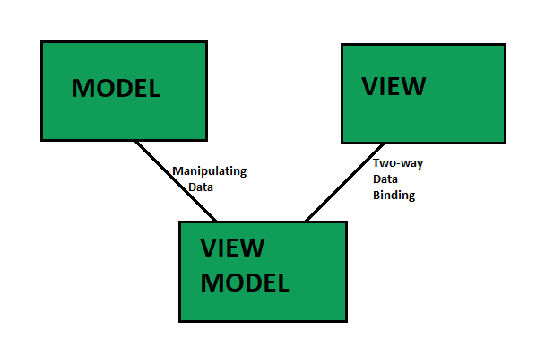

---
tags:
  - 도서/한-권으로-배우는-Vuejs-3
title: 1-Vuejs에 대한 소개
---


## Vue.js에 대한 소개

- MVVM(Model-View-VIewModel) 패턴을 표방하고 있다.

  - Model: 애플리케이션 도메인의 데이터 및 동작을 캡슐화하는 비즈니스 객체
  - View: 사용자가 보게되는 데이터
  - ViewModel: 모델과 뷰를 동기화하는 객체

  

- 코어 라이브러리는 ViewModel에 집주오디어있다.
- 코어 라이브러리를 제외하고도 Router나 Vuex 같은 라이브러리르 개발/배포하고 있다.
- 가상 노드 구성을 통해 매우 좋은 성능을 보여준다.
  - 디렉티브: HTML에 사용되는 특별한 기호. 정의한 기능 혹은 연결된 변수의 값에 따라 DOM 엘리먼트를 변화시킨다.
  - 디렉티브 중 v-model과 같은 디렉티브는 스크립트 코드의 변수와 양방향으로 바인드되어 실시근으로 DOM 엘리먼트에 변화를 줄 수 있다.
  - Vue는 가상노드를 생성하고 해당 노드에 먼저 모든 DOM을 구성한 후 브라우저에게 최종 DOM 엘리먼트 변경으로 통지함으로써 성능 저하를 방지했다.

## Vue 3의 대표 신규 기능들 소개

### Composition API

- 기존의 Vue는 Options API를 기반으로 했다.
- Options API는 하나의 객체를 하나의 모듈로 만들어 컴포넌트라 칭했다.
- 하지만 Options API는 애플리케이션의 규모가 커지면서, 데이터가 언제 어떻게 변하는지 분산되어 추적하기가 어려워진다는 단점이 있다.
- Composition API는 함수 기반의 방식을 제공해 Options API의 문제점을 개선할 수 있게되었다.

### Suspense

- 컴포넌트가 데이터를 받아오기 전까지 기본 컨텐츠를 표시할 수 있는 기능

### Teleport

- DOM 계층을 무시하고 특정 DOM 엘리먼트에 렌더링할 수 있는 기능

### 여러 개의 v-model 디렉티브

- 기존에는 하나의 사용자 컴포넌트가 하나의 v-model 디렉티브를 가지는 것먼 허용했다.
  - 추가적인 v-model 디렉티브가 필요한 경우 v-bind, v-on 디렉티브를 사용했다.
- Vue 3에서는 여러 개의 v-model 지정이 가능하다.

### 프록시(Proxies)로 진화된 반응성

- 기존의 Watch 옵션은 자바스크립트 객체의 속성이 추가되거나 배열의 아이템이 추가는 것에 대해서는 반응하지 않았다.

- Vue 3는 composition API를 통해 데이터를 프록시로 변환하여 이를 해결했다.

- 객체의 속성을 추가하는 경우, Vue 3는 obj 객체를 프록시 안에 담아두기 때문에 이를 즉시 알아차린다.

- Vue 3에서 Proxy를 이용하기 위해서는 ref난 reactive 함수를 사용하면 된다.

  ```vue
  const obj = reactive({})
  obj.item1 = 2 
  ```

### Fragments

- 하나의 컴포넌트가 여러 개의 루트 노드를 가지는 것을 허용한다.

### Emits Option

- `$emit()`은 하나의 컴포넌트가 부모 컴포넌트에게 이벤트를 전달하기 위해 존재하는 함수다.
- 기존에는 이 함수를 사용하는데 아무런 제약이 없었다.
- Vue 3에서는 이 함수를 컴포넌트 옵션 `emtis`를 사용해서 전송할 이벤트를 정의하도록 변했다.
- 장점
  - 해당 컴포넌트에서 발생하는 이벤트들을 한눈에 볼 수 있다.
  - 이벤트의 데이터에 대해서 사전에 검증할 수 있는 기능을 제공한다.
- `emits` 옵션을 비워두고 click 이벤트를 발생시키면 Vue의 이벤트가 아닌 네이티브 이벤트로 인식하여 처리한다.

### createRenderer

- `createRenderer`: 사용자가 렌더링의 동작을 정의할 수 있게해주는 함수
- Host 환경의 Node와 element를 인자로 받아 해당 노드와 엘레먼트의 렌더링 동작을 변경할 수 있게 해준다.
- Renderer가 가지는 CRUD에 관련된 함수들을 재정의할 수 있다.

## 참고 자료

- https://012.vuejs.org/guide/
- https://www.geeksforgeeks.org/introduction-to-model-view-view-model-mvvm/
- https://beomy.tistory.com/43
- https://kyounghwan01.github.io/blog/Vue/vue3/composition-api/#composition-api%E1%84%80%E1%85%A1-%E1%84%82%E1%85%A1%E1%84%8B%E1%85%A9%E1%84%80%E1%85%A6-%E1%84%83%E1%85%AC%E1%86%AB-%E1%84%87%E1%85%A2%E1%84%80%E1%85%A7%E1%86%BC
