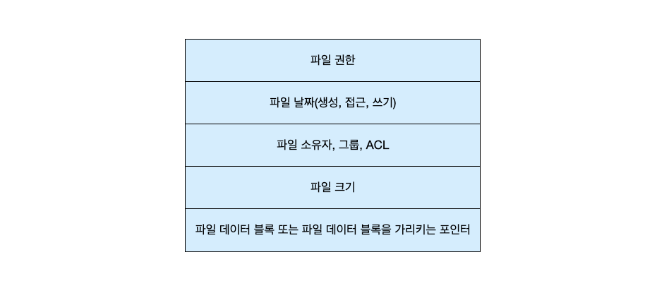
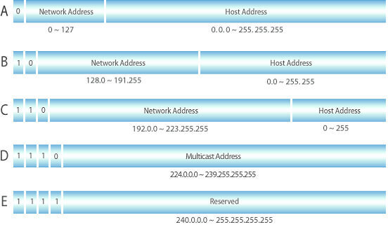
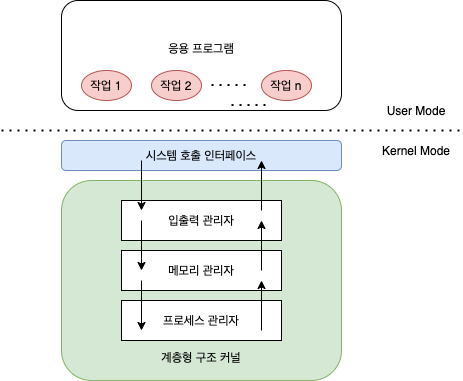
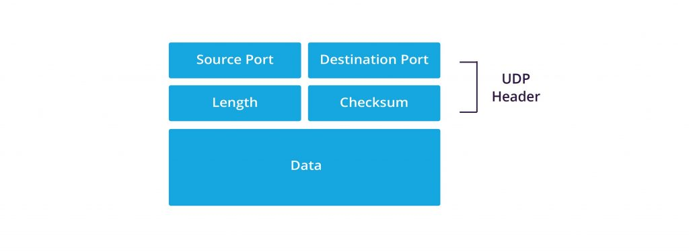

---
tags:
  - 도서/쉽게-배우는-운영체제
title: 1-운영체제의 개요
---

## 운영체제 소개

### 운영체제의 역할

- 자원 관리: 컴퓨터 자원(키보드, 네트워크 카드, 사운드 카드 등)을 요청한 애플리케이션들에게 적절한 순서로 자원을 배분하고 적절한 시점에 자원을 회수한다.
- 자원 보호: 악의적이거나 미숙한 애플리케이션, 사용자으로부터 자원을 보호하는 역할을 한다. 다른 영역의 자원을 침범하여 데이터를 수정하거나 삭제를 막아준다.
- 하드웨어 인터페이스 제공: CPU, 메모리, 키보드, 마우스와 같은 하드웨어가 제조사에 신경쓸 필요없이 사용할 수 있도록 하드웨어 인터페이스를 제공한다. 하드웨어 인터페이스 지원은 드라이버를 설치해야 가능한데, 대부분의 드라이버는 운영체제를 설치할 때 자동으로 설치된다.
- 사용자 인터페이스 제공: 사용자가 운영체제를 편리하게 사용할 수 있도록 GUI 등을 제공한다.

<aside>
💡 펌웨어: 운영체제는 하드웨어를 조정하고 관리하는 역할을 하므로 하드웨어의 도움 없이 작동하기 어렵기 때문에 운영체제를 소프트웨어와 하드웨어의 결합 형태인 펌웨어라고도 부른다.

</aside>

### 운영체제의 목표

괄호 안은 관련된 역할을 뜻한다.

- 효율성(자원 관리): 자원을 효율적으로 관리해야된다. 적은 자원을 사용하여 결과를 빨리 보여주는 것을 목표한다.
- 안정성(자원 보호): 사용자와 애플리케이션의 안전 문제와 하드웨어적인 보안 문제를 처리할 수 있어야된다. 또한, 시스템에 문제가 발생했을 때 이전으로 복구하는 결함 포용(fault tolerant)기능을 수행해야 한다.
- 확장성(하드웨어 인터페이스 제공): 다양한 시스템 자원을 추가하거나 제거하기에 편리해야 한다. 하드웨어의 종류에 상관없이 꽂으면 바로 실행할 수 있는 plug & play 기능을 제겅해야된다.
- 편리성(사용자 인터페이스 제공): 사용자가 편리하게 작업할 수 있는 환경을 제공해야된다.

## 운영체제의 역사

### 초창기 컴퓨터(1940년대)

- 진공관을 사용한 에니악
- 전선을 연결하여 논리회로를 구성하는 하드와이어링 방식을사용했다.

### 일괄 작업 시스템(1950년대)

- 진공관과 전선으로 만들어진 논리회로를 아주 작은 크기로 구현한 IC칩이 만들어졌다.
- 천공카드 리더(punch card reader)를 입력 장치로, 라인 프린터(line printer)를 출력 장치로 사용했다.
- 작업에 필요한 프로그램과 데이터를 모두 입력해야 작업이 가능했다. 프로그램 실행 중간에 데이터를 입력하거나 수정하는 것이 불가능해서 일괄 작업 시스템(batch job system) 또는 일괄 처리 시스템(batch processing system)이라고 부른다.

### 대화형 시스템(1960년대 초반)

- 키보드와 마우스가 등장했다.
- 작업 준간에 사용자가 입력을 하거나 사용자에게 중간 결과값을 보여줄 수 있게 되었다.
- 이에 따라 프로그램이 입력값에 따라 작업의 흐름이 바뀌는 것도 가능했다.
- 입출력이 생기면서 프로그램의 실행 시간을 예측하기 어렵다는 문제가 발생했다.

<aside>
💡 CPU 집중 작업: 일괄 작업 시스템에서는 프로그램이 실행되는 동안에 입출력이 불가능하기 때문에 대부분의 작업이 CPU만 사용하는 계산 작업이었다. 이를 CPU 집중 작업이라고 부른다.
입출력 집중 작업: 대화형 시스템에서는 프로그램이 실행되는 동안에 입출력이 가능하기 때문에 입출력 집중 작업이 생겨났다. 이를 입출력 집중 작업이라고 부른다.

</aside>

### 시분할 시스템(1960년대 후반)

- 컴퓨터의 계산 능력이 향상되면서 하나의 CPU로 여러 작업을 동시해 실행하는 기술인 다중 프로그래밍(multiprogramming)이 개발되었다.
- CPU 사용 시간을 잘게 쪼개어 작업들에 나누어줌으로써 모든 작업이 동시에 처리되는 것처럼 보이게 구현했다.
- 시분할 시스템은 여러 작업을 동시에 처리하기 위한 추가 작업이 필요하다는 단점이 있다.
- 시스템 내에 많은 양의 작업이 공존할 경우, 중요한 작업이 일정 시간 안에 끝나는 것을 보장하지 못한다.
    - 이를 해결하기 위해 특정 시스템에서 일정 시간 안에 작업이 처리되도록 보장하는 실시간 시스템을 사용한다.
- 시분할 시스템에서 동시에 실행되는 작업의 개수를 멀티프로그래밍 수준(level of multiprogramming) 또는 멀티프로그래밍 정도(degree of multiprogramming)라고 한다.
- 시분할 시스템은 하나의 컴퓨터에서 여러 명이 작업할 수 있는 다중 사용자 시스템을 가능하게 했다.

<aside>
💡 경성 실시간 시스템: 지정한 응답 시간을 정확히 지키는 시스템으로 원자력 발전소의 원자로 온도 제어, 미사일 요격과 같은 작업에 이용된다.
연성 실시간 시스템: 지정한 응답 시간을 최대한 지키지만 융통성이 어느 정도 허용된 시스템이다. 한 예로 동영상 재생기는 응답 시간 안에 작업이 처리되지 않으면 끊김 현상이 발생하지만 치명적인 결과는 낳지는 않는다.

</aside>

### 분산 시스템(1970년대 후반)

- 인터넷이 등장했다.
- 복잡한 계산이나 많은 양의 데이터를 처리하기 위해서 메인프레임이라는 고가의 컴퓨터를 살필요가 없어졌다.
- 여러 대의 컴퓨터를 인터넷으로 연결해 복잡한 연산을 처리하는 시스템을 분산 처리 시스템이라고 한다.

### 클라이언트/서버 시스템(1990년대 ~ 현재)

- 분산 시스템의 한 종류다.
- 클라이언트가 서버에 작업을 요청하면 서버가 작업을 처리하여 응답하는 구조다.
- 웹 시스템이 등장하면서 클라이언트/서버 시스템이 많이 알려졌다.
- 모든 요청이 서버로 집중되기 때문에 서버 과부하가 발생할 수 있다는 문제점이 있다.

<aside>
💡 데몬: 멈추지 않고 계속 작동하는 프로그램

</aside>

### P2P 시스템(2000년대 초반 ~ 현재)

- 분산 시스템의 한 종류다.
- 서버를 거치지 않고 사용자가 사용자를 직접 연결한다.
- 서버 과부하를 줄일 수 있다는 장점이 있다.
- 메신저나 파일 공유 등의 목적으로 주로 사용한다.

<aside>
💡 P2P 시스템은 서버가 없는 완전 P2P 시스템과 서버가 있는 P2P 시스템으로 나뉜다.
서버가 있는 P2P 시스템: 사용자 인증과 출석 정보, 과거 데이터 보관등을 위한 메신저
서버가 없는 P2P 시스템: 비트코인의 블록체인. 거래 장부를 분삼시킴으로써 하나의 장부가 조작되거나 유실 되어도 거래에 영향을 미치지 않는다. 전체 시스템의 50% 이상이 도으이했을 때만 거래 장부의 변경이 가능하도록 함으로써 악의적인 공격을 방어한다.

</aside>

### 기타 컴퓨팅 환경(2000년대 초반 ~ 현재)

1. 그리드 컴퓨팅
    - 네트워크에 연결된 다른 컴퓨터의 자원을 공유하여 사용하는 시스템이다.
    - 불법 웹 하드에서 주로 사용하는 방법으로 사용자의 컴퓨터 자원을 사용한다.
2. 클라우드 컴퓨팅
    - 그리드 컴퓨팅과 SaaS를 합쳐놓은 형태다.
    - SaaS는 프로그램을 설치할 필요없이 인터넷을 통해 소프트웨어 기능을 이용하고 그만큼만 비용을 지불하는 개념이다.
    - 최근 IT산업 전반에 사용되고, 일반 사용자들도 개인 정보 백업을 위한 용도로 사용되고 있다.
3. 사물 인터넷
    - 사물에 센서와 통신 기능을 내장하여 인터넷에 연결하는 기술이다.

## 운영체제의 구조

### 커널

운영체제의 핵심적인 기능을 모아놓은 것이다. 운영체제의 성능은 커널에 의해 좌우된다.

- 프로세스 관리: 프로세스에 CPU를 배분하고 작업에 필요한 환경을 제공한다.
- 메모리 관리: 프로세스에 작업 공간을 배치하고 실제 메모리보다 큰 가상공간을 제공한다.
- 파일 시스템 관리: 데이터를 저장하고 접근할 수 있는 인터페이스를 제공한다.
- 입출력 관리: 필요한 입력과 출력 서비스를 제공한다.
- 프로세스 간 통신 관리: 공동 작업을 위한 각 프로세스 간 통신 환경을 지원한다.

### 운영체제는 크게 두 부분으로 나뉜다.

- 인터페이스: 사용자와 애플리케이션에 인접하여 커널에 명령을 전달하고 실행 결과를 돌려준다.
    - 예: csh, tsh, bash 등
- 커널: 운영체제의 핵심 기능을 모아놓는다.

### 시스템 호출과 드라이버

- 시스템 호출: 커널이 자신을 보호하기 위해 만든 인터페이스다. 응용 프로그램이 하드웨어 자원에 접근하거나 운영체제가 제공하는 서비스를 사용할 때 시스템 호출을 사용해야된다.
- 드라이버: 커널과 하드웨어 사이의 인터페이스 역할을 한다.
    - 운영체제가 모든 하드웨어에 맞는 인터페이스를 개발하기는 어렵고, 제작자가 하드웨어를 제일 잘 알고 있기때문에 하드웨어 제작자가 직접 만들어 설치해야된다.
    - 일부 기본 적인 드라이버는 커널에 포함되어 있다.

<aside>
💡 API: 응용 프로그램이 사용할 수 있도록 소프트웨어에서 연관된 기능을 제공하는 인터페이스
SDK: 개발자를 위해 API, API 매뉴얼, 코드 편집기, 에뮬레이터 같은 것들을 하나로 묶어서 배포하는 개발 툴

</aside>

### 커널의 구조

커널을 어떻게 구현했냐에따라 여러가지 구조로 구분된다.

- 단일형 구조 커널: 따로 모듈들이 구분없이 하나로 구성되어 있다. 초기의 운영체제에서 사용된 방법이다.
  

    

    
    - 장점
        - 모듈간의 통신이 거의 없기 때문에 통신 비용이 줄어든다.
    - 단점
        - 디버깅이 어렵다.
        - 여러 기능이 서로 의존하고 있기때문에 하나의 결함이 시스템 전체로 확산할 수 있다.
        - 코드 수정이 어렵다.
        - 복잡한 기능을 구현하기에 어렵다.
- 계층형 구조 커널: 비슷한 기능을 가진 모듈을 묶어서 하나의 계층으로 만들고 계층 간의 통신을 하도록 구현한다. 오류가 발생했을 때 해당 계층만 따로 수정하면 되기 때문에 디버깅하기 쉽다.
  

    

    
- 마이크로 구조 커널: 프로세스 관리, 메모리 관리, 프로세스 간 통신 관리 등 기본적인 기능만 제공한다. 다른 모듈들은 사용자 영역에 구현된다.
  

    

    
    - 각 모듈이 동립적으로 작동하기 때문에 하나의 모듈이 실패하더라도 전체 운영체제가 멈추지 않는다.
    - 커널이 가벼워서 CPU 용량이 작은 시스템에도 적용이 가능하다.

### 가상 머신

- C언어는 다른 커널을 가진 운영체제와 호환성이 떨어진다. 따라서, 애플리케이션을 만들때 각 운영체제 별로 따로 만들어야되는 문제가 있다.
- 자바는 애플리케이션과 운영체제 사이에 가상 머신이 있어 코드를 수정할 필요가 없다.

## 연습 문제

1. 운영체제
2. 임베디드 운영체제
3. 응용 프로그램
4. 아래
    1. 기능을 확장하기 힘들어진다.
    2. 사용자가 잘못된 컴퓨터 자원에 접근할 수 있다.
5. 인터페이스
6. 일괄 작업 시스템
7. 대화형 시스템
8. 시분할 시스템
9. 일괄 작업시스템?
10. 시분할 시스템, 다중 사용자 시스템
11. 실시간 시스템
12. 분산 시스템
13. P2P 시스템
14. 시스템 호출
15. 하드웨어 드라이버
16. 단일형 구조 커널
17. 마이크로 구조 커널
18. 가상 머신

## 심화 문제

1. 아래
    1. 자원 관리: 하드웨어 자원을 응용 프로그램들에게 적절히 배분하고, 회수한다.
    2. 자원 보호: 악의적이거나 미숙한 응용 프로그램과 사용자로부터 자원을 보호한다.
    3. 하드웨어 인터페이스 제공: 하드웨어를 제조사를 신경쓸 필요없이 사용할 수 있도록 제공한다.
    4. 사용자 인터페이스 제공: 사용자가 운영체제를 편리하게 사용할 수 있도록 제공한다.
2. 아래
    1. 효율성: 적은 자원으로 애플리케이션을 빠르게 실행할 수 있도록 한다.
    2. 안정성: 사용자와 애플리케이션의 안전 문제와 하드웨어적인 보안 문제를 처리할 수 있어야된다. 문제가 발생하면 이전으로 복구하는 결함 포용기능을 수행해야된다.
    3. 확장성: 다양한 하드웨어 자원을 추가, 삭제할 수 있어야된다. 하드웨어를 연결하면 바로 실행할 수 있는 plug & play 기능을 수행해야 된다.
    4. 편리성: 사용자가 편리하게 작업할 수 있는 환경을 제공해야된다.
3. 아래
    1. CPU 집중 작업: 입출력이 불가능하여 대부분의 작업이 CPU만 사용하는 작업
    2. 입출력 집중 작업: 대부분의 작업시간이 입출력에 사용되는 작업
4. 일정 시간안에 작업이 처리되도록 보장하는 시스템. 시분할 시스템이 등장하면서 중요한 작업이 일정 시간안에 완료되지 못하는 문제가 발생했는데 이를 해결하기 위해 사용했다.
5. 그리디 컴퓨팅과 SaaS를 합쳐놓은 형태의 시스템. 언제 어디서나 응용 프로그램과 데이터를 자유롭게 사용할 수 있는 컴퓨터 환경이다.
6. 아래
    1. API: 응용 프로그램이 사용할 수 있도록 소프트웨어에서 연관된 기능을 제공하는 인터페이스
    2. SDK: 개발자를 위해 API, API 매뉴얼, 코드 편집기, 에뮬레이터 같은 것들을 하나로 묶어서 배포하는 개발 툴
7. 모듈 구분없이 하나로 구성된 커널. 모듈간의 통신이 없기 때문에 처리 속도가 빠르다는 장점이 있다. 하지만 디버깅 및 코드수정이 힘들고, 하나의 결함이 있으면 시스템 전체영역에 영향을 줄 수 있다는 단점이 있다. 복잡한 시스템을 개발할 수 없다는 단점이 있다.
8. 프로세스 관리, 메모리 관리, 프로세스 간 통신 등의 기본적인 기능만 제공하는 커널. 다른 모듈은 사용자 영역에서 구현된다. 일부 모듈에 문제가 발생해도 시스템을 운영체제 전체가 멈추지 않는다는 장점이 있다. 또한, 커널이 가벼워서 CPU 용량이 작은 시스템에도 사용이 가능하다.
