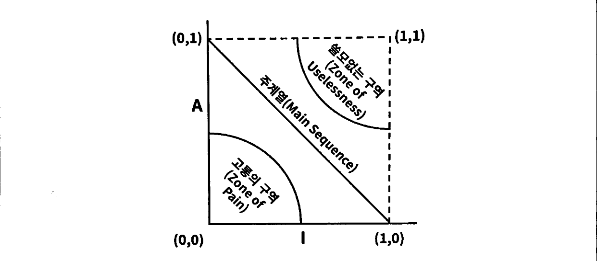

---
tags:
  - 도서/Clean-Architecture
---

# 컴포넌트 원칙

## 컴포넌트

- 컴포넌트: 시스템의 구성 요소로 배포할 수 있는 가장 작은 단위.
  - 자바의 jar, 루비의 gem, 닷넷의 DLL...
- 여러 컴포넌트를 서로 링크하여 실행 가능한 단일 파일로 생성할 수 있다.
- 또는, 여러 컴포넌트를 서로 묶어서 .war 파일과 같은 단일 아카이브로 만들 수도 있따.
- 또는 컴포넌트 각각을 .jar나 .dll같이 독적으로 로드할 수 있는 플러그인이나 .exe 파일로 만들어서 독립적으로 배포할 수도 있다.
- 컴포넌트의 간략한 역사
  - 소프트웨어 개발 초창기에는 메모리에서의 프로그램 위치와 레이아웃을 프로그래머가 직접 제어했다. 또한, 프로그래머가 라이브러리 함수의 소스코드를 애플리케이션 코드에 직접 포함시켜 단일 프로그램으로 컴파일했다.
  - 함수 라이브러리가 크면 클수록 컴파일은 더 오래 걸렸다. 컴파일 시간을 단축시키기 위해 프로그래머는 함수 라이브러리의 소스코드를 애플리케이션 코드로부터 분리했다. 함수 라이브러리를 개별적으로 컴파일하고, 컴파일된 바이너리를 메모리의 특정 위치에 로드했다.
  - 이후 애플리케이션이 점점 커져 애플리케이션을 여러개의 주소 세그먼트로 분리하여 함수 라이브러리 공간을 사이에 두고 오가며 동작하게 배치해야했다. 이런 방식은 메모리가 늘어날수록 단편화가 계속 될 수 밖에 없다.
- 재배치성
  - 위의 문제를 해결책은 재배치가 가능한 바이너리(relocatable binary)였다.
  - 로더를 사용해 메모리에 재배치할 수 있는 형태의 바이너리를 생성하도록 컴파일러를 수정했다.
  - 프로그래머는 함수 라이브러리를 로드할 위치와 애플리케이션을 로드할 위치를 로더에게 지시할 수 있게 된다.
  - 로더는 여러 개의 바이너리를 입력받은 후, 단순히 하나씩 차례로 메모리로 로드하면서 재배치하는 작업을 처리했다.
  - 프로그램이 라이브러리 함수를 호출한다면 컴파일러는 라이브러리 함수 이름을 '외부 참조'로 생성한다. 또한, 라이브러리 함수를 정의하는 프로그램이라면 컴파일러는 해당 이름을 '외부 정의'로 생성한다. 이렇게 함으로써 외부 정의를 로드할 위치가 정해지기만 하면 로더가 외부 참조를 외부 정의에 링크시킬 수 있게 된다. 이렇게 링킹 로더가 탄생한다.
- 프로그램이 커지면서 함수 라이브러리는 자기 테이프와 같이 느린 장치에 저장되었다. 링킹로더는 이처럼 대체로 느린 장치를 사용해서 수십에서 수백 개의 바이너리 라이브러리를 읽고 외부 참조를 해석해야 했다. 
  - 이로인해 로드와 링크가 두 단계로 분리되었다. 
  - 링커는 별도의 애플리케이션으로 이 작업을 처리하도록 만들었다. 링크가 완료된 재배치 코드를 만들어 주었고, 그덕분에 로더의 로딩 과정에 아주 빨라졌다.
  - 비록 느린 링커를 사용해서 파일을 만들었지만, 한번 만들어둔 실행 파일은 언제나라도 빠르게 로드할 수 있게 되었다.
- 메모리 크기가 커지고, CPU 클록 속도가 증가하면서 링크 시간이 줄어들기 시작했고, 소규모 작업이라면 링킹로더마저도 다시금 사용할 만하게 되었다. 
  - 다시 로드와 링크를 동시에 할 수 있게 되었다.
  - 다수의 .jar 파일 또는 공유 라이브러리를 순식간에 서로 링크한 후, 링크가 끝난 프로그램을 실행할 수 있게 되었다
  - 이를 컴포넌트 플러그인 아키텍처가 탄생했다.
  - 컴포넌트 플러그인 아키텍처: .jar 파일, DLL, 공유 라이브러리를 기존 애플리케이션에 플러그인 형태로 배포하는 아키텍처

### 컴포넌트 응집도

- 컴포넌트 응집도와 관련된 세 가지 원칙
  - REP(Reuse/Release Equivalence Principle): 재사용/릴리스 등가 원칙
  - CCP(Common Closure Principle): 공통 폐쇄 원칙
  - CRP(Common Reuse Principle): 공통 재사용 원칙

- REP: 재사용/릴리스 등가 원칙
  > 재사용 단위는 릴리스 단위와 같다.
  
  - 단일 컴포넌트는 응집성 높은 클래스와 모듈들로 구성되어야 한다.
  - 하나의 컴포넌트로 묶인 클래스와 모듈은 버전 번호가 같아야 하며, 동일한 릴리스로 추적 관리되고, 동일한 릴리스 문서에 포함되어야 한다.
  
- CCP: 공통 폐쇄 원칙

  > 동일한 이유로 동일한 시점에 변경되는 클래스를 같은 컴포넌트로 묶어라. 서로 다른 시점에 다른 이유로 변경되는 클래스는 다른 컴포넌트로 분리하라.

  - 대다수의 애플리케이션에서 유지보수성은 재사용성보다 훨씬 중요하다.

  - 애플리케이셔넹서 코드가 반드시 변경되어야 한다면, 이러한 변경이 여러 컴포넌트 도처에 분산되어 발생하기보다는, 차라리 변경 모두가 단일 컴포넌트에서 발생하는 편이 낫다.

  - 이 원칙은 개방 폐쇄 원치고가도 밀접하게 관련되어있다. 동일한 유형의 변경에 대해 닫혀있는 클래스들을 하나의 컴포넌트로 묶음으로써 변경이 영향을 주는 컴포넌트들이 최소한으로 한정될 가능성이 높아진다.

  - CCP는 컴포넌트 수준의 SRP다. 

- CRP: 공통 재사용 원칙

  > 컴포넌트 사용자들을 필요하지 않는 것에 의존하게 강요하지 말라.

  - CRP는 어떤 클래스를 포함시켜야 하는지 설명하는 것이 전부가 아니라 동일한 컴포넌트로 묶어서는 안되는 클래스가 무엇인지도 말해준다.

  - 사용하지 않는 클래스지만 의존성으로 인해 사용되는 컴포넌트가 변경될 떄마다 사용하는 컴포넌트도 변경해야 할 가능성이 높다. 또한, 사용하는 컴포넌트를 변겨앟지 않더라도, 재컴파일, 재검증, 재배포를 해야 하는 가능성은 여전히 남아 있다.

- 응집도에 관한 세 원칙이 서로 상충된다.

  - REP와 CCP는 포함 원칙이다.
  - CRP는 배제 원칙이다.

  - REP와 CRP에만 중점을 두면, 사소한 변경이 생겼을 때 너무 많은 컴포넌트에 영향을 준다.

  - CCP와 REP에만 중점을 두면, 불필요한 릴리스가 너무 빈번해진다.

  - CCP와 CRP에만 중점을 두면, 재사용이 어려워진다.

- 뛰어난 아키텍트라면 개발팀이 현재 관심을 기울이는 부분을 충족시키는 위치를 찾아야 하며, 또한 시간이 흐르면서 개발팀이 주의를 기울이는 부분 역시 변한다는 사실도 이해하고 있어야 한다.
  - 프로젝트 초기에는 CCP가 REP보다 훨씬 중요한데, 개발 가능성이 재사용성보다 더욱 중요하기 때문이다.

## 컴포넌트 결합

- ADP: 의존성 비순환 원칙

  > 컴포넌트 의존성 그래프에 순환이 있어서는 안 된다.

  - 많은 개발자가 동일한 소스 파일을 수정하는 환경에서는 프로젝트의 안정 버전을 빌드하지 못하고 누군가가 마지막으로 수정한 코드 떄문에 망가진 부분이 동작하도록 계쏙해서 수정하는 작업만 하는 문제가 발생할 수 있다.
  - 이 문제의 해결책 2가지
    - 주 단위 빌드: 일주일의 첫 4일 동안은 서로 신경쓰지 않고 작업하고, 금요일에 통합하여 시스템을 빌드한다.
      - 프로젝트가 커지면 통합이 금요일 하루만에 끝마치는 게 불가능해진다.
      - 개발보다 통합에 드는 시간이 늘어나면서 팀 효율성도 나빠진다.
    - 의존성 비순환 원칙: 개발 환경을 릴리스 가능한 컴포넌트 단위로 분리하는 것이다.
      - 이를 통해 컴포넌트는 개별 개발자 또는 단일 개발팀이 책임질 수 있는 작업 단위가 된다.
      - 이 절차가 성공적으로 동작하려면 컴포넌트 사이의 의존성 구조에 순환이 있어서는 안 된다.
      - 순환이 발생하면 순환 의존되고 있는 컴포넌트들이 하나의 거대한 컴포넌트가 되어버린다. 간단한 단위 테스트를 실행할 때도 수많은 라이브러리를 포함해서 빌드해야 되고, 빌드 순서도 파악하기 힘들어진다.
      - 컴포넌트 사이의 순환을 끊는 메커니즘 2가지
        - 의존성 역전 원칙을 적용한다. 인터페이스를 사용하여 컴포넌트 간의 의존성을 역전시킨다.
        - 중간 단계의 컴포넌트를 만들어서 두 컴포넌트가 모두 의존하는 클래스들은 새로운 컴포넌트로 이동시킨다. 이처럼 요구사항이 변경되면 컴포넌트 구조도 변경될 수 있다.

- 하향식(top-down) 설계

  - 컴포넌트 구조는 하향식으로 설계될 수 없다.
  - 컴포넌트는 시스템에서 가장 먼저 설계할 수 잇는 대상이 아니며, 오히려 시스템이 성장하고 변경될 때 함께 진화한다.
  - 시스템의 기능적 측면은 컴포넌트 의존성 다이어그램으로 보이지 않는다.
  - 프로젝트가 진행되면서 변경되는 범위가 시스템의 가능한 한 작은 일부로 한정되기를 원하면서 SRP와 CCP에 관심을 갖기 시작한다.
  - 애플리케이션이 계속 성잠함에 따라 우리는 재사용 가능한 요소를 만드는 일에 관심을 기울이기 시작하고 컴포넌트를 조합하는 과정에서 CRP가 영향을 미치기 시작한다. 결국 순환이 발생하면 ADP가 적용되면서 컴포넌트 의존성 그래프는 흐트러지고 성장한다.

- SDP: 안정된 의존성 원칙

  > 안정성의 방향으로(더 안정된 쪽에) 의존하라.

  - 변경이 쉽지 않은 컴포넌트가 변동이 예상되는 컴포넌트에 의존하게 만들어서는 절대로 안 된다. 한번 의존하게 되면 변동이 큰 컴포넌트도 결국 변경이 어려워진다.
  - 안정성은 변경을 만들기 위해 필요한 작업량과 관련된다.
    - 세 컴포넌트가 X 컴포넌트에 의존하고 있으면, X 컴포넌트는 변경하지 말아야할 이유가 세 가지나 되기 때문에 안정된 컴포넌트다.
    - Y 컴포넌트가 세 컴포넌트에 의존하고 있으면, Y 컴포넌트는 변경이 발생할 수 있는 외부 요인이 세 가지다. 상당히 불안정한 컴포넌트다.
  - 안정성 지표
    - `Fan-in`: 컴포넌트 내부의 클래스에 의존하는 컴포넌트 외부의 클래스의 개수
    - `Fan-out`: 컴포넌트 외부의 클래스에 의존하는 컴포넌트 내부의 클래스의 개수
    - I(불안정성): `Fan-out` / ( `Fan-in` + `Fan-out` ). I가 0에 가까울수록 안정된 컴포넌트이고, 1에 가까울수록 불안정한 컴포넌트다.
  - SDP가 위반되었을 때, DIP를 도입하면 이 문제를 해결할 수 있다.
  - 인터페이스만 포함하는 컴포넌트 처럼 실행 가능한 코드가 없는 컴포넌트를 추상 컴포넌트라고 부른다. 이러한 추상 컴포넌트는 상당히 안정적이며, 덜 안정적인 컴포넌트가 의존할 수 있다.

- SAP: 안정된 추상화 원칙

  > 컴포넌트는 안정된 정도만큼만 추상화되어야 한다.

  - 시스템에서 고수준의 전책은 변동성이 없기 바라기 떄문에 안정된 컴포넌트에 위치해야 한다. 하지만 고수준 정책을 안정된 컴포넌트에 위치시키면 ,그 정책을 퐇마하는 소스 코드는 수정하기가 어려워진다.
  - 이 문제를 해결하기 위해서 안정된 컴포넌트는 추상 컴포넌트로 만들어 수정하지 않고도 확장에 유연하도록 만들어야된다.
  - 안정된 추상화 원칙: 안정된 컴포넌트는 추상 컴포넌트여야 하며, 이를 통해 안정성이 컴포넌트를 확장하는 일을 방해해서는 안된다. 불안정한 컴포넌트는 반드시 구체 컴포넌트여야 하며, 컴포넌트가 불안정하므로 컴포넌트 내부의 구체적인 코드를 쉽게 변경할 수 있어야 하기 때문이다.
  - 추상화 지표
    - Nc: 컴포넌트의 클래스 개수
    - Na: 컴포넌트의 추상 클래스와 인터페이스의 개수
    - A: 추상화 정도. A = Na / Nc
  
  - A/I 그래프
  
    - 주계열: 컴포넌트가 위치할 수 있는 합리적인 지점
    - 고통의 구역: 추상적이지 않으므로 확장할 수 없고, 안정적이므로 변경하기도 상당히 어렵다.
      - 유틸리티 라이브러리의 경우 (0, 0) 근처에 위치할 수 있는데 변동성이 없는 컴포넌트는 (0, 0) 근처에 위치하더라도 해롭지 않다.
    - 쓸모없는 구역: 최고로 추상적이지만, 누구도 그 컴포넌트에 의존하지 않는다.
  
    
  
    - 변동성이 큰 컴포넌트는 주계열에 가능한 한 가깝게해야 한다.
    - D: 주계열과의 거리. D = |A + I - 1|. D가 0이면 컴포넌트가 주계열 바로 위에 위치한다는 뜻이며, 1이면 주계열로부터 가장 멀리 위치한다는 뜻이다.
    - D 지표의 평균과 분산을 구했을 때, 주계열에 일치하도록 설계되었다면 평균과 분산은 0에 가까워진다. 분산을 통해 관레 한계를 결정하기 위한 목적으로 사용할 수 있다.
