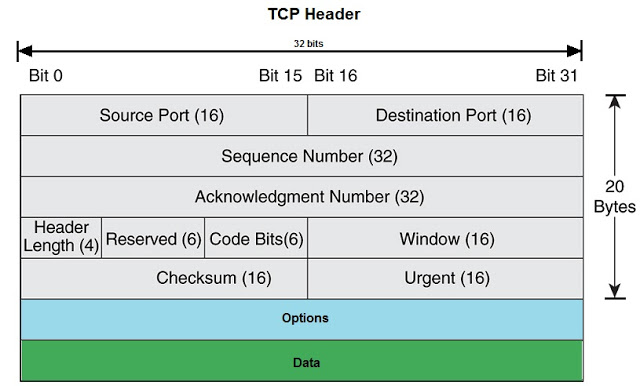
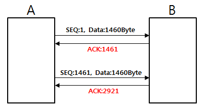
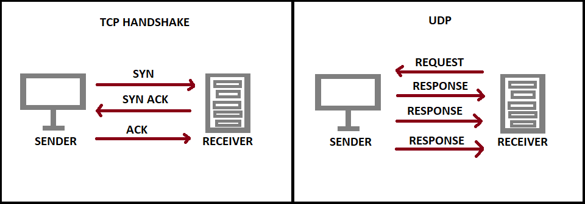
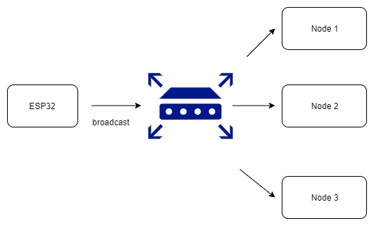

---
tags:
  - 도서/모두의-네트워크
---

# 6장 전송 계층 : 신뢰할 수 있는 데이터 전송하기

## 전송 계층의 역할

- 전송 계층은 목적지에 신뢰할 수 있는 데이터를 전달하는 역할과 전송된 데이터의 목적지가 어떤 애플리케이션인지 식별하는 역할을 한다.
- 전송 계층의 특징을 설명하면 신뢰성/정확성과 효율성으로 구분할 수 있다.
    - 신뢰성/정확성: 데이터를 목적지에 문제없이 전달하는 것. 연결형 통신이라고 한다.
        - 연결형 통신은 상대편과 확인해 가면서 통신하는 방식이다.
        - TCP
    - 효율성: 데이터를 빠르고 효율적으로 전달하는 것. 비연결형 통신이라고 한다.
        - 비연결 통신은 상대편을 확인하지 않고 일방적으로 데이터를 전송하는 방식이다.
        - 동영상처럼 효율적인 데이터 전송이 필요한 애플리케이션에서 사용한다.
        - UDP

## TCP의 구조

- TCP로 전송할 때 붙이는 헤더를 TCP 헤더라고 한다.
- TCP 헤더가 붙은 데이터를 세그먼트라고한다.
  
    
    
- TCP는 데이터를 전송하기 전에 연결(connection)이라는 가상의 독점 통신로를 확보한다.
    - 코드 비트 헤더영역의 각 비트는 순서대로
        - URG, ACK, PSH, RST, SYN, FIN을 뜻한다.
        - 여기서 SYN은 연결 요청, ACK은 확인 응답을 뜻한다.
    - 연결을 확립하기 위해 패킷 요청을 세번 교환하는데 이를 3-way 핸드셰이크라고 한다.
        1. 클라이언트가 서버에게 SYN 패킷을 보낸다.
        2. 서버는 클라이언트에게 SYN+ACK 패킷을 보낸다.
        3. 클라이언트는 ACK 패킷을 보낸다.
    - 여기서 SYN 패킷을 보낸다는 것은 TCP 헤더에 SYN 비트를 1로 활성화 한다는 뜻이다. ACK도 마찬가지다.
- 연결을 끊을 때는 4-way 핸드셰이크를 한다. 여기서 FIN 비트는 연결 종료 요청을 뜻한다.
    1. 클라이언트에서 서버로 FIN 패킷을 보낸다.
    2. 서버는 클라이언트에게 ACK 패킷을 보낸다.
    3. 서버는 클라이언트에게 FIN 패킷을 보낸다.
    4. 클라이언트는 서버에게 ACK 패킷을 보낸다.

## 일련번호와 확인 응답 번호 구조

- 3-way 핸드셰이크가 끝나고 데이터를 주고받을 때 TCP 헤더의 일련번호(sequence number)와 확인 응답 번호(acknowledgement number)를 사용한다.
    - Seq 번호: 이 데이터가 몇 번째 데이터(바이트)인지
    - Ack 번호: 몇 번째 데이터(바이트)를 수신했는지
      
        
    
- 데이터가 손상되거나 유실된 경우에 일련번호와 확은 응답 번호를 사용해서 데이터를 재전송하게 되어 있다. 이를 재전송 제어라고 한다.
- 세그먼트 하나를 보낼 때마다 확인 응답을 보내는 것은 비효율적이다. 이를 해결하기 위해 세그먼트를 연속해서 보낸 다음 한번에 확인 응답을 반환하게 한다.
    - 한 번에 받은 세그먼트들을 일시적으로 보관하기 위해 버퍼를 둔다.
    - 버퍼 크기보다 많은 세그먼트들이 오면 오버플로가 발생할 수 있기때문에 TCP 헤더에 윈도우 사이즈라고 현재 얼마나 많은 용량을 저장할 수 있는지 나타내는 값을 둔다.
    - 윈도우 사이즈는 3-way 핸드셰이크 과정에 확인한다.
    
    
    

## 포트 번호의 구조

- 전송된 데이터가 목적지의 어떤 애플리케이션인지 구분하기위해 포트 번호를 사용한다.
- TCP 헤더에는 출발지 포트 번호(source port number)와 목적지 포트 번호(destination port number)가 필요하다.
- 0~1023번은 well-known ports로 주요 프로토콜이 사용하도록 예약되어 있다. 1024번은 예약되어 있지만 사용되지 않는다. 1024번 이상은 랜덤 포트다.
- 웹 브라우저와 같은 클라이언트는 자동으로 할당된 포트를 주로 사용한다. 하지만 서버는 포트를 정해둬야된다.
- 서버는 받은 데이터의 출발지 포트 번호를 참고하여 다시 데이터를 보내줄 수 있다.

## UDP의 구조

- UDP는 비연결형 통신이라 TCP처럼 시간이 걸리는 확인 작업을 일일이 하지 않는다.
- UDP는 효율성을 중요하게 생각한다. 동영상 같은 건 대개 UDP를 사용한다.
- UDP 헤더가 붙은 데이터를 UDP 데이터그램이라고 부른다.
  
    
    
- UDP는 확인 작업을 하지 않고 연속해서 데이터를 보낸다.
  
    
    
- UDP를 사용하면 랜에 있는 컴퓨터나 네트워크 장비에 데이터를 일괄로 보낼 수 있다. 이것을 브로드캐스트라고 한다. TCP는 데이터를 전송할 때 ACK 응답을 하나씩 보내야되기 때문에 브로드캐스트에 적합하지 않다.

