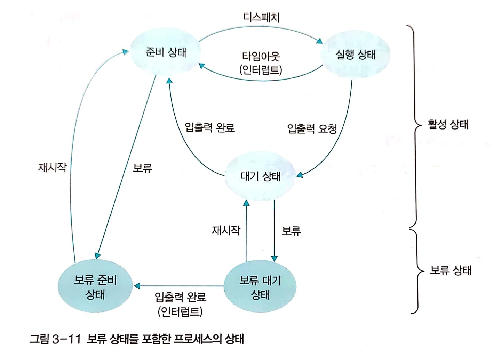
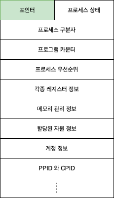
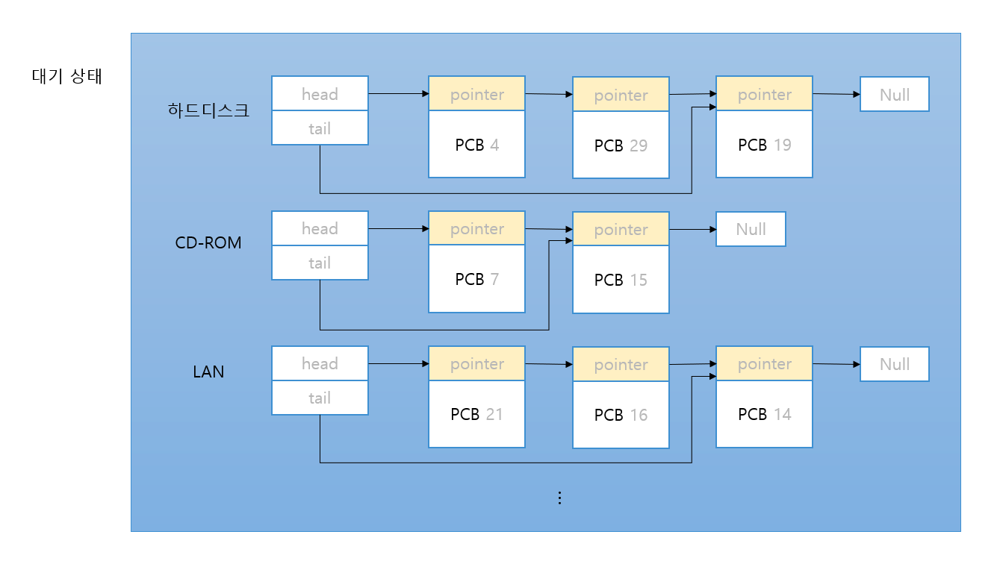
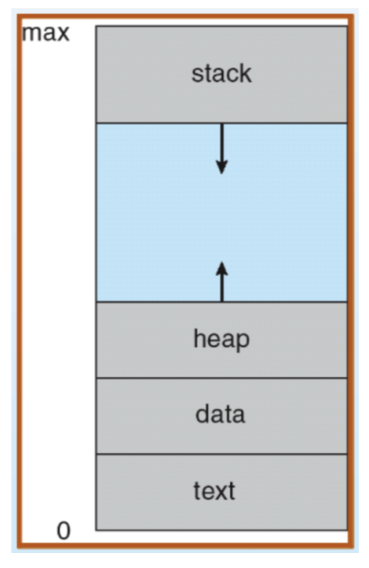
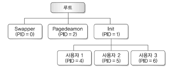

# 3. 프로세스와 스레드

## 프로세스의 개요

### 프로세스의 개념

- 프로그램: 저장장치에 저장되어 있는 정적인 상태.
- 프로세스: 실행을 위해 메모리에 올라온 동적인 상태. 컴퓨터 시스템의 작업 단위로 태스크라고도 부른다.

### 프로그램에서 프로세스로 전환

- 프로그램을 실행시키면 프로그램을 메모리의 적당한 위치로 가져온다. 그와 동시에 프로세스를 처리하는 데 필요한 다양한 정보가 들어있는 프로세스 제어 블록(Process Control Block, PCB)을 만든다.
- 프로세스 제어 블록에는 있는 다양한 정보 중 대표적인 적인 것은 세가지다.
    - 프로세스 구분자(Process IDentification, PID): 메모리의 프로세스를 구분하는 구분자다.
    - 메모리 관련 정보: 프로세스가 메모리의 어디에 저장되어 있는지 위치 정보가 담겨있다. 또한 메모리 보호를 위한 경계 레지스터와 한계 레지스터도 포함되어 있다.
    - 각종 중간값: 프로세사가 사용했던 중간값이 저장된다. 또한, 프로그램 카운터도 저장된다.
- 운영체제도 프로그램이기 떄문에 프로세스 형태로 실행된다.
    - 부트스트랩이 많은 운영체제 관련 프로세스를 실행한 후 일반 프로세스가 실행되므로 컴퓨터에는 일반 사용자의 사용자 프로세스(user process)와  운영체제의 커널 프로세스(kernel process)가 실행된다.

### 프로세스의 상태

- 활성 상태
    - 생성 상태
        - 프로그램을 메모리에 가져와 실행 준비가 완료된 상태이다.
        - 프로세스 제어 블록이 생성된다.
    - 준비 상태
        - 실행을 기다리는 모든 프로세스가 자기 차례를 기다리는 상태이다.
        - CPU 스케줄러가 다음에 실행될 프로세스를 선택한다. 이 작업을 dispatch(PID) 명령으로 처리하는데 이를 실행하면 해당 프로세스가 준비 상태에서 실행 상태로 바뀌어 작업이 이루어진다.
    - 실행 상태
        - 선택된 프로세스가 타임 슬라이스를 얻어 CPU를 사용하는 상태이다.
        - 타임 슬라이스: 실생상태에 있는 프로세스가 자신에게 주어진 시간
        - 프로세스 사이의 문맥 교환이 일어난다.
        - 시간을 다 사용하면 timeout(PID)가 실행되어 프로세스가 준비 상태로 옮겨진다.
        - 실행 상태 동안 작업이 완료되면 exit(PID)가 실행되어 프로세스가 정상 종료된다.
        - 입출력 요청을 받으면 CPU는 입출력 관리자에게 입출력을 요청하고 block(PID)를 실행한다. 실행되면 해당 상태는 대기 상태로 옮긴다. 또한, CPU 스케줄러는 새로운 프로세스를 실행 상태로 가져온다.
    - 대기 상태
        - 실행 상태에 있는 프로세스가 입출력 요청하면 입출력이 완료될 때까지 기다리는 상태이다.
        - 입출력이 완료되면 인터럽트가 발생하고, 대기 상태에 잇는 있는 프로세스 중 해당 인터럽트로 깨어날 프로세스를 찾는데 이것이 wakeup(PID)다. 실행되면 준비 상태로 이동하게 된다.
    - 완료 상태
        - 프로세스가 종료된 상태이다.
        - 코드와 사용했던 데이터를 메모리에서 삭제하고 프로세스 제어 블록을 폐기한다.
        - 만약 오류나 다른 프로세스에 의해 비정상적으로 종료되는 강제 종료(abort)를 만나면, 디버깅을 위해 강제 종료 직전의 메모리 상태를 저장장치로 옮기는데 이를 코어 덤프라고 한다.
- 휴식 상태
    - 프로세스가 작업을 일시적으로 쉬고 있는 상태이다.
    - 유닉스에서 프로그램을 실행하는 도중에 ctrl + z를 누르면 볼 수 있다.
    - 휴식 상태인 프로세스는 fg나 bg 명령어를 통해 재시작할 수 있다.
- 보류 상태
    - 프로세스가 메모리에서 잠시 쫓겨난 상태이다.
    - 휴식 상태는 메모리에 남아있다는 차이점이 있다.
    - 프로세스가 아래와 같은 경우에 보류 상태가 된다.
        - 메모리가 꽉 차서 일부 프로세스를 메모리 밖으로 보낼 때
        - 프로그램에 오류가 있어서 실행을 미루어야 할 때
        - 바이러스와 같이 악의적인 공격을 하는 프로세스라고 판단될 때
        - 매우 긴 주기로 반복되는 프로세스라 메모리 밖으로 쫓아내도 큰 문제가 없을 때
        - 입출력을 기다리는 프로세스의 입출력이 계속 지연될 때
    - 보류 상태에 들어간 프로세스는 메모리 밖으로 쫓겨나 스왑 영역에 보과뇐다.
    - 보류 준비 상태: 준비 상태에서 옮겨진 상태
    - 보류 대기 상태: 대기 상태에서 옮겨진 상태
        - 보류 대기 상태에서 입출력이 완료되면 활성 상태가 아닌 보류 준비 상태로 옮겨진다.
    - 각 상태에서 재시작하면 원래 활성 상태로 들어간다.

## 프로세스 제어 블록과 문맥 교환

### 프로세스 제어 블록

- 프로세스 제어 블록(PCB, Task Control Block 라고도 함): 프로세스를 실행하는데 필요한 중요한 정보를 보관하는 자료 구조
- 프로세스 제어 블록의 구성
  
    
    
    - 포인터: PCB 끼리 연결하여 준비 상태나 대기 상태 큐를 구현할 때 사용한다.
    - 프로세스 상태: 프로세스가 현재 어떤 상태인지 나타내며 생성, 준비 ,실행, 대기, 보류 준비, 보류 대기 등이 있다.
    - 프로세스 구분자: 운영체제 내에 있는 여러 프로세스를 구별하기 위한 값이다.
    - 프로그램 카운터: 다음에 실행될 명령어의 위치를 가리키는 값이다.
    - 프로세스 우선순위: 실제 프로세스들은 서로 다른 중요도를 가지고 있다. 사용자 프로세스보다 커널 프로세스의 우선순위가 높고, 사용자 프로세스끼리도 우선순위가 다르다. 프로세스가 대기 상태로 들어올 때 대기 상태 큐가 우선순위 별로 따로 운영된다. CPU 스케줄러가 준비 상태에 있는 프로세스 중 실행 상태로 옮겨야 할 프로세스를 선택할 때 우선 순위가 높은 프로세스를 먼저 실행하고 더 자주 실행한다.
    - 각종 레지스터 정보: 프로세스가 실행되는 중에 사용하던 레지스터 값이 저장된다. 누산기, 색인 레지스터, 스택 포인터 등이 있다.
    - 메모리 관리 정보: 프로세스가 메모리의 어디에 있는지 나타내는 메모리 위치 정보, 메모리 보호를 위해 사용하는 경계 레지스터 값과 한계 레지스터 값 등이 저장된다. 그 외에 세그먼테이션 테이블, 페이지 테이블 등의 정보도 보관된다.
    - 할당된 자원 정보: 프로세스를 실행하기 위해 사용하는 입출력 자원이나 오픈 파일 등에 대한 정보를 저장한다.
    - 계정 정보: 계정 번호, CPU 할당 시간, CPU 사용 시간 등의 정보를 저장한다.
    - 부모 프로세스 구분자의 자식 프로세스 구분자: 부모 프로세스를 가리키는 PPID, 자식 프로세스를 가리키는 CPID 정보를 저장한다.
- 포인터의 역할
    - 입출력을 기다리는 프로세스는 대기 상태 큐로 모인다. 이 때, PCB를 하나의 큐로 관리하면 입출력장치로부터 인터럽트가 들어왔을 때 모든 PCB를 다 확인해봐야된다는 문제가 있다. 이를 해결하기 위해 같은 입출력을 요구한 프로세스끼리 모아서 놓아 여러 개의 큐로 관리한다. 이를 대기 큐라고 부른다.
    - 이렇게 PCB를 큐로 연결하기 위해서 포인터로 연결한다.
    
    
    

### 문맥 교환

- 문맥 교환(context switching): CPU를 차지하던 프로세스가 나가고 새로운 프로세스를 받아들이는 작업이다.
- 문맥 교환 과정
    1. 실행 상태인 프로세스의 PCB에 현재까지의 작업 결과를 저장한다.
    2. 실행 상태인 프로세스가 준비 상태가 된다.
    3. 준비 상태에 있던 프로세스들 중 하나가 실행 상태가 된다.
    4. CPU의 레지스터에 실행 상태가 된 프로세스의 PCB 값으로 채운다.

## 프로세스의 연산

### 프로세스의 구조

- 코드 영역: 프로그램의 본문이 기술된 영역으로 읽기 전용으로 처리된다.
- 데이터 영역: 코드가 실행되면서 사용하는 정적 변수나 파일 등의 각종 데이터를 모아놓은 영역이다. 읽기와 쓰기가 가능하다.
- 스택 영역: 운영체제가 프로세스를 실행하기 위해 부수적으로 필요한 데이터를 모아놓은 영역이다. 스택 영역은 운영체제가 사용자의 프로세스를 작동하기 위해 유지하는 영역이므로 사용자에게는 보이지 않는다.

### 프로세스의 생성과 복사

- fork() 시스템 호출: 실행 중인 프로세스로 부터 새로운 프로세스를 복사하는 함수다. 프로세스 제어 블록을 포함한 부모 프로세스 영역의 대부분이 자식 프로세스에 복사된다. 그 중 일부는 값이 변경되는데 변경되는 부분은 아래와 같다.
    - 프로세스 구분자(PID): 프로세스마다 구분자가 다르기 때문이다.
    - 메모리 관련 정보: 부모 프로세스와 자식 프로세스가 차지하고 있는 메모리의 위치가 다르기 때문이다.
    - 부모 프로세스 구분자와 자식 프로세스 구분자: 자식 프로세스에서는 부모 프로세스 구분자로 부모 프로세스를 나타내고 자식 프로세스 구분자는 값이 -1이다.
- fork() 시스템 호출의 장점
    - 프로세스 생성 속도가 빠르다.
        - 하드디스크로부터 프로그램을 가져오지 않고 기존 메모리에서 복사하기 때문에 빠르다.
    - 추가 작업 없이 자원을 상속할 수 있다.
    - 시스템 관리를 효율적으로 할 수 있다.
        - 부모 프로세스와 자식 프로세스가 연결되어 있기 때문에, 자식 프로세스를 종료하면 자식이 사용하던 자원을 부모 프로세스가 정리할 수 있다.

### 프로세스의 전환

- exec() 시스템 호출: 프로세스를 그대로 둔 채 내용만 바꾼다. exec() 시스템 호출을 하면 현재의 프로세스가 완전히 다른 프로세스로 전환된다.
    - 코드 영역: 기존 내용을 지우고 새로운 코드로 바꾼다.
    - 데이터 영역: 새로운 변수로 채워진다.
    - 스택 영역: 리셋된다.
    - 프로세스 구분자, 부모 프로세스 구분자, 자식 프로세스 구분자, 메모리 관련 사항들은 변경되지 않는다.
    - 프로그램 카운터 레지스터 등의 각종 레지스터, 사용한 파일 정보는 모두 리셋된다.
- exec() 시스템 호출의 장점
    - 이미 만들어진 프로세스 제어 블록, 메모리 영역, 부모-자식 관계를 그대로 재사용할 수 있다.

### 프로세스의 계층 구조

- UNIX의 프로세스 계층 구조
  
    
    
    - 부팅되면 커널 관련 프로세스를 여러개 만드는데, 그중 init 프로세스가 전체 프로세스의 출발점이된다. init 프로세스는 일반 사용자 프로세스의 맨 위에 위치한다.
    - 프로세스를 효율적으로 관리하기 위해 init 프로세스를 만든 다음 나머지 프로세스를 init 프로세스의 자식으로 만든다.
    - init 프로세스에서 fork()와 exec() 시스템 호출을 이용하여 자식프로세스를 만든다. 자식으로는 login 프로세스, shell 프로세스 등이 있다.
- 프로세스 계층 구조의 장점
    - 여러 작업의 동시 처리: login 프로세스는 인증을 거쳐 컴퓨터에 접속하는 과정을 처리하는데 한 번에 1명만 처리할 수 있다. fork() 시스템 호출로 login 프로세스를 여러 개 만들어 새로운 사용자가 들어올 때마다 이러한 작업을 반복하면 여러 사용자를 동시에 처리할 수 있다.
    - 용이한 자원 회수: 프로세스 간에 책임 관계가 분명하여 시스템을 관리하기 수월하다. 만약 모든 프로세스가 독립적으로 만들어지면 프로세스가 종료될 때마다 운영체제가 직접 자원을 회수해야 하기 때문에작업이 복잡해진다. 프로세스가 부모-자식 관계라면 자식 프로세스가 작업을 마쳤을 때 사용하던 자원을 부모 프로세스가 회수하면 된다.
- 미아 프로세스와 좀비 프로세스
    - 미아 프로세스: 프로세스가 종료된 후에도 비정상적으로 남아 있는 프로세스. 부모 프로세스가 자식보다 먼저 죽는 경우에 발생한다.
    - 좀비 프로세스: 자식 프로세스가 비정상적으로 종료된 후 부모 프로세스에 연락이 안되어 부모가 뒤처리를 하지 않는 경우에 발생한다.
    - 운영체제는 반환되지 못한 자원을 회수하는 자원 회수를 주기적으로 해야 한다.

## 스레드

### 스레드의 개념

- 스레드: 프로세스의 코드에 정의된 절차에 따라 CPU에 작업 요청을 하는 실행 단위다.
- 처리 > 프로세스 > 스레드
- 일괄 작업(batch job): 여러 개의 프로세스를 모아서 한꺼번에 처리하는 방법
- 프로세스와 스레드의 차이
    - 프로세스끼리는 약하게 연결되어 있는 반면 스레드끼리는 강하게 연결되어 있다.
    - 멀티태크스: 서로 독립적이기 때문에 한 프로세스가 비정상적으로 종료되어도 나머지 프로세스는 정상적으로 작동한다. 서로 독립적인 프로세스는 데이터를 주고받을 때 프로세스 간 통신(Inter Process Communication, IPC)를 사용한다.
    - 멀티스래드: 서로 강하게 연결되어있기 때문에 하나의 스레드가 비정상적으로 종료되면 프로세스 내 나머지 스레드도 강제 종료된다. 멀티스레드는 변수나 파일 등을 공유하고 전역 변수나 함수 호출 등의 방법으로 스레드 간 통신을 한다.
- 스레드 관련 용어
    - 멀티스레드: 프로세스 내 작업을 여러 개의 스레드로 분할함으로써 작업의 부담을 줄이는 프로세스 운영 기법이다.
    - 멀티태스킹: 운영체제가 CPU에 작업을 줄 때 시간을 잘게 나누어 배분하는 기법이다. 이렇게 여러 스레드에 시간을 잘게 나누어주는 시스템을 시분할 시스템이라고 한다. 시분할 시스템에서 운영체제가 CPU에 전달하는 작업은 프로세스가 아니라 스레드이다.
    - 멀티프로세싱: CPU를 여러 개 사용하여 여러 개의 스레드를 동시에 처리하는 작업 환경이다. 이는 병렬 처리에서의 슈퍼스칼라 기법과 같다. 여러 개의 CPU 혹은 CPU 내 여러 개의 코어에 스레드를 배정하여 동시에 작동한다. 네트워크로 연결된 여러 컴퓨터에 스레드를 나누어 협업하는 분산 시스템도 멀티프로세싱이라고 부른다.
    - CPU 멀티스레드: 한 번에 하나씩 처리해야 하는 스레드를 파이프라인 기법을 이용하여 동시에 여러 스레드를 처리하도록 만든 병렬 처리 기법이다.
        - 멀티스레드: 운영체제가 소프트웨어적으로 프로세스를 작은 단위의 스레드로 분할하여 운영하는 기법이다.
        - CPU 멀티스레드: 하드웨어적인 방법으로 하나의 CPU에서 여러 스레드를 동시에 처리하는 병렬 처리 기법이다.
    
    <aside>
    💡 스레드의 탄생 배경: CPU와 프로그래밍 기술이 발전하면서 프로세스를 다양한 스레드로 나누어 여러 개의 코어에 분산하여 시스템 효율을 높이기 위해서 스레드가 탄생했다.
    
    </aside>
    

### 멀테스레드의 구조와 예

- 프로세스는 크게 정적인 영역과 동적인 영역으로 구분된다.
    - 정적인 영역: 스레드가 작업하면서 값이 바뀌지 않는 영역이다.
        - 코드, 전역 데이터, 파일 등
    - 동적인 영역: 스레드가 작업하면서 값이 바뀌거나 새로만들어지거나 사라지는 영역이다.
        - 레지스터, 스택 등
- fork() 시스템 호출로 여러 개의 프로세스를 만들면 필요 없는 정적 영역이 여러 개가 된다.
- 멀티스레드는 코드, 파일 등의 자원을 공유함으로써 자원의 낭비를 막고 효율성이 향상된다.
    - 이런 의미로 스레드는 가벼운 프로세스(Light Weight Process, LWP)라고 부르며, 반대로 스레드가 1개인 일반 프로세스는 무거운 프로세스(heavy Weight Process, HWP)라고 부른다.

### 멀티스레드의 장단점

- 멀티스레드의 장점
    - 응답성 향상: 한 스레드가 입출력으로 인해 작업이 진행되지 않더라도 다른 스레드가 작업을 계속하여 사용자의 작업 요구에 빨리 응답할 수 있다.
    - 자원 공유: 한 프로세스 내에서 독립적인 스레드를 생성하면 프로세스가 가진 자원을 모두 스레드가 공유하게 되어 작업을 원할하게 진행할 수 있다.
    - 효율성 향상: 여러 개의 프로세스를 생성하는 것과 달리 멀티스레드는 불필요한 자원 중복을 막음으로써 시스템의 효율이 향상된다.
    - 다중 CPU 지원: 2개 이상의 CPU를 가진 컴퓨터에서 멀티스레드를 사용하면 다중 CPU가 멀티스레드를 동시에 처리하여 CPU 사용량이 증가하고 프로세스의 처리 시간이 단축된다.
- 멀티 스레드의 단점
    - 모든 스레드가 자원을 공유하기 떄문에 한 스레드에 문제가 생기면 전체 프로세스에 영향을 미친다. 반면 프로세스는 독립적이기 때문에 한 프로세스의 문제가 다른 프로세스로 전달되지 않는다.
        - 예: IE와 구글 크롬

### 멀티스레드 모델

- 프로세스와 똑같이 스레드도 커널 스레드와 사용자 스레드가 있다.
- 사용자 스레드: 운영체제가 멀티스레드를 지원하지 않을 때 사용하는 방법이다. 사용자 레벨에서 라이브러리를 사용하여 스레드를 구현하는 방법으로 라이브러리가 커널이 지원하는 스케줄링이나 동기화 같은 기능을 대신 구현해준다.
    - 커널 입장에서는 일반 프로세스이지만 커널이 하는 일은 라이브러리가 대신 처리하여 여러 개의 스레드를 작동한다. 커널의 스레드 하나와 프로세스 내의 여러 개의 스레드가 연결되기 때문에 1 to N 모델이라고 부른다.
    - 장점: 라이브러리가 직접 스케줄링을 하고 작업에 필요한 정보를 처리하기 때문에 문맥 교환이 일어나지 않는다. 따라서 부가적인 작업이 줄어들어 속도가 빠르다.
    - 단점: 한 프로세스의 타임 슬라이스를 여러 스레드가 공유하기 때문에 여러 개의 CPU를 동시에 사용할 수 없다. 커널 입장에서는 사용자 스레드는 하나의 프로세스로 인식되기 때문이다.
- 커널 스레드: 커널이 멀티스레드를 지원하는 방식이다.
    - 하나의 사용자 스레드가 하나의 커널 스레드와 연결되기 때문에 1 to 1 모델이라고 부른다.
    - 장점: 커널 레벨에서 모든 작업을 지원하기 때문에 멀티 CPU를 사용할 수 있고, 하나의 스레드가 대기 상태에 있어도 다른 스레드는 작업을 계속할 수 있다. 또한 커널의 기능을 사용하므로 보안에 강하고 안정적으로 작동한다.
    - 단점: 문맥 교환을 할 때 오버헤드 떄문에 느리게 작동한다.
- 멀티레벨 스레드: 사용자 스레드와 커널 스레드를 혼합한 방식으로 M to N 모델이라고 부른다.
    - 커널 스레드의 수가 사용자 스레드보다 같거나 작다.
    - 사용자 스레드와 커널 스레드의 장단점을 모두 가지고 있다.
    - 빠르게 움직여야 하는 스레드는 사용자 스레드로 작동하고, 안정적으로 움직여야 하는 스레드는 커널 스레드로 작동한다.

## 동적 할당 영역과 시스템 호출

### 프로세스의 동적 할당 영역

- 프로세스는 코드 영역, 데이터 영역, 스택 영역, 힙 영역으로 이루어져 있다.
  
    
    
    - 코드 영역: 프로그램의 본체가 있는 곳
    - 데이터 영역: 프로그램이 사용하려고 정의한 변수와 데이터가 있는 곳.
    - 스택 영역:
        1. 호출한 함수가 종료되고 함수를 호출하기 전 코드로 되돌아올 메모리 주소를 저장한다.
        2. 지역 변수를 저장한다.
    - 힙 영역: 동적으로 할당되는 변수 영역. malloc() 함수로 할당할 수 있다.

### exit()와 wait() 시스템 호출

- exit() 시스템 호출
    - 작업의 종료를 알려주는 시스템 호출
    - exit() 함수를 선언함으로써 부모 프로세스는 자식 프로세스가 사용하던 자원을 빨리 거둬 갈 수 있다.
    - exit() 함수는 전달하는 인자를 확인하여 자식 프로세스가 어떤 상태로 종료되었는지 알려준다. 인자가 0이면 정상 종료이고 -1이면 비정상 종료이다.
- wait() 시스템 호출
    - 부모 프로세스가 먼저 종료됨으로써 고아 프로세스가 생기는 것을 방지하기 우해 wait() 시스템 호출을 사용한다.
    - 부모 프로세스와 자식 프로세스 간 동기화에도 사용된다.

## 연습 문제

1. 프로세스 컨트롤 블럭
2. 준비 상태
3. 대기 상태
4. 디스패치
5. 휴식 상태
6. 문맥 교환
7. fork
8. exec
9. 미아 프로세스
10. 스레드
11. wait
12. 가비지 컬렉션 스레드 수집
13. 프로세스 계층 구조

## 심화 문제

1. 직접 그림
2. 아래
    1. 휴식 상태: 프로세스가 메모리에 올려진 채로 작업을 일시적으로 쉬는 상태다. UNIX에서 ctrl + z를 누르면 이 상태가 된다.
    2. 보류 상태: 프로세스가 메모리에서 쫓겨나 작업을 일시적으로 쉬는 상태다. 아래의 경우에 보류 상태가 된다.
        - 메모리가 꽉 차서 일부 프로세스를 메모리에서 내보내야할 때
        - 프로세스에 오류가 있어서 작업을 일시적으로 미뤄야할 때
        - 악의적인 공격을 하는 프로세스라고 판단할 때
        - 입출력을 기다리는 대기 상태가 장시간 유지될 때
        - 긴 주기로 실행되는 프로세스여서 메모리에서 내보내도 문제가 없을 때
3. 프로세스를 처리하는데 필요한 다양한 정보를 저장하는 자료구조다. 대표적으로 다음의 정보가 있다.
    - 프로세스 구분자
    - 메모리 관련 정보
    - 각종 중간값
4. CPU를 사용중이던 프로세스가 나가고 새로운 프로세스를 받아 들이는 작업이다. 기존에 레지스터에 저장된 값들을 메모리로 보내고 새로운 프로세스의 PCB 값들을 레지스터로 옮긴다.
5. 아래
    - 코드 영역: 프로그램의 코드가 저장 되는 영역
    - 데이터 영역: 전역 변수, 스태틱 변수, 파일 등의 데이터가 저장되는 영역
    - 스택 영역: 운영체제가 프로세스를 실행하기 위해 부수적으로 필요한 데이터를 모아둔 영역
6. 아래
    - 프로세스 생성 속도가 빠르다.
    - 추가 작업이 자원을 상속할 수 있다.
    - 시스템 관리를 효율적으로 할 수 있다.
7. 이미 만들어진 PCB, 부모-자식 관계, 메모리 영역을 재사용할 수 있다.
8. 아래
    - 여러 작업의 동시 처리가 가능하다.
    - 자원 회수 관리가 쉽다.
9. 아래
    - 멀티스레드: 한 개의 프로세스에 여러 개의 스레드를 생성하여 사용하는 프로그래밍 기법이다.
    - 멀티태스킹: 하나의 CPU에서 여러 스레드에 시간을 잘게 나누어 처리하는 기법이다.
    - 멀티프로세싱: 여러 CPU에 여러 스레드를 할당하여 처리하는 기법이다. 슈퍼스칼라 기법과 같은 의미다.
    - CPU 멀티스레드: 한 번에 하나씩 처리해야되는 스레드를 파이프라인 기법을 이용해 동시에 여러 스레드를 처리하는 병렬 처리 기법을 말한다.