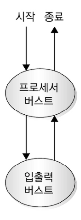
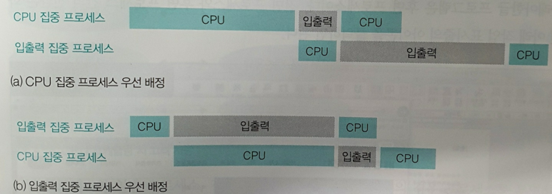
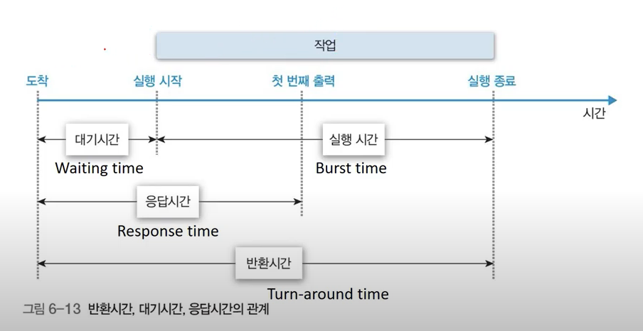

---
tags:
  - 도서/쉽게-배우는-운영체제
---

# 4. CPU 스케줄링

## 스케줄링의 개요

### 스케줄링의 단계

- CPU 스케줄러: 여러 프로세스의 상황을 고려하여 CPU와 시스템 자원을 어떻게 배정할지 결정하는 일을 한다.
- 고수준 스케줄링
    - 장기 스케줄링, 작업 스케줄링이라고도 한다.
    - 전체 시스템의 부하를 고려하여 작업을 시작할지 말지를 결정한다.
    - 이 결정에 따라 시스템의 전체 프로세스 수가 결정되는데 이를 멀티프로그래밍 정도(degree of multiprogramming)라고한다.
- 중간 수준 스케줄링
    - 시스템에 과부하가 걸려서 전체 프로세스 수를 조절해야 한다면 이미 활성화된 프로세스 중 일부를 보류 상태로 보낸다.
- 저수준 스케줄링
    - 어떤 프로세스에 CPU를 할당할지, 어떤 프로세스를 대기 상태로 보낼지 등을 결정한다.
    - 성능에 많은 영향을 미치는 스케줄링이다.

### 스케줄링의 목적

- 공평성: 모든 프로세스가 자원을 공평하게 배정받아야 하며, 자원 배정 과정에 특정 프로세스가 배제되어서는 안 된다.
- 효율성: 시스템 자원이 유휴 시간 없이 사용되도록 스케줄링 하고, 유휴 자원을 사용하려는 프로세스에는 우선권을 주어야한다.
- 안정성: 우선순위를 사용하여 중요 프로세스가 먼저 작동하도록 배정함으로써 시스템 자원을 점유하거나 파괴하려는 프로세스로부터 자원을 보호해야 한다.
    - 시스템의 안정성과 효율성을 높이기 위해 다른 프로세스보다 먼저 처리해야 하는 프로세스가 있으므로 CPU 스케줄러는 일정 부분 공평성을 해친다.
- 확장성: 프로세스가 증가해도 시스템이 안정적으로 작동하도록 조치해야 한다. 또한 시스템 자원이 늘어나는 경우 이 혜택이시스템에 반영되기 해야 한다.
- 반응 시간 보장: 응답이 없는 경우 사용자는 시스템이 멈춘 것으로 가정하기 때문에 시스템은 적절한 시간 안에 프로세스의 요구에 반응해야 한다.
- 무한 연기 방지: 특정 프로세스의 작업이 무한히 연기되어서는 안 된다.

## 스케줄링 시 고려 사항

### 선점형 스케줄링과 비선점 스케줄링

- 선점형 스케줄링: 어떤 프로세스가 CPU를 할당받아 실행 중이더라도 운영체제가 CPU를 강제로 빼앗을 수 있는 스케줄링 방식이다.
    - 대표적인 예로 인터럽트 처리가 있다.
    - 장점: 하나의 프로세스가 CPU를 독접할 수 없기 때문에 빠른 응답 시간을 요구하는 대화형 시스템이나 시분할 시스템에 적합하다.
    - 단점: 문맥 교환으로 인해 오버헤드가 많이 발생한다.
- 비선점형 스케줄링: 어떤 프로세스가 실행 상태에 들어가 CPU를 사용하면 그 프로세스가 종료되거나 자발적으로 대기 상태에 들어가기 전까지는 계속 실행된다.
    - 장점: CPU 스케줄러의 작업량이 적고 문맥 교화느이 오버헤드가 적다.
    - 단점: CPU 사용 시간이 긴 프로세스 때문에 CPU 사용 시간이 짧은 여러 프로세스가 오랫동안 기다리게 되어 전체 시스템의 처리율이 떨어 질 수 있다.
- 선점형 스케줄링 방식의 스케줄러에도 비선점형 프로세스가 있을 수 있다.
    - 예를 들어 시스템을 백업하는 프로세스는 비선점형으로 작동한다.

### 프로세스 우선순위

- 프로세스의 우선순위가 높다는 것은 더 빨리 자주 실행된다는 의미이다.
- 커널 프로세스의 우선순위가 일반 프로세스보다 높다.
- 같은 커널 프로세스라 하더라도 우선순위가 다를 수 있다.
- 일반 프로세스도 우선순위가 서로 다르다.
- 일반 프로세스의 우선순위는 사용자가 조절할 수 있다.
    - 우선순위를 높이기 위해서는 관리자 권한이 필요하고, 우선순위를 낮추는 것은 일반 계정으로도 된다.

### CPU 집중 프로세스와 입출력 집중 프로세스

- 프로세스 상태 중 실제로 작업이 일어나느 것은 실행 상태와 대기 상태다.
- CPU를 할당받아 실행하는 작업을 CPU 버스트, 입출력 작업을 입출력 버스트라고 부른다.

- CPU 집중 프로세스: CPU를 많이 사용하는 프로세스를 말한다. 즉 CPU 버스트가 많은 프로세스다.
- 입출력 집중 프로세스: 저장장치에서 데이터를 복사하는 일과 같이 입출력을 많이 사용하는 프로세스를 말한다. 즉 입출력 버스트가 많은 프로세스다.
- CPU 집중 프로세스와 입출력 집중 프로세스가 같이 있을 때는 입출력 집중 프로세스를 먼저 실행 상태로 옮기는 것이 효율적이다.
  
    
    
- 프로세스에 따라서 입출력 집중 프로세스와 CPU 집중 프로세스를 명확하게 구분할 수 없는 경우도 있다. 따라서 이를 통해 우선순위를 고려하기 어려울 수도 있다.

### 전면 프로세스와 후면 프로세스

- 전면 프로세스: 현재 입력과 출력을 사용하는 프로세스이며, 사용자와 상호작용이 가능하여 상호작용 프로세스라고도 한다.
- 후면 프로세스: 사용자와 상호작용이 없는 프로세스이다. 압축 프로그램처럼사용자의 입력이 없이 작동하기 때문에 일괄 작업 프로세스라고도 한다.
- 전면 프로세스는 사용자의 요구에 즉각 반응해야 하지만 후면 프로세스는 상효작용이 없다.
    - 따라서 저면 프로세스의 우선순위가 후면 프로세스보다 높다.

## 다중 큐

### 준비 상태의 다중 큐

- CPU 스케줄러가 모든 프로세스 제어 블록을 뒤져서 가장 높은 우선순위의 프로세스를 찾는 것은 번거롭다.
- 이를 해결하기 위해 다중 큐를 사용한다.
    - 우선순위에 따라 여러 개의 큐를 만든다.
    
    
    
- 프로세스 우선 순위 배정 방식 2가지
    - 고정 우선순위 방식: 운영체제가 프로세스에 우선순위를 부여하면 프로세스가 끝날 때까지 바뀌지 않는다.
        - 장점: 구현이 쉽다.
        - 단점: 시시각각 변하는 시스템 변화에 대응하기 어려워 작업 효율이 떨어진다.
    - 변동 우선순위 방식: 프로세스 생성 시 부여받은 우선순위가 프로세스 작업 중간에 변하는 방식이다.
        - 장점: 시스템의 효율성을 높일 수 있다.
        - 단점: 구현이 어렵다.

### 대기 상태의 다중 큐

- 시스템 내에 다양한 종류의 입출력장치가 있기 때문에 대기 상태의 프로세스를 한곳에 모아놓으면 관리가 불편하다.
- 시스템의 효율을 높이기 위해 대기 상태에서 같은 입출력을 요구한 프로세스끼리 모아놓은 대기 큐를 만든다.
- 준비 상태의 다중 큐와 대기 상태의 다중 큐 차이점
    - 준비 큐는 한 번에 하나의 프로세스를 꺼내어 CPU를 할당하는 반면, 대기 큐는 여러 개의 프로세스 제어 블록을 동시에 꺼내어 준비 상태로 옮긴다.
        - 동시에 끝나는 인터럽트를 처리하기 위해 인터럽트 벡터라는 자료구조를 사용한다.
    - 대기 큐에 있는 프로세스 제어 블록은 큐에 삽입된 순서대로 처리되지만, 일부는 나중에 들어온 것이 먼저 준비 상태로 옮겨 가기도 한다.
        - 입출력 장치가 CPU나 메모리보다 느려서 작업 속도를 높이기 위해 작업 순서를 뒤바꾸는 경우가 잇다.

## 스케줄링 알고리즘

| 구분 | 종류 |
| --- | --- |
| 비선점형 알고리즘 | FCFS 스케줄링, SJF 스케줄링, HRN 스케줄링 |
| 선점형 알고리즘 | 라운드 로빈 스케줄링, SRT 스케줄링, 다단계 큐 스케줄링, 다단계 피드백 큐 스케줄링 |
| 둘 다 가능 | 우선순위 스케줄링 |

### 스케줄링 알고리즘 평가 기준

- CPU 사용률: 전체 시스템의 동작 시간 중 CPU가 사용된 시간. 이상적인 수치는 100%이지만, 실제는 여러 가지 이유로 90%에도 못 미친다.
- 처리량: 단위 시간당 작업을 마친 프로세스의 수.
- 대기 시간:작업을 요청한 프로세스가 작업을 시작하기 전까지 대기하는 시간.
- 응답 시간: 프로세스 시작 후 첫 번째 출력 또는 반응이 아놀 떄 까지 걸리는 시간. 대화형 시스템에서 중요하다.
- 반환 시간: 프로세스가  생성된 후 종료되어 사용하던 자원을 모두 반환하는 데 까지 걸리는 시간.

### FCFS 스케줄링

- First Come First Served. FIFO라고도 부른다.
- 준비 큐에 도착한 순서대로 CPU를 할당하는 비선점형 방식
- 초기의 일괄 작업 시스템에서 사용되었다.
- 평가
    - 콘보이 효과가 존재한다.
    - 콘보이 효과: 처리 시간이 긴 프로세스가 CPU를 차지하면 다른 프로세스들은 하염없이 기다려 시스템의 효율성이 떨어지는 문제
    - 현재 작업 중인 프로세스가 입출력 작업을 요청하는 경우 CPU가 작업을 하지 않고 쉬는 시간이 많아져 작업 효율이 떨어진다.

### SJF 스케줄링

- Shortest Job First.
- 준비 큐에 있는 프로세스 중 실행 시간이 가장 짧은 작업부터 CPU를 할당하는 비선점형 방식.
- 평가
    - FCFS에 비해 평균 대기 시간이 줄어든다.
    - 운영체제가 프로세스의 종료 시간을 정확하게 예측하기 어렵다.
      
        → 프로세스가 자신의 작업 시간을 운영체제에 알려준다면 해결할 수 있지만, 프로세스가 자신의 작업 시간을 정확히 알기 어려울 뿐 아니라, 일부 악의적인 프로세스가 작업 시간을 속인다면 시스템의 효율성이 나빠진다.
        
    - 공평하지 못하다. 작업 시간이 길다는 이유만으로 계속 뒤로 밀려 아사(starvation) 현상이 발생할 수 있다.
      
        → 에이징으로 완화할 수 있다. 프로세스가 자신의 순서를 양보할 때 마다 나이를 한 살씩 먹어 최대 몇 살까지양보하도록 규정하는 것이다.
        

### HRN 스케줄링

- Highest Response Ratio Next
- SJF 스케줄링에서 발생할 수 있는 아사 현상을 해결하기 위해 만들어진 비선점형 알고리즘.

$$
우선순위 = {{대기 시간 + CPU 사용 시간}\over CPU 사용 시간}
$$

- 우선순위를 정할 때 대기 시간을 고려함으로써 아사 현상을 완화한다.
- HRN 스케줄링에서는 숫자가 클수록 우선순위가 높다.
- 평가
    - 실행 시간이 짧은 프로세스의 우선순위를 높게 설정하면서도 대기 시간을 고려하여 아사 현상을 완화한다.
    - 여전히 공평성이 위배된다.

### 라운드 로빈 스케줄링

- 타임 슬라이스동안 작업을 하다가 작업을 완료하지 못하면 준비 큐의 맨 뒤로로 가서 자기 차례를 기다리는 선점형 알고리즘.
- 평가
    - 콘베이 효과가 줄어든다.
    - 문맥 교환에 따른 추가 시간을 고려하여 타임 슬라이스를 적절히 설정해야 한다.
        - 타임 슬라이스가 너무 긴 경우 FCFS 스케줄링과 다른게 없다.
        - 타임 슬라이스가 너무 짧은 경우 문맥 교환에 많은 시간을 낭비하여 실제 작업을 못하는 문제가 발생한다.
    

### SRT 우선 스케줄링

- Shortest Remaining Time
- 기본적으로 라운드 로빈 스케줄링을 사용하지만, CPU를 할당받을 프로세스를 선택할 때 남아 있는 작업 시간이 가장 적은 프로세스를 선택한다.
- 평가
    - 현재 실행 중인 프로세스와 큐에 있는 프로세스의 남은 시간을 주기적으로 계산하고, 남은 시간이 더 적은 프로세스와 문맥 교환을 해야 하므로 계산하는 작업이 추가된다.
    - 종료 시간을 예측하기 어렵다.
    - 아사 현상이 일어난다.

### 우선순위 스케줄링

- 프로세스의 중요도에 따라 우선순위를 갖고, 이를 반영한 스케줄링 알고리즘.
- 비선점형 방식과 선점형 방식에 모두 적용할 수 있다.
- 평가
    - 준비 큐에 있는 프로세스의 순서를 무시하고 우선순위가 높은 프로세스에 먼저 CPU를 할당하므로 공평성을 위배하고 아사 현상을 일으킨다.
    - 프로세스의 우선순위를 매번 바꿔야되는 경우에는 오버헤드가 발생하여 시스템 효율성이 떨어진다.

### 다단계 큐 스케줄링

- multilevel queue
- 운영체제로부터 부여받은 우선순위에 따라 해당 우선순위의 큐에 삽입된다.
- 우선순위는 고정형 우선순위를 사용한다.
- 상단 큐에 있는 모든 프로세스의 작업이 끝나야 다음 우선순위 큐의 작업이 시작된다.
- 우선순위에 따라 타임 슬라이스를 조절하여 작업 효율을 높일 수도 있다.
- 우선순위가 높은 상위 큐 프로세스의 작업이 끝나기 전에는 하위 큐 프로세스의 작업을 할 수 없다.
    - 즉 우선순위가 높은 프로세스 때문에 우선순위가낮은 프로세스의 작업이 연기되는 문제가 있다.
    - 이를 해결하기 위해 다단계 피드백 큐 스케줄링을 사용한다.

### 다단계 피드백 큐 스케줄링

- multilevel feedback queue
- 다단계 큐 스케줄링과 달리 CPU를 사용하고 난 프로세스의 우선순위가 낮아진다.
- 프로세스가 CPU를 한 번씩 할당받아 실행될 때마다 프로세스의 우선순위를 낮춤으로써, 다단계 큐에서 우선순위가 낮은 프로세스의 실행이 연기되는 문제를 완화한다.
- 물론 프로세스의 우선순위가 낮아진다고 할지라도 커널 프로세스가 일반 프로세스의 큐에 삽입되지는 않는다.
- 우선순위에 따라 타임 슬라이스의 크기가 다르고 마지막 큐는 들어온 순서대로 작업을 마치는 FCFS 스케줄링 방식으로 동작한다.

## 인터럽트 처리

### 인터럽트의 개념

- 초기의 프로그래밍 방식은 프로그램을 위에서부터 한 줄씩 차례로 실행하는 순차적 프로그래밍이었다.
    - 하지만 이는 특정 문제를 해결하는 데 취약하다.
    - 버튼이 눌렸는지 안 눌렸는지 주기적으로 확인하는 대신 버튼이 눌리면 프로세스에 알려주는데 이를 이벤트 드리븐이라고 한다.
- 운영체제의 입출력 처리도 이벤트 드리븐 방식과 마찬가지로 입출력이 완료되면 이벤트를 발생시키는데 이를 인터럽트라고한다.

### 동기적 인터럽트와 비동기적 인터럽트

- 동기적 인터럽트: 프로세스가 실행 중인 명령어로 인해 발생하는 인터럽트. 사용자 인터럽트라고도 한다. 다음과 같은 종류가 있다.
    - 프로그램상의 문제 때문에 발생하는 인터럽트(다른 사용자의 메모리 영역에 접근, 오버플로우 등)
    - 컴퓨터 작업자가 의도적으로 프로세스를 중단하기 위해 발생시킨 인터럽트(ctrl + c)
    - 입출력장치 같은 주변장치의 조작에 의한 인터럽트
    - 산술 연산 중 발생하는 인터럽트(예: 0으로 나누기)
- 비동기적 인터럽트: 하드웨어적인 오류로 발생하는 인터럽트.
    - 하드디스크 읽기 오류
    - 메모리 불량

### 인터럽트 처리 과정

- 인터럽트 벡터: 인터럽트 번호와 그 번호에 붙어있는 함수의 쌍으로 구성된 자료 구조
    - 인터럽트 핸들러: 해당 인터럽트가 발생하면 어떤 일을 처리할 것인지가 정의된 함수. 사용자가 이를 재정의할 수도 있다.
- 인터럽트 처리 과정
    1. 인터럽트가 발생하면 현재 실행 중인 프로세스는 일시 정지 상태가 되고, 재시작을 위해 현재 프로세스 관련 정보를 임시로 저장한다.
    2. 여러 개의 인터럽트가 동시에 발생하면 인터럽트 컨트롤러가 우선순위를 고려하여 중요한 인터럽트부터 처리하도록 순서를 결정한다.
    3. 먼저 처리할 인터럽트가 결정되면 인터럽트 벡터에 등록된 인터럽트 핸들러가 실행된다.
    4. 인터럽트 벡터가 연결된 핸들러가 인터럽트 처리를 마치면 일시 정지된 프로세스가 다시 실행되거나 종료된다.

### 인터럽트와 이중 모드

- 사용자 프로세스가 시스템 호출을 요청하면 대기 상태로 전환되고 커널 프로세스가 요청받은 작업을 처리한다.
- 이와 같이 운영체제가 사용자 모드와 커널 모드를 전환하며 일처리 하는 것을 이중 모드(dual mode)라고 한다.
- 이중 모드는 운영체제가 자원을 보호하기 위해 사용한다.
- 사용자가 커널 모드로 진입하는 경우 2가지
    - 시스템 호출을 사용한 경우(자발적)
    - 인터럽트를 발생시킨 경우(비자발적)

## 연습 문제

1. 고수준 스케줄링
2. 저수준 스케줄링
3. 선점형 스케줄링
4. 전면 프로세스
5. FCFS 스케줄링
6. SJF 스케줄링
7. 아사 현상
8. 에이징 기법을 사용한다. 오래 기다린 프로세스를 먼저 처리되도록 하면 아사 현상을 해결할 수 있다.
9. HRN 스케줄링
10. 라운드 로빈 스케줄링
11. 타임 슬라이스의 크기가 작을 수록 문맥 교환이 발생하는 시간이 많아져서 실제 프로세스를 처리하는 효율이 떨어진다.
12. SRT 스케줄링
13. 다단계 큐 스케줄링
14. 다단계 피드백 큐 스케줄링 
15. 무한이다. 마지막 큐는 FCFS로 동작한다.
16. 길어진다. 우선순위가 낮은 프로세스가 CPU를 점유했을 때 점유할 수 있는 시간을 많이 주기위해서 길게 설정되어있다.
17. FCFS 스케줄링

## 심화 문제

1. 아래
    - 고수준 스케줄링: 전체 시스템의 부하를 고려하여 작업을 시작할지 정하는 스케줄링이다.
    - 중간 수준 스케줄링: 시스템의 부하를 고려하여 활성화 된 프로세스의 개수를 조절하는 스케줄링이다.
    - 저수준 스케줄링: 다음에 실행 상태가 될 프로세스와 준비 상태가 될 프로세스를 선택하는 스케줄링이다.
2. 아래
    - 공평성: 모든 프로세스가 자원을 공평하게 배정받아야 하며, 자원 배정 과정에서 특정 프로세스가 배제되어서는 안된다.
    - 효율성: 시스템 자원이 유휴 시간이 없이 사용되도록 스케줄링하고, 유휴 자원을 사용하려는 프로세스에게 우선권을 줘야된다.
    - 안정성: 우선순위를 사용하여 중요 프로세스가 먼저 작동하도록 배정함으로써 시스템 자원을 점유하거나 파괴하려는 프로세스로부터 자원을 보호해야 한다.
    - 확장성: 프로세스가 증가해도 시스템이 안정적으로 작동하도록 조치해야 한다. 또한 시스템 자원이 늘어나느 경우 이혜택이 시스템에 반영되게 해야 한다.
    - 반응 시간 보장: 응답이 없는 경우 사용자는 시스템이 멈춘 것으로 가정하기 때문에 시스템은 적절한 시간 안에 프로세스의 요구에 반응해야 한다.
    - 무한 연기 방지: 특정 프로세스의 작업이 무한히 연기되어서는 안 된다.
3. 아래
    - 선점형 스케줄링: 프로세스가 CPU를 할당 받아 사용중이더라도 운영체제가 CPU를 강제로 빼앗을 수 있는 스케줄링 기법
    - 비선점형 스케줄링: 어떤 프로세스가 실행 상태에 들어가 CPU를 사용하면 그 프로세스가 종료되거나 자발적으로 대기 상태에 들어가기 전까지는 계속 실행되는 스케줄링 기법
4. 아래
    - CPU 사용률: 전체 시스템 동작 시간 중 CPU가 사용된 시간
    - 처리량: 단위 시간당 작업을 마친 프로세스의 수
    - 대기 시간: 작업 요청을 한 프로세스가 작업을 시작하기 전까지 대기하는 시간
    - 응답 시간: 프로세스 시작 후 첫 번째 출력 또는 반응이 나올 때 까지 걸리는 시간
    - 반환 시간: 프로세스가 생성된 후 종료되어 사용하던 자원을 모두 반환하는 데까지 걸리는 시간
5. 아래
    - FCFS: 준비 큐에 도착한 순서대로 CPU를 할당하는 비선점형 스케줄링
    - SJF: 준비 큐에 있는 프로세스 중 실행 시간이 가장 짧은 작업부터 CPU를 할당하는 비선점형 스케줄링
    - HRN: 서비스를 받기 위해 대기한 시간과 CPU 사용 시간을 고려하여 우선순위를 정하는 스케줄링
6. 아래
    - 라운드 로빈: 선점형 스케줄링 중 가장 간단한 기법. 하당받은 시간 동안 작업하다가 작업을 완료하지 못하면 준비 큐의 맨 뒤로 간다.
    - SRT: 기본적으로 라운드 로빈 방식을 사용하지만, CPU를 할당받을 프로세스를 선택할 때 남아 있는 작업 시간이 가장 적은 것을 선택하는 스케줄링
    - 다단계 큐: 우선순위에 따라 준비 큐를 여러 개 사용하며 고정 우선순위를 사용하는 스케줄링
    - 다단계 피드백 큐: 우선순위에 따라 준비 큐를 여러 개 사용하며, 프로세스가 CPU를 사용한 후 우선순위 가 낮아지는 특징을 가진 스케줄링
7. 작업 시간이 긴 작업이 계속 뒤로 밀리면서 영원히 준비 상태로 남는 현상을 아사 현상이라고 한다. 이를 해결하기 위해 오래 대기한 작업의 우선순위를 높여주는 에이징 기법을 사용한다.
8. 타임 슬라이스가 너무 짧은 경우, 문맥 교환을 하는데 시간을 많이 사용해서 시스템 효율성이 떨어진다. 타임 슬라이스가 너무 긴 경우 FCFS 스케줄링과 똑같아져 콘보이 효과가 발생할 수도 있다.