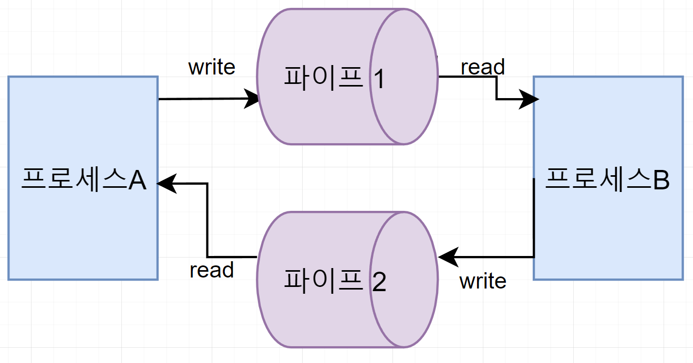

---
tags:
  - 도서/쉽게-배우는-운영체제
---

# 5. 프로세스 동기화

## 프로세스 간 통신

### 프로세스 간 통신의 개념

* 프로세스 내부 데이터 통신: 하나의 프로세스 내에 2개 이상의 스레드가 존재하는 경우의 통신. 프로세스 내부의 스레드는 전역 변수나 파일을 이용하여 데이터를 주고 받는다.
* 프로세스 간 데이터 통신: 같은 컴퓨터에 있는 여러 프로세스끼리의 통신. 공용 파일 또는 운영체제가 제공하는 파이프를 사용하여 통신한다.
* 네트워크를 이용한 데이터 통신: 여러 컴퓨터가 네트워크로 연결되어 있을 때의 통신. 프로세스가 소켓을 이용하여 데이터를 주고받는다.

💡 같은 컴퓨터에 있는 프로세스끼리도 소켓을 이용하여 통신할 수 있다. IP 주소로 127.0.0.1과 같이 루프백 주소를 사용하면 된다. 하지만 소켓을 사용하려면 많은 전처리를 해야 하기때문에 다른 프로세스 간 통신 방법보다 느리다.

### 프로세스 간 통신의 분류

* 통신 방향에 따른 분류
  * 양방향 통신: 데이터를 동시에 양쪽 방향으로 전송할 수 있는 구조. 프로세스 간 통신에서 소켓 통신이 양방향 통신에 해당한다.
  * 반양방향 통신: 데이터를 양쪽 방향으로 전송할 수 있지만 동시 전송은 불가능하고 특정 시점에 한쪽 방향으로만 전송할 수 있는 구조. 대표적인 예는 무전기다.
  * 단방향 통신: 한쪽 방향으로만 데이터를 전송할 수 있는 구조. 프로세스 간 통신에서 전역 변수와 파이프가 단방향 통신에 해당한다.
* 통신 구현 방식에 따른 분류
  * 대기가 있는 통신(동기화 통신): 데이터를 보냈다는 것을 받는 쪽에 알려주는 통신. 데이터를 받는 쪽은 데이터가 도착할 때까지 자동으로 대기 상태에 머물러있다. 파이프와 소켓이 동기화 통신에 해당한다.
  * 대기가 없는 통신(비동기화 통신): 데이터를 받는 쪽이 반복문을 무한 실행하며 기다리는 바쁜 대기(busy wating)를 사용하여 데이터가 도착했는지 직접 확인한다. 전역 변수와 파일이 비동기화 통신에 해당한다. 전역 변수나 파일이 비동기화 통신에 해당한다.

### 프로세스 간 통신의 종류

* 프로세스 간 통신은 데이터를 주거나 받는 동작으로 이루어지면 이는 쓰기 연산과 읽기 연산으로 간소화 할 수 있다.
  * send: 쓰기 연산
  * receive: 읽기 연산
* 전역 변수를 이용한 통신
  * 공동으로 관리하는 메모리를 사용하여 데이터를 주고받는 것이다.
  * 데이터를 보내는 쪽: 전역 변수에 값을 쓴다.
  * 데이터를 받는 쪽: 전역 변수의 값을 읽는다.
  * 전역 변수로 양방향 통신을 하려면 전역 변수를 2개 사용해야 한다.
* 파일을 이용한 통신
  * 파일 입출력 코드는 크게 열기, 쓰기 또는 읽기, 닫기로 구성되어 있다.
  * 파일을 열 때 파일이 있는지, 또는 그 파일이 있다면 쓰기 권한이 있는지도 확인한다. 정상적으로 파일을 사용할 수 있다면 open() 함수는 fd(file descriptor)를 반환한다.
  * 파일을 이용한 통신은 부모-자식 프로세스 간 통신에 많이사용되며 운영체제가 프로세스 동기화를 제공하지 않는다.
    * 그래서 프로세스가 알아서 동기화를 해야하는데 주로 부모 프로세스가 wait() 함수를 이용해서 자식 프로세스의 작업이 끝날 때까지 기다렸다가 작업을 시작한다.
* 파이프를 이용한 통신
  * open() 함수로 기술자를 얻고 작업을 한 후 close() 함수로 마무리한다.
  * 파이프로 양방향 통신을 하려면 파이프 2개를 사용해야 한다.
  *   아래 그림에서 프로세스 B가 파이프1에 대해 읽기 연산을 수행했는데 프로세스 A가 파이프 1에 아직 쓰기 연산을 하지 않았다면 프로세스 B는 대기 상태가 된다.

      
  * 파이프는 이름 없는 파이프와 이름 있는 파이프로 나뉜다.
    * 이름 없는 파이프: 일반적으로 파이프라고 하면 이를 가리킨다. 부모와 자식 프로세스 혹은 같은 부모를 가진 자식 프로세스와 같이 서로 관련 있는 프로세스 간 통신에 사용된다.
    * 이름 있는 파이프: FIFO라 불리는 특수 파일을 이용하며 서로 관련 없는 프로세스 간 통신에 사용된다.
* 소켓을 이용한 통신
  * 프로시저 호출이 한 컴퓨터에 있는 함수를 호출하는 것이라면, 원격 프로시저 호출은 다른 컴퓨터에 있는 함수를 호출하는 것이다.
  * 일반적으로 원격 프로시저 호출은 소켓을 이용하여 구현한다.
  * 통신하고자 하는 프로세스는 소켓에 쓰기 연산을 하면 데이터가 전송되고, 읽기 연산을 하면 데이터를 받게 된다.
  * 소켓은 프로세스 동기화를 지원하므로 데이터를 받는 쪽의 프로세스가 바쁜 대기를 하지 않아도 된다.
  *   소켓은 하나만 사용해도 양방향 통신이 가능하다.

      
*   정리

    | 종류    | 운영체제 동기화 지원     | open()/close() 사용 |
    | ----- | --------------- | ----------------- |
    | 전역 변수 | x(바쁜 대기)        | x                 |
    | 파일    | x(wait() 함수 이용) | o                 |
    | 파이프   | o               | o                 |
    | 소켓    | o               | o                 |

## 공유 자원과 임계구역

### 공유 자원의 접근

* 공유 자원(shared resource): 여러 프로세스가 공동으로 이용하는 변수, 메모리 ,파일 등을 말한다.
* 공유 자원은 공동으로 이용되기 때문에 누가 언제 데이터를 읽거나 쓰느냐에 따라 그 결과가 달라질 수 있다.
* 2개 이상의 프로세스가 공유 자원을 병행적으로 읽거나 쓰는 상황을 경쟁 조건(race condition)이 발생했다고한다.

### 임계구역

* 임계구역(critical section): 공유 자원 접근 순서에 따라 실행 결과가 달라지는 프롬그램의 영역

### 생산자-소비자 문제

* 임계구역과 관련된 전통적인 문제로 생산자-소비자 문제(producer-consumer problem)가 있다.
*   상황

    * 생산자 프로세스와 소비자 프로세스가 서로 독립적으로 작업한다.
      * 생산자 프로세스: 물건을 생산해서 버퍼에 넣는다.
      * 소비자 프로세스: 버퍼에서 물건을 가져온다.
    * 버퍼는 작업을 계속하기 위해 원형 버퍼를 사용한다.
    * 버퍼가 비었는지 가득 찼는지 확인하기 위해 sum이라는 전역 변수를 사용한다. sum은 현재 버퍼에 있는 상품의 총수가 저장된다.

    !\[Untitled]\(assets/Untitled 1-4551204.png)
* 문제가 발생하는 상황
  * 생산자가 물건 하나를 buf 4에 저장했다. sum을 4로 바꿔야 하나 아직 바꾸지 못했다.
  * 소비자가 물건 하나를 소비했다. sum을 2로 바꿔야 하나 아직 바꾸지 못했다.
  * 이 상태에서 1. 생산자의 `sum = sum + 1;` 과 2. 소비자의 `sum = sum - 1;` 이 거의 동시에 실행되면 문제가 발생한다. 생산자와 소비자가 독립적이기 떄문에 상대방이 sum을 바꾸려는 것을 모른채 현재 상태인 sum = 3을 읽어서 작업을 한다.
  * 미세한 시간 차를 두고 1, 2 또는 2, 1 순서로 실행되면 sum 값을 2나 4가 된다.

### 임계구역 해결 조건

* 상호 배제(Mutual Exclusion): 한 프로세스가 임계구역에 들어가면 다른 프로세스는 임계구역에 들어갈 수 없다.
* 한정 대기(Bounded Waiting): 어떤 프로세스도 무한 대기하지 않아야 한다. 즉 특정 프로세스가 임계구역에 진입하지 못하면 안된다.
* 진행의 융통성(Progress): 한 프로세스가 다른 프로세스의 진행을 방해해서는 안 된다.

## 임계구역 해결 방법

### 임계구역 해결 조건을 고려한 코드 설계

*   상호 배제 문제

    !\[Untitled]\(assets/Untitled 2-4551211.png)

    * 상호 배제 문제를 해결한 것처럼 보이지만 해결하지 못했다. 아래의 경우에 해당된다.
      1. P1이 `while(lock==true)` 를 통과하고 타임아웃이 발생하여 대기 상태가 된다.
      2. P2가 `while(lock==true)` 를 통과한다.
      3. P1과 P2가 임계구역에 진입할 수 있게된다.
    * 또한 잠금이 풀리기 위해서 바쁜 대기를 해야된다는 단점도 있다.
*   한정 대기 문제

    !\[Untitled]\(assets/Untitled 3-4551218.png)

    * 상호 배제가 보장된다.
    * 하지만 아래의 경우에 교착 상태(deadlock)이 발생할 수 있다.
      1. P1이 `lock1=true;` 를 실행한 후 타임아웃이 발생하여 P2가 실행 상태로 바뀐다.
      2. P2가 `lock2=true;` 를 실행한다.
      3. P1과 P2는 while문에서 서로가 lock을 풀어주기를 기다리는 상태가 된다.
    * 또한, 확장성에도 문제가 있다. 프로세스가 늘어나면 검사해야 하는 lock의 개수도 늘어나 비효율적이다.
*   진행의 융통성 문제

    !\[Untitled]\(assets/Untitled 4-4551222.png)

    * 상호 배제와 한정 대기를 보장한다.
    * 진행의 융통성 융통성을 보장하지 못한다.
      * 한 프로세스가 두 번 연달아 임계구역에 진입하고 싶어도 그럴 수 없다.
      * 이렇게 프로세스의진행이 다른 프로세스로 인해 방해받는 현상을 경직된 동기화(lockstep synchronization)라고 한다.
*   하드웨어적인 해결 방법

    * 상호배제 문제 코드에서 `while(lock==true);` 문과 `lock=true;` 문이 하드웨어적으로 동시에 실행하면 임계구역 문제를 해결할 수 있다.

    !\[Untitled]\(assets/Untitled 5-4551225.png)

    * 여전히 바쁜 대기를 사용해서 자원 낭비가 발생하는 문제가 있다.

### 피터슨 알고리즘

!\[Untitled]\(assets/Untitled 6-4551228.png)

* 두 프로세스가 동시에 lock을 설정했더라도 turn을 사용하여 다른 프로세스에게 양보하게 된다.
* 하드웨어의 도움이 필요가 없다.
* 임계구역 해결의 세 가지 조건을 모두 해결했다.
* 하지만, 2개의 프로세스만 사용 가능하다는 한계가 있다.

### 데커 알고리즘

!\[Untitled]\(assets/Untitled 7-4551232.png)

* 만약, 동시에 lock이 걸렸을 경우 turn을 확인하여, turn에 해당하는 프로세스가 락을 풀어 기다리는 구조다.
* 하드웨어의 도움이 필요없다.
* 프로세스가 늘어나면 변수도 늘어나고 전체적인 알고리즘도 복잡해진다.

### 세마포어

* 기존 알고리즘들은 바쁜 대기를 사용하여 자원을 낭비하고 복잡하다는 단점이 있다. 세마포어는 이를 해결할 수 있다.
* 세마포어는 임계구역에 진입하기 전에 스위치를 사용 중으로 놓고 임계구역으로 들어간다. 이후에 도착하는프로세스는 앞의 프로세스가 작업을 마칠 때까지 기다린다.
* 프로세스가 작업을 마치면 세마포어는 다른 프로세스에 임계구역을 사용하라는 동기화 신호를 보낸다. 이를 통해 바쁜 대기를 할 필요가 없다.

!\[Untitled]\(assets/Untitled 8-4551237.png)

* Semaphore(n): 전역변수 RS를 n으로 초기화 한다. RS에는 현재 사용 가능한 자원의 수가 저장된다.
* P(): 잠금을 수앻아는 코드로, RS가 0보다 크면 1만큼 감소시키고 임계구역에 진입한다. 만약 RS가 0이하면 0보다 커질 때까지 기다린다.
* V(): 잠금 해제와 동기화를 같이 수행한다. RS값을 1 증가하고 세마포어에서 기다리는 프로세스에게 임계구역에 진입해도 좋다는 wake\_up 신호를 보낸다.
* P()와 V()는 내부 코드를 검사와 지정(TestAndSet)을 사용하여 분리 실행되지 않고 완전히 실행되게 해야한다.

### 모니터

* 세마포어는 P()나 V() 호출을 잘못 사용하면 임계구역을 보호하지 못 할 수도 있다는 문제가 있다.
* 공유 자원을 사용할 때 모든 프로세스가 세마포어 알고리즘을 따르도록 구현한다면 굳이 P()와 V()를 직접 사용할 필요가 없어진다. 이를 실제로 구현한 것이 모니터(monitor)이다.
* 모니터가 구현되어 있는 대표적인 예가 Java이다.

## 파일, 파이프, 소켓 프로그래밍

### 파일

* 파일 내의 데이터는 한 줄로 길게 저장되는 이를 순차 파일(sequential file)이라고 한다.
* 순차 파일에 접근하는 방식을 순차적 접근(sequential access)이라한다.
* open() 함수로 파일을 여는 방식에는 읽기 전용, 읽기/쓰기, 쓰기 전용, 생성 등이 있다.
* 자식 프로세스에 파일 기술자가 복사되기 때문에 open() 한 번이지만 close() 자식 프로세스에서 한 번, 부모 프로세스에서 한 번, 총 두 번 발생한다.
* 파일 기술자의 위치 정보는 부모 프로세스와 자식 프로세스가 공유한다. 따라서 부포 프레서스는 lseek() 함수를 통해 파일 기술자의 위치를 움직여야된다.

### 파이프

* 파일과 다르게 파이프에서는 read()와 write()의 기술자가 따로 존재한다. 다라서 동기화가 가능하다.
* 부모 프로세스와 자식 프로세스에서 각자 필요없는 파일 기술자를 닫는다.
* 자식 프로세스가 fd\[1]에 쓰고 부모 프로세스가 fd\[0]으로 받는 구조이다.
* 자식 프로세스에서는 fd\[0]을 닫고, 부모 프로세스에서는 fd\[1]을 닫는다.

### 네트워킹

* 클라이언트
  * 소켓을 생성한 후 connect()를 통하여 서버와 접속을 시도한다.
  * 서버와 접속되면 read()혹은 write() 작업을 하며, 작업이 끝나면 소켓 기술자를 닫는다.
* 서버
  * 소켓을 생성한 후 bind()를 사용하여 생성한 소켓을 특정 포트에 등록한다.
  * 소켓이 포트에 등록되면 listen()을 실행하여 클라이언트를 받을 준비를 한다.
  * accept()는 여러 클라이언트의 connect() 중 하나를 골라 작업을 시작하게 해준다.
* 하나의 포트에 소켓 여러 개 생성이 가능하다.
  * 소켓을 하나만 생성할 수 있다면 네이버가 운영하는 서버가 단 한 사람만 접속할 수 있다는 의미다.

## 연습 문제

1. 반양방향 통신
2. 바쁜 대기
3. 아래
   * 대기가 없는 통신: 파일, 전역 변수
   * 대기가 있는 통신: 파이프, 소켓
4. 파이프는 단방향 통신만 가능하기 때문에 양방향 통신을 하기 위해서는 2개가 필요하다.
5. 경쟁 조건
6. 임계 구역
7. 상호 배제
8. 진행의 융통성(Progress)
9. 세마포어
10. 동시에 임계구역에 접근할 수 있는 프로세스의 개수
11. 아래

    ```bash
    if RS>0 then RS=RS-1;
    else block();
    ```
12. 아래

    ```bash
    RS=RS+1;
    wake_up();
    ```
13. P()와 V()의 호출을 잘못한 경우
14. 검사 및 지정
15. 모니터

## 심화 문제

1. 아래
   * 단방향 통신: 데이터를 한 방향으로만 전송할 수 있는 통신(전역변수, 파일, 파이프)
   * 반양방향 통신: 데이터를 한 방향으로 전송할 수 있지만 한 순간에는 한 방향으로만 전송할 수 있는 통신(무전기)
   * 양방향 통신: 데이터를 양 방향으로 전송할 수 있는 통신(소켓)
2. 아래
   * 대기가 없는 통신: 데이터를 받는 쪽이 바쁜 대기를 통해 데이터가 도착했는지 직접 확인해야되는 통신. (전역변수, 파일)
   * 대가기 있는 통신: 데이터를 주는 쪽이 데이터를 받는 쪽에게 데이터가 도착했다는 것을 알려주는 통신. (파이프, 소켓)
3. 믹서기를 사용할 때 동시에 여러 명이 믹서기를 사용할 수 없다. 믹서기가 돌아가면 다른 재료들은 믹서기가 멈출 때 까지 기다려야한다.
4. 상호배제가 보장되지 않는다. P1의 while문이 통과되고 타임아웃이 발생해 P2의 while문이 통과하여 두 프로세스가 모두 임계구역에 진입할 수 있게 된다.
5. 진행의 융통성이 보장되지 않는다. P2가 연속으로 임계구역에 진입하고 싶어도 P1이 임계구역을 한번 거칠 동안은 대기상태가 된다.
6.  아래

    ```c
    #inlude <stdio.h>
    #include <unistd.h>
    #include <fcntl.h>

    void main() {
    	int pid, fd;
    	char buf[5];

    	fd = open("com.txt", O_RDWR);
    	pid = fork();

    	if (pid < 0 || fd < 0) exit(-1);

    	else if (pid == 0) {
    		write(fd, "Test", 5);
    		close(fd);
    		exit(0);
    	}
    	else {
    		wait(0);
    		lseek(fd, 0, SEEK_SET);
    		read(fd, buf, 5);
    		printf("%s", buf);
    		close(fd);
    		exit(0);
    	}
    }
    ```
