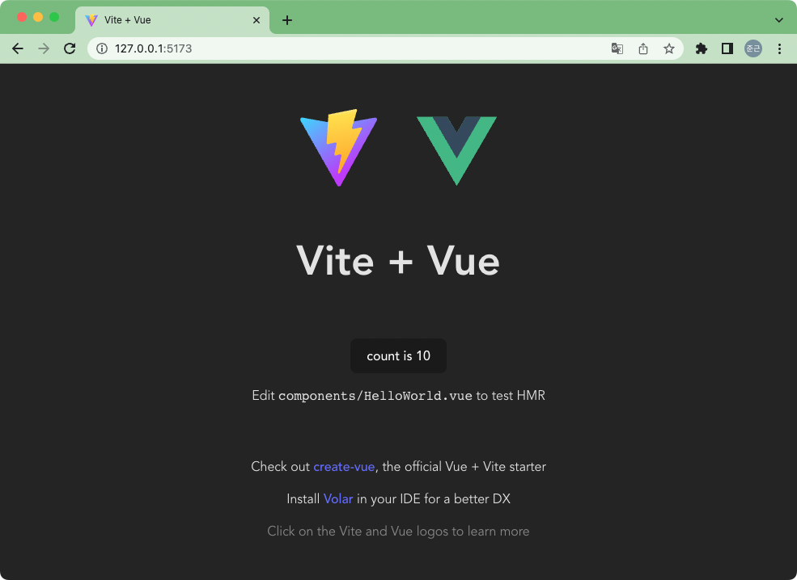
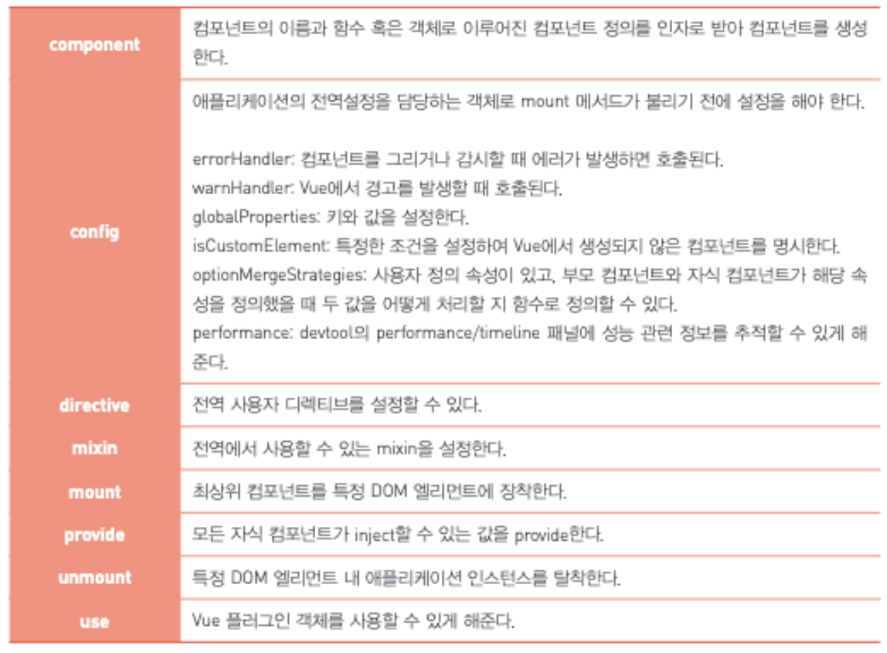
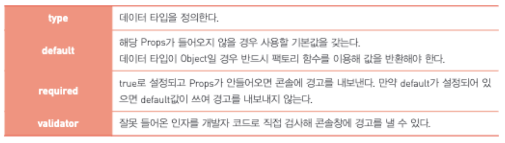

---
tags:
  - 도서/한-권으로-배우는-Vue.js-3
---

# Vue 3 기초

## Vue 3 기초

- Vue를 프로젝트에 포함하는 방법 2가지
  - CDN으로 부터 Vue 라이브러리를 Script에 포함하는 방법
    - 라이브러리를 호스트 서버에 저장해둘 필요가 없기 때문에 네트워크 트래픽을 줄일 수 있다.
    - 한번 브라우저에 내려오고 나면 대부분 디스크 캐시에 저장되어 재활용되기 때문에 매우 빠른 속도를 보여준다.
  - npm/yarn을 이용하여 Vue 패키지를 설치하여 사용하는 방법
    - 라이브러리의 의존성 관리를 자동으로 해준다.
    - 라이브러리와 애플리케이션 코드를 하나 혹은 사용자가 설정한 청크의 개수로 컴파일하여 브라우저에 전달할 수 있다.
    - 브라우저에서는 컴파일된 코드만 캐시하고 나면 서버로 추가적으로 받을 파일이 없으므로 굉장히 빠른 속도를 보여준다.

## CDN을 통한 Hello World 구현

- 데이터 변수로 선언된 값은 템플릿 내 HTML 코드에서 두 개의 중괄호 `{{ }}`로 접근이 가능하다. 이를 선언적 렌더링이라고한다.
- 선언적 렌더링: DOM 엘리먼트에게 다시 렌더링할 것을 명령하지 않고 DOM과 연결된 상태와 속성이 변경될 때 자동으로 DOM 엘리먼트가 업데이되는 것
  - Vur와 React가 선언적 렌더링을 사용한다.

## NPM/Vite를 이용한 기본 프로젝트 생성

- 일반적으로 결과물은 하나의 js 파일로 만들어지지만, 만약 결과물의 사이즈가 너무 클 경우 비동기적 방식을 이용해 필요할 때 컴포넌트를 불러올 수 있는 Lazy 로딩 방식을 이용한다.

- npm을 이용해 Vue를 설치하면 Webpack이나 Rollup 같은 다양한 모듈 번들러를 이용해 프로젝트를 컴파일할 수 있다.

  - 모듈 번들러: 분리된 모듈들을 하나의 파일로 병합해주는 도구

- Vite: Vue 개발자 Evan You 가 만든 빌드 툴.

  - EcmaScript 6를 따르는 Vue 3의 모듈이 별다른 컴파일 과정 없이 브라우저에 렌더링 될 수 있게 해주는 기능(Hot Module Replacement, HMR)을 제공한다.
  - 기본적으로 Rollup을 이용해 번들을 생성한다.

- vite를 이용해 프로젝트 생성, 실행, 빌드

  - https://vitejs.dev/guide/

  ```bash
  npm create vite@latest # 프로젝트 생성
  npm run dev # 서버 실행
  npm run build # 하나의 번들로 컴파일
  ```

  

### Vite 기본 프로젝트 구성

-  `index.html`: body에 루트 엘리먼트인 div가 하나 존재한다. div에는 id값이 존재하는데, 이 id는 Vue 컴포넌트들이 어느 곳에 포함이 되어야 하는지 알 수 있게 하는 매우 중요한 단서다.
- `main.js`; 루트 엘리먼트가 생성되고 나면 실행되는 자바스크립트 파일.  루트 컴포넌트를 구성할 `App.vue` 파일과 vue 모듈로 부터 `createApp`함수를 가져와서 애플리케이션 인스턴스를 생성하고 id 값을 확인해서 마운트 시킨다.
- `App.vue`: 컴포넌트에 대한 다양한 정보를 하나의 파일에 담고있는 SFCSingle-File-Components 다.
  - HTML DOM 구조를 나타내는 template 영역
    - script 항목에서 선언된 변수를 이용해 선언적 렌더링을 구현할 수 있다.
    - Vue 3.0에서는 `components` 옵션을 이용해 컴포넌트를 지정하지 않는다.
    - `<script setup>`이라는 Vue의 신규 기능으로, `<template>`를 `render()` 함수로 변경하기 때문에 명시적으로 변수나 컴포넌트를 노출 시킬 필요가 없다.
  - CSS 스타일 코드를 가지는 style 영역
    - `<style scoped>`를 통해 컴포넌트 내에서만 CSS를 적용할 수 있다. 이를 사용하지 않으면 전역에 적용된다.
  - 스크립트를 가질 수 있는 script 영역

### Vite Alias 생성

- Alias를 이용하여 컴포넌트의 경로를 매번 적을 필요 없도록 할 수 있다.

- 아래 예시의 경우 '/src/componenets/Component.vue' 같이 할 필요없이 '/@components/Component.vue'라고 할 수 있다.

  ```javascript
  // vite.config.js
  import { defineConfig } from 'vite'
  import vue from '@vitejs/plugin-vue'
  const path = require('path')
  
  // https://vitejs.dev/config/
  export default defineConfig({
    resolve:{
      alias:{
        '/@' : path.resolve(__dirname, './src'),
        '/@componenets' : path.resolve(__dirname, './src/components')
      },
    },
    plugins: [vue()]
  })
  ```


## Vue 3 핵심 문법

### 컴포지션 함수 setup

- 컴포지션 API는 setup 함수 내에서 사용이 가능하다.
- setup함수는 객체를 반환하는데 이 객체 내에는 화면을 담당하는 HTML에서 사용할 변수들이 들어있어야 한다.

```vue
update() {
	// Update Action
}
```

### Vue 컴포넌트의 생명주기

- 생명주기: 컴포넌트를 생성하여 DOM 노드 트리에 마운트하고, 불필요한 엘리먼트를 제거하는 일련의 과정

- Vue는 각 생명주기를 후킹하는 방법을 제공한다.

- 아래 훅 이름들의 괄호안은 컴포지션 API의 함수.

- beforeCreate: 컴포넌트를 생성하기 전. `setup` 함수 내 작성하는 모든 코드는 beforeCreate를 대체하므로 훅 함수가 따로 없다.

- created: 컴포넌트가 생성된 후. `setup` 함수가 대체하기 때문에 훅 함수가 따로 없다.

- breforeMount(onBeforeMount): 가상 노드가 render 함수를 호출하기 직전에 호출.

- mounted(onMounted): 가상 노드가 실제 DOM에 반영 되고나서 호출. 실제 엘리먼트를 참조할 수 있는 시점이다.

- beforeUpdate(onBeforeUpdated): 데이터가 변경되었지만 아직 DOM에 반영되지 않았을 때 호출.

- updated(onUpdated):데이터가 변경되어 DOM이 변경완료된 시점에 호출된다. 해당 DOM에 참조된 변수에 접근할 수 있는 시점이다. 하지만, 자식 노드들이 업데이트가 완료되었다고 보장하지는 않는다. 자식 컴포넌트까지 모두 수정된 것을 기다리기 위해서는 `nextTrick`을 이용해야된다.

  ```vue
  updated() {
  	this.$nextTick(function() {
  		// 모든 자식이 업데이트 되었다.
  	})
  }
  ```

- beforeUnmount(onBeforeUnmount): 컴포넌트가 탈착되기 직전에 호출된다. 아직 모든 기능을 사용할 수 있는 상태다.
- unmounted(onUnmounted): 컴포넌트가 탈찰되고 나서 호출된다.
- activated(onActivated):
  - `keep-alive` 태그는 컴포넌트가 다시 렌더링되는 것을 방지하고, 상태를 유지하기 위해 쓰인다.
  - 일반적으로 `v-is` 디렉트와 함께 쓰여, `v-is` 디렉티브가 컴포넌트를 변경할 때 기존 컴포넌트의 상태가 사라지지 않게 하기 위해 사용한다.
  - `keep-alive`로 컴포넌트의 상태가 보존되기 시작하면 `onActivated` 훅 함수가 호출된다.
- deactivated(onDeactivated):
  - `keep-alive`로 상태가 유지되던 컴포넌트가 효력을 상실하면 호출된다.
  - VIte의 HMR이 해당 컴포넌트를 다시 렌더링할 때 일반적으로 호출된다.
- renderTracked(onRenderTracked): Virtual DOM이 변경될 때마다 관찰 목적으로 훅이 호출된다. 이 함수를 통해 `DebuggerEvent` 객체를 살펴보면 어떤 이유로 Virtual DOM이 변경이 되는지 알 수 있다.
- renderTriggered(onRenderTriggered): Virtual DOM이 DOM으로 반영이 되어야 할 때 호출된다. 실제 DOM이 변경되기 직전에 호출된다.
- errorCaptured(onErrorCaptured): 자손 컴포넌트에 에러가 발생하면 어느 컴포넌트에서 어떤 에러가 발생했는지 알려준다.


### 선언적 렌더링

- data 옵션에 setup 변수를 선언하면된다. 선언된 변수는 템플릿 변수와 결합될 수 있도록 반드시 객체 형식으로 반환해야 된다.

```vue
<template>
<div id="date">
  {{ date }}
</div>
</template>

<script>
  export default {
    data() {
      return {
        date: Date().toString()
      }
    }
  }
</script>
```

- 수염표기법 대신에 디렉티브를 사용할 수 도 있다.

  ```vue
  <p>{{ msg }}</p>
  <p v-text="msg"></p>
  ```

  - 수염표기법의 경우는 HTML 엘리먼트의 textContent를 업데이트하기 때문에 HTML를 입력해도 문자열 그대로 렌더링된다.
  - v-text 디렉티브는 HTML 엘리먼트의 innerHTML 값에 변수값을 전달하기 때문에 HTML 마크업 언어가 표현이 된다.

- v-pre 디렉티브를 사용하면 해당 레리먼트를 포함한 모든 엘리먼트들의 값을 컴파일하지 않는다. 아래의 예시는 msg의 값이 출력되지 않는다.

  ``` vue
  <div v-pre>{{ msg }} </div>
  ```


### 데이터 결합을 통한 사용자 입력 처리

- HTML 태그의 속성에 컴포넌트의 변수값을 결합할 수 있다.

- 단방향 결합 `v-bind`

  - 아래 처럼 두 가지 표현 방법이 있다.

  ```js
  v-bind:HTML속성="변수명"
  :HTML속성="변수명"
  ```

- 양방향 결합 `v-model`

  ```js
  v-model:HTML속성="변수명"
  ```

### 이벤트 리스너를 이용한 사용자 입력 처리

- HTML 태그나 다른 컴포넌트에서 발생된 이벤트를 캡처할 때 `v-on` 디렉티브를 이용할 수 있다.

- 아래의 2가지 표현법이 존재한다.

  ```js
  v-on:click="스크립트 코드, 혹은 함수 이름"
  @click="스크립트 코드, 혹은 함수 호출"
  ```

- Options API에서 함수를 만들기 위해서는 methods라는 옵션에 선언하면 된다.

  ```js
  export default {
  	data() {
  		return {
  			counter: 0
  		}
  	},
  	methods: {
  		onClick: function(evt) {
  			if (evt) {
  				evt.preventDefault()
  			}
  			this.counter++
  		}
  	}
  }
  ```

- 이벤트 수식어

  - `preventDefault()` 같은 이벤트의 함수를 직접 호출할 필요없이 v-on 디렉티브에서 별도의 수식어를 제공한다.

  - 아래의 예는 `preventDefault()`의 수식어 예시다.

    ```vue
    <button @click.prevent="onClick">
      ...
    </button>
    ```

  - 수식어의 종류는 아래 링크를 참고한다.
    - https://vuejs.org/guide/essentials/event-handling.html#event-modifiers

- 키 수식어

  - 키 입력에 대한 이벤트 처리도 아래와 같은 방식으로 막을 수 있다.

  ```vue
  <input @keyup.enter.prevent />
  ```

### 템플릿 내 조건문 (v-if)

- 조건에 따라 엘리먼트를 생성하거나 제거할 수 있다.

  ```vue
  <tempalte>
    <p v-if"counter < 5">
      5보다 작습니다. 
    </p>
    <p v-else>
      5와 같거나 큽니다.
    </p>
  </tempalte>
  ```

- `v-if` 디렉티브의 경우 조건에 따라 엘리먼트를 제거했다가 다시 생성했다가 하지만, `v-show`의 경우는 일단 모두 생성한후 조건에 맞지 않으면 hide 처리한다.


### 템플릿 내 반복문(v-for)

- `v-for`을 통해 배열이나 객체를 순회하며 반복할 수 있다.

```js
v-for="값 in 배열"
v-for="(값, 인덱스) in 배열"

v-for="값 in 객체"
v-for="(값, 키) in 객체"
v-for="(값, 키, 인덱스) in 객체"
```

### Computed 속성

- 데이터 변경을 실시간으로 감시하고, 계산된 속성을 원하는대로 변경시켜주는 기능
- 데이터의 복잡한 구현이 필욯나 경우 사용한다.
- methods vs computed
  - `methods`의 경우 호출할 때 마다 매번 새로 계산하지만, `computed`는 계산 결과를 캐싱해두었다가 재사용한다. \
  - `computed`는 종속하는 데이터의 값이 변했을 때만 재계산을 한다. 

### Watch

- 데이터의 변화를 감지하영 사용자가 지정한 콜백함수를 호출할 수 있게 해주는 기능
- 컴포넌트가 생성되어 변수가 할당되기 전에 모든 변수는 null값을 가지고 있다. watch는 기본적으로 이러한 null에서 초기값으로 넘어가는 과정을 데이터의 변경으로 판단하지 않는다.

```js
export default {
  data() {
    return {
      question: '',
      answer: 'Questions usually contain a question mark. ;-)'
    }
  },
  watch: {
    // whenever question changes, this function will run
    question(newQuestion, oldQuestion) {
      // ...
    }
  }
}
```

- 감시하고자 하는 대상이 객체나 리스트라면 deep 옵션을 true로 설정하는 것이 좋다.

```js
export default {
  watch: {
    someObject: {
      handler(newValue, oldValue) {
        // Note: `newValue` will be equal to `oldValue` here
        // on nested mutations as long as the object itself
        // hasn't been replaced.
      },
      deep: true
    }
  }
}
```

### 컴포넌트 생성

- 아래 메서드를 사용하여 정의한 것들은 애플리케이션의 모든 컴포넌트가 사용할 수 있는 전역 범위로 선언된다.

  

- props: 컴포넌트에 데이터를 넘겨줄 ㅈ수 잇는 사용자 지정 속성이다. 

  ```vue
  Vue.component('child', {  
  	props: ['msg'],  
  	template: '<span>{{ msg }}</span>'
  })
  ```

  - props의 속성

    

  - 컴포넌트에 props를 넘기는 방법: `v-bind` 혹은 콜론(:) 사용

    ```vue
    <my-component title="Component 1" :data="[1,2,3]"></my-component>
    ```

- non-props 속성: class나 style 그리고 id 속성 등은 props 옵션에 정의되어 있지 않지만 대상 컴포넌트에 전달되어 필요한 역할을 하곤 한다. 이를 non-props 속성이라고 부른다.

  - title이라는 non-props 속성을 받았다면,

    ```vue
    <p>{{ $attrs.title }}</p>
    ```

### 사용자 이벤트 생성

- 이벤트를 정의할 수 있다.

```js
emits: ['myevent-1', 'my-event2']
```

- 이벤트 이름은 케밥 형식의 소문자만 사용하는 것을 권장한다.

- v-model 디렉티브와 연동된 변수는 컴포넌트의 Props에 연동이 된다. 

  - `emit`을 사용하면 컴포넌트 안에서 업데이트 된 변수를 부모 컴포넌트와 동기화가 가능하다.
  - 업데이트를 위해서는 `update:msg`와 같이 `update:`라는 접두사와 변수명을 결합한 이벤트명을 이용할 수 있다.

  ```vue
  <!-- MyComponent.vue -->
  <script>
  export default {
    props: ['title'],
    emits: ['update:title']
  }
  </script>
  
  <template>
    <input
      type="text"
      :value="title"
      @input="$emit('update:title', $event.target.value)"
    />
  </template>
  ```

### Slots

- Vue에도 shadom DOOM의 slot과 비슷하게 기능을 제공하고 있다.

- Vue에서 슬롯은 시작태그와 종료태그 사이에 들어가는 값을 의미한다.

  - 아래와 같이 `Component`라는 태그 사이에 Slot_value를 넣어 작성하면, Component라는 컴포넌트의 템플릿 영역에 있는 `<slot>` 태그가 SLot_value로 치환된다.

    ```vue
    <!-- 부모 컴포넌트 -->
    <Component> Slot_value </Component>
    ```

    ```vue
    <!-- 자식 컴포넌트 변경 전 -->
    <button><slot></slot></button>
    
    <!-- 자식 컴포넌트 변경 후 -->
    <button>Slot_value</button>
    ```

- 기본 값 설정도 가능하다.

  ```vue
  <slot>Default Value</slot>
  ```

- 여러 개의 슬롯을 정의할 때는 하나의 기본 슬롯을 제외하고 나머지는 항상 `name` 속성을 제공해야된다.

  ```vue
  <!-- 자식 컴포넌트 -->
  <slot name="header"></slot>
  <slot></slot>
  <!-- 부모 컴포넌트 -->
  <Component> 
    <template v-slot:header>Header</template>
    <template v-slot:default>Default</template>
  </Component>
  ```

### Provide/Inject

- `props`의 단점은 직접 적인 부모 자식 관계일 때만 데이터를 전달할 수 있다는 점이다. 컴포넌트가 중첩되어 있어 부모 컴포넌트가 깊이 있는 자식컴포넌트에게 데이터를 줄 때는 중간에 있는 컴포넌트에도 전달해야되는 불편함이 있다.

  

  

- Provide: 상위 컴포넌트에서 하위 컴포넌트들과 공유할 데이터를 정의할 때 사용

- Inject: 상위 컴포넌트가 넣은 데이터를 하위 컴포넌트가 접근할 때 사용

- 기본적으로 반응성을 가지진 않지만, ref/reactive/computed 등과 같은 함수를 이용해 반응성을 가지는 변수를 provide할 경우 inject된 값 역시 반응성을 가지게 된다.

```js
// 상위 컴포넌트
export default {
  provide: {
    message: 'hello!'
  }
}

// 하위 컴포넌트
export default {
  inject: ['message'],
  created() {
    console.log(this.message) // injected value
  }
}
```

### 사용자 디렉티브

- 사용자가 정의한 디렉티브를 사용할 수도 있다.

```js
app.directive('my-directive', {
  bind: function () {
    // do preparation work
    // e.g. add event listeners or expensive stuff
    // that needs to be run only once
  },
  update: function (newValue, oldValue) {
    // do something based on the updated value
    // this will also be called for the initial value
  },
  unbind: function () {
    // do clean up work
    // e.g. remove event listeners added in bind()
  }
})
```

- 커스텀 디렉티브를 사용할 떄는 `v-`라는 접두어를 붙여 사용해야된다.

```vue
<div v-my-directive="someValue"></div>
```

- mounted와 updated 모두 적용되게 하고 싶을 경우 무기명 함수로 선언하면 된다.

```js
app.directive('my-directive', (el, binding) => {
  // this will be called for both `mounted` and `updated`
  el.style.color = binding.value
})
```

- 디렉티브는 속성 및 값을 전달받을 수 있다.

```js
v-디렉티브:속성 = "값"
v-디렉티브 = "값"
v-디렉티브
```

- 훅에서 받을 수 있는 파라미터는 2가지다.
  - `el`: 디렉티브가 사용된 특정 HTML 엘리먼트
  - `binding`
    - `instance`: 디렉티브가 사용된 컴포넌트 인스턴스를 나타낸다.
    - `value`: 디렉티브로 전달된 값을 나타낸다.
    - `oldValue`: `beforeUpdate` 혹은 `updated` 훅 함수 사용 시 이전 값을 나타낸다.
    - `arg`: 속성값을 나타낸다.
    - `modifiers`: 수식어가 사용됐다면 수식어를 나타낸다.
    - `dir`: 디렉티브 객체를 반환한다.

### Mixins

- Mixins는 컴포넌트보다 먼저 호출된다.

```js
var mixin = {
  data: function () {
    return {
      message: 'hello',
      foo: 'abc'
    }
  }
}

new Vue({
  mixins: [mixin],
  data: function () {
    return {
      message: 'goodbye',
      bar: 'def'
    }
  },
  created: function () {
    console.log(this.$data)
    // => { message: "goodbye", foo: "abc", bar: "def" }
  }
})
```

## 참고 자료

- https://vuejs.org/guide/essentials/lifecycle.html#lifecycle-diagram
- https://v1.vuejs.org/guide/components.html
- https://velog.io/@ks1ksi/Vue-Provide-Inject-vs-Props

