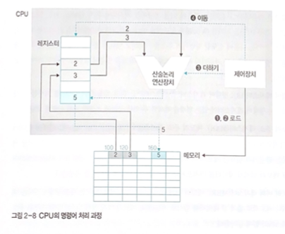
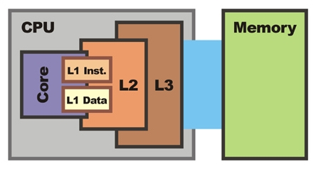
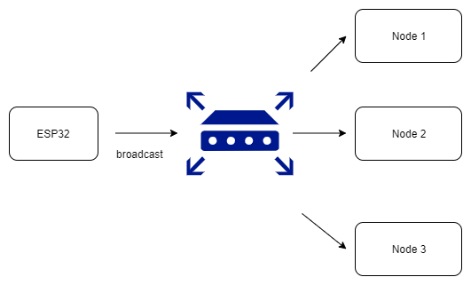
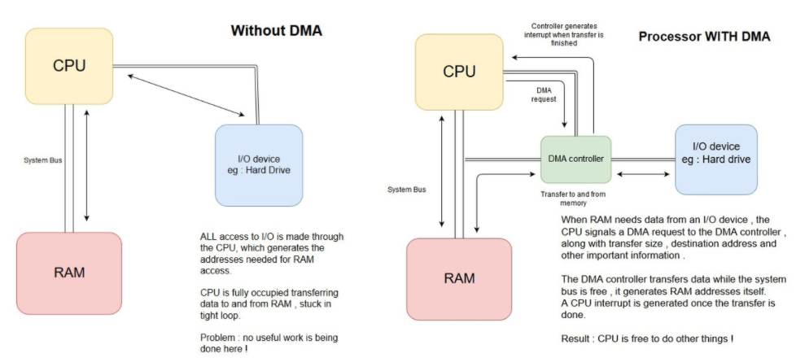
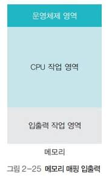

---
tags:
  - 도서/쉽게-배우는-운영체제
title: 2-컴퓨터의 구조와 성능 향상
---
## 컴퓨터의 기본 구성

### 하드웨어의 구성

- CPU: 명령어를 해석하여 실행하는 장치다.
- 메모리: 작업에 필요한 프로그램과 데이터를 저장하는 장소로, 바이트 단위로 분할되어 주소로 구분한다.
- 입력장치: 외부의 데이터를 컴퓨터에 입력하는 장치다.
    - 천공카드, 키보드, 마우스, 스캐너 등
- 출력장치: 컴퓨터에서 처리한 결과를 사용자가 원하는 형태로 출력하는 장치다.
    - 프린터, 모니터, 스피커
- 저장장치: 메모리보다 느리지면 저렴하고 용량이 크며, 전원이 꺼져도 데이터가 영구히 저장되는 장치다.
- 버스: 컴퓨터 부품들이 연결하는 통로. 일정한 규칙에 따라 각 장치에 데이터를 전송하는 역할을 한다.
- 메인보드: CPU와 메모리 등 다양한 부품을 연결하는 판.
    - 메인보드 안에 버스가 복잡하게 얽혀 있어 전력이 공급되면 버스로 연결된 부품이 작동한다.
    - 메인보드에 여러 부품을 꽂을 수 있는 단자가 있는데 이 단자에 그래픽카드, 사운드카드, 랜카드 등이 기본으로 장착되어 있기도 하고, 성능 향상을 위해 따로 장착하기도한다.

### 폰 노이만 구조

- 프로그램을 메모리에 올려서 실행할 수 있도록 하는 컴퓨터 구조.
- 이전의 컴퓨터는 컴퓨터의 용도를 변경하려면 전선의 연결을 바꾸어야했다.

### 하드웨어 사양 관련 용어

- 클럭: 컴퓨터 부품들은 딜전 간격의 전기 신호에 맞추어 작업을 진행한다. 이 전기 신호를 틱 또는 클록틱이라고도 부른다. 이 틱을 만들어내는 메인보드 내의 부품을 클럭이라고 부른다.
- 헤르츠: 틱이 발생하는 속도의 단위.
- 시스템 버스와 CPU 내부 버스
    - 시스템 버스: 메모리와 주변장치를 연결하는 버스로 FSB(Front-side Bus)라고도 부른다.
    - CPU 내부 버스: CPU 내부에 있는 장치를 연결하는 버스로 BSD(Back-side Bus)라고도 부른다. CPU 내부 버스는 CPU 클록과 같아서 시스템 버스보다 훨씬 빠르다.
- CPU는 CPU 내부 버스 속도로 동작하고 메모리는 시스템 버스의 속도로 동작하기 때문에 병목현상이 발생하는 문제가 있다.

## CPU와 메모리

### CPU의 구성과 동작

- CPU는 산술논리 연산장치(ALU), 제어장치, 레지스터로 구성되어 있다.
    - 산술논리 연산장치: 데이터를 연산하는 장치로 데이터의 덧셈, 뺄셈, 곱셈, 나눗셈 같은 산술 연산과 AND, OR 가은 논리 연산을 수행한다.
    - 제어장치: 작업을 지시하는 장치다.
    - 레지스터: CPU 내에 데이터를 임시로 보관하는 곳이다.
- 아래와 같은 어셈블리어 프로그램이 있다고 해보자.

    ```wasm
    LOAD mem(100), register 2;
    LOAD mem(120), register 3;
    ADD register 5, register 2, register 3;
    MOVE register 5, mem(160);
    ```

    - 1행: 메모리의 100번지에 있는 값을 레지스터 2로 가져온다.
    - 2행: 메모리의 120번지에 있는 값을 레지스터 3으로 가져온다.
    - 3행: 레지스터2와 레지스터 3에 저장된 값을 더한 결과를 레지스터 5에 저장한다.
    - 4행: 레지스터 5에 저장된 값을 메모리의 160번지로 옮긴다.
    - 제어 장치는 명령어를 해석하여 ‘메모리에서 데이터를 가져와라’, ‘덧셈을 실행하라’, ‘덧셈한 결과를 메모리로 옮겨놓아라’라고 신호를 보낸다.
      

        

    
- 레지스터의 종류
  아래를 제외하고도 다양한 레지스터가 존재한다.
    - 사용자 가시 레지스터: 사용자 프로그램에 의해 변경되는 레지스터
        - 데이터 레지스터(DR): CPU가 명령어를 처리하는 데 필요한 데이터를 임시로 저장하는 범용 레지스터다.
        - 주소 레지스터(AR): 데이터 또는 명령어가 저장된 메모리의 주소를 저장한다.
    - 사용자 불가시 레지스터: 사용자가 임의로 변경할 수 없는 레지스터
        - 프로그램 카운터(PC): 다음에 실행할 명령어의 위치정보를 저장한다.
        - 명령어 레지스터(IR): 현재 실행 중인 명령어를 저장한다. ex) ADD, LOAD
        - 메모리 주소 레지스터(MAR): 메모리 관리자가 접근해야 할 메모리의 주소를 저장한다.
        - 메모리 버퍼 레지스터(MBR): 메모리 관리자가 메모리에서 가져온 데이터를 임시로 저장한다.
        - 프로그램 상태 레지스터(PSR): 연산 결과(양수, 음수 등)를 임시 저장한다.
    - `LOAD mem(100), register 2;` 라는 코드를 실행한다면
        1. 프로그램 카운터에서 해당 코드가 저장된 메모리의 주소를 제어 장치에 전송한다. 
        2. 코드를 읽어 `LOAD` 에 해당하는 명령어를 명렁어 레지스터에 저장한다.
        3. 제어 장치는 명령어 레지스터에 있는 명령을 해석하여 메모리에 있는 데이터를 가져오라는 제어 신호를 보낸다.
        4. 메모리 주소에는 100이 저장되고, 메모리 관리자는 메모리의 100번지에 저장된 값을 메모리 버퍼 레지스터로 가져온다.
        5. 제어 장치는 메모리 버퍼 레지스터에 저장된 값을 레지스터 2로 옮긴다.
           

            

  
- 버스의 종류
    - 제어 버스: 제어 장치와 연결된 버스로, CPU가 메모리와 주변장치에 제어 신호를 보내기 위해 사용한다. 메모리와 주변장치에서도 작업이 완료되거나 오류가 발생하면 제어 신호를 보내기 때문이 양방향이다.
    - 주소 버스: 메모리 주소 레지스터와 연결된 버스로, 메모리나 주변장치에 데이터를 읽거나 쓸 때 위치 정보를 보내기 위해 사용하며 단방향이다.
    - 데이터 버스: 메모리 버퍼 레지스터와 연결된 버스로, 데이터의 이동이 양방향으로 이루어진다.
    

    

    
- 버스의 대역폭(bandwidth)은 한 번에 전달할 수 있는 데이터의 최대 크기를 말한다.
    - 버스의 대역폭은 CPU가 한 번에 처리할 수 있는 데이터의 크기(워드), 레지스터의 크기, 메모리에 한 번에 저장할 수 있는 데이터의 크기와 항상 같다.
    - 예: 32bit CPU 1→ 1워드 == 32bit, 64bit CPU → 1워드 == 64bit
    - 메모리 주소는 바이트 단위로 지정되고, 메모리에서 데이터를 읽거나 쓸 때는 워드 단위로 움직인다.

### 메모리의 종류와 부팅

- 메모리의 종류
    - 램(Random Access Memory): 읽거나 쓸 수 있는 메모리
        - 휘발성 메모리: 전력이 끊기면 데이터가 사라지는 메모리
            - DRAM(Dynamic RAM): 일정 시간이 지나면 데이터가 사라지므로 일정 시간 마다 다시 재생시켜야 한다.
            - SDRAM(Synchronous Dynamic RAM): DRAM이 발전된 형태로 클록틱이 발생할 때마다 데이터를 저장하는 동기 DRAM이다.
            - SRAM(Static RAM): 전력이 공급되는 데이터가 사라지기 때문에 재생할 필요없다. DRAM에 비해 속도는 빠르지만 비싸다.
            - 일반적으로 메인메모리에는 DRAM을 사용하고, 캐시 같은 고속 메모리에는 SRAM을 사용한다.
            - 비휘발성 메모리는 메모리 내부가 복잡하고 속도가 느리며 가격이 비싸기 때문에 메인메모리는 휘발성 메모리를 사용한다.
        - 비휘발성 메모리: 전력이 끊겨도 데이터르 보관할 수 있는 메모리
            - 플래시 메모리: 각 소자의 최대 사용 횟수가 제한되어 보통 소자 하나당 몇 천 번에서 만 번 정도 사용하면 제기능을 잃는다.
            - SSD: 하드디스크를 대신하도록 만든 메모리다.
    - 롬(Read Only Memory): 읽기만 가능한 메모리
        - 데이터를 한 번만 저장할 수 있다는 특성 때문에 BIOS를 롬에 저장한다.
        - 마스크 롬: 데이터를 지우거나 쓸 수 없는 롬
        - PROM: 전용 기계를 이용하여 데이터를 한 번만 저장할 수 있는 롬
        - EPROM: 데이터를 여러 번 쓰고 지울 수 있는 롬
    
    <aside>
    💡 DDR SDRAM: SDRAM은 CPU 내부 버스가 아닌 시스템 버스와 같은 속도로 작동하기 때문에 작업 속도가 느리다는 문제가 있다. 클록틱 한 번에 하나의 워드만 저장하는 SDRAM을 개선하여 한 번에 2개의 워드를 저장하는 SDRAM을 DDR SDRAM이라고 부른다. DDR2 SDRAM은 한 번에 4개의 워드, DDR3는 8개, DDR4는 16개의 워드를 저장한다.
    
    </aside>
    
- 운영체제도 소프트웨어 중 하나기 때문에 사용자의 작업이 진행되는 동안에는 운영체제의 작업이 잠시 중단된다. 따라서, 메모리를 보호하려면 하드웨어의 도움이 필요하다.
    - 경계 레지스터(bound register): CPU는 현재 진행 중인 작업의 메모리 시작 주소를 저장한다.
    - 한계 레지스터(limit register): 현재 진행 중인 작업이 차지하고 있는 메모리의 크기를 저장한다.
    - 사용자의 작업이 진행되는 동안 이 두 레지스터의 주소 범위른 벗어난다면 메모리와 관련된 인터럽트가 발생한다.
        - 인터럽트가 발생하면 모든 작업이 중단되고 CPU는 운영체제를 깨워서 인터럽트를 처리하도록 한다.
        - 메모리 영역을 벗어나서 발생한 인터럽트의 경우 운영체제는 해당 프로그램을 강제 종료시킨다.
- 부팅: 컴퓨터를 켰을 때 운영체제를 메모리에 올리는 과정
    - 부트스트랩(bootstrap): 운영체제르 실행하기 위한 코드
    - 마스터 부트 레코드: 하드디스크의 첫 번째 섹터를 가리키며, 부트스트랩이 저장되는 위치다.
        - 최근은 USB 드라이버도 마스터 부트 레코드를 탑재할 수 있다. ‘부팅 USB 만들기’가 USB 드라이버에 마스터 부트 레코드 영역을 만들고 필요한 부트스트랩 코드를 설치하는 것을 뜻한다.
    - 부팅 과정
        1. 컴퓨터 전원을 켜면 롬에 저장된 BIOS가 실핸된다.
        2. BIOS는 CPU, 메모리, 하드디스크, 키보드, 마우스와 같은 주요 하드웨어가 제대로 작동하는지 확인한다.
        3. BIOS가 하드디스크의 마스터 레코드에 저장된 부투스트랩을 메모리로 불러온다.
    - 운영체제가 2개 설치되어 있다면, 어떤 운영체제를 사용할 것인지 물어보는 화면이 나오는데, 이 화면이 부트스트랩이 실행된 화면이다.

## 컴퓨터 성능 향상 기술

장치 간 속도 차이를 개선하고 시스템의 작업 속도를 올리기 위해 개발된 운영체제 기술을 살펴볼 것이다.

### 버퍼

- 느린 입출력장치에서 데이터를 읽을 떄마다 하나씩 전송하면 작업량에 비해 실제로 전송되는 데이터 양이 작아지는 문제를 해결하기 위해 존재한다.
- 일정량의 데이터를 모아서 옮기면 적은 노력으로도 많은 양의 데이터를 옮길 수 있는다 .이렇게 데이터를 모아주는 장치를 버퍼라고 한다.
- 버퍼는 소프트웨어적으로도 사용된다. 동영상 스트리밍이 그 예시다.
- 스풀(SPOOL): CPU와 입출력장치가 독립적으로 동작하도록 고안된 소프트웨어적인 버퍼다.
    - 예시) 프린터에 사용되는 스풀러가 있다. 스풀러는 인쇄할 내용을 순차적으로 출력하는 소프트웨어로, 출력 명령을 내린 프로그램과 독립적으로 동작한다.

### 캐시

- 메모리와 CPU 간의 속도 차이를 완호하기 위해 메모리의 데이터를 미리 가져와 저장해두는 임시 저장소로 버퍼의 일종이다.
- CPU가 메모리에 접근해야 할 때 캐시를 먼저 방문하여 원하는 데이터가 있는지 찾아본다.
    - 캐시에 원하는 데이터가 있으면 캐시 히트라고 하며, 그 데이터를 바로 사용한다.
    - 원하는 데이터가 캐시에 없으면 캐시 미스라고 한다.
    - 캐시 히트가 되는 비율은 캐스 적중률이라고 하며, 일반적인 컴퓨터의 캐시 적중률은 약 90%이다.
    - 캐시 적중률을 높이는 방법으로는 캐시의
        - 캐시의 크기를 늘리거나
        - 앞으로 많이 사용될 데이터를 가져오는 것이다.
            - 현재 위치에서 가까운 데이터가 멀리 있는 데이터보다 사용될 확률이 더 높다는 지역성 이론을 활용할 수 있다.
    
    <aside>
    💡 지역성 이론에 따르면 프로그래밍시 goto 문을 사용하지 않는 것이 좋다.
    
    </aside>
    
- 캐시에 있는 데이터가 변경되면 메모리에 있는 원래 데이터를 변경해야된다. 변경하는 방식은 2가지가 있다.
    - 즉시 쓰기
        - 캐시에 데이터가 변경되면 즉시 메모리에 반영하는 방식이다.
        - 메모리와 빈번한 데이터 전송으로 성능이 느려진다는 단점이 있다.
        - 메모리의 최신 값이 항상 유지되기 떄문에 급작스러운 정전에도 데이터를 잃어버리지 않는다는 장점이 있다.
    - 지연 쓰기
        - 캐시에 변경된 내용을 모아서 주기적으로 반영하는 방식으로 카피백(copy back)이라고도 한다.
        - 메모리와 데이터 전송 횟수가 줄어들어 시스템 성능을 향상할 수 있다는 장점이 있다.
        - 메모리와 캐시된 데이터 사이의 불일치가 발생할 수 도 있다는 단점이 있다.
- 캐시는 명령어와 데이터의 구분 없이 모든 자료를 가져오는 L2캐시와 명령어와 데이터를 구분하여 가져오는 L1 캐시로 구분된다.
    - L1 캐시의 데이터 캐시는 데이터 레지스터, 명령어 캐시는 명령어 레지스터에 연결된다.
    - L2 캐시는 메모리와 연결된다.



### 저장장치의 계층 구조

가격과 컴퓨터 성능 사이의 타협접으로 저장장치의 계층 구조가 존재한다. 속도가 빠르고 값이 비싼 저장장치를 CPU 가까운 쪽에 두고, 값이 싸고 용량이 큰 저장장치를 반대쪽에 배치하여 적당한 가격으로 빠른 속도와 큰 용량을 동시에 얻고 있다.

이런 계층 구조는 중복되는 데이터의 일관성을 유지해야 되는 문제점이 있다.


### 인터럽트

- 초기의 컴퓨터 시스템은 주변장치가 적었기 때문에 CPU가 직접 입출력장치에서 데이터를 가져오거나 내보냈다. 이를 폴링 방식이라고 부른다.
    - 입출력 장치의 상태를 주기적으로 검색하여 일정한 조건을 만족할 때 데이터를 처리한다.
    - CPU가 명령어 해석과 실행이라는 본래의 역할을 해야되는데 작업 효율이 떨어진다.
- 폴링 방식의 문제를 해결하기 위해 등장한 것이 인터럽트 방식이다.
- 인터럽트 방식은 CPU가 아닌 입출력 관리자(장치 관리자)가 입출력장치의 데이터를 가져오고 내보내는 것을 관리한다.
- 인터럽트의 동작 방식은 아래와 같다.
    1. CPU가 입출력 관리자에게 입출력 명령을 보낸다.
    2. 입출력 관리자는 명령받은 데이터를 메모리에 가져다놓거나 메모리에 있는 데이터를 저장장치로 옮긴다.
    3. 데이터 전송이 완료되면 입출력 관리자는 완료 신호를 CPU에 보낸다. 이 완료 신호를 인터럽트라고 한다.
- 인터럽트는 하던 작업을 중단하고 처리해야 하는 의미의 신호다.
- 입출력장치들을 구분하기 위해서 운영체제는 장치마다 고유 번호를 매기는데 이를 인터럽트 번호라고 한다.
    - 윈도우의 경우 키보드는 1번, 마우스는 12번, 첫 번째 하드디스크는 14번이다.
- 여러 장치가 동시에 인터럽트를 보낼 경우 하나씩 인터럽트를 처리하는 것은 비효율적이다. 이를 해결하기 위해 여러 개의 인터럽트를 하나의 배열로 만든 인터럽트 벡터를 사용한다. 입출력관리자가 인터럽트 벡터를 보내면 CPU는 인터럽트가 발생한 번호를 확인한다.
  

    

    
- 기존에는 메모리의 접근 권한이 CPU에만 있었고, CPU가 입출력을 관리했다. 인터럽트 방식을 사용하면서 입출력 관리자가 메모리에 접근할 수 있는 권한을 가지게 되었는데, 이 권한을 직접 메모리 접근(DMA)라고 불렀다. 또한 이른 입출력 관리자를 직접 메모리 접근 제어기(DMA Controller)라고 불렀다.
  

    

    
- 직접 메모리 접근이 추가되고 나서 메모리가 복잡해졌다. 메모리에는 CPU가 사용하는 데이터와 입출력 장치가 사용하는 데이터가 섞여있기 때문이다.
    - 이를 좀 더 관리하기 편하기위해 CPU가 사용하는 메모리 공간과 직접 메모리 접근을 통해 들어오거나 나가는 데이터를 위한 공간을 분리했다. 이를 메모리 매핑 입출력(Memory Mapped I/O, MMIO)라고 부른다.
      

        

    
- 직접 메모리 접근이 생기면서 CPU와 직접 메모리 접근이 동시에 메모리에 접근하는 경우를 처리해야된다.
    - 보통은 CPU의 작업보다 입출력 장치의 속도가 느리기 때문에 직접 메모리 접근에 양보한다. 이를 사이클 훔치기라고 부른다.

## 병렬 처리

- 병렬 처리: 동시에 여러 개의 명령을 처리하여 작업의 능률을 올리는 방식이다.
- 스레드: CPU가 처리할 수 있는 작업의 단위
- CPU 멀티스레드: 여러 개의 스레드를 동시에 처리하는 방법
- CPU의 명령어 실행 과정
    - 명령어 패치(Instruction Fetch, IF): 다음에 실행할 명령어를 명령어 레지스터에 저장한다.
    - 명령어 해석(Instruction Decode, ID): 명령어를 해석한다.
    - 명령어 실행(EXecution, EX): 해석한 결과를 토대로 명령어를 실행한다.
    - 쓰기(Write Back, WB): 실행된 결과를 메모리에 저장한다.
- 파이프라인 기법: 명령어를 여러 개의 단계로 분할한 후, 각 단계를 동시에 처리하는 하드웨어를 독립적으로 구성한다.
  

    

    
- 파이프라인 기법시 고려 사항
    - 상호 의존성이 없어야 병렬 처리가 가능하다. 뒤의 명령어가 앞의 명령어가 끝나야 진행될 수 있다면 병렬 처리를 할 수 없다.
    - 각 단계의 시간을 거의 일정하게 맞춰야 병렬 처리가 원만하게 이루어진다. 각 단계의 처리 시간이 들쑥날쑥하면 앞의 작업이 먼저 끝 나더라도 가장 긴 시간이 걸리는 단계에서 병목 현상이 발생한다.
    - 전체 작업 시간을 몇 단계로 나눌지 잘 따져보아야 한다. 병렬 처리에서 작업을 N개로 쪼갰을 때 N을 병렬 처리의 깊이라고 한다. N이 커질 수록 작업의 개수가 많아져서 성능이 높아질 것 같지ㅏㄴ 각 단계마다 작업을 이동하고 새로운 작업을 불러오는데 시간이 너무 많이 걸려서 오히려 성능이 떨어진다. 보통은 병렬 처리의 깊이를 10~20 정도로 한다.
- 파이프라인 기법에는 데이터 위헙, 제어 위험, 구조적 위험 3가지의 문제가 있다.
    - 데이터 위험: 데이터의 의존성 때문에 발생하는 문제다. 뒤의 명령어가 앞의 명령어에서 만든 데이터에 의존한다면 동시에 실행할 수 없다. 데이터 위험은 파이프라인의 명령어 단계를 지연하는 등의 방법으로 해결한다.
    - 제어 위험: 분기를 하는 if 문 혹은 goto 문 같은 명령에서 발생하는 문제다. 보통의 경우 모든 프로그램이 순차적으로 실행된다고 가정하므로 동시에 실행되는 명령들이 순차적으로 실행된다. 제어 위험은 분기 예측이나 분기 지연 방법으로 해결한다.
    - 구조 위험: 서로 다른 명령어가 같은 자원에 접근하려 할 때 발생하는 문제다. 구조 위험은 해결하기 어렵다고 알려져 있다.
- 슈퍼스칼라 기법: 파이프라인을 처리할 수 있는 코어를 여러 개 구성하여 복수의 명령어가 동시에 실행되도록 하는 방식이다.


- 슈퍼파이프라인 기법: 파이프라인 기법에서는 한 클록마다 하나의 명령어를 실행하지만, 슈퍼파이프라인 기법에서는 파이프라인의 각 단계르 세분하여 한 클록 내에서 여러 명령어를 처리할 수 있다. 슈퍼파이프라인 기법은 크레이 슈퍼컴퓨터의 CPU에서 사용된다.
  

    

    
- 슈퍼파이프라인 슈퍼스칼라 기법: 슈퍼스칼라 기법과 슈퍼파이프라인 기법을 합쳐놓은 방식이다.


- VLIW(Very Long Instruction Word) 기법: 아프이 병렬 처리 기법들은 병렬 처리를 지원하는 하드웨어적인 방법이지만, VLIW 기법은 소프트웨어적으로 처리하는 방법이다. 동시에 수행할 수 있는 명령어들을 컴파일러가 추출하고 하나의 명령어로 압축하여 실행한다. 따라서, 앞의 병렬 처리 기법들은 런타임에 병렬 처리가 이루어지지만 VLIW 기법은 컴파일 시 병렬 처리가 이루어진다.

## 무어의 법칙과 암달의 법칙

- 무어의 법칙: 인텔의 공동 창업자인 고든무어가 주장한 법칙. CPU의 속도가 24개월마다 2배빨라진다.
    - 하지만 지금은 CPU 발열 문제로 5GHz이상 높이기 어렵다.
    - 따라서 처리 속도를 올리는 대신 멀티코어를 장착하는 방향으로 나아가고 있다.
- 암달의 법칙: 컴퓨터 시스템의 일부를 개선할 때 전체 미치는 영향과의 관계를 수식으로 나타낸 것.

## 연습문제

1. 아래
    1. 산술논리 연산장치: 사친연산과 논리연산을 처리해주는 장치
    2. 레지스터: 연산에 필요한 데이터를 저장해두는 장치
    3. 제어장치: 작업을 지시하는 장치
2. 프로그램을 메모리에 올려서 실행해야된다.
3. 아래
    1. 제어 버스: CPU의 제어장치와 연결되어있고, 메모리와 주변장치에 제어 신호를 주기 위해서 사용한다. 양방향 버스다.
    2. 주소 버스: 메모리 주소 레지스터와 연결되어있고, 메모리나 주변장치의 데이터의 주소를 전송할 때 사용한다. CPU에서 출발하는 단방향 버스다.
    3. 데이터 버스: 메모리 버퍼 레지스터와 연결되어있고, 메모리나 주변장치의 데이터를 읽거나 쓸 때 사용한다. 양방향 버스다.
4. 신호를 한 방향으로 밖에 보내지 못하는 버스를 말한다. 대표적으로 주소 버스가 있다.
5. 프로그램 카운터
6. 명령어 레지스터
7. 메모리 주소 레지스터
8. 메모리 버퍼 레지스터
9. 메모리 주소 레지스터
10. 메모리 버퍼 레지스터
11. 경계 레지스터, 한계 레지스터
12. 버퍼
13. 스풀러
14. 부트스트랩
15. 저장장치의 계층 구조
16. 인터럽트
17. 직접 메모리 접근
18. 메모리 매핑 입출력
19. VLIW

## 심화문제

1. 메인보드에서 발생하는 전기 신호로 컴퓨터 장치들은 이 전기 신호에 맞춰서 작동한다.
2. 다음에 실행할 명령어의 주소를 저장하고 있다.
3. 아래
    1. 제어 버스: CPU의 제어 장치와 연결되어 있고, 메모리와 주변 장치에 제어 신호를 보내는 용도로 사용한다. 오류가 발생시 주변 장치에서 CPU로 신호를 보내야되기 때문에 양방향 버스다.
    2. 주소 버스: CPU가 메모리나 주변 장치의 데이터를 읽거나 쓰기위해 위치 주소를 넘기는 버스다. 단방향 버스다.
    3. 데이터 버스: CPU가 메모리나 주변 장치의 데이터를 읽거나 쓰기위해 데이터 값을 넘기는 버스다. 양방향 버스다.
4. 아래
    1. 휘발성 메모리: 전원이 없으면 저장되어 있던 데이터가 소멸되는 메모리를 말한다. DRAM, SRAM, SDRAM 등이 있다.
    2. 비휘발성 메모리: 전원이 없어도 데이터가 유지되는 메모리를 말한다. 플래시메모리나 SSD 등이 있다.
5. SDRAM을 기본적으로 시스템 버스의 클럭에 맞춰 동작하기 때문에 CPU의 처리속도보다 느리다는 문제가 있다. 이를 개선하기 하여 DDR SDRAM은 한 클럭에 2워드의 데이터를 처리할 수 있도록하여 병목 현상을 개선하였다.
6. CPU와 입출력장치가 독립적으로 동작하기 위해서 사용되는 소프트웨어적인 버퍼다.
7. 아래
    1. 즉시 쓰기 방식: 데이터에 변경이 있으면 캐시와 메모리에 모두 변경 사항을 반영하는 방식
        1. 장점: 캐시와 메모리의 데이터 불일치가 발생하지 않는다.
        2. 단점: 메모리에 신호를 자주 보내야되기 때문에 성능이 좋지 않다.
    2. 지연 쓰기 방식: 캐시에만 데이터 수저을 한 뒤, 주기적으로 한꺼번에 변경 사항을 메모리에 반영하는 방식
        1. 장점: 메모리에 신호를 적게 주게되므로 성능이 향상된다.
        2. 단점: 캐시와 메모리의 데이터 불일치가 발생할 수 있기 때문에 조심해야된다.
8. 입출력 장치가 많아지면서 현재 발생한 인터럽트가 어떤 장치의 인터럽트인지 구분하기 위해서 사용한다.
9. CPU의 도움 없이도 메모리에 접근할 수 있도록 입출력 관리자에게 주는 권한이다.
10. 관리를 편하게 하기우해 CPU와 입출력장치가 사용하는 메모리 영역을 분리해서 사용하는 기법이다.
