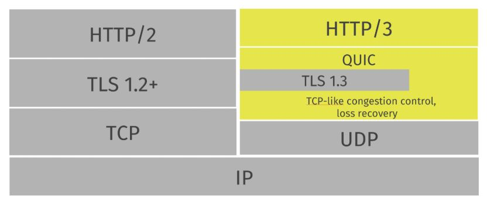

---
tags:
  - 네트워크
  - HTTP
---
# HTTP/3와 QUIC

이번에는 현재 IETF의 인터넷 초안 상태인 HTTP/3에 대해서 알아본다. HTTP/3는 기존의 HTTP 버전들과 다르게 TCP를 사용하지 않는다. Transport layer에서 TCP가 아닌 QUIC을 사용한다. QUIC은 Quick UDP Internet Connection의 약자로 구글에서 개발한 UDP기반의 프로토콜이다. 이 QUIC에서 제공하는 기능에는 어떤 것이 있을까.

## 보안

기존에 TCP + HTTP/2를 사용할 때는 보안을 위해 별도의 TLS 레이어가 필요했다. QUIC은 자체적으로 보안 기능을 내장하고 있어 별도의 TLS 레이어를 둘 필요가 없어졌다.

이렇게 결합하면 어떤 이점이 있을까? 기존의 TCP + TLS의 경우에는 클라이언트와 서버가 연결을 시작할 때 TCP의 3-Way Handshake와 TLS 자체의 Handshake가 따로 필요했었다.

QUIC은 이 두 가지 Handshake를 하나로 결합해서 한 번의 왕복(RTT)으로 암호화를 제공하는 연결이 가능해진다.

## HoL 블록킹 대응

HTTP/2는 HTTP/1.1에서 파이프라이닝 기능에서 발생할 수 있는 HoL 블록킹 문제를 요청을 병렬적으로 처리할 수 있게하여 애플리케이션 레이어의 HoL문제를 해결했었다. 하지만 TCP 레이어에서의 HoL 문제를 해결하지 못했다. HTTP/2는 한 개의 TCP 연결에서 요청들이 발생하는데, TCP의 혼잡 제어 등으로 인해 TCP 스트림에서 하나의 패킷 손실이 있다면 해당 패킷을 계속해서 재전송하기 때문에 TCP 레이어에서도 HoL문제가 발생한다.

QUIC은 패킷 손실이 발생하게 되면 발생한 스트림만 재전송을 기다리고 나머지 스트림은 게속해서 전송을 진행하기 때문에 HoL 블록킹이 발생하지 않는다. 아래 그림에서 FEC 패킷이 손실을 복구하기 위한 패킷을 의미한다.

## 참고 자료

[https://ko.wikipedia.org/wiki/HTTP/3](https://ko.wikipedia.org/wiki/HTTP/3)

[https://blog.cloudflare.com/the-road-to-quic/](https://blog.cloudflare.com/the-road-to-quic/)

[https://ykarma1996.tistory.com/86](https://ykarma1996.tistory.com/86)

[https://goodmilktea.tistory.com/98](https://goodmilktea.tistory.com/98)

[https://community.akamai.com/customers/s/article/How-does-HTTP-2-solve-the-Head-of-Line-blocking-HOL-issue?language=en_US](https://community.akamai.com/customers/s/article/How-does-HTTP-2-solve-the-Head-of-Line-blocking-HOL-issue?language=en_US)

[https://www.8bellsresearch.com/wp-content/uploads/2020/05/f4fp-01-s15-poster-fec3-goquick-eightbells.pdf](https://www.8bellsresearch.com/wp-content/uploads/2020/05/f4fp-01-s15-poster-fec3-goquick-eightbells.pdf)