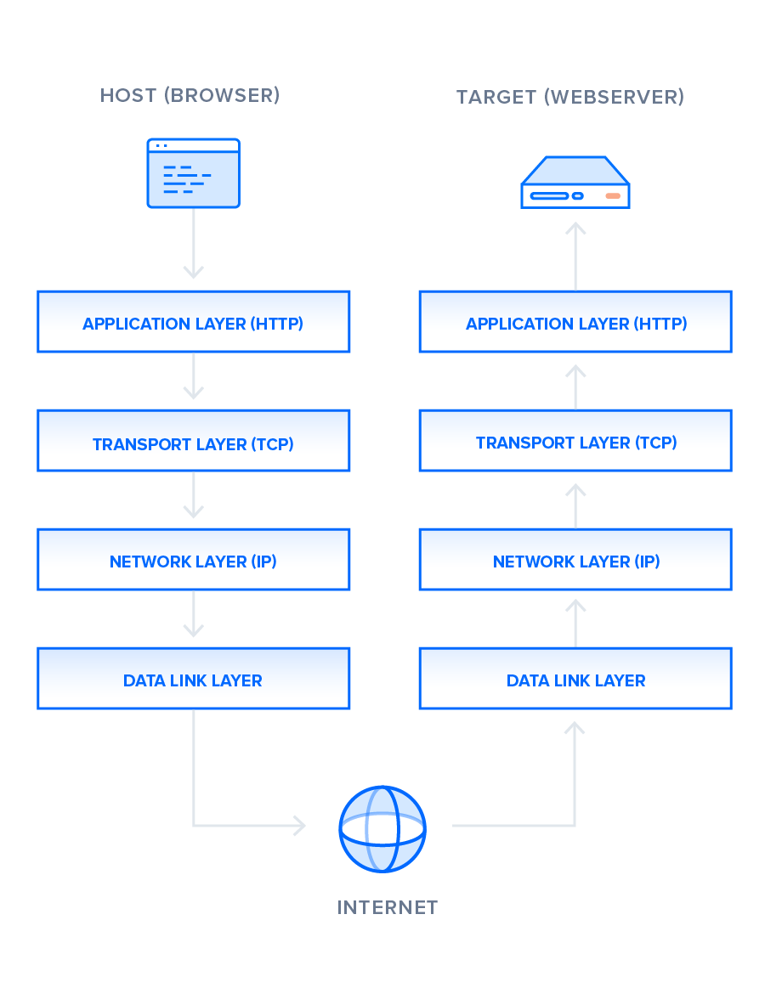
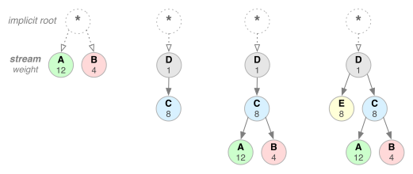

---
tags:
  - 네트워크
  - HTTP
---
# HTTP1.1 vs HTTP2.0

## 탄생 배경

### HTTP/1.1

클라이언트가 웹 서버와 정보 교환을 하기위해 만드러진 프로토콜이다. 클라이언트가 서버에게 `GET`이나 `POST` 같은 메소드와 함께 요청을 보내면, 서버는 HTML이나 이미지 같은 리소스를 다시 클라이언트에게 보낸다. 이렇게 하나의 요청과 응답을 주고 받는 과정에는 한 개의 애플리케이션 레이어 프로토콜이 사용된다고 생각하면 된다. HTTP/1.1은 아래와 같이 텍스트 기반 형식으로 메시지를 보낸다.

```jsx
GET /index.html HTTP/1.1
Host: www.example.com
```



### HTTP/2

Google에서 개발한 SPDY라는 프로토콜을 기반으로 시작되었다. HTTP/2는 압축, 멀티플렉싱, 우선 순위 지정과 같은 기술을 사용해 웹 페이지의 로딩 시간을 줄였다. HTTP/2가 1.1과 가장 큰 다른 점은 바이너리 프레이밍 레이어가 있다는 것이다. 바이너리 프레이밍 레이어는 HTTP 메시지를 바이너리 형식으로 캡슐화하여 메시지를 주고 받는다. HTTP/2를 지원하는 클라이언트와 서버는 프레이밍 작업을 대신 진행해주기 때문에 변환 과정을 의식할 필요가 없다. 이렇게 바이너리로 변환하면서 새로운 접근 방식으로 데이터 전달을 할 수 있게 되었다.


## 메시지 전달 방식

### HTTP/1.1

보통 한 개의 웹 페이지에는 하나의 리소스만 존재하지 않다. 여러개의 html, js, css, 이미지 파일 등이 하나의 페이지를 구성하고 있다. 기존의 HTTP/1.0의 경우는 새로운 요청이 있을 때마다 TCP 연결을 끊고 다시 만들어야 했기때문에 시간이나 리소스 측면에서 비용이 많이 들었다. 이를 단기 커넥션(Short-lived connection) 이라고 한다. HTTP/1.1에서는, 이 모델은 Connection 헤더가 close 값으로 설정되어 전송된 경우에만 사용된다.

이를 해결하기 위해 HTTP/1.1에서 영속적인 커넥션(Persistent connection), HTTP 파이프라이닝(HTTP Piplining)을 도입했다. 영속적인 커넥션은 TCP 연결을 여러번의 요청에 사용함으로써, 연결을 만드는 것에대한 비용을 줄일 수 있다. 서버는 Keep-Alive 헤더를 사용해서 연결이 최소한 얼마나 열려있어야 할지를 설정할 수 있다.

파이프라이닝은 이런 영속적인 커넥션을 통해서, 응답을 기다리지 않고 요청을 연적으로 보내는 기능이다. 하지만 파이프라이닝은 HOL 문제를 가지고 있다. 서버는 요청이 들어온 순서대로 처리를 한다. 만약, 앞에 들어온 요청에 지연이 발생하면 나머지 요청들도 전부 지연이 발생하는 문제가 발생하는데 이를 HOL 블락 문제라고 한다. 이를 완화하기 위해서 병렬 TCP 연결을 추가하여 구현할 수는 있지만 클라이언트와 서버간에 동시에 연결 가능한 TCP 연결 개수는 제한이 있다.


### HTTP/2

HTTP/2에서는 바이너리 프레이밍 레이어에서 바이너리로 인코딩을 통해 더 작은 단위의 패킷으로 잘라서 데이터 전송의 유연성을 높였다. HTTP/2의 메시지 전달 방식을 이해하기 위해서는 용어를 먼저 이해해야된다.

- 스트림: TCP 연결 내에서 전달되는 바이트의 양방향 흐름이다. 하나 이상의 메시지를 전달할 수 있다.
- 메시지: 논리적 요청 또는 응답에 매핑되는 프레임의 전체 시퀀스다.
- 프레임: HTTP/2에서 통신의 최소 단위다. 각 프레임에는 하나의 프레임 헤더를 포함하고 있다. 이 프레임 헤더를 통해 프레임이 속하고 있는 스트림을 식별한다.

모든 통신에는 하나의 TCP 연결을 통해 수행되며 양방향 스트림의 수는 제한이 없다. 각 스트림에는 양방향 메시지 전달에 사용되는 고유 식별자와 우선순위 정보가 있다. 이를 통해 메시지를 병렬적으로 처리할 수 있게되고 이를 멀티플렉싱이라고 부른다. 멀티플렉싱은 메시지가 다른 메시지가 완료될 때까지 기다릴 필요가 없도록 하여 HTTP/1.1의 HOL 블락 문제를 해결합니다.


## HTTP/2의 기술

### 스트림 우선 순위 지정

각 스트림에 가중치와 종속성을 부여해 우선 순위를 지정할 수 있다.

- 각 스트림에는 1~256 사이의 정수 가중치가 할당될 수 있다.
- 각 스트림에는 다른 스트림에 대한 명시적 종속성이 부여될 수 있다.
  
    
    
1. 스트림 A의 가중치는 12, B는 3이기 때문에 가중치에 따라 스트림 B는 스트림 A에 할당된 리소스의 1/3을 사용한다.
2. C는 D에 종속적이기 때문에 D의 전체 리소스를 전부 할당한 뒤, D가 전부 수신되면 C가 전체 리소스를 할당받는다.
3. 스트림 D는 C보다 먼저 전체 리소스를 할당받아야 하며, 스트림 C는 A 및 B보다 먼저 전체 리소스를 할당받아야 하고, 스트림 B는 스트림 A에 할당된 리소스의 1/3을 수신해야 된다.
4. 스트림 D는 E 및 C보다 먼저 전체 리소스를 할당받아야 하고, E 및 C는 A 및 B보다 먼저 똑같은 리소스를 할당받아야 하며, 스트림 A 및 B는 가중치에 비례하여 리소스를 할당받아야 된다.

### 버퍼 기반 흐름 제어

클라이언트와 서버는 아직 처리하지 못한 요청과 응답을 저장해둘 수 있는 버퍼 공간이 있다. 이 버퍼를 통해서 균일하지 않는 다운로드와 업로드 속도를 어느 정도 제어할 수 있게된다. 또한 한 번에 큰 요청이 오는 경우도 처리할 수 있도록 유연성을 제공해준다.

**HTTP/1.1**

HTTP/1.1의 경우에는 TCP 연결을 기반으로 흐름 제어를 한다. 클라이언트와 서버는 TCP 연결이 만들어지면 시스템 기본값으로 설정된 사이즈만큼 버퍼를 생성한다. 수신자가 버퍼에 데이터를 담고있으면 발신자에게 남은 버퍼 용량을 나타내는 receive window를 보낸다. 이 receive window는 ACK 패킷으로 신호를 보낸다. ACK 패킷은 데이터를 제대로 수신했다는 것을 확인하기 위해 보내는 패킷이다. 만약 recevie window의 크기가 0이 되면 발신자는 내부 버퍼를 지운 다음 데이터 데이터 전송 재개를 요청할 때까지 발신자는 더 이상 데이터를 보내지 않는다.


**HTTP/2**

HTTP/2는 connection 레벨(TCP)과 스트림 레벨 2가지로 흐름 제어를 한다. 클라이언트와 서버는 connection 레벨과 스트림 레벨의 window 사이즈를 각각 설정한다. 스트림 레벨의 window 사이즈와 관련해서는 2가지의 frame이 존재한다.

- SETTINGS 프레임
    - SETTINGS_INITIAL_WINDOW_SIZE: 값 설정을 통해 스트림 레벨의 초기 window 사이즈를 지정할 수 있다. 따로 설정하지 않으면 65,535바이트로 설정된다.
- WINDOW_UPDATE 프레임
    - 수신자가 이 프레임을 보낼 때마다 window 사이즈가 커진다. window 사이즈는 기본적으로 발신자가 DATA 프레임을 보낼 때마다 작아진다.

자세한 흐름 제어 내용은 [링크](https://www.monitorapp.com/ko/http2-%ED%9D%90%EB%A6%84%EC%A0%9C%EC%96%B4/)에서 확인하도록 한다.

이렇게 스트림 별로 흐름 제어를 하게되면 사용자가 중요한 리소스를 먼저 가져오고 이후에 나머지 리소스를 가져오게 하는 등의 유동적인 리소스 전략을 사용할 수 있다. 그리고 이 흐름 제어는 애플리케이션 레이어 레벨이기때문에 중간 노드가 있다면 중간 노드만의 유동적인 리소스 전략을 사용할 수도 있다는 장점이 있다.

### 리소스 요청 예측

일반적인 웹 애플리케이션에서는 하나의 HTML 페이지에 CSS, JavaScript, 이미지 등의 다른 리소스들을 많이 가지고 있다. 클라이언트 입자에서는 추가적인 리소스를 HTML 파일을 받고 나서 알 수 있기 때문에, 병렬적인 로딩이 불가능하다. 


**HTTP/1.1**

HTTP/1.1에서는 이 문제를 해결하기 위해서 HTML에 있는 리소스 인라인 기능을 사용했다.

```html
<p style='color:#ffffff'>인라인 스타일이 적용된 문장.</p>
```

아래와 같이 HTML 문서 자체에 CSS와 JavaScript 코드를 직접 입력하는 것이 인라인 기능이다. 이렇게하면 한 번의 요청으로 모든 내용을 가져올 수 있게 된다. 하지만 이 방법은 HTML 문서의 크기가 너무 커진다는 문제점이 있다. 또한 HTML 파일 안에 리소스가 포함되기 때문에 이미 브라우저에 캐싱되어 있는 리소스는 재요청을 하지 않는 등의 기술을 사용할 수 없게된다.

**HTTP/2**

HTTP/2가 나오면서 이 문제를 궁극적으로 해결할 수 있게되었다. HTTP/2에는 서버 푸쉬라는 기능이 있다. 서버는 클라이언트에게 HTML 파일을 보내기 전에 다른 리소스가 어떤게 필요한지 미리 알고 있기 때문에 사용할 수 있는 기능이다. 


`PUSH_PROMISE` 프레임에 의해서 푸쉬 스트림들이 만들어진다. 클라이언트는 `PUSH_PROMISE` 프레임을 수신하면 캐싱되어 있는 리소스를 확인 후 `RST_STREAM` 프레임으로 해당 스트림을 거부할 수 있다. 또한 클라이언트는 아래의 항목들을 `SETTINGS` 프레임을 통해 언제든지 제어할 수 있다.

1. 서버가 동시에 푸쉬할 수 있는 스트림의 수
2. 푸쉬 스트림이 열릴 때 초기 흐름 제어 window 사이즈
3. 푸쉬 기능 활성화/비활성화

### 압축

웹 애플리케이션을 최적화하기 위해서 HTTP 메시지의 크기를 줄이기 위한 압축을 주로 사용한다.

**HTTP/1.1**

gzip을 이용해서 여러 가지 파일을 압축하는데 사용했다. 하지만 이는 메시지 바디에만 해당한다. HTTP 헤더는 항상 일반 텍스트로 전송한다는 문제가 있다.

**HTTP/2**

HTTP/2에서는 HPACK 압축 프로그램을 통해서 압축을 한다. HPACK은 헤더 프레임을 압축할 수 있다는 장점이 있다. 또한 HPACK은 헤더 필드 목록을 추적하여 이 후에 전송하는 요청 헤더 프레임에는 변경된 헤더 필드만 보낼 수 있다.


## 참고 자료

[https://www.digitalocean.com/community/tutorials/http-1-1-vs-http-2-what-s-the-difference](https://www.digitalocean.com/community/tutorials/http-1-1-vs-http-2-what-s-the-difference)

[https://developers.google.com/web/fundamentals/performance/http2?hl=ko](https://developers.google.com/web/fundamentals/performance/http2?hl=ko)

[https://developer.mozilla.org/ko/docs/Web/HTTP/Connection_management_in_HTTP_1.x](https://developer.mozilla.org/ko/docs/Web/HTTP/Connection_management_in_HTTP_1.x)

[https://jwprogramming.tistory.com/36](https://jwprogramming.tistory.com/36)

[https://www.monitorapp.com/ko/http2-흐름제어/](https://www.monitorapp.com/ko/http2-%ED%9D%90%EB%A6%84%EC%A0%9C%EC%96%B4/)

[https://hpbn.co/http1x/](https://hpbn.co/http1x/)