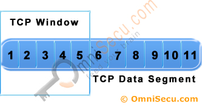

---
tags:
  - 네트워크
---
# TCP 흐름 제어

## 목적

TCP를 사용하는 두 호스트가 있을 때, 발신자의 전송 속도가 너무 빨라서 수신자의 버퍼를 오버플로우 시키는 경우를 방지하기 위한 목적이다.

## 슬라이딩 윈도우

- TCP는 흐름 제어를 위해 슬라이딩 윈도우 기법을 사용한다.
- TCP 윈도우는 데이터의 일부를 받았다는 ACK 패킷을 받기 전에 발신자가 보낼 수 있는 데이터의 크기다.
- 발신자는 자신의 윈도우 안에 있는 패킷들을 모두 보낼 수 있으며, 각 패킷에 대해서 타임아웃 타이머를 시작해야된다.
- 수신자로부터 ACK 패킷을 받게되면, ACK 번호만큼 윈도우를 오른쪽으로 밀 수 있다.

- 아래 영상을 확인하면 좀 더 이해하기 쉽다.

[https://www.youtube.com/watch?v=lk27yiITOvU](https://www.youtube.com/watch?v=lk27yiITOvU)

## 참고 자료

[https://web.eecs.umich.edu/~sugih/courses/eecs489/lectures/30-TCP-Flow+ARQ.pdf](https://web.eecs.umich.edu/~sugih/courses/eecs489/lectures/30-TCP-Flow+ARQ.pdf)