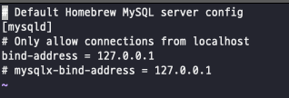

---
tags:
  - MySQL
---
# macOS에서 mariadb 설치 에러 해결

[https://mariadb.com/resources/blog/installing-mariadb-10-1-16-on-mac-os-x-with-homebrew/](https://mariadb.com/resources/blog/installing-mariadb-10-1-16-on-mac-os-x-with-homebrew/)

위 링크를 읽으면서 mariadb를 설치한 뒤, mariadb를 실행하니 다음과 같은 에러로 실행에 실패하는 문제가 생겼다.

```bash
[ERROR] /usr/local/opt/mariadb/bin/mariadbd: unknown variable 'mysqlx-bind-address=127.0.0.1'
```

`/usr/local/etc/my.cnf` 파일에 들어가서 저 부분을 주석처리한 뒤, 재실행하니 해결되었다.



## 참고 자료

[https://stackoverflow.com/questions/58245118/warning-the-post-install-step-did-not-complete-successfully-when-trying-to-ins](https://stackoverflow.com/questions/58245118/warning-the-post-install-step-did-not-complete-successfully-when-trying-to-ins)

[https://mariadb.com/resources/blog/installing-mariadb-10-1-16-on-mac-os-x-with-homebrew/](https://mariadb.com/resources/blog/installing-mariadb-10-1-16-on-mac-os-x-with-homebrew/)