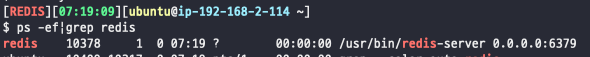

---
tags:
  - Redis
---
# Redis 서버 구성하기

## 설치 및 구성

1. redis-server를 실행한다.

```bash
$ sudo apt update
$ sudo apt install redis-server
```

1. redis-server가 서비스 환경으로 구동될 수 있도록 설정

```bash
# /etc/redis/redis.conf

supervised systemd
```

```bash
$ sudo systemctl restart redis.service
```

## 외부에서 접근 가능하도록 수정

```bash
# /etc/redis/redis.conf

bind 0.0.0.0
```

```bash
$ sudo systemctl restart redis
```

## 패스워드 설정

```bash
# /etc/redis/redis.conf

requirepass ${내가 원하는 패스워드}
```

```bash
$ sudo systemctl restart redis
```

## 확인



## 참고 자료

[https://xerar.tistory.com/80](https://xerar.tistory.com/80)

[https://www.digitalocean.com/community/tutorials/how-to-install-and-secure-redis-on-ubuntu-18-04](https://www.digitalocean.com/community/tutorials/how-to-install-and-secure-redis-on-ubuntu-18-04)

[https://infoscoco.com/92](https://infoscoco.com/92)