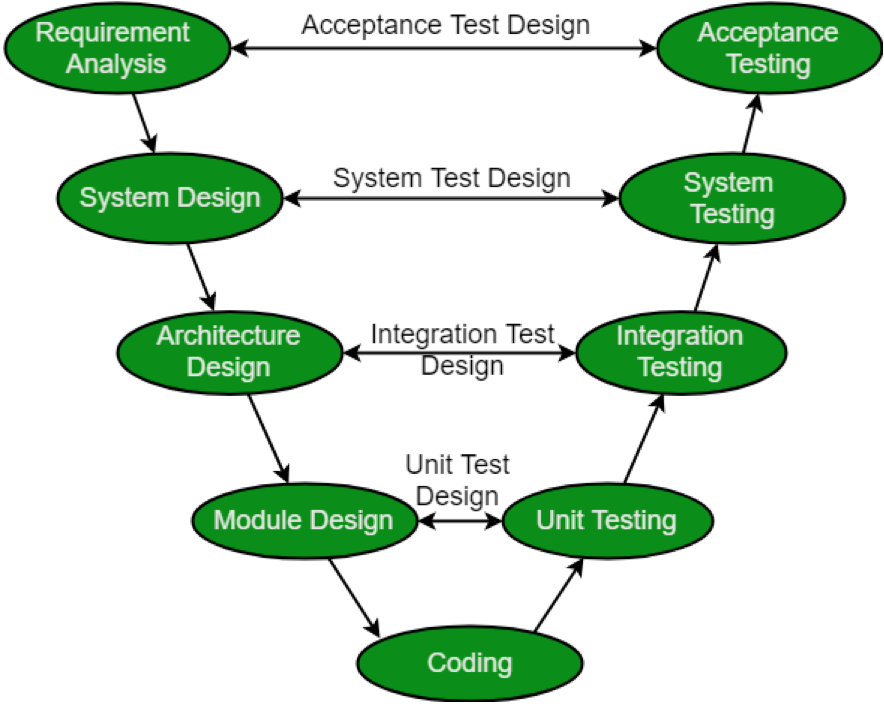

---
tags:
  - 테스트
---
# 테스트 방법론

## **구현과 테스트**

### **소프트웨어 생명 주기 (SDLC)와 테스트**

- V-Diagram
    - Requirement Analysis: 의뢰자로부터 요구 사항을 받아 분석
    - System Design: 소프트웨어 명세 작성. 시스템 구성, 메뉴 구조, 데이터 구조 등.
    - Architecture Design: 모듈 목록, 각 모듈의 기능, 인터페이스 관계, 의존 관계, 데이터베이스 테이블 등 설계.
    - Module Design: 프로그래머가 직접 코딩을 할 수 있도록 유닛 또는 모듈 단위로 설계.
    
    
    

## **테스트**

- unit test
    - 테스트가 가능한 최소 단위로 나누어진 모듈, 프로그램, 객체, 클래스 내에서 결함을 찾고 그 기능을 검증하는 것임
    - 시스템의 다른 부분에서 격리하여 독립적으로 수행 됨
    - 코드를 작성한 프로그래머가 주도함
    - 코드를 중심으로 수행함
- integration test
    - 모듈간 인터페이스를 테스트 함
    - 각기 다른 모듈과 상호 연동하는 동작을 테스트 함
    - 기능적 특성과 특정한 비기능적 특성을 테스트 함
        - 기능성: 조향
        - 비기능성: 성능, 부하, 스트레스 등
- system test
    - 전체 시스템 또는 제품의 동작에 대해 테스트함
    - 가능한 범위에서 실제 최종 사용 환경 또는 유사한 환경에서 수행함
        - 환경 특성 장애 리스크를 최소화 하기 위해서
    - 기능 및 비기능 요구 사항을 모두 검증함
    - 독립적인 테스트 팀이 주도함(QA 팀 등)
- acceptance test
    - 시스템이 실제 사용할만한 준비가 되어있는지에 대해 평가함
        - 결함을 찾는 것이 주된 관심사가 아님
        - 사용자가 불편함이 없는지 확인하는 것이 주 목적
    - 시스템을 사용하는 사용자가 전담하여 수행함
        - 알파/베타 테스트
            - 알파 테스트: 사내 이해당사자들에게 테스트
            - 베타 테스트: 사외 대상자들에게 테스트

## **FIRST: 좋은 단위 테스트는 무엇인가?**

- Fast: 실행이 빠르다.
    - 단위 테스트의 가치는 지속적이고 빠른 피드백을 주는데 있음
    - TDD 관점에서 테스트를 위해서 프로덕션 코드를 수정하는 것은 좋은 습관이다.
    - 실행이 느린 단위 테스트(수십~수천 ms)
        - 외부 자원(데이터베이스, 파일, 네트워크) 접근 코드를 실행함.
    - 실행이 빠른 단위 테스트(수 ms)
        - 프로덕션 코드만 실행함
    - 외부 자원 의존성을 줄이는 방법
        - Stub: 테스트 용도로 하드 코딩한 값을 반환하는 구현체
        - Mock: 가상의 데이터를 만들어서 주입하는 방식
- Isolated/Independent: 고립되고 독립적이다.
    - 단위 테스트 내 상호작용하는 코드가 많음
        - 데이터 의존성
        - 다른 단위 테스트 의존성
    - 고립되지 않고 독립적이지 않은 단위 테스트의 특징
        - 문제 발생 가능성 높음
        - 발생한 문제는 복장섭 높음
        - 단위 테스트에서 DB에 접근하고 있으면, DB에 문제가 발생할 시에 테스트 실패가 된다. 실제 테스트하려는 대상이 아닌 부분으로 인해 테스트가 실패가 나버린다.
        - 아래 사진에서 테스트가 여러 명이 동시에 실행할 경우 확률적으로 테스트 실패가 발생할 수 있다. 데이터 의존적인 단위 테스트다.
    - 단위 테스트의 실생 순서에 의존성을 가지고 있을 시 문제점
        - 테스트 실패 시 단위 테스트 체인을 분석 해야함
        - 다른 단위 테스트 실패 시 필요한 단위 테스트를 수행하지 못함
- Repeatable: 반복 가능하다.
    - 실행할 때 마다 동일한 결과를 보장함
    - 통제 할 수 없는 외부 요소는 동일한 결과를 보장하지 못할 수 있음
    - 산발적으로 실패하는 테스트는 불필요한 비용을 야기함
- Self-validating: 스스로 검증 가능하다.
    - 좋은 단위 테스트는 스스로 검증 가능해야한다.
    - 테스트를 printf 등으로 출력하면, 각 테스트마다 성공 여부를 직접 하나씩 확인해야된다.
    - assert 메서드를 통해 코드 자체가 성공 여부를 확인할 수 있도록 해야된다.
    - 스스로 검증 가능하면 얻는 장점
        - 실행 자동화가 가능하다. (Infinitest)
        - 지속적 통합: 자동으로 내가 merge한 코드가 다른 코드에게 문제를 일으키는지 검증이가능하다(Jenkins, TeamCity)
- Through/Timely: 시기 적절하게 구현하고 사용한다.
    - 고정적인 규칙은 없다. 상황에 맞는 전략을 취하는게 좋다.
        - 요구사항 변경이 빈번한 개발 초기 단계
        - 오래 방치된 하지만 문제 없는 레거시 코드
        - 프로덕션 코드 구현 전후
        - develop 브랜치에 통합 하기 전
        - 배포 하기전

## **RIGHT-BICEP 무엇을 테스트 해야하는가?**

- Right: 기대한 결과를 검증한다.
    - 해피 시나리오 테스트: 코드가 정상적으로 동작 했을 때의 결과를 검증
        - 요구사항, 시나리오 또는 프로덕션 코드를 충분히 이해한 상태임을 의미할 수 있다.
- Boundary condition: 경계 조건을 테스트 한다.
    - 경계 조건 예시
        - 모호하고 일관성 없는 입력 값
        - 잘못된 양식의 데이터
        - 수치적 오버플로를 일으키는 연산
        - 비거나 빠진 값
        - 이성적인 기대 값을 훨씬 벗어나는 값
        - 중복 허용이 안되는 목록에 중복 값이 존재
        - 정렬이 안된 정렬 리스트 혹은 그 반대
        - 시간 순이 맞지 않는 경우
    - 질 좋은 테스트 케이스
        - 프로덕션 코드 변화에 민감하게 반응 함
        - 프로덕션 코드가 어떤 결함을 가질 수 있는지 충분히 고민하여 테스트 케이스를 결정해야된다.
    - 경계 조건
        - Coformance: 양식 준수
        - Ordering: 정렬 순서
        - Range: 범위
        - Reference: 참조
        - Existence: whswo
        - Cardinality: 기수
        - Time: 순서
- Inverse relationshiop: 단위 테스트는 논리적인 역관계를 활용하여 테스트 한다.
    - 수학적인 계산 로직 테스트에 종종 사용됨
        - 제곱근을 계산하는 메서드를 테스트할 때, 250의 제곱근 값을 직접 구하는 것은 어려움이 있음.
        - 메서드 반환 값을 제곱하여 250에 가까운지 확인하는 테스트를 짜면 된다.
    - 비 수학적인 로직 테스트 예제
        - 프리디케이트의 보어를 이용해서 참과 보어의 합이 원본 데이터와 같은지 확인한다.
- Cross-check result: 다른 수단을 활용하여 교차 테스트 한다.
    - 제곱근을 구하는 메서드를 구현했다면, Java의 `Math.sqrt` 를 통해 값을 비교한다.
    - 교차 테스트 사용 예
        - 재구성한 라이브러리
        - 리팩토링 이전 vs 이후
        - 총합 확인
- Error condition: 오류 조건하에 오류가 발생하는지 테스트 한다.
    - 언해피 시나리오
        - 환경적인 제약
            - 메모리가 가득 찰 때
            - 디스크 공간이 가득 찰 때
            - 네트워크 가용성 및 오류들
            - 시스템 로드
            - 제한된 색상 팔레트
            - 매우 높거나 낮은 비디오 해상도
        - 예외가 발생한 경우를 테스트
- Performance: 성능 조건을 테스트 한다.
    - 성능 개선을 확인하기 위한 테스트
        - 병목 지점을 추측하는 건 어려움
        - 단위 테스트로 구간별 경과 시간을 측정하여 진단함
    - 성능 개선 확인 방법
        - 성능 최적화 이전 코드 vs 성능 최적화 이후 코드 경과 시간 측정