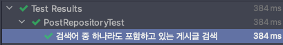

---
tags:
  - JPA
---
# QueryDSL 시작하기

상황에 따라 쿼리문이 동적으로 변하는 기능이 필요했다. 이 기회에 QueryDSL을 사용해서 이를 구현해보고자 한다.

## 의존성 추가

QueryDSL을 사용하기 위해서는 의존성을 추가할 뿐만의 아니라 약간의 설정이 필요하다. 

- QueryDSL은 프로젝트 내에 있는 Entity들을 스캔하여 `JPAAnnotationProcessor` 을 통해 Q 클래스를 생성한다.
    - Q 클래스를 통해 엔티티의 필드 값을 통한 쿼리문을 쉽게 작성할 수 있게 해준다.
- `@Entity` 같은 JPA 관련 어노테이션을 탐지할 수 있도록 하기위해서 'javax.persistence-api’, ‘javax.annotation-api’를 함께 annotationProcessor에 추가해준다.
- sourceSets 부분은 개발환경에서 Q 클래스에 접근할 수 있도록 하기위해 설정해주는 부분이다. "$projectDir/src/main/java"와 "$projectDir/build/generated"가 개발 환경에 접근 가능한 경로다.

```groovy
// build.gradle

dependencies {
		// ...
		implementation 'com.querydsl:querydsl-apt:5.0.0'
		implementation 'com.querydsl:querydsl-jpa:5.0.0'
		annotationProcessor(
		        "javax.persistence:javax.persistence-api",
		        "javax.annotation:javax.annotation-api",
		        "com.querydsl:querydsl-apt:5.0.0:jpa")
		// ...
}

sourceSets {
    main {
        java {
            srcDirs = ["$projectDir/src/main/java", "$projectDir/build/generated"]
        }
    }
}
```

## Bean 등록

쿼리를 생성하기 위한 객체인 `JPAQueryFactory` 를 Bean으로 등록해둔다.

```java
@Configuration
public class QueryDslConfiguration {

    @PersistenceContext
    private EntityManager entityManager;

    @Bean
    public JPAQueryFactory jpaQueryFactory() {
        return new JPAQueryFactory(entityManager);
    }
}
```

## Repository 커스텀

`JpaRepository`에서 제공하는 기본적인 기능에다가 QueryDSL로 직접 구현한 메서드를 추가하고자 한다. 이를 위해서는 인터페이스의 다중 상속을 이용한다.

```java
public interface PostRepository extends JpaRepository<Post, Long>, PostCustomRepository {

    List<Post> findAllByWritingDateGreaterThanEqual(final LocalDate localDate);
}
```

`JpaRepository` 오른쪽에 `PostCustomRepository` 를 함께 상속한 것을 볼 수 있다. `PostCustomRepository`에 추가하고자 하는 메서드를 정의하고 이에 대한 구현 클래스를 따로 정의해둔다.

```java
public interface PostCustomRepository {

    List<Post> findAllByAnyKeyword(List<String> keywords);
}
```

아래 코드와 같이 `JPAQueryFactory` 를 이용해 쿼리를 생성했다. 여기서 주의해야될 점은 구현 클래스의 이름이 무조건 `{인터페이스이름}Impl` 형태이다. 

```java
@Repository
public class PostCustomRepositoryImpl implements PostCustomRepository {

    private final JPAQueryFactory jpaQueryFactory;

    public PostCustomRepositoryImpl(final JPAQueryFactory jpaQueryFactory) {
        this.jpaQueryFactory = jpaQueryFactory;
    }

    @Override
    public List<Post> findAllByAnyKeyword(final List<String> keywords) {
        BooleanBuilder booleanBuilder = new BooleanBuilder();

        for (String keyword : keywords) {
            booleanBuilder.or(post.title.contains(keyword));
        }

        return jpaQueryFactory.selectFrom(post)
            .where(booleanBuilder)
            .orderBy(post.writingDate.desc())
            .fetch();
    }
}
```

만약 다른 이름의 구현 클래스를 만들고 싶다면 아래와 같이 어노테이션을 통해  postfix의 설정을 바꿀 수 있다.

```java
@EnableJpaRepositories(
  basePackages = "com.baeldung.repository", repositoryImplementationPostfix = "CustomImpl")
```

## 테스트

아래와 같이 테스트 코드를 작성했는데 통과하는 것을 볼 수 있었다.

```java
@DisplayName("검색어 중 하나라도 포함하고 있는 게시글 검색")
@Test
void findAllByAnyKeyword() {
    postRepository.save(
        new Post("한양대 공지", Board.HY_SCHOLARSHIP, "https://google.com", LocalDate.now()));
    postRepository.save(
        new Post("새로운 공지입니다.", Board.HY_SCHOLARSHIP, "https://google2.com", LocalDate.now()));
    postRepository.save(
        new Post("이 글을 검색하지마세요.", Board.HY_SCHOLARSHIP, "https://google3.com", LocalDate.now()));

    assertThat(postRepository.findAllByAnyKeyword(List.of("한양대", "공지"))).hasSize(2);
}
```



## 참고 자료

[https://www.baeldung.com/spring-data-composable-repositories](https://www.baeldung.com/spring-data-composable-repositories)

[https://tecoble.techcourse.co.kr/post/2021-08-08-basic-querydsl/](https://tecoble.techcourse.co.kr/post/2021-08-08-basic-querydsl/)