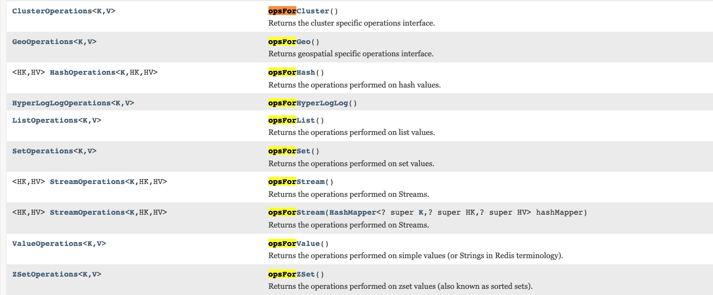

# Spring에서 Redis를 이용해 캐싱 구현하는 법

Spring에서 Redis 서버로 캐싱하는 방법은 2가지 방법이 있다. 기본적인 동작 확인만 목표로 하기 때문에 자세한 설정 방법은 생략한다.

## 어노테이션을 사용하는 방법

### 의존성 추가

```bash
implementation 'org.springframework.boot:spring-boot-starter-data-redis'
```

### Config에 `@EnableCaching` 추가

```java
@SpringBootApplication
@EnableCaching
public class Application {
		...
}
```

### Entity에 Serializable 구현

Redis에서 데이터를 바이트 스트림으로 저장하기 위해서 필요하다.

```java
@Entity
public class User implements Serializable{
	@Id
	@GeneratedValue(strategy = GenerationType.AUTO)
	private Integer id;
	private String name;
	private String email;
	private Integer age;
	public User() {
		super();
	}
	
	public User(Integer id, String name, String email, Integer age) {
		super();
		this.id = id;
		this.name = name;
		this.email = email;
		this.age = age;
	}
}
```

### 서비스 레이어의 메서드에 `@Cachable` 추가

```java
@GetMapping("/{id}")
@Cacheable(value= "Users", key="#id")
public User getUser(@PathVariable Integer id) {
	log.info(">> User Controller: get user by id: " + id);
	return userService.getUserById(id);
}
```

Redis에 특정 엔티티를 추가하기 위해 `@CachePut`, 캐싱된 엔티티를 지우기 위해 `@CacheEvict` 를 사용할 수 있다. 

## RedisTemplate 이용하는 방법

캐싱할 데이터를 압축해서 저장한다던가, 추가적인 처리가 필요할 때 사용할 수도 있다.

### RedisTemplate 빈 등록

```java
@Configuration
@EnableRedisRepositories
public class RedisRepositoryConfig {

    private final RedisProperties redisProperties;

    // lettuce
    @Bean
    public RedisConnectionFactory redisConnectionFactory() {
        return new LettuceConnectionFactory(redisProperties.getHost(), redisProperties.getPort());
    }

    @Bean
    public RedisTemplate<String, Object> redisTemplate() {
        RedisTemplate<String, Object> redisTemplate = new RedisTemplate<>();
        redisTemplate.setConnectionFactory(redisConnectionFactory());
        redisTemplate.setKeySerializer(new StringRedisSerializer());
        redisTemplate.setValueSerializer(new StringRedisSerializer());
        return redisTemplate;
    }
}
```

### redisTemplate 사용하기

```java
@Repository
@RequiredArgsConstructor
public class CartDao {

	private final RedisTemplate<String, Object> redisTemplate;

	public void addItem(ItemDto itemDto, Long memberId){
		String key = KeyGen.cartKeyGenerate(memberId);
		redisTemplate.opsForValue().set(key, itemDto);
		redisTemplate.expire(key, 60, TimeUnit.MINUTES);
	}

	public ItemDto findByMemberId(Long memberId){
		String key = KeyGen.cartKeyGenerate(memberId);
		return (ItemDto) redisTemplate.opsForValue().get(key);
	}
}
```

저장할 자료구조에 따라 `opsForValue()` 뿐만아니라 다양한 메서드를 제공하고 있다.



## 참고 자료

[https://docs.spring.io/spring-data/redis/docs/current/api/org/springframework/data/redis/core/RedisTemplate.html](https://docs.spring.io/spring-data/redis/docs/current/api/org/springframework/data/redis/core/RedisTemplate.html)

[https://wildeveloperetrain.tistory.com/32](https://wildeveloperetrain.tistory.com/32)

[https://loosie.tistory.com/807](https://loosie.tistory.com/807)

[https://wildeveloperetrain.tistory.com/32](https://wildeveloperetrain.tistory.com/32)

[https://pearlluck.tistory.com/727](https://pearlluck.tistory.com/727)

[https://dzone.com/articles/introduction-to-spring-data-redis](https://dzone.com/articles/introduction-to-spring-data-redis)

[https://medium.com/@hulunhao/how-to-use-redis-template-in-java-spring-boot-647a7eb8f8cc](https://medium.com/@hulunhao/how-to-use-redis-template-in-java-spring-boot-647a7eb8f8cc)