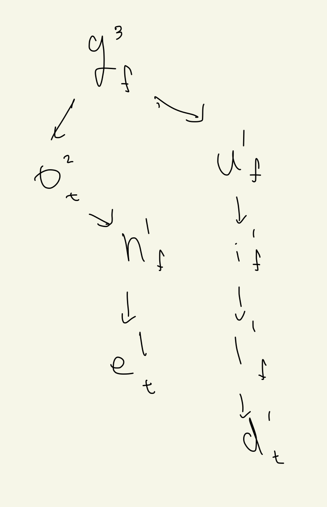

---
tags:
  - 프로그래머스-풀이
---
# 17685

날짜: 2022년 8월 23일 오전 11:21

## 코드

[Algorithm/17685.py at main · Junroot/Algorithm](https://github.com/Junroot/Algorithm/blob/main/programmers/17685.py)

## 풀이

단순하게 단어하나씩 입력을 늘려가면서 구하게되면 O(N*L)로 타임아웃이 발생할 것이다.

트라이를 이용해 중복되는 계산 부분을 제거하면 시간복잡도를 O(L)로 줄일 수 있다.

위 사진은 ‘go, gone, guild’를 트라이로 만들었을 때의 그림이다.

오른쪽 상단은 존재할 수 있는 단어 개수, 오른쪽 하단은 해당 글자로 끝나는 단어가 있는지 여부를 나타내는 true, false를 나타낸다.

최종 답을 찾을 때는 오른쪽 상단이 1이거나, 현재 글자로 끝이나는 단어의 depth를 모두 더해주면된다.