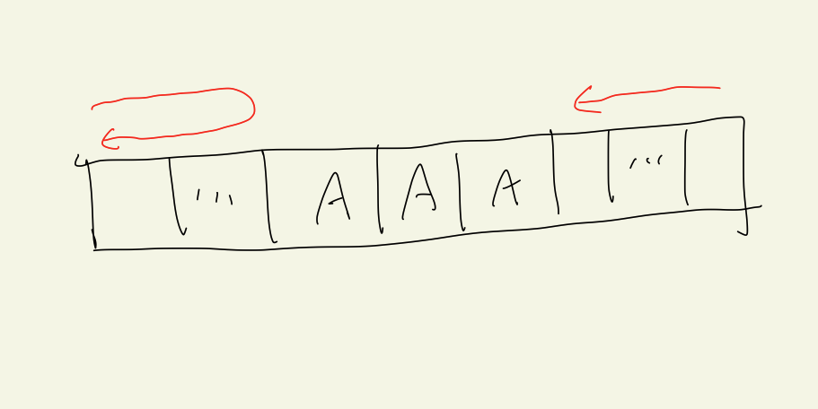

---
tags:
  - 프로그래머스-풀이
---
# 42860

날짜: 2022년 1월 31일 오후 5:50

## 코드

[Algorithm/42860.py at main · Junroot/Algorithm](https://github.com/Junroot/Algorithm/blob/main/programmers/42860.py)

## 풀이

문제를 수평 이동과 수직 이동으로 크게 나눌 수 있다.

### 수직 이동

수직 이동에 대한 처리는 그렇게 어렵지 않다. 알파벳이 26개인것만 알고 있다면.

### 수평 이동

수평 이동에 대한 처리에서 놓쳐서는 안되는 경우가 있다. `오른쪽으로 이동했다가 왼쪽으로 쭉 이동하는 경우가 더 짧을 수도 있다` 라는 점이다. 나는 이를 해결하기 위해 2가지 문제로 나눠서 풀었다. 그림으로 표현하면 다음과 같다.

1. 모든 연속된 'A' 구간 찾기
이 부분은 리스트를 처음부터 끝까지 한 번만 스캔해서 찾아냈다. `find_all_a_ranges()` 함수를 확인해보면 된다.
2. 주어진 구간에 도달하기까지 오른쪽으로 이동했다가 왼쪽으로 쭉 이동하는 거리 계산
(출발 구간에서 연속된 'A' 구간에 도착하기 전 까지의 거리) * 2 + (끝부분에서 왼쪽으로 이동하는 거리)

2번에서 설명한 방법으로 계산한 거리 중에 최소 값이 되는 경우를 찾으면 된다. `find_min_horizontal_movement()` 함수를 확인해보면 된다.