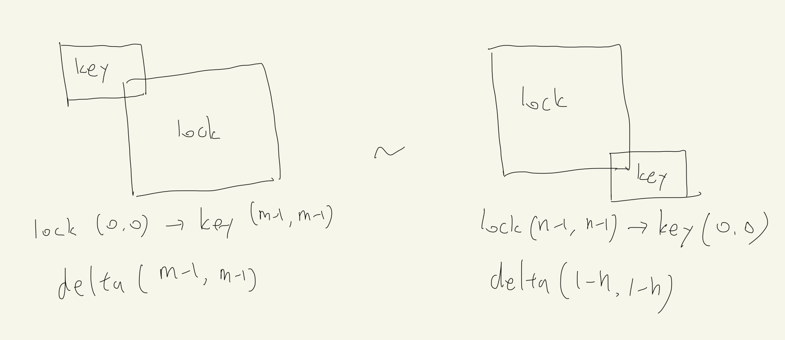

# 60059

날짜: 2022년 3월 8일 오후 3:47

## 코드

[Algorithm/60059.py at main · Junroot/Algorithm](https://github.com/Junroot/Algorithm/blob/main/programmers/60059.py)

## 풀이

단순히 모든 경우의 수를 다 구해보면 되는 문제다.

겹쳐지는 부분 계산을 좀 신경써야되는데, 특정 lock위치에 대한 key의 위치값 차이를 delta로 두고 모든 가능한 delta값을 루프를 돌면서 탐색했다.

