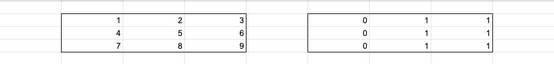

# 92344

날짜: 2022년 5월 25일 오후 6:31
오답: o

## 코드

[Algorithm/92344.py at main · Junroot/Algorithm](https://github.com/Junroot/Algorithm/blob/main/programmers/92344.py)

## 풀이

### 잘못된 풀이

처음에 접근한 방법은 중복된 연산(덧셈, 뺄셈)을 피하기 위해서 배열의 표현을 자신의 왼쪽 또는 위쪽의 차이로 나타내려고 했다. 만약 자신의 왼쪽의 차이로 표현하면 아래 사진과 같다.



이렇게 하고 배열의 가로 길이가 더 길도록 transpose 하면 해결될 것이라고 생각했다. 

O(배열 세로 길이 * skill 길이)로 최악의 경우는 31 * 250000지만 시간초과가 발생했다.

### 맞는 풀이

결국 다른 사람 풀이를 확인했다.

잘못된 풀이와 비슷하지만 조금 달랐다.

1. 누적합을 이용함
2. 연산에 대해서만 누적합을 계산함

누적합은 x, y의 값을 확인하기 위해서는 (0, 0)부터 (x, y)까지의 모든 값을 더하는 형식이다. 위 배열을 누적합으로 변환하면 아래와 같다.

```python
n n n 0
n n n 0
n n n 0
0 0 0 0
```

```python
n 0 0 -n
0 0 0 0
0 0 0 0
-n 0 0 n
```

누적합을 이용하면 하나의 연산에대해서 값 업데이트가 4번만 일어나므로 O(skill 길이)로 해결이 가능해진다.

그리고 초기 값에대해서 누적합으로 변환하려고 하면 연산이 복잡해지지만 생각해보니 초기 값은 굳이 누적합으로 연산할 필요가 없었다.

## 참고 자료

[https://tech.kakao.com/2022/01/14/2022-kakao-recruitment-round-1/#문제-6-파괴되지-않은-건물](https://tech.kakao.com/2022/01/14/2022-kakao-recruitment-round-1/#%EB%AC%B8%EC%A0%9C-6-%ED%8C%8C%EA%B4%B4%EB%90%98%EC%A7%80-%EC%95%8A%EC%9D%80-%EA%B1%B4%EB%AC%BC)