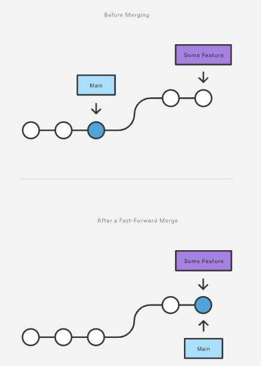

---
tags:
  - Git
---
# Git 시작하기

## **Git이란**

* 버전관리 도구
* 리누스 토발즈, 2005년

## **Git 실습**

*   macOS 기준

    * macOS는 기본적으로 설치되어 있다.

    ```
    sudo brew install git
    ```
*   설치 후 설정

    ```
    git config --global user.name "MY NAME"
    git config --global user.email "MY EMAIL"
    ```
*   기존 프로젝트를 git으로 관리하고 싶을 때

    ```
    git init
    ```
*   새로운 디렉토리를 생성하여 git 저장소를 만들 때

    ```
    git init (directory path)
    ```
*   파일 상태 확인하기

    ```
    git status
    ```
* git 파일 관리를 위한 3가지 영역
  * git directory: 프로젝트의 메타데이터와 객체 데이터베이스를 저장하는 곳 (.git)
  * working directory: 프로젝트의 특정 버전을 checkout 한 영역
  * Staging area(index): 저장할 파일들에 대한 정보를 담고있는 파일(.git/index)
    * git add를 하면 staging area에 해당 파일이 추가된다.
* git 파일 관리 3단계
  1. working directory에서 파일을 추가, 수정, 삭제
  2. staging area 에 파일을 add 해서 commit 할 스냅샷을 만듦. (git add)
  3. staging area 에 있는 파일들을 commit 해서 git directory에 영구적인 스냅샷으로 저장 (git commit)
* git 관리중인 파일의 상태
  * untracked: 새롭게 추가되어 추적이 되지 않은 상태
  * staged: 로컬 데이터베이스에 저장하기 위해 등록해 놓은 상태
  * commited: 데이터가 로컬 데이터베이스에 안전하게 저장된 상태
  * modified: 수정한 파일을 아직 로컬 데이터베이스에 저장하지 않은 상태
*   staging area에 파일 추가

    ```
    git add (file path) (file path) (file path) # 특정 파일 추가
    git add . # 전체 추가
    ```
*   git commit

    ```
    git commit -m "simple message" # 간단한 메시지
    git commit # multiline 메시지 작성 시
    ```
*   git diff

    ```
    git diff # working directory와 index를 비교
    git diff (commitA)..(commitB) # 커밋 간 차이점을 비교
    git diff --staged # index와 HEAD를 비교
    ```
*   git log

    ```
    git log # 현재 저장소의 시간순 커밋 히스토리
    git log -p # diff를 함께 보기
    git log -Number # 히스토리 갯수 지정
    git log --grep keyword # 커밋 메시지 조회
    git log --oneline # multiline으로 작성된 메시지 한줄로 표시
    git log --graph # 그래프 표현
    ```
*   git branch

    ```
    git branch # branch 목록확인
    git branch (branch_name) # branch 만들기
    git branch -d (branch_name) # branch 삭제 (merge된 branch만)
    git brnach -D (branch_name) # branch 삭제 (조건 없이 branch 삭제)
    ```
*   git checkout

    * index와 working directory의 파일들이 변경된 branch를 기준으로 switching 됨.
    * HEAD가 가리키는 branch가 변경됨.
    * HEAD: 현재 branch의 가장 마지막 커밋

    ```
    git checkout (branch_name) # 지정한 branch로 변경
    git checkout -b (branch_name) # 새로운 branch를 만들고 그 branch로 변경
    ```
*   git merge

    * 코드가 반영될 branch에서 입력해야됨.

    ```
    git merge (target_branch_name)
    ```
*   Fast-forward merge: 현재 branch의 커밋이 변경이 일어난 branch의 base commit과 동일한 경우

    
*   3-way merge

    * 두 branch 간 공통의 parent commit 을 이용하여 변경된순으로 merge를 수행
    * merge의 결과를 별도의 commit object로 저장
    * 코드가 반영된 branch가 바라보는 commit을 새로 만들어진 commit으로 변경
    * 이때 만들어진 commit을 merge commit 이라고 함.

    !\[Untitled]\(assets/Untitled 1.png)
*   git rebase

    * 지정한 base를 기준으로 현재 branch의 base commit을 변경
    * 내부적으로는 base commit을 기준으로 현재 branch 에서 추가된 변경을 하나씩 적용
    * merge 와 log history 자체가 변경 되기 때문에 호불호가 많이 갈리는 기능
    * base commit 을 기준으로 커밋을 새롭게 만들기 때문에 상당한 conflict 상황이 발생 가능
    * 작업 history 가 유지 되지 않게 되므로 작업 이력이 중요한 경우에는 적절하지 않음

    .png>)

## **Github 실습**

* Github: Git 원격 저장소를 호스팅 해주는 서비스.
*   git remote 명령어

    ```
    # 원격 저장소 추가
    git remote add (remote_alias) (remote url)
    # 원격 저장소 상세정보 확인
    git remote show (remote alias)
    # 원격 저장소 alias 변경
    git remote rename (old_name) (new_name)
    # 원격 저장소 url 변경
    git remote set-url (remote alias) (new remote url)
    # 원격 저장소 목록 확인
    git remote -v
    ```
*   local branch push 하기

    ```
    git push (remote) (remote branch_name)
    ```
*   이미 원격에 존재하는 저장소 받아오기

    ```
    git clone (remote_url) (directory_name[생략시 remote repository name]) -b (branch_name[생략 시 default branch])
    ```
*   원격 저장소 변경내용 가져오기

    ```
    # remote 저장소에 추가된 object들을 받아와서 local에 저장
    git fetch (remote) (remote branch)
    # remote 저장소에 추가된 object들을 local로 받아오면서 merge까지 수행
    git pull (remote) (remote branch):(local branch)
    ```
* pull request: merge하기 전에 리뷰 받기.

## **Tips**

* `.gitignore`: git에 포함 안 시킬 파일들 정하기
  * [https://www.gitignore.io/](https://www.gitignore.io/)
*   .gitignore에 추가했지만 이미 push 해버린 경우

    * cached를 붙이면 local에 있는 파일과 폴더들은 그대로 놔두고 원격저장소에 있는 것들만 지우게 된다.

    ```
    git rm -r --cached some-directory
    git commit -m "remove ignored directory"
    git push origin master
    ```
* Non-fast-forward push 거부 해결하기
  *   git pull 로 해결하는 방법

      ```
      git pull origin master
      ```
  *   git rebase로 해결하는 방법

      ```
      git fetch origin master
      git rebase origin/master
      ```
* 직전 커밋 변경하기
  *   실수로 일부 파일이 누락되었거나 커밋 메시지가 잘못 작성된 경우

      ```
      git commit --amend
      ```
  *   working tree 를 유지하며 되돌리기 (--mixed)

      ````
      git reset <commit>

      - working tree, staging area 유지하며 되돌리기

        ```shell
        git reset --soft <commit>
      ````
  *   working tree, staging area 모두 되돌리기

      ```
      git reset --hard <commit>
      ```
