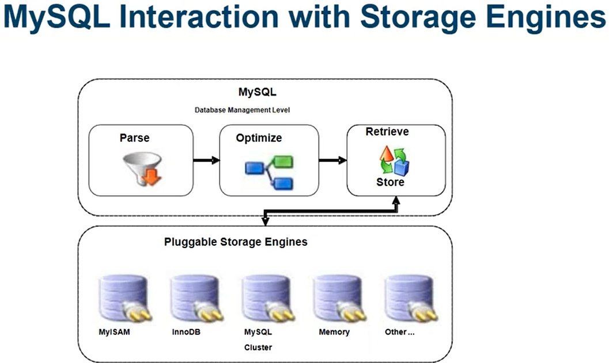
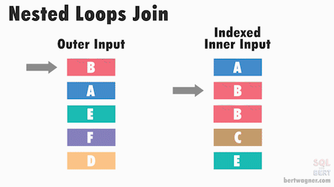

# SQL 튜닝 전에 알아야 될 용어

## MySQL 구조

MySQL의 SQL 튜닝을 하기 전에 MySQL가 어떤 구조로 동작하는지 알 필요가 있다. MySQL Connectors를 통해 SQL문을 보내게되면 간략히 아래와 같은 과정을 거친다.

1. Parser를 통해 MySQL 엔진에서 문법 에러가 있는지, DB에 존재하는 테이블을 대상으로 SQL문을 작성했는지 검사한다.
2. Optimizer를 통해 요청한 데이터를 빠르고 효율적으로 찾아가는 전략적 계획을 만든다.
3. 계획을 토대로 스토리지 엔진에 위치한 데이터를 찾는다.
4. 찾은 데이터에서 불필요한 부분을 필터링하고 필요한 연산을 수행한 뒤에 사용자에게 반환한다.



### 스토리지 엔진

InnoDB, MyISAM, Memory 등과 같은 스토리지 엔진은 사용자가 요청한 SQL 문을 토대로 DB에 저장된 디스크나 메모리에서 필요한 데이터를 가져오는 역할을 한다. 이후 해당 데이터를 MySQL 엔진으로 보내준다. 스토리지 엔진이 데이터를 저장하는 방식에 따라 각각의 스토리지 엔진을 선택하여 사용할 수 있으며, 필요하다면 외부에서 스토리지 엔진 설치 파일을 가져와 활성화하여 즉시 사용할 수도 있다. 

일반적으로 온라인상의 트랜잭션 발생으로 데이터를 처리하는 OLTP환경이 대다수인 만큼 주로 InnoDB 엔진을 사용한다. 또한 대량의 쓰기 트랜잭션이 발생한다면 MyISAM 엔진을, 메모리 데이터를 로드하여 빠르게 읽는 효과를 내려면 Memory엔진을 사용하는 식으로 응용하여 스토리지 엔진을 선택할 수 있다.

### MySQL 엔진

앞에서 말한 Parser, Optimizer도 MySQL 엔진에 포함된다. 사용자가 요청한 SQL 문을 넘겨받은 뒤 SQL 문법 검사와 적절한 오브젝트 활용 검사를 하고, SQL 문을 최소 단위로 분리하여 원하는 데이터를 빠르게 찾는 경로를 탐색하는 역할을 한다.


### 쿼리 캐시

SQL문이 key, 쿼리 실행 결과가 Value인 Map이다. 하지만, 데이터가 변경되면 모두 삭제해버린다. 이는 오히려 처리 성능 저하를 유발하고 버그의 원인이 되어서 MySQL8.0 이후에 제거되었다.

### 파서

사용자가 요청한 SQL 문을 쪼개 최소단위로 분리하고 트리를 만든다. 트리를 만들면서 문법 검사를 수행한다.

### 전처리기(Preprocessor)

파서에서 생성한 트리를 토대로 SQL 문에 구조적인 문제가 없는지 파악한다. SQL 문에 작성된 테이블, 열, 함수, 뷰와 같은 오브젝트가 실질적으로 존재하는 오브젝트인지, 접근 권한을 가지고 있는지 확인한다.

### 옵티마이저

전달된 트리를 기반으로 필요하지 않은 조건을 제거하거나 연산 과정을 단순화한다. 또한, 어떤 순서로 테이블에 접근할지, 인덱스를 사용할지, 사용한다면 어떤 인덱스를 사용할지, 정렬할 때 인덱스를 사용할지 아니면 임시 테이블을 사용할지와 같은 실행 계획을 수립한다.

실행 계획을 수립하는 작업 자체만으로도 대기 시간과 하드웨어 리소스를 점유하므로, 시간과 리소스에 제한을 두고 실행 계획을 선정해야 된다. 옵티마이저가 에측한 실행 계획이 항상 최적의 실행 계획이 아니다.

### 엔진 실행기

MySQL 엔진과 스토리지 엔진 영역 모두에 모두 걸치는 오브젝트로, 옵티마이저에서 수립한 실행 계획을 참고하여 스토리지 엔진에서 데이터를 가져온다. 읽어온 데이터를 정렬하거나 조인하고, 불필요한 데이터는 필토링하는 추가 작업을 한다. MySQL 엔진의 부하를 줄이려면 스토리지 엔진에서 가져오는 데이터양을 줄이는게 매우 중요하다.

## 조인 알고리즘 용어

### 드라이빙 테이블과 드리븐 테이블

조인을 처리할 때, 테이블에 동시에 접근할 수 없으므로 테이블의 데이터에 접근하는 우선순위가 존재한다. 이 때 먼저 접근하는 테이블을 드라이빙 테이블, 나중에 접근하는 테이블을 드리븐 테이블이라고 부른다. 드라이빙 테이블에서 많은 건수가 반환되면 해당 결과를 가지고 드리븐 테이블에 접근하게 되는 만큼 드라이빙 테이블을 무엇을로 선정할지는 매우 중요하다. 가능하면 적은 결과가 반환될 것으로 예상되는 드라이빙 테이블을 선정하고, 조인 조건절의 열이 인덱스로 설정되도록 구성해야된다.

### 중첩 루프 조인(NL조인)

드라이빙 테이블의 데이터 1건 당 드리븐 테이블의 모두 스캔하여 양족 테이블에 공통된 데이터를 찾는 방법이다. 


속도를 개선하기 위해서는 인덱스를 생성할 수 있다.



하지만 비고유 인덱스 일경우 랜덤 액세스가 발생한다. 랜덤 액세스를 줄일 수 있도록 데이터의 액세스 범위를 좁히는 방향으로 인덱스를 설계하고 조건절을 작성해야 한다. 기본 키는 클러스터형 인덱스이므로 기본 키의 순서대로 테이블의 데이터가 적재되어 있어 조회 효율이 높다.

### 블록 중첩 루프 조인(BNL 조인)

NL 조인의 성능을 개선하기 위해 만들어졌다. 드라이빙 테이블의 행들을 조인 버퍼에 넣을 수 있는 만큼 저장 해둔 후 드리븐 테이블을 스캔하면서 탐색한다. 한 번에 여러 개 행들과 비교할 수 있기 때문에 성능 개선이 된다.


### 배치 키 액세스 조인(BKA 조인)

NL 조인의 경우 드라이빙 테이블에서 조회된 데이터로 드리븐 테이블에 접근하게 되어 비고유 인덱스에 의해 무조건 랜덤 액세스가 발생한다. 


이를 개선하기 위해 다중 범위 읽기(multi range read, MRR) 기능을 도입했다. MRR은 드리븐 테이블의 데이터를 예측하고 정렬된 상태로 버퍼에 적재하는 기능이다. 미리 예측된 데이터를 가져와 정렬된 상태에서 랜덤 버퍼에 담기 때문에, 드리븐 테이블에 대해 랜덤 액세스가 아닌 시퀀셜 액세스를 할 수 있게된다.


### 해시 조인

해시 조인은 MySQL 8.0.18 버전부터, MariabDB 5.3 버전부터 지원하는 기능이다. 조인에 참여하는 각 테이블의 데이터를 내부적으로 해시값을 만들어 내부 조인을 수행한다. 해시값으로 내부 조인을 수행한 결과는 조인 버퍼에 저장되므로 조인 열의 인덱스를 필수로 요구하지 않아도 된다. 해시 조인은 대용량 데이터의 동등 비교 연산에서 사용되지만 MySQL과 MariaDB의 핵심적인 조인 알고리즘으로는 사용되지 않고 있다.


## 오브젝트 스캔 유형

### 테이블 풀 스캔

인덱스가 존재 하지 않거나, 전체 데이터 대비 대량의 데이터가 필요할 경우 발생한다. 테이블오 직행해서 처음부터 끝까지 데이터를 스캔하기 때문에 성능적으로 느리다. 인덱스 없이 사용하는 유일한 방식이다.


### 인덱스 범위 스캔

SQL 문에서 BETWEEN ~ AND 구문이나, <, >, LIKE 구문 등 비교 연산에 인덱스가 포함될 경우 발생한다. 인덱스를 범위 기준으로 스캔한 뒤 결과를 토대로 테이블의 데이터를 찾아간다. 좁은 범위를 스캔할 때는 성능적으로 효율적이지만, 넓은 범위를 스캔할 때는 비효율적이다.


### 인덱스 풀 스캔

인덱스로 구성된 열 정보만 요구하는 SQL 문에서 인덱스 풀 스캔이 발생한다. 인덱스를 처음부터 끝까지 스캔하는 방식이다. 인덱스 풀 스캔은 테이블 풀 스캔보다는 데이터 양이 적으므로 성능상 유리하지만, 전 영역을 모두 검색하는 방식인 만큼 검색 범위를 줄이는 방향으로 SQL 튜닝을 해야된다.


### 인덱스 고유 스캔

WHERE 절에 = 조건으로 작성하며, 해당 조인 열이 기본 키 또는 고유 인덱스의 선두 열로 설정되었을 떄 발생한다. 기본 키나 고유 인덱스로 테이블에 접근하는 방식으로, 인덱스를 사용하는 스캔 방식 중에 가장 효율적인 스캔 방법이다.


### 인덱스 루스 스캔

보통 GROUP BY나 MAX(), MIN() 같은 함수고 실행되면 발생한다. 인덱스의 필요한 부분들만 골라 스캔하는 방식이다.


### 인덱스 병합 스캔

WHERE 문 조건절의 열들이 서로 다른 인덱스로 존재하면 옵티마이저가 해당 인덱스를 가져와서 모두 활용하는 방식이다. 통합하는 방법으로는 결합(union)과 교차(intersection)방식이 있으며 이들 방식은 모두 실행 계획으로 출력된다. 인덱스 병합 스캔은 물리적으로 존재하는 개별 인덱스를 각각 스캔하므로 인덱스 접근하는 시간이 몇 배로 걸린다. 따라서 별개로 생성된 인덱스들을 보통 하나의 인덱스로 통합하여 SQL 튜닝을 수행하거나, SQL 문 자체를 독립된 하나의 인덱스만 수행하도록 변경할 수 있다.


## 디스크 접근 방식


### 시퀀셜 액세스

물리적으로 인접한 페이지를 차례대로 일근 순차 접근 항식으로, 보통 테이블 풀 스캔에서 사용된다. 데이터를 찾고자 이동하는 디스크 헤더의 움직임을 최소화하여 작업 시간과 리소스 점유 비용을 줄일 수 있다.

### 랜덤 액세스

물리적으로 떨어진 페이지들에 임의로 접근하는 임의 접근 방식이다. 페이지에 접근하는 디스크 헤더가 정해진 순서 없이 이동하는 만큼 디스크의 물리적인 움직임이 필요하고 다중 페이지 읽기가 불가능하기 때문에, 데이터의 접근 수행 시간이 오래걸린다.

## 조건 유형

SQL 문의 WHERE 절 조건문 기준으로 데이터가 저장된 디스크에 접근하게 된다. 이때 필요한 데이터에 엑세스하는 조건문으로 데이터를 가져오고, 가져온 데이터에서 다시 한번 출력할 데이터만 추출한다. 이때 맨 처음 디스크에서 데이터를 검색하는 조건을 **액세스 조건**이라고 부르고, 디스크에서 가져온 데이터를 추가로 추출하거나 가공 및 연산하는 조건을 **필터 조건**이라고 한다.

예제를 보는 것이 이해가 빠를 것이다.

```java
SELECT *
	FROM TAB
WHERE ID = 1
	AND CODE = 'A'
```

위와 같은 SQL 문이 있을 때, 조건문으로는 `ID = 1`과 `CODE = 'A'`가 있다. 만약, ID 열로 생성된 인덱스를 활용해서 테이블을 접근한다면 `ID = 1`이 액세스 조건이 된다. ID 열로 생성된 인덱스를 통해 가져온 데이터들을 `CODE = 'A'` 조건으로 필터링 작업을 할 것이다. 따라서 `CODE = 'A'`가 필터 조건이 된다.

## 참고 자료

업무에 바로 쓰는 SQL 튜닝(양바른)

[https://www.ktexperts.com/storage-engines-in-mysql-article-12/](https://www.ktexperts.com/storage-engines-in-mysql-article-12/)

[https://m.blog.naver.com/PostView.naver?isHttpsRedirect=true&blogId=leedw82&logNo=130033986608](https://m.blog.naver.com/PostView.naver?isHttpsRedirect=true&blogId=leedw82&logNo=130033986608)

[https://bertwagner.com/posts/visualizing-nested-loops-joins-and-understanding-their-implications/](https://bertwagner.com/posts/visualizing-nested-loops-joins-and-understanding-their-implications/)

[https://hoing.io/archives/24491](https://hoing.io/archives/24491)

[https://www.slideserve.com/rafael/batched-key-access-a-significant-speed-up-for-join-queries-powerpoint-ppt-presentation](https://www.slideserve.com/rafael/batched-key-access-a-significant-speed-up-for-join-queries-powerpoint-ppt-presentation)

[https://dev.mysql.com/doc/refman/8.0/en/group-by-optimization.html](https://dev.mysql.com/doc/refman/8.0/en/group-by-optimization.html)

[https://en.wikipedia.org/wiki/Sequential_access](https://en.wikipedia.org/wiki/Sequential_access)