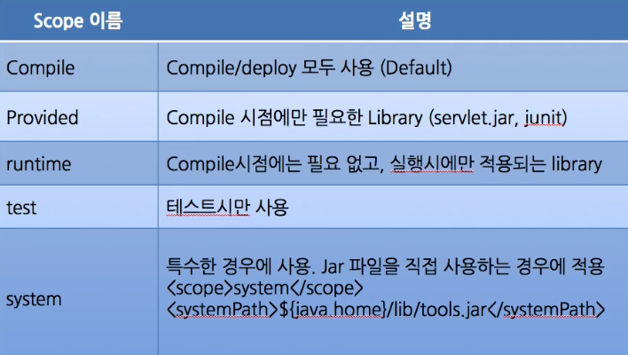
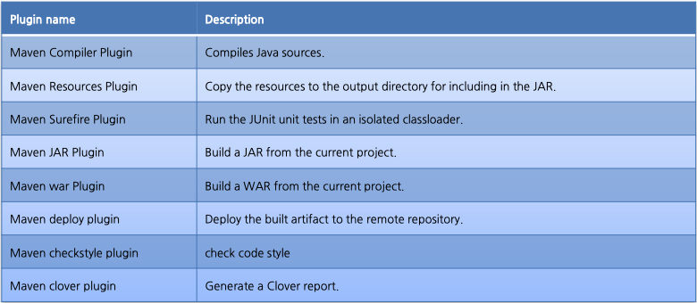

# Maven 시작하기

## **소개**

- Maven이란?: 빌드 툴
- 빌드란?: 아래의 4가지 과정이 존재한다.
    - 컴파일: java코드를 JVM에 올려서 인터프리터가 이해할 수 있는 수준으로 바이너리로 바꿔주는 과정
    - 테스트: 소스코드 컴파일 -> 테스트 코드 컴파일 -> 테스트 실행
    - 패키징: jar나 war 같은 형식으로 압축
    - 배포: 패키징한 것을 remote 저장소에 배포
        - 일반적으로 배포 기능은 안쓰고 Jenkins 같은 외부 툴 사용
- Maven 설정 디렉토리 구조(Java web project)
    - `pom.xml`: maven 설정이 포함되어 있다.
    - `/src/main/java`: java source code
    - `/src/main/resources`: 배포할 환경 설정 파일(xml, properties)
    - `/src/main/webapp`: 웹자원 (JSP, JS, CSS 등)
    - `/src/test/java`: test source code
    - `/src/test/resource`: test 환경의 설정 파일
    - `/target`: 컴파일 된 결과물이 저장되는 경로
    - 프로젝트마다 구조가 조금씩 다를 수 있다.
- 빌드 툴 종류
    - Ant
        - 최근에 거의 사용하지 않음
        - 디테일하게 설정 가능
        - 사용하는 라이브러리를 모두 다 가지고 있어야된다.
        - 설정 파일: build.xml
    - Maven
        - 사내 90% 정도가 사용
        - dependency 관리가 편리하다.
    - Gradle
        - Groovy를 이용해서 빌드할 수 있다.
        - Maven과 기능이 매우 유사함

## **환경 구성**

- 버전 확인
    - maven이 사용하고 있는 java 버전도 확인 가능하다.
        - java 버전 변경 방법 2가지
            - maven이 확인 하는 환경 변수인 JAVA_HOME 값 변경하기(권장)
            - 직접 maven 설정 파일 변경하기
        - 프로젝트마다 pom.xml에 빌드 시 사용할 java 버전을 지정할 수도 있다.
- 실무에서 발생하는 문제
    - 프로젝트마다 사용하는 maven 버전이 다르기 때문에 maven을 여러 개 설치하는 경우가 있다.
        - 설치되어 있는 경로를 직접 지정하여 특정 버전의 maven으로 빌드 해야된다.
    - maven 버전은 동일한데 java 버전이 다를 수도 있음
        - pom.xml 활용
    - 일부 PC에서 빌드가 안된다면?
        - maven 버전 확인 필요

## **빌드**

- 빌드 단계
- 라이프 사이클
    - 어떤 명령어를 실행하면 위 phase부터 순서대로 실행된다.
        - 예: install을 실행시키면
            - process-resources -> compile -> process-test-resources -> test-compile -> test -> package -> install
        - 이전 phase에서 실패하면 다음 phase는 실행하지 않는다.
    - 이미 진행했던 phase를 다시 호출하면 기존에 있던 결과물을 재활용하는 경우가 있다. 이를 깨끗하게 다시 시직하려면 clean을 해야된다.
- 아래 사진에서 `mvn clean package`를 제외하고는 같은 동작을 한다.
- test를 제외시키고 싶은 경우`Dmaven.test.skip=true`
- 빌드 실패하면 error message를 자세히 보자
    - error 메시지에 모든게 다 나온다.
    - `e` 옵션을 주면 더욱더 자세하게 에러를 출력해줌
- IDE(eclipse)상에서 배포하는 건 위험하다.
    - ex) clover plugin을 사용할 경우 테스트 커버리지를 확인하기 위해 우리가 작성한 코드 사이에 커버리지 측정 코드가 추가된다. IDE로 배포를 하게 되면 이 추가된 코드도 포함되어서 배포가 되어버린다.
    - 이 때문에 배포 환경에서 불필요한 CPU나 메모리 사용이 발생할 수 있다.
- IDE를 사용하면 background로 자동 build를 해주는 경우가 있다.
    - eclipse에서는 이 주기가 너무 짧아서 가능하면 끄는 것이 좋다.
- maven으로 빌드할 때 사용한 java 버전이상으로 결과물을 실행시켜야 한다.

## **기능**

- repository
    - `pom.xml` 만 가지고 있으면, 거기에 적혀있는 라이브러리와 플러그인을 로컬 PC로 가져온다.
    - 그렇기때문에 라이브러리와 플러그인을 프로젝트 구조에 위치할 필요가 없다.
    - 버전이 변경 될때마다 파일을 복사할 필요 없이 버전 명만 수정하면된다.
    - 로컬 저장된 파일이 있는지 먼저 찾고 remote 서버에서 파일을 가져온다.
    - 종류
        - repository: artifact(빌드된 결과물) download 받는 주소
        - plug repository: plugin(maven 내의 기능 수행) download 받는 주소
        - distribution management: deploy할 때 사용되는 주소
- local repository
    - 경로: `~/.m2`
    - 한번 다운로드 받으면 재활용 한다.
        - 단 옵션을 추가하여 매번 새롭게 다운 가능
    - local repository 파일이 잘못되면 계속 잘못된 파일 사용함.
        - clean 명령을 사용해도 다운로드 파일을 지우는 것은 아니기 때문에 계속 문제가 발생
        - `~/.m2` 경로에서 직접 파일 삭제 후 재설치
    - local repisotry에 배포하려면 install 명령어
    - local repository를 삭제한 경우 딱히 문제가 발생하지 않는다. 새로 파일들 다운로드 받으면 된다.
- remote repository
    - 한번 배포한 것은 다시 repository에 재배포 가능
    - 그러나 다른 사람이 다운로드 받아간 것은 관리자가 임의로 조작 불가.
    - 문제가 있는 버전을 배포 했을 경우
        - 버전을 하나 올려서 패치
        - 공지 "다시 업로드 했으니 다시 받아주세요"
- 설정 파일 위치
    - `~/.m2/settings.xml`
- 의존성 관리
    - 2개의 dependency에서 버전만 다르고 공통적으로 사용되는 라이브러리가 있다면 maven이 알아서 적절히 선택하게 된다. 이것 또한 maven 기능 중 하나.
    - maven이 의존성 관리를 해준다.
        - 필요한 의존성 추가
        - 추이 의존성 추가
        - 추이 의존성 중 불필요한 의존성 제거
        - 의존성 스코프 관리
            - 의존성이 필요한 시기(컴파일 타임, 런타임)
            - 의존성에서 필요한 디테일한 설정
    - 가장 좋은 의존 관계 구조는 트리 구조

### 설정

- 상속 구조를 가진다.
    - 아무것도 설정되어 있지 않은 `pom.xml` 도 사실 여러 설정을 상속 받고 있는 상태다.
    - 실제로 설정되어 있는 내용을 보려면 IDE에서 effective POM 창을 열면 볼 수 있다.
- xml 선언
    - project: maven 스키마 정의.
        - 이 xml파일은 maven 설정 파일이라는 것을 나타냄.
        - maven 설정 파일에 필요한 태그들이 정의되어 있음.
    - modelVersion: 현재 설정 파일의 버전
- 프로젝트 식별자: groupId, artifactId, version
    - groupId
        - 그룹, 회사, 팀, 조직, 프로젝트 또는 다른 그룹을 나타냄
        - 관례상 그룹 식별자는 프로젝트를 생성한 조직의 도메인 명을 java의 패키지 명처럼 거꾸로 표기하는 것이다.
    - artifactId:
        - groupId의 하위에 존재하는 각각의 프로젝트를 표현하는 식별자
    - version
        - 프로젝트의 특정한 배포(release)를 나타낸다. 프로젝트가 릴리즈 되었을 때 확정된 버전이 부여된다.
        - 이 버전을 바탕으로 구성된 식별자를 통하여 프로젝트의 특정 버전을 지칭할 수 있게 된다.
        - 프로젝트의 개발이 계속 진행중이라면 SNAPSHOT과 같이 버전으로 표기된 특별한 식별자를 사용하여 프로젝트의 버전을 구분할 수 있다.
        - ex) ver 1.4.8
            - 1: 메이저 버전(호환성에 차이가 존재할 수 있음)
            - 4: 마이너 버전(큰 변화는 아니지만 기능의 변경)
            - 8: hot fix나 bug fix
        - 회사 이름이 바뀌었을 때, groupId 변경은 신중히 고민해야된다. groupId만 변경되어도 전혀 다른 프로젝트라고 인식하기 때문이다.
        - artifact id에 구분자들 둘거면 '-'로 구분한다.
- repository
    - 어떤 maven의 repository를 바라볼것인가를 설정
    - 따로 설정하지 않아도 `pom.xml`에서 기본으로 상속받는 repository가 존재한다.
        - repository서버가 사라져서 더 이상 라이브러리를 다운받지 못 할 경우
            - 로컬에 있는 라이브러리를 사내 repository에 올린다.
- dependency
    - 필요한 의존성 추가
    - 추이 의존성 중 불필요한 의존성 제거
    - 의존성 스코프 관리
        - 컴파일
        - 런타임
        - 테스트
- dependency tree 보기
  
    ```
    mvn dependency:tree
    ```
    
- maven의 dependency 관리를 해주지 않으면?
    - 사용하는 모든 라이브러리도 직접 확인
    - 직접 다운로드
    - 프로젝트 패키지 구조에 포함 시켜야함
    - 만약 파일 전달 시 한번 문제가 되면 항상 문제가 전파도미
- dependency 충돌 시 우선 순위: 선언 순서만 달라져도 최종 사용하는 라이브러리의 버전이 달라질 수 있다
    - depth가 더 낮은 곳에 선언된 것이 우선
    - 먼저 선언된 것이 우선
    - 직접 선언된 것이 우선
- dependency 위험성을 최소화 하려면
    - 참고를 하고싶다면 필요한 것만 복사
    - 가져오더라도 최신 버전인지 확인
    - 의존성 스코프 관리
        - provided: 컴파일 시점에 필요하지만, provided로 설정한 의존성에 대해서는 runtime 시점에 JDK 또는 컨테이너가 제공한다.
    
    
    
    - 실제 서비스에서
        - runtime: JDBC 드라이버
        - test: 테스트 관련 설정
        - provided: servlet(웹 컨테이너가 제공해주기 때문), java 제공 라이브러리, 사내 라이브러리
        - system: 듣보잡 쓸때, 비추!
- plugin
    - maven이 어떤 기능을 수행할 때, 각각의 기능은 plugin 형태로 제공된다.
    - 플러그인의 종류
      
        
    
- profile
    - 각각의 다른 환경에 맞는 각 빌드를 커스터마이징 할 수 있는 기능을 제공한다.
    - 환경: local, dev, alpha, beta, real
    - 왼쪽처럼 각 프로필에 대한 태그를 정의를 할수 있고, 오른쪽처럼 프로필에서 지정해둔 태그 값을 사용할 수 있다.
    - 특정 profile에서만 특정 plugin을 실행하도록 정의도 가능하다.
- properties
    - Java의 변수라고 생각하면 된다.
    - 설정 파일에서 발생하는 중복 설정을 제거하기 위해서 properties를 정의하고 설정 파일 전체에서 사용할 수 있다.
    - 주로 사용하는 곳
        - dependency 버전이 중복될 떄
        - JDK version
        - etc
- source code 연동
    - dependency를 걸어두어도, 실제로는 jvm에서 실행할 수 있는 바이트코드를 가져오기 때문에 내부 코드를 확인하는 것이 불가능하다.
    - IDE를 통해 source 연동을 통해서 java 소스코드를 볼 수 있도록 만들 수 있다.

## **기타**

- multi proejct
    - 프로젝트가 클 경우 모듈, 기능별로 프로젝트를 분리해야된다.
    - 상위 프로젝트에 dependency를 추가하면, 공통 dependency를 쉽게 관리할 수 있다.
    - `dependencyManagement` 태그
        - 상위 프로젝트에 `dependency`태그로 의존성을 추가해 둔 경우 자식 모듈이 상위 모듈을 지정하면 항상 가져간다.
        - `dependencyManagement`태그로 의존성을 추가해 둔 경우는 자식 모듈의 `dependency`태그에 의존성을 추가하면 버전은 부모에게 상속받는다.