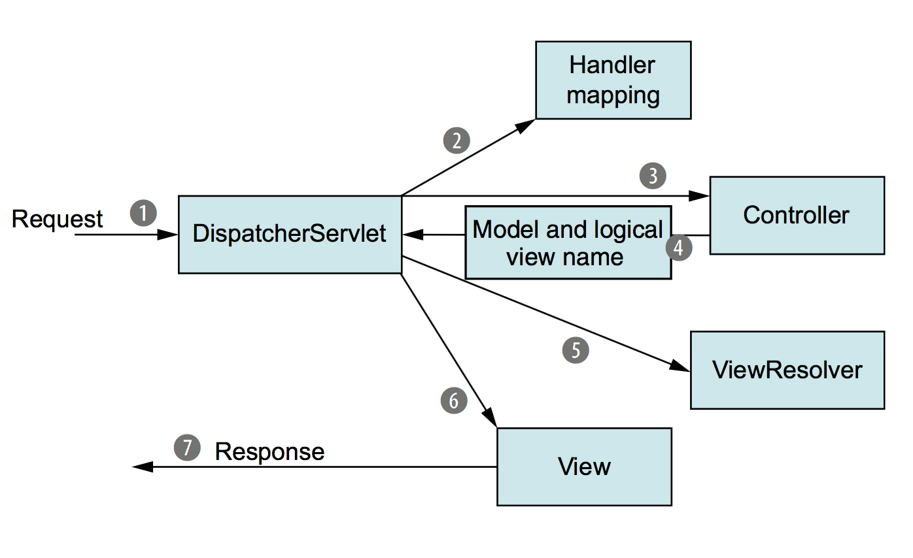

# Spring MVC 동작 과정

### 스프링 @MVC

- 스프링은 DispatcherServlet과 7가지 전략을 기반으로 한 MVC 프레임워크를 제공한다.
- 애노테이션을 중심으로 한 새로운 MVC의 확장 기능은 @MVC라는 별칭으로도 불린다.

### 스프링 웹 기술과 스프링 MVC

- 엔터프라이즈 애플리케이션의 가장 앞단에서 클라이언트 시스템과 연동하는 책임을 맡고 있는 것이 웹 프레젠테이션 계층이다. Java의 웹 프레젠테이션 계층의 기술과 프레임워크는 매우 다양하여 선택의 폭이 넓다.
- 스프링은 기본적으로 웹 계층과 다른 계층을 깔끔하게 분리해서 스프링 애플리케이션이지만 웹 계층을 다른 기술로 대체하더라도 아무런 문제가 없게 만들 수 있다. 물론 스프링 자신도 최고의 웹 기술과 웸 프레임워크를 제공하고 있다.
- 스프링은 서블릿 웹 애플리케이션의 컨텍스트를 두 가지로 분리해놓았다. **스프링 웹 서블릿 컨텍스트를 통째로 다른 기술**로 대체할 수 있도록 하기위해서다.
    - 루트 애플리케이션 컨텍스트: 웹 기술에서 완전히 독립적인 비즈니스 서비스 계층과 데이터 엑세스 계층을 담고 있다.
    - 서블릿 애플리케이션 컨텍스트: 스프링 웹 기술을 기반으로 동작하는 웹 관련 빈을 담고 있다.

### 스프링 MVC와 DispatcherServlet 전략

- 스프링은 유연성과 확장성에 중점을 두고 어떤 종류의 시스템 개발이나 환경, 요구조건에도 잘 들어맞도록 재구성할 수 있는 범용적 프레임워크다. 따라서 계층과 기술이 서로의 내부를 잘 알고 강하게 결합되는 것을 극도로 꺼린다.
- 스프링의 웹 기술에도 동일하게 적용된다. 스프링은 특정 기술이나 방식에 매이지 않으면서 웹 프레젠테이션 계층의 각종 기술을 조합, 확장해서 사용할 수 있는 웹 애플리케이션 개발의 기본 틀을 제공해준다.
- 스프링 웹 기술의 핵심이자 기반이 되는 것은 DispatcherServlet이다. 이 서블릿은 스프링의 웹 기술을 구성하는 다양한 전략을 DI로 구성해서 확장하도록 만들어진 스프링 서블릿/MVC의 엔진과 같은 역할을 한다.

### DispatcherServlet과 MVC 아키텍처

- Spring의 MVC 아키텍처는 보통 front controller 패턴과 함께 사용된다. 프론트 컨트롤러 패턴은 중앙집중형 컨트롤러를 프레젠테이션 계층의 제일 앞에 둬서 서버로 들어오는 모든 요청을 먼저 받아서 처리하게 만드는 패턴을 말한다.
- DispatcherServlet이 프론트 컨트롤러다.



1. DispatcherServlet의 HTTP 요청 접수
   자바 서버의 서블릿 컨테이너는 HTTP 프로토콜을 통해 들어오는 요청이 스프링의 DispatcherServlet에 할당된 것이라면 HTTP 요청정보를  DispatcherServlet에 전달해준다. web.xml에 DispatcherServlet이 전달 받을 URL의 패턴이 정의되어 있다. 이 서블릿-매핑은 URL이 /app로 시작하는 모든 요청을 스프링의 프론트 컨트롤러인 DispatcherServlet에게 할당해주는 것이다.
   DispatcherServlet은 모든 요청에 공통적으로 진행해야 하는 전처리 작업이 등록된 것이 있다면 이를 먼저 수행한다. 보안이나 파라미터 조작, 한글 디코딩과 같은 작업이 있다.
   
    ```xml
    <servlet-mapping>
    	<servlet-name>Spring MVC Dispatcher Servlet</servlet-name>
    	<url-pattern>/app/*</url-pattern>
    </servlet-mapping>
    ```
   

2-3. DispatcherServlet에서 컨트롤러로 HTTP 요청 위임

DispatcherServlet은 URL이나 파라미터 정보, HTTP 명령 등을 참고로 해서 어떤 컨트롤러에게 작업을 위힘할지 결정한다. 컨트롤러를 선정하는 것은 DispatcherServlet의 핸들러 매핑 전략을 이용한다. 스프링에서는 웹의 요청을 handle 하는 오브젝트라는 의미로 컨트롤러를 핸들러라고도 부른다.
DispatcherServlet이 매핑으로 찾은 컨트롤러는 특정 인터페이스를 구현할 필요없이 메소드를 어떻게 호출할지 알고있다. 오브젝트 어댑터를 사용해서, 특정 컨트롤러를 호출해야 할 때는  해당 컨트롤러 타입을 지원하는 어댑터를 중간에 껴서 호출하는 것이다.
DispatcherServlet이 핸들러 어댑터에 요청을 전달할 때는 모든 웹 요청 정보가 담긴 HttpServletRequest 타입의 오브젝트를 전달해준다. 이를 어댑터가 적절히 변환하여 컨트롤러의 메소드가 받을 수 있는 파라미터로 변환해서 전달해주는 것이다. HttpServletResponse도 같이 전달해준다. 가끔씩 컨트롤러가 결과를 리턴값으로 돌려주는 대신 HttpServletResponse 오브젝트 안에 직접 집어넣을 수도 있기 때문이다.

4. 컨트롤러의 모델 생성과 정보 등록

컨트롤러는 먼저 사용자 요청을 해석하고, 그에 따라 실제 비즈니스 로직을 수행하도록 서비스 계층 오브젝트에게 작업을 위임한 뒤, 결과를 받아서 모델을 생성한 뒤, 마지막으로 어떤 뷰를 사용할지 결정한다. 컨트롤러는 DispatcherServlet에 모델과 뷰를 돌려준다. 모델은 보통 맵에 담긴 정보라고 생각하면된다.

5-6. 컨트롤러의 결과 리턴: 모델과 뷰

컨트롤러가 뷰 오브젝트를 직접 리턴할 수도 있지만, 보통은 뷰의 논리적인 이름을 리턴해주면 DispatcherServlet의 전략인 뷰 리졸버가 이를 이용해 뷰 오브젝트를 생성한다. 대표적으로 사용되는 뷰는 JSP, 엑셀, PDF, JSON 등이 있다. 따라서 컨트롤러가 리턴해주는 정보는 결국 모델과 뷰 두 가지다. 스프링에는 ModelAndView라는 이름의 오브젝트가 있는데, 이를 ModelAndView가 DispatcherServlet이 최종적으로 어댑터를 통해 컨트롤러로부터 돌려받는 오브젝트다. 뷰 작업을 통한 최종 결과물은 HttpServletResponse 오브젝트 안에 담긴다.

6. HTTP 응답 돌려주기

뷰 생성까지 모든 작업을 마쳤으면 DispatcherServlet은 등록된 후처리기가 있는지 확인하고, 있다면 후처리기에서 후속 작업을 진행한 뒤에 뷰가 만들어준 HttpServletResponse에 담긴 최종 결과를 서블릿 컨테이너에 돌려준다. 서블릿 컨테이너는 HttpServletResponse에 담긴 정보를 HTTP 응답으로 만들어 사용자의 브라우저나 클라이언트에게 전송하고 작업을 종료한다.

### DispatcherServlet의 DI 가능한 전략

앞에서 핸들러 매핑과 뷰 리졸버를 전략이라고 불렀다. 그 이유는 DispatcherServlet에 DI로 확장이 가능한 전략이기 때문이다. 이외에도 다양한 방식으로 DispatcherServlet에 동작방식과 기능을 확장, 변경할 수 있는 전략이 존재한다. 스프링 MVC는 자주 사용되는 전략을 디폴트로 설정해두고 있다. 필요한 전략만 확장해서 사용하고 나머지는 디폴트 전략을 이용해도 된다.

- HandlerMapping
URL과 요청 정보를 기준으로 어떤 컨트롤러를 사용할지 결정한다. `HandlerMapping` 인터페이스를 구현해서 만들 수 있다. 디폴트로는 `BeanNameUrlHandlerMapping`과 `RequestMappingHandlerMapping`이 있다. `BeanNameUrlHandlerMapping`은 URL을 빈 이름이 매핑시켜 컨트롤러를 선택한다. `RequestMappingHandlerMapping`은 `@Controller` 와 `@RequestMapping` 를 통해 정의된 컨트롤러를 선택한다.
- HandlerAdapter
핸들러 매핑으로 선택한 컨트롤러를 DispatcherServlet이 호출할 때 사용하는 어댑터다. 디폴트로 등록되어 있는 핸들러 어댑터는 `HttpRequestHandlerAdapter`, `SimpleControllerHandlerAdapter`, `RequestMappingHandlerAdapter`가 있다. `HttpRequestHandlerAdapter`, `SimpleControllerHandlerAdapter`는 각각 `HttpRequestHandler` 인터페이스와 `Controller` 인터페이스를 위한 어댑터다. `RequestMappingHandlerAdapter`는 `@RequestMapping`를 위한 어댑터다.
- HandlerExceptionResolver
예외가 발생했을 때 이를 처리하는 로직은 가진 전략이다. 예외가 발생했을 때 처리는 개발 컨트롤러가 아니라 DispatcherServlet에서 처리해야 한다. DispatcherServlet은 등록된 HandlerExceptionResolver 중에서 발생한 예외에 적합한 것을 찾아서 예외를 처리한다. 디폴트 전략은 `ExceptionHandlerExceptionResolver`, `ResponseStatusExceptionResolver`, and `DefaultHandlerExceptionResolver`가 있다. `ExceptionHandlerExceptionResolver`는 `@ExceptionHandler`애노테이션을 통해 예외를 처리할 수 있게해준다. `ResponseStatusExceptionResolver`는 예외를 HTTP 상태 코드에 매핑시켜준다. `DefaultHandlerExceptionResolver`는 스프링 MVC의 표준 예외를 미리 지정해둔 HTTP 상태 코드로 변환 시켜준다.
- ViewResolver
컨트롤러가 리턴한 뷰 이름을 참고해서 적절한 뷰 오브젝트를 찾아주는 전략이다. 디폴트 전략은 `InternalResourceViewResolver`이다. 이는 JSP나 서블릿 같이 RequestDispatcher에 의해 포워딩될 수 있는 리소스를 뷰로 사용하게 해준다.
- LocaleResolver
지역 정보를 결정해주는 전략이다. 디폴트 전략인 `AcceptHeaderLocaleResolver`는 HTTP 헤더의 정보를 보고 지역정보를 설정해준다.
- ThemeResolver
테마를 가지고 이를 변경해서 사이트를 구성할 경우 쓸 수 있는 테마 정보를 결정해주는 전략이다. 디폴트 전략인 `FixedThemeResolver`는 고정된 테마를 사용하게 한다.
- RequestToViewNameTranslator
컴트롤러에서 뷰 이름이나 뷰 오브젝트를 제공해주지 않았을 경우 URL과 같은 요청정보를 참고해서 자동으로 뷰 이름을 생성해주는 전략이다. 디폴트 전략은 `DefaultRequestToViewNameTranslator`이다.

## 참고 자료

[https://www.baeldung.com/spring-handler-mappings](https://www.baeldung.com/spring-handler-mappings)

[https://docs.spring.io/spring-framework/docs/current/javadoc-api/org/springframework/web/servlet/DispatcherServlet.html](https://docs.spring.io/spring-framework/docs/current/javadoc-api/org/springframework/web/servlet/DispatcherServlet.html)

토비의 스프링 3.1 (이일민)