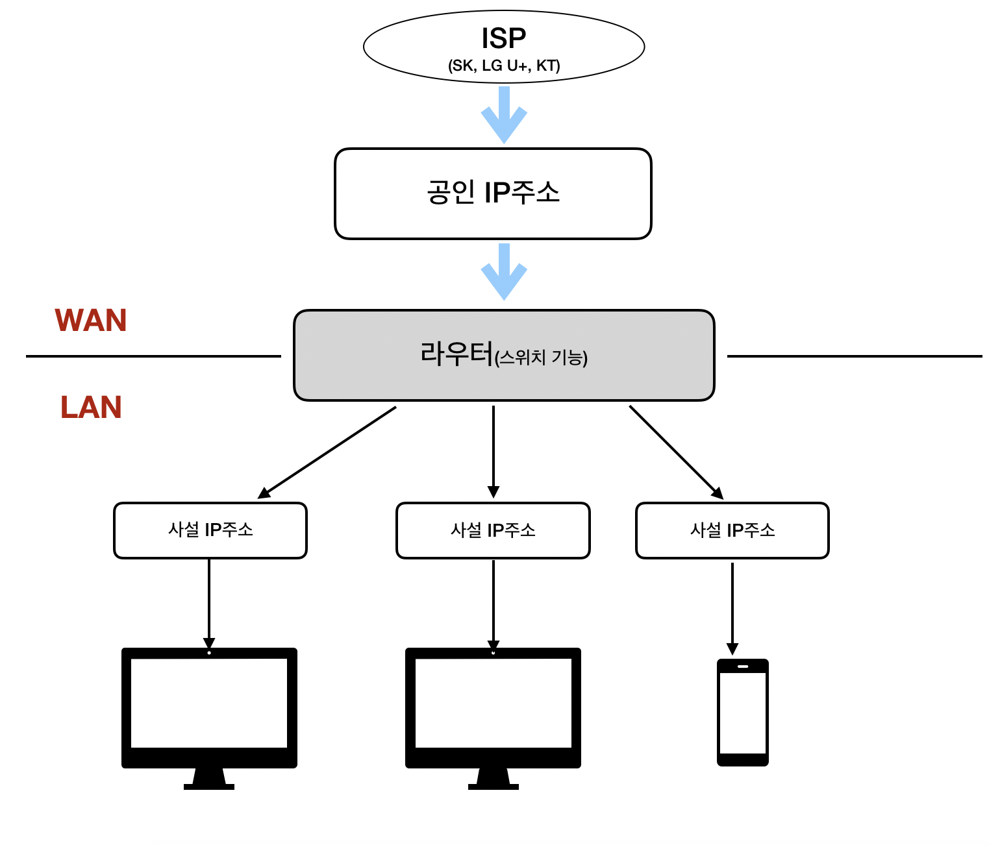

---
tags:
  - 도서/모두의-네트워크
title: 5-네트워크 계층 목적지에 데이터 전달하기
---

## 네트워크 계층의 역할

- 네트워크 계층은 네트워크 간의 통신을 가능하게 해준다.
- 네트워크 계층을 통해 다른 네트워크로 데이터를 전송하려면 라우터라는 네트워크 장비가 필요하다.
    - 라우터는 데이터의 목적지가 정해지면 해당 목적지까지 어떤 경로로 가는 것이 좋은지 알려주는 기능을 한다. 이를 라우팅이라고 한다.
    - 라우터는 라우팅 테이블이 있어서 경로 정보를 등록하고 관리한다.
- 네트워크 계층에서는 목적지 주소를 IP주소로 표현한다.
    - IP주소는 어떤 네트워크의 어떤 컴퓨터인지 구분할 수 있도록 해준다.
- 네트워크 계층에는 IP(Internet Protocol)라는 프로토콜이 있다.
    - 네트워크 계층에서 캡슐화할 때 IP 헤더를 붙인다. 여러 헤더 정보가 많지만 중요한 것은, 출발지 IP 주소와 목적지 IP 주소가 포함된다.
    - 이렇게 캡슐화된 것을 IP 패킷이라고 부른다.

## IP 주소의 구조

- IP 주소는 ISP에게 받을 수 있다.
- IP 버전에는 IPv4와 IPv6가 있다.
    - IPv4는 32비트 주소이다.
    - 이후에 IPv4의 주소로는 부족해져서 128비트인 IPv6를 도입했다.
- IP 주소에는 공인 IP 주소와 사설 IP 주소가 있다.
    - 인터넷에 직접 연결되는 컴퓨터나 라우터에는 공인 IP 주소가 할당된다.
    - 회사나 가정의 랜에 있는 컴퓨터는 사설 IP 주소가 할당된다.
    - 랜 안에 있는 컴퓨터가 모두 공인 IP 주소를 할당하면 IP 주소가 쉽게 부족해지므로 이를 해결하기 위해서 공인 IP주소는 라우터에만 할당하고 랜 안에 있는 컴퓨터에게는 사설 IP 주소를 할당하거나 라우터의 DHCP 기능을 사용하여 주소를 자동으로 할당하게한다.
      

        

    
- IPv4의 경우는 보통 8비트씩 끊어서 읽는다.
- IP 주소는 네트워크 ID와 호스트 ID로 나눠져있다.
    - 네트워크 ID는 어떤 네트워크인지를 나타낸다.
    - 호스트 ID는 해당 네트워크의 어떤 컴퓨터인지를 나타낸다.

## IP 주소의 클래스 구조

- IP 주소는 네트워크의 규모에 따라 A ~ E 클래스로 나누어져 있다.
    - A 클래스: 대규모 네트워크 주소
    - B 클래스: 중형 네트워크 주소
    - C 클래스: 소규모 네트워크 주소
    - D 클래스: 멀티캐스트 주소
    - E 클래스: 연구 및 특수용도 주소
- IPv4는 네트워크 ID와 호스트 ID에 해당하는 비트 길이를 조정할 수 있다. 이 네트워크 크기를 클래스라는 개념으로 구분하고 있다.
  

    

    
    - 각 클래스마다 사설 IP 주소의 범위가 따로 존재한다.
        - A 클래스: 10.0.0.0 ~ 10.255.255.255
        - B 클래스: 172.16.0.0 ~ 172.31.255.255
        - C 클래스: 192.168.0.0 ~ 192.168.255.255

## 네트워크 주소와 브로드캐스트 주소의 구조

- 브로드캐스트: IP 네트워크에 있는 모든 호스트로 데이터를 전송하는 방식이다.
- 멀티캐스트: 한 호스트에서 패킷을 여러 컴퓨터로 동시에 전송하는 것이다.
- IP 주소에는 네트워크 주소와 브로드캐스트 주소라는 특별한 주소가 있다.
    - 이 주소는 컴퓨터나 라우터가 자신의 IP로 사용하면 안된다.
    - 네트워크 주소: 전체 네트워크에서 작은 네트워크를 식별하는 데 사용한다.
    - 브로드캐스트 주소: 네트워크에 있는 컴퓨터나 장비 모두에게 한 번에 데이터를 전송하는데 사용한다.
- C 클래스의 경우
    - 호스트 ID가 10진수로 0(2진수로 00000000)이면 네트워크 주소.
    - 호스트 ID가 10진수로 255(2진수로 11111111)이면 브로드캐스트 주소.

## 서브넷의 구조

- 네트워크를 작은 네트워크로 분할하는 것을 서브네팅이라고 한다. 분할된 네트워크를 서브넷이라고 한다.
- IP의 호스트 ID 부분을 빌려 서브넷으로 만들 수 있다.
    - 그러면, IP는 네트워크 ID, 서브넷 ID, 호스트 ID로 나뉜다.
- 네트워크 ID와 호스트 ID를 식별하기 위해 서브넷 마스크라고 한다.
    - A 클래스: 255.0.0.0
    - B 클래스: 255.255.0.0
    - C 클래스: 255.255.255.0
- 서브넷 마스크를 슬래스로 나타내는 것을 프리픽스 표기법이라고 부른다.
    - 255.255.255.0 은 /24가 된다.
- C 클래스의 네트워크 ID를 28비트로 변경하면
    - 서브넷 마스크 255.255.240
    - 프리픽스 표기법 /28

## 라우터의 구조

- 라우터는 네트워크를 분리할 수 있다.
- 스위치와 허브는 네트워크를 분리할 수 없다.
- 컴퓨터 한 대가 다른 네트워크로 접속하려면 네트워크의 출입구를 설정해야된다.
    - 이를 위해서 라우터의 IP를 설정해야된다.
    - 이렇게 네트워크의 출입구를 기본 게이트웨이라고 부른다.
- 라우팅은 경로 정보를 기반으로 현재 네트워크에서 다른 네트워크로 최적의 경로를 통해 데이터를 전송한다.
    - 이 경로 정보가 등록되어 있는 테이블을 라우팅 테이블이라고 부른다.
    - 라우팅 테이블은 수동으로 등록하는 방법(정적 라우팅)과 자동으로 등록하는 방법(동적 라우팅)이있다.
        - 대규모 네트워크에서는 정보를 하나하나 라우터에 등록하기 힘들기 때문에 동적 라우팅을 사용한다.
        - 동적 라우팅은 라우터 간에 경로 정보를 서로 교환하여 라우팅 테이블 정보를 자동으로 수정해준다.
        - 라우터 간에 라우팅 정보를 교환하기 위한 프로토콜로 라우팅 프로토콜이 있다. 대표적으로 RIP, OSPF, BGP 등이 있다.
        - 정적 라우팅은 라우팅 정보가 교환되지 않아 대역폭에 부담이 적다는 장점이 있다. 하지만 어떤 경로에 장애가 발생해도 동적으로 반영되지 않아 우회할 수 없다는 단점이 있다.
