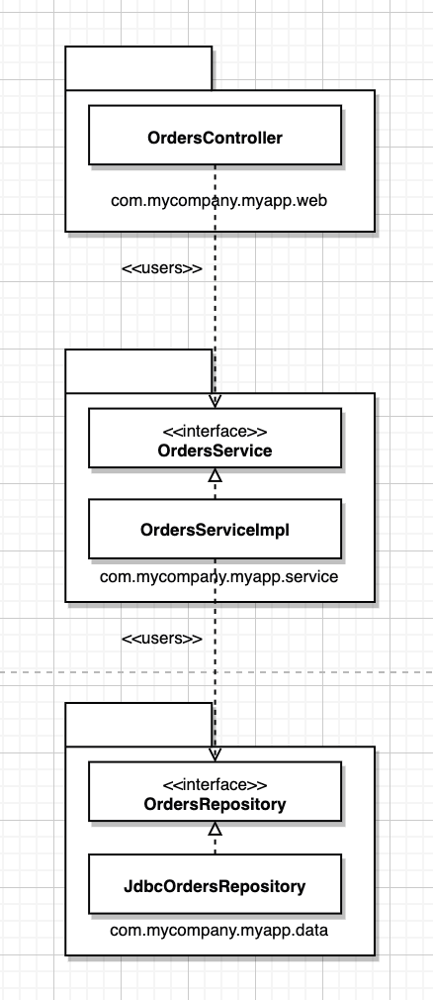
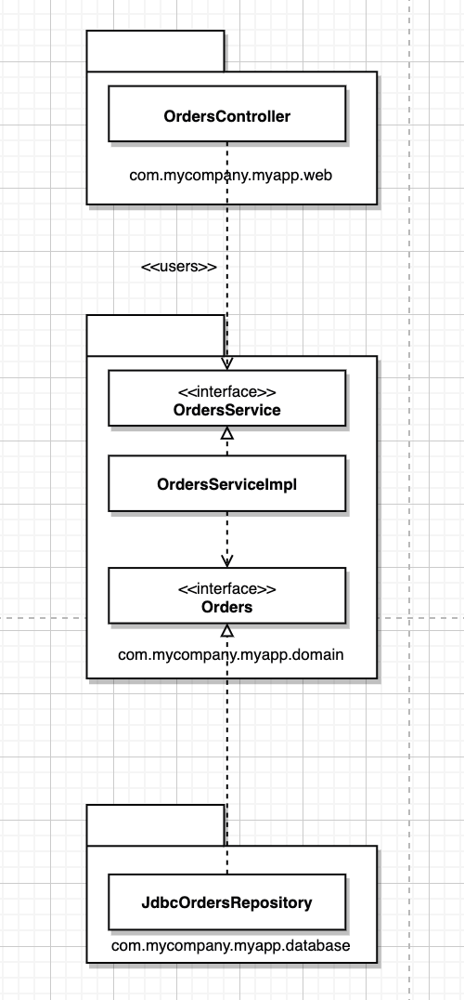

---
tags:
  - 도서/Clean-Architecture
title: 6-세부사항
---


## 데이터베이스는 세부사항이다

* 애플리케이션 내부 데이터의 구조는 시스템 아키텍처에서 대단히 중요하다. 하지만 데이터베이스는 데이터 보델이 아닌 소프트웨어일 뿐이다. 아키텍처 관점에서 이러한 유틸리티닌 저수준의 세부사항일 뿐이라서 아키텍처와는 관련이 없다.
* 데이터베이스 시스템이 우위를 차지할 수 있었던 이유는 디스크 떄문이다. 느린 디스크를 개선하기 위해 색인, 캐시, 쿼리 계획 최적화가 필요했다. 이를 위해ㅅ 데이터 접근 및 관리 시스템이 필요했다.
  * 파일 시스템: 문서 기반. 문서의 이름을 기준으로 조회할 떄는 잘 동작하지만, 내용을 기준으로 검색할 떄는 크게 도움되지 않는다.
  * 데이터베이스 시스템: 내용 기반. 내용을 기반으로 레코드를 자연스럽고 편리하게 찾는 방법을 제공하지만, 정형화되지 않은 문서를 저장하고 검색하는 데는 대체로 부적합하다.
* 디스크가 RAM으로 대체되면, 데이터들을 연결 리스트, 트리, 해시 테이블 ,스택, 큐 등의 데이터 구조로 체계화될 것이다.
* 데이터 저장소의 측면에서 성능은 완전히 캡슐화하여 업무 규칙과는 분리할 수 있는 관심사다.

## 웹은 세부사항이다

* 웹이 유명세를 탄 이래 지난 십여 년 사이에 모든 연산 능력을 중앙 서버에 두는 방식과 모든 연산 능력을 단말에 두는 방식 사이에서 끊임없이 움직여 왔다.
* 하지만 이 진동은 웹이 있기전부터 존재했다. 웹은 IT 역사 전체로 시야를 넓히면 아무것도 바꾸지 않았다.
* 웹은 세부사항으로 핵심 업무 로직에서 분리된 경계 바깥에 두어야 한다.
* UI와 패르리케이션 사이에는 추상화가 가능한 또 다른 경계가 존재한다.
  * 완전한 입력 데이터와 그에 따른 출력 데이터는 데이터 구조로 만들어서 유스케이스를 실행하는 처리 과정의 입력 값과 출력 값으로 사용할 수 있다.

## 프레임워크는 세부사항이다

* 대개의 경우 프레임워크는 그를 중심에 두고 우리의 아키텍처는 그 바깥을 감싸야 한다고 말한다.
* 프레임워크를 중심에 뒀을 때의 위험 요인
  * 프레임워크의 아키텍처는 그다지 깔끔하지 않은 경우가 많다.
    * 프레임워크는 의존성 규칙을 위반하는 경향이 있다.
    * 업무 객체를 만들 떄, 프레임워크 제작자는 자신의 코드를 상속할 것을 요구한다.
  * 제품이 성숙해지면서 프레임워크가 제공하는 기능과 틀을 벗어나게 될 것이다.
  * 프레임워크는 당신에게 도움되지 않는 방향으로 진화할 수도 있다.
  * 새롭고 더 나은 프레임워크가 등장해서 갈아타고 싶을 수도 있다.
* 프레임워크가 아키텍처의 바깥쪽 원에 속하는 세부사항으로 취급하라.
  * 업무 객체를 만들 떄 프레임워크가 자신의 기반 클래스로부터 파생하기를 요구한다면, proxy를 만들고, 업무 규칙에 플러그인할 수 있는 컴포넌트에이들 proxy를 위치시켜라.
  * 프레임워크가 핵심 코드 안으로 들어오지 못하게 하라. 대신 핵심 ㄱ코드에 플러그인할 수 있는 컴포넌트에 프레임워크를 통합하고, 의존성 규칙을 준수하라.

## 사례 연구: 비디오 판매

1. 유스케이스 분석

    * 시스템을 분할하여, 특정 액터를 위한 변경이 다른 액터에게 전혀 영향을 미치지 않게 만들고자 한다.
    * 추상 유스케이스: 범용적인 정책을 담고 있으며, 다른 유스케이스에서 이를 더 구체화한다.

    

2. 컴포넌트 아키텍처
   * 뷰, 프레젠터, 인터랙터, 컨트롤러로 분리된 전형적인 분할방법을 사용할 수 있다.
   * 컴포넌트들을 모두 분할 해서 `.jar`로 만들 수도 있고, 합칠 수도 있다.
   * 각 컴포넌트를 독립적으로 컴파일하고 빌드할 수 있는 환경을 구성하면, 후에 시스템이 변경되는 양사엥 맞춰 시스템 배포 방식을 조정할 수 있다.
3. 의존성 관리
   * 모든 의존성은 항상 더 높은 수준의 정책을 포함하는 컴포넌트를 향한다.
   * 사용 관계는 제어흐름과 같은 방향을 가리키며, 상속 관계는 제어흐름과는 반대 방향을 가리킨다.

## 빠져 있는 장

* 설계나 코드 조직화와 관련된 몇 가지 접근법을 살펴본다.
* 계층 기반 패키지
  * 웹, 업무 규칙, 영속성 코드를 위해 계층이 각각 하나씩 존재한다.
  * 코드는 계층이라는 얇은 수평 조각으로 나뉘며, 각 계층은 유사한 종류의 것들을 묶는 도구로 사용된다.
  * '엄격한 계층형 아키텍처'의 경우 계층은 반드시 바로 아래 계층에만 의존해야 한다.
  * 자바의 경우 계층은 주로 패키지로 구현된다.
  * 계층형 아키텍처는 업무 도메인에 대해 아무것도 말해주지 않는다는 문제도 있다.
  * 
* 기능 기반 패키지
  * 서로 연관된 기능, 도메인 개념, Aggregate Root에 기반하여 수직의 얇은 조각으로 코드를 나누는 방식
  * 상위 수준 구조가 업무 도메인에 대해 무언가 알려주게 된다.
  * 유스케이스가 변경될 경우 변경해야 할 코드를 모두 찾는 작업이 더 쉬워질 수 있다.
  * !\[다운로드 (1)]\(assets/다운로드 (1).png)
* 포트와 어댑터
  * 업무/도메인에 초점을 둔 코드가 프레임워크나 데이터베이스 가은 기술적인 세부 구현과 독립적이며 분리된 아키텍처를 만들기 위해서다.
  * 내부 영역은 도메인 개념을 모두 포함하는 반면, 외부 영역은 외부 세계와의 상호작용을 포함한다.
  * 
* 컴포넌트 기반 패키지
  * 계층형 아키텍처는 속임수를 써서 몇몇 의존성을 의도치 않은 방식으로 추가하더라도, 보기에는 여전히 좋은 비순환 의존성 그래프가 생성된다는 문제점이 있다.

      * 정적 분석 도구를 사용하여 아키텍처적인 위반 사항이 없는지 검사할 수 있지만, 컴파일러를 사용해서 아키텍처를 강제하는 방식을 더 선호한다.

      .png>)

  * 지금까지 우리가 본 모든 것들을 혼합한 것으로, 큰 단위의 단일 컴포넌트와 관련된 모든 책임을 하나의 자바 패키지로 묶는다.

      * 사용자 인터페이스를 큰 단위의 컴포넌트로부터 분리해서 유지한다.
      * 업무 로직과 영속성 관련 코드를 하나로 묶는다. 이를 컴포넌트라고 부른다.
      * 컴포넌트 내부에서 관심사 분리는 여전히 유효하며, 업무 로직은 데이터 영속성과 분리되어 있다.

      ```
      
      ```

* 만약 자바 애플리케이션 모든 타입을 public으로 지정한다면, 패키지는 단순히 조직화를 위한 매커니즘으로 전락하여 캡슐화를 위한 매커니즘이 될 수 없다. public타입을 코드 베이스 어디에서도 사용할 수 있다면 패키지를 사용하는 데 따른 이점이 거의 없다.
  * protected를 사용하여패키지 밖의 코드에서 접근을 제한해야된다.
* 프로그래밍 언어가 제공하는 방법 외에도 소스 코드 의존성을 분리하는 방법이 존재한다.
  * 자바의 OSGi 같은 모듈 프레임워크나 자바 9에서 제공하는 새로운 모듈 시스템
  * 소스 코드 수준에서 의존성을 분리하는 방법.
    * gradle 같은 빌드 도구를 사용해서 모듈이나 프로젝트가 서로 분리되도록 구성해야 한다. 하지만 이는 성능, 복잡성, 유지보수 문제가 생길 수 있다.
    * 더 간단하게 '도메인 코드(내부)', '인프라 코드(외부)'로 나누는 방식도 있지만, 특정 영역에 있는 인프라 코드가 다른 영역에 있는 인프라 코드를 직접 호출 할 수 있는 문제가 있음.
* 결론
  * 고민해야 되는 사항
    * 설계를 어떻게 해야만 원하는 코드 구조로 매핑할 수 있을지
    * 코드를 어떻게 조직화할지
    * 런타임과 컴파일타임에 어떤 결합 분리 모드를 적용할지
  * 수행해야 되는 사항
    * 가능하다면 선택사항을 열어두되, 실용주의적으로 행하라
    * 팀의 규모, 기술 수준, 해결책의 복잡성을 일정과 예산이라는 제약과 동시에 고려하라
    * 선택된 아키텍처 스타일을 강제하는 데 컴파일러의 도움을 받을 수 있을지 고만하며, 데이터 모델과 같은 다른 영역에 결합되지 않도록 주의하라
