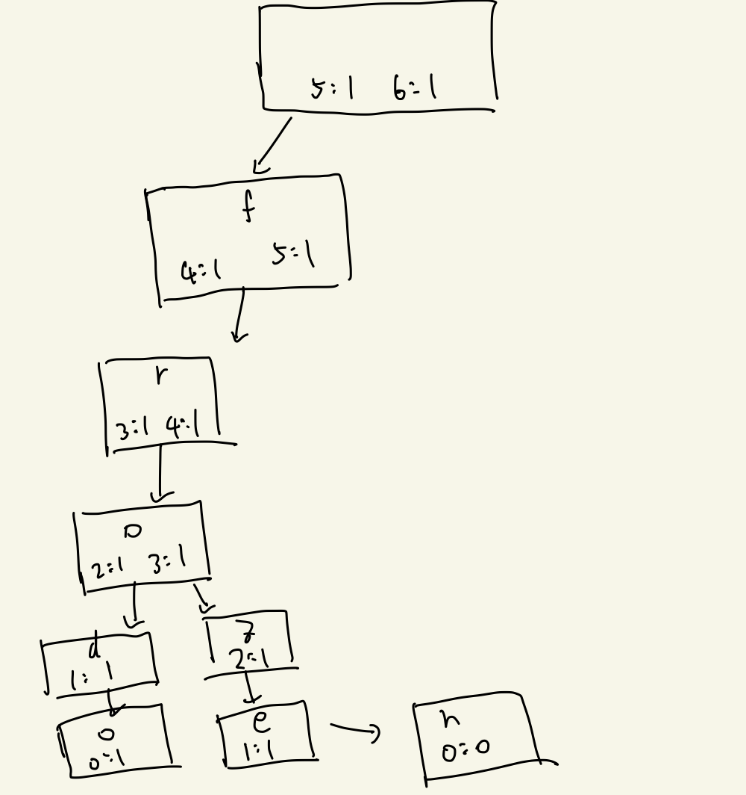

---
tags:
  - 프로그래머스-풀이
---
# 60060

날짜: 2022년 6월 28일 오후 3:52

## 코드

[Algorithm/60060.py at main · Junroot/Algorithm](https://github.com/Junroot/Algorithm/blob/main/programmers/60060.py)

## 풀이

바이너리 서치를 이용해서 문제를 풀었다. words를 정렬한 뒤, 쿼리를 만족하는 word를 lower bound와 upper bound의 차로 개수를 구했다. 쿼리와 단어를 비교하는 법은 아래와 같다.

- 글자 길이가 다른 경우 길이가 더 짧은 것을 작은 값으로 취급
- 글자 길이가 같은 경우 사전순 비교
- 쿼리에 ?가 나온 순간부터 같은 단어로 취급(접미사가 ?인 경우를 고려해서다. 접두사의 경우는 처리하지 않았다.

위 방식대로 하면 접두사에 ?가 붙는 경우의 처리가 이루어지지 않는다. 나같은 경우는 word와 접두사가 ?인 글자를 뒤집어서 바이너리 서치로 찾았다.

## 다른 사람 풀이

트라이를 이용한 방법도 있었다. 트라이를 만들 때, 이후 문자열의 길이별 개수를 기록하여 와일드카드가 있을 때 쉽게 개수를 찾을 수 있도록한다. 접두사에 와일드카드가 있을 경우에는 바이너리 서치 방법과 마찬가지로 단어들을 뒤집은 뒤 만든 트라이로 찾을 수 있다. 아래 사진은 ‘frodo’와 ‘frozen’을 추가했을 때의 트라이 상태다.



```python
class Node(object):
    def __init__(self, length = None):
        self.total_children = {}
        if length != None:
            self.total_children[length] = 1
        self.children = {}

class Trie(object):
    def __init__(self):
        self.head = Node(None)

    def insert(self, s):
        curr_node = self.head
        if len(s) not in curr_node.total_children:
            curr_node.total_children[len(s)] = 1
        else:
            count = curr_node.total_children[len(s)]
            curr_node.total_children[len(s)] = count + 1

        for i in range(0, len(s)):
            suffix_length = len(s) - i - 1
            if s[i] not in curr_node.children:
                curr_node.children[s[i]] = Node(suffix_length)
                curr_node = curr_node.children[s[i]]
            else:
                curr_node = curr_node.children[s[i]]
                if suffix_length not in curr_node.total_children:
                    curr_node.total_children[suffix_length] = 1
                else:
                    count = curr_node.total_children[suffix_length]
                    curr_node.total_children[suffix_length] = count + 1

    def get_count_prefix(self, prefix, count_wildcard):
        curr_node = self.head
        for c in prefix:
            if c not in curr_node.children:
                return 0
            curr_node = curr_node.children[c]

        if count_wildcard not in curr_node.total_children:
            return 0
        else:
            return curr_node.total_children[count_wildcard]

def solution(words, queries):
    answer = []

    # Make trie
    forward_trie = Trie()
    reverse_trie = Trie()
    for word in words:
        forward_trie.insert(word)
        reverse_trie.insert(word[::-1])

    for query in queries:
        if query[-1] == '?':
            count_wildcard = len(query) - query.find('?')
            answer.append(forward_trie.get_count_prefix(query[:-count_wildcard], count_wildcard))
        else:
            count_wildcard = query.rfind('?') + 1
            answer.append(reverse_trie.get_count_prefix(query[count_wildcard:][::-1], count_wildcard))

    return answer
```