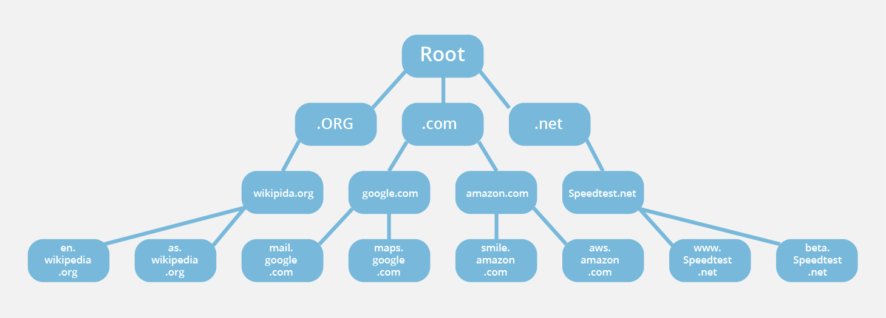

---
tags:
  - 도서/모두의-네트워크
title: 7-응용 계층 애플리케이션에 데이터 전송하기
---

## 응용 계층의 역할

- 서비스를 요청하는 측을 클라이언트, 서비스를 제공하는 측을 서버라고 한다.
- 클라이언트에서 제공하는 애플리케이션과 서버에서 사용하는 서버 프로그램 간에 통신하기 위해 응용 계층의 프로토콜을 사용한다.
- 응용 계층의 주요 프로토콜에는 HTTP, FTP, DNS, SMTP, POP3 등이 있다.

## 웹 서버의 구조 (웹 사이트 접속)

- WWW는 W3나 웹이라고도 불린다.
- WWW는 HTML, URL, HTTP라는 세가지 기술이 사용된다.
- HTML은 하이퍼텍스트를 작성하는 마크업 언어로 태그를 사용하여 문장 구조나 이미지 파일을 표시한다.
- 하이퍼텍스트로는 문장이나 이미지를 표시하거나 하이퍼링크를 사용할 수 있다.
- HTTP: 웹 서비스에서 클라이언트와 웹 서버 간에 정보를 주고받기 위해 사용되는 네트워크 프로토콜이다.
    - HTTP는 80번 포트를 통해 통신한다.
    - 웹 브라우저에서는 HTTP 요청을 보내고, 웹 서버에서는 HTTP 응답을 반환한다.
    - HTTP/1.1 버전부터 keepalive 기능이 있어 데이터를 교환하는 동안 TCP 연결을 유지할 수 있다.
    - HTTP/2 버전부터는 요청을 보낸 순서대로 응답을 반환하지 않아도 된다. 따라서 이전 요청에 대한 처리를 기다릴 필요가 없다.
- FTP: 서버와 클라이언트 간에 파일을 전소앟기 위한 프로토콜이다.
    - 제어 용도로는 21번 포트를 사용한다.
    - 전송 용도로는 20번 포트를 사용한다.

## DNS 서버의 구조 (이름 해석)

- DNS는 URL을 IP 주소로 변환하는 시스템이다.
- DNS 서버가 URL에 해당하는 IP 주소를 알려주는 것을 이름 해석(name resolution)이라고 한다.
- [www.github.com](http://www.github.com) 과 같이 컴퓨터나 네트워크를 식벼랗기 위해 붙여진 이름을 도메인 이름이라고 한다.
- 도메인 이름 앞에 붙는 www는 호스트 이름이라고 한다.
- 웹 브라우저에 URL을 입력하게 되면 웹 사이트의 IP 주소를 알기 위해 DNS 서버에 요청하여 IP 주소를 확인한다.
- DNS 서버는 전 세계에 계층적으로 연결되어 있어서, 자신이 모르는 도메인은 자신의 아래 계층의 DNS 서버에 요청한다.
  

    

    

## 메일 서버의 구조 (SMTP와 POP3)

- 메일을 송수신하려면 SMTP와 POP3 라는 프로토콜을 사용한다.
    - SMTP는 메일을 보내는 데 사용하는 프로토콜로 25번 포트를 사용한다.
    - POP3는 메일을 받는데 사용되는 프로토콜로 110번 포트를 사용한다.
- 클라이언트 → 서버, 서버 → 서버로 메일을 전송할 때 SMTP를 사용한다.
- 클라이언트가 메일 서버로 부터 메일을 가져올 때 POP3를 사용한다.
    - 메일 서버에는 메일 박스라고 메일을 보관 해주는 기능이 있다.
    - POP3를 사용하여 메일을 가져올 떄는 사용자 인증이 필요하다.
