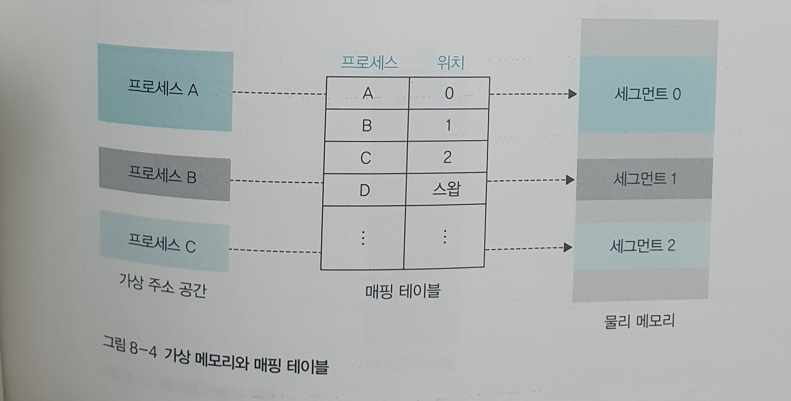
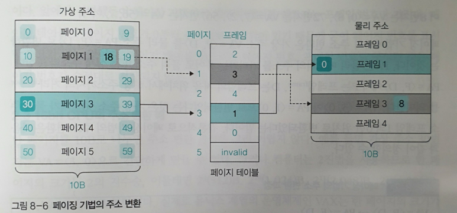

---
tags:
  - 도서/쉽게-배우는-운영체제
title: 8-가상 메모리의 기초
---

## 가상 메모리의 개요

### 가상 메모리 시스템

- 가상 메모리(virtual memory): 크기가 다른 물리 메모리에서 일관되게 프로세스를 실행할 수 있는 기술.
- 가상 메모리 시스템의 모든 프로세스는 물리 메모리와 별개로 0번지부터 시작하는 연속된 메모리 공간을 가진다.
- 논리 주소 vs 가상 주소
    - 논리 주소는 물리 메모리에 존재하는 위치의 주소를 프로세스 관점에서 지정하는 방식이다.
    - 가상 주소는 물리 메모리 공간이 아닌 가상의 주소 공간을 가진다.
- 가상 메모리에서 메모리 관리자가 사용할 수 있는 메모리의 전체 크기는 물리 메모리와 스왑 영역을 합한 크기다.
- 동적 주소 변환(Dynamic Address Translation, DAT): 가상 메모리 시스템에서 메모리 관리자는 프로세스가 사용하는 가상 주소를 실제 메모리의 물리 주소로 변환하는 작업.
- 가상 메모리 분할 방식에도 가변 분할 방식과 고정 분할 방식이 있다.
    - 가변 분할 방식 → 세그먼테이션
    - 고정 분할 방식 → 페이징

### 매핑 테이블의 필요성과 역할

- 가상 메모리 시스템에서 가상 주소는 실제로 물리 주소나 스왑 영역 중 한 곳에 위치하며, 메모리 관리자는 가상 주소와 물리 주소를 일대일 매핑 테이블로 관리한다.
- 페이지 매핑 테이블: 페이징 기법에서 사용하는 매핑 테이블
- 세그먼테이션 매핑 테이블: 세그먼테이션 기법에서 사용하는 매핑 테이블

## 페이징 기법

### 페이징 기법의 구현

- 페이지: 가상 주소의 분할된 각 영역
- 프레임: 물리 메모리의 분할된 각 영역
- 페이지 크기 == 프레임 크기
- 페이지 테이블에 어떤 페이지가 어떤 프레임에 있는지에 대한 연결 정보가 담겨있다.
- 페이지 테이블의 각각의하 줄을 페이지 테이블 엔트리(page table entry, PTE)라고 부른다.
- 모든 페이지의 정보를 순서대로 가지고 있기 때문에 페이지 번호에대한 추가 열은 필요없다.

### 페이징 기법의 주소 변환

- 가상 주소를 VA = <P, D>로 표현한다.
    - P: 페이지.
    - D: 페이지의 처음위치에서 해당 주소까지의 거리(distance). 오프셋(offset)이라고도 한다.
- 물리 주소를 PA = <F, D>로 표현한다.
    - F: 프레임.
    - D: 프레임의 처음위치에서 해당 주소까지의 거리(distance).
- P = (가상 주소) / (한 페이지의 크기)
- D = (가상 주소) % (한 페이지의 크기)
- 페이지 테이블을 확인하여 페이지가 위치한 프레임의 위치를 찾으면 PA를 구할 수 있다.
- 컴퓨터에선 페이지의 크기를 2의 지수승으로 분할하기 때문에, 비트 단위로 페이지의 위치를 구할 수 있다.
  

### 페이지 테이블 관리

- 페이지 테이블 관리의 가장 큰 문제는 페이지 테이블의 크기가 크다는 것이다.
- 페이지 테이블은 물리 메모리의 운영체제 영역에 저장된다.
- 프로세스가 스왑 영역으로 옮겨질 때 페이지 테이블도 함께 옮겨진다.
- 프로세스가 메모리에 접근하려고 할 때 메모리 관리자는 ‘페이지 테이블 베이스 레지스터(Page Table Base Register)’를 이용해서 페이지 테이블의 위치를 빠르게 파악한다.
- 페이지 테이블 베이스 레지스터는 프로세스 제어 블록(PCB)에 저장되어 있다.

### 페이지 테이블 매핑 방식

- 직접 매핑
    - 모든 페이지 테이블을 물리 메모리에 가지고 있는 방식.
    - 장점: 주소 변환 속도가 빠르다.
    - 단점: 페이지 테이블이 메모리의 많은 영역을 차지한다.
    
- 연관 매핑
    - 전체 페이지 테이블을 스왑 영역에 두고 페이지 테이블의 일부를 물리 메모리에 가져온다.
    - 물리 메모리에 일부 페이지만 저장된 테이블을 변환 색인 버퍼(Translation Look-aside Buffer, TLB) 또는 연관 레지스터(associate register)라고 부른다.
    - 변환 색인 버퍼는 일부 내용만 무작위로 배치하기 때문에 페이지 번호와 프레임 번호 둘 다 표기한다.
    - 원하는 페이지 번호가 변환 색인 버퍼이 있는 경우를 TLB 히트, 없는 경우를 TLB 미스라고 부른다.
    - 장점: 일부 페이지만 물리 메모리에 보관하기 때문에 메모리를 절약할 수 있다.
    - 단점1: 모든 변환 색인 범퍼를 검색한 후에야 원하는 페이지가 메모리에 없다는 것을 알 수 있다.
    - 단점2: TLB 미스가 빈번하게 발생할 경우 시스템 성능이 떨어진다.
    
- 집합-연관 매핑
    - 페이지 테이블을 같은 크기의 여러 묶음으로 나누고, 각 묶음의 시작주소를 가진 디렉터리 테이블을 만들어 관리한다.
    - 디렉터리 매핑 또는 멀티페이지 매핑이라고도 부른다.
    - 현재 묶음이 스왑 영역에 있으면 디렉터리 테이블에는 스왑 영역에 있다는 표기를 한다.
    - 디렉터리 테이블에 Invalid 표기가 되어있으면 TLB 미스가 발생한 것이다.
    - 장점1: 연관 매핑과 다르게 TLB 미스를 빠르게 확인할 수 있다.
    - 장점2: 일부 페이지 테이블만 메모리에서 관리하여 물리 메모리를 낭비하지 않는다.
    
- 역매핑
    - 물리 메모리의 프레임 번호를 기준으로 테이블을 작성한다.
    - 역매핑 테이블에는 <PID, 페이지 번호>로 구성되어 있다.
    - 장점: 물리 메모리의 프레임 번호를 기준으로 작성하기 때문에 테이블의 크기가 작다.
    - 단점: 페이지가 스왑 영역에 있는지 확인하기 위해서는 테이블 전체를 검사해야 되기 때문에 느리다.
    

## 세그먼테이션 기법

### 세그먼테이션 기법의 구현

- 세그먼테이션 테이블에는 세그먼테이션 크기를 나타내는 limit과 물리 메모리사의 시작 주소를 나타내는 address가 잇다.
- 프로세스가 스왑 영역에 있을 때는 세그먼테이션 테이블의 address에 Invalid 표시가 되어있다.
  

### 세그먼테이션 기법의 주소 변환

- 가상 주소 VA = <S, D>
    - S: 세그먼트 번호
    - D: 세그먼트 시작 지점에서 해당 주소까지의 거리
- 가상 주소가 주어지면, 세그먼트 테이블에서 세그먼트 번호에 해당하는 엔트리를 찾는다.
- 찾은 엔트리의 address에서 D를 더하면 실제 물리주소가 된다.
- D가 limit보다 큰 경우 프로세스를 강제 종료하는데, 이 오류를 트랩(trap)이라고 한다.
- 트랩이 발생하면 운영체제는 사용자에게 세그먼테이션 오류 메시지를 보낸다.

## 세그먼테이션-페이징 혼용 기법

### 세그먼테이션-페이징 혼영 기법의 도입

- 순수 페이징 기법을 사용하면 중복되는 데이터로 페이지 테이블이 커지기 때문에 현대의 메모리 관리는 페이징 기법과 세그먼테이션 기법을 혼합하여 사용한다.
- 중복되는 데이터의 대표적인 예는 메모리 접근 권한이 있다.
    - 메모리 접근 권한: 메모리의 특정 번지에 저장된 데이터를 사용할 수 있는 권한으로 read, write, execute, append 권한이 있다.
    - 순수 페이징 기법을 쓰면 페이지 테이블의 엔트리마다 중복되는 권한 비트가 발생한다. 인접한 페이지의 메모리 접근 권한이 같은 경우가 많기 때문이다.
    
- 페이지로 분할된 가상 주소 공간에서 서로 관련 있는 영역을 하나의 세그먼트로 묶어 세그먼테이션 테이블로 관리하고, 각 세그먼트를 구성하는 페이지를 해당 페이지 테이블로 관리하는 방식이다.
- 세그먼테이션 테이블은 자신과 연결된 페이지 테이블의 시작 주소를 가진다.
- 세그먼테이션 테이블은 권한 비트 뿐만아니라 파일 소유자, 자신이 속한 그룹, 이외의 그룹의 권한을 모두 명시한다.

### 세그먼테이션-페이징 혼용 기법의 주소 변환

- 가상 주소 VA = <S, P, D>
    - S: 세그먼트 번호
    - P: 페이지 번호
    - D: 페이지의 처음 위치에서 해당 주소까지의 거리
- 과정
    1. VA = <S, P, D>로 세그먼테이션 테이블의 해당 세그먼트 번호로가서 자신의 영역을 벗어나는 불법 접근이 아닌지, 권한이 없는 페이지에 접근하는 것은 아닌지 확인한다.
        1. 만약 권한이 없으면 세그먼테이션 오류(트랩)을 발생시켜 프로세스를 강제 종료한다.
        2. 권한이 있으면 연결된 페이지테이블로 간다.
    2. 페이지 테이블에서 해당 페이지가 어느 프레임에 저장되었는지 확인한다.
        1. 만약 프레임이 있다면 메모리에 바로 접근한다.
        2. 프레임이 없다면 스왑 영역에 가서 해당 페이지를 물리 메모리로 가져온다.
    3. 물리 메모리에 있는 프레임의 처음 위치에서 D만큼 떨어진 곳에 접근하여 데이터를 읽거나 쓴다.

## 연습문제

1. 물리 메모리 크기 + 스왑 영역 크기
2. CPU의 bit
3. 페이지 테이블
4. VA = <P, D> → PA = <F, D>
5. 페이지 테이블 엔트리
6. VA = <P, D>
    - P = (가상 주소) / (페이지 크기)
    - D = (가상 주소) % (페이지 크기)
7. 베이스 레지스터
8. 연관 매핑
9. 직접 매핑
10. 페이지 테이블 베이스 레지스터
11. 역매핑
12. 변환 색인 버퍼(TLB)
13. TLB 미스
14. 스왑 영역
15. 동적 주소 변환
16. 트랩
17. 페이지 테이블

## 심화문제

1. 가상 메모리가 이론적으로 가질 수 있는 크기는 무한인데, 실제로는 CPU의 비트 수에따라 결정된다. 이론적으로 무한한 이유는 물리 메모리가 부족한 경우 스왑영역에 저장해두면 되기 때문이다.
2. 페이지 번호에 해당하는 프레임 번호를 페이지 테이블에서 확인해서 매핑한다.
3. 페이지 테이블을 모두 스왑영역에 저장해두고, 일부를 무작위로 메모리에 가져온다. 페이지 테이블 영역을 모두 메모리에 올릴 필요가 없다는 장점이 있지만, TLB 히트인지 확인하기 위해서 모든 페이지 테이블을 탐색해야된다는 단점이 있다.
4. 페이지 테이블을 같은 크기의 그룹으로 나누어, 그를 디렉토리라고 부른다. 각 디렉토리의 시작 주소를 가진 디렉토리 테이블을 만든다. 만약 디렉토리가 메모리에 존재하지 않는다면 invalid 표시를 한다.
5. 모든 물레 프레임에 대해서 할당돤 페이지 정보를 저장한다. 역매핑 테이블에는 pid, 페이지번호가 저장되어 있다. 페이지가 스왑 영역에 있는지 확인하기 위해서는 모든 테이블 영역을 확인해봐야된다는 단점이 있다.
6. 각 세그먼트 별로 접근 권한, 소유자가 다르기 때문이다. 만약 페이지 테이블에 이 정보를 저장하면 중복된 비트가 많아서 메모리 낭비가 발생하기 때문에, 세그먼트 별로 묶어서 접근 권한, 파일 소유자 등을 확인한다.
