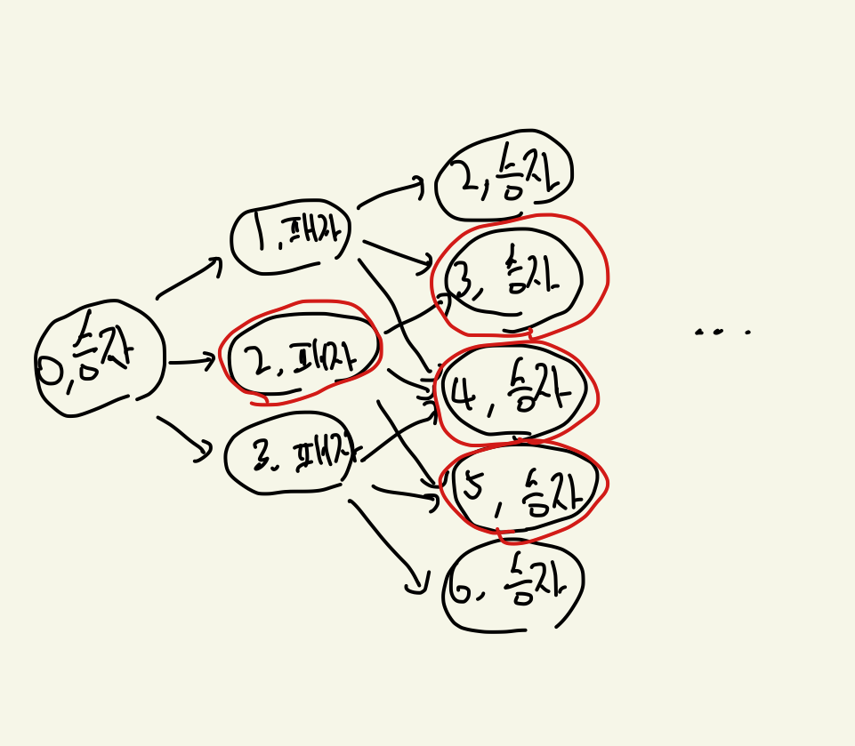

---
tags:
  - 프로그래머스-풀이
---
# 92345

날짜: 2022년 5월 24일 오후 7:27

## 코드

[Algorithm/92345.py at main · Junroot/Algorithm](https://github.com/Junroot/Algorithm/blob/main/programmers/92345.py)

## 풀이

모두가 이상적인 플레이를 했을 때 승자와 패자가 이미 결정되어있는 31게임이 생각났다. 31게임의 전략에서 힌트를 얻어서 구현을 했다.

31게임의 승자의 기본전략은 마지막으로 30, 26, 22, 18, …., 2를 말하는 것이다. 이를 dicision tree로 그려볼면 이렇게 된다. 여기서 빨간색 테두리는 승자가 항상 승리할 수 있는 전략이 있는 상태를 표시해둔 것이다.



이를 승자 노드에서 보면 다음으로 가는 노드에 항상 승리할 수 있는 상태인 것이 최소 하나만 있으면 된다.

패자 입장에서보면 다음으로 가는 노드가 전부 승자가 항상 승리할 수 있는 상태여야된다. 이를 이번 문제에서도 적용해봤다.

`attack`의 첫번째 반환 값은 공격자에게 항상 승리할 수 있는 상태로 가는 상태가 하나라도 있으면 True, 없으면 False를 반환한다.

`defence`의 첫번째 반환 값은 어떤 경우로 가도 공격자가 항상 승리할 수 있는 상태면 True, 아니면 False를 반환한다.

```python
import copy

def solution(board, aloc, bloc):
    directions = [(-1, 0), (0, 1), (1, 0), (0, -1)]

    def attack(board, attack_loc, defence_loc):
        if board[attack_loc[0]][attack_loc[1]] == 0:
            return False, 0

        result = 100

        next_locations = []
        for direction in directions:
            next_location = [attack_loc[0] + direction[0], attack_loc[1] + direction[1]]
            if 0 <= next_location[0] < len(board) and 0 <= next_location[1] < len(board[0]) \
                    and board[next_location[0]][next_location[1]] == 1:
                next_locations.append(next_location)

        if len(next_locations) == 0:
            return False, 0

        for next_location in next_locations:
            next_board = copy.deepcopy(board)
            next_board[attack_loc[0]][attack_loc[1]] = 0
            is_valid, move_count = defence(next_board, next_location, defence_loc)
            if is_valid:
                result = min(result, move_count + 1)

        if result == 100:
            return False, 0
        return True, result

    def defence(board, attack_loc, defence_loc):
        if board[defence_loc[0]][defence_loc[1]] == 0:
            return True, 0

        result = []

        next_locations = []
        for direction in directions:
            next_location = [defence_loc[0] + direction[0], defence_loc[1] + direction[1]]
            if 0 <= next_location[0] < len(board) and 0 <= next_location[1] < len(board[0]) \
                    and board[next_location[0]][next_location[1]] == 1:
                next_locations.append(next_location)

        if len(next_locations) == 0:
            return True, 0

        for next_location in next_locations:
            next_board = copy.deepcopy(board)
            next_board[defence_loc[0]][defence_loc[1]] = 0
            is_valid, move_count = attack(next_board, attack_loc, next_location)
            if not is_valid:
                return False, 0
            result.append(move_count + 1)
        return True, max(result)

    is_valid, move_count = attack(board, aloc, bloc)
    if is_valid:
        return move_count
    return defence(board, bloc, aloc)[1]
```

코드로 구현해보니 `attack` 함수와 

이렇게 구현하고 보니 `attack` 함수와 `defense` 함수를 하나로 합칠 수 있을 것으로 보였다.

```python
import copy

def solution(board, aloc, bloc):
    directions = [(-1, 0), (0, 1), (1, 0), (0, -1)]

    def find_optimal_movement(board, my_loc, opposite_loc):
        if board[my_loc[0]][my_loc[1]] == 0:
            return False, 0

        next_locations = []
        for direction in directions:
            next_location = [my_loc[0] + direction[0], my_loc[1] + direction[1]]
            if 0 <= next_location[0] < len(board) and 0 <= next_location[1] < len(board[0]) \
                    and board[next_location[0]][next_location[1]] == 1:
                next_locations.append(next_location)

        if len(next_locations) == 0:
            return False, 0

        win_movements = []
        lose_movements = []
        for next_location in next_locations:
            next_board = copy.deepcopy(board)
            next_board[my_loc[0]][my_loc[1]] = 0
            is_opposite_win, move_count = find_optimal_movement(next_board, opposite_loc, next_location)
            if not is_opposite_win:
                win_movements.append(move_count + 1)
            else:
                lose_movements.append(move_count + 1)

        if len(win_movements) > 0:
            return True, min(win_movements)
        return False, max(lose_movements)

    return find_optimal_movement(board, aloc, bloc)[1]
```