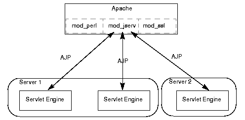

---
tags:
  - Apache
---
# Apache 동작 방식

## 배경

- Apache를 띄우고, mod_jk를 이용해 애플리케이션 서버와 연동하는 과정에서 계속 문제가 발생했다. 아무래도 Apache 동작 방식에 이해가 필요하다고 느껴져 간단하게 정리해본다.
- Apache의 용도나 웹서버의 역할은 다루지 않는다.

## Virtual Host

- Apache는 하나의 서버에서 여러 개의 웹사이트를 호스팅할 수 있다.

### Name-based Virtual Host

- 하나의 IP주소로 여러 개의 host를 가진다.

- `NameVirtualHost`로 이를 명시할 수 있고, `ServerName`을 통해 이름을 구분한다.

- `httpd.conf` 예시

  ```
  NameVirtualHost *:80 
  
  <VirtualHost 192.168.0.108:80> 
    ServerAdmin webmaster@example1.com 
    DocumentRoot /var/www/html/example1.com       
    ServerName www.example1.com 
  </VirtualHost> 
  
  <VirtualHost 192.168.0.108:80> 
    ServerAdmin admin@ example2.com 
    DocumentRoot /var/www/html/example2.com 
    ServerName www.example2.com 
  </VirtualHost>
  ```

### IP-based Virtual Host

- 각 호스트마다 다른 IP주소를 가진다.

- `httpd.conf`예시

  ```
  Listen 192.168.0.100:80
  
  <VirtualHost 192.168.10.108:80>
  	ServerAdmin webmaster@example1.com
  	DocumentRoot /var/www/html/example1.com      
  	ServerName www.example1.com
  </VirtualHost>
  
  <VirtualHost 192.168.10.109:80>
  	ServerAdmin admin@example2.com
  	DocumentRoot /var/www/html/example2.com
  	ServerName www.example2.com
  </VirtualHost>
  ```

## httpd.conf 주요 설정

- `Listen`: 웹 서버가 요청을 받을 포트 번호를 지정한다.
- `LoadModule`: 로드할 동적 모듈의 경로를 지정한다.
- `VirtualHost`: virtual host를 설정하는데 사용한다.
- `ServerRoot`: 웹 서버를 실행하기 위한 파일들의 최상단 경로 
- `ServerName`: 서버의 호스트 이름과 포트를 지정한다.
- `DocumentRoot`: 클라이언트에게 제공할 문서들의 최상단 경로
- `Directory`: 특정 디렉토리의 상세 규칙을 지정할 수 있다. (접근 권한 등)

## AJP(Apache Jserv Protocol)

- 애플리케이션 서버에 들어오는 요청을 프록시할 때 사용하는 바이너리 프로토콜
- 바이너리로 요청 메시지를 압축하기 때문에, 웹 서버가 애플리케이션 서버로 HTTP 메시지를 전송하는 것보다 빠르다.
- TCP 커넥션을 유지하여 재사용하기 때문에 더 빠르게 전송할 수 있다.



## 참고 자료

- https://www.guru99.com/apache.html
- https://linuxhint.com/apache-httpd-configuration/
- https://tomcat.apache.org/connectors-doc/ajp/ajpv13a.html
- https://docs.oracle.com/cd/A97336_01/ias.102/a83709/jweb.htm

