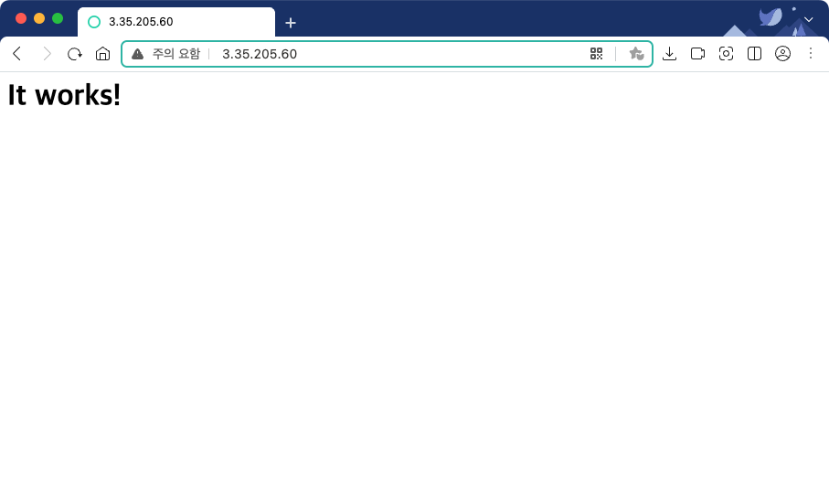

---
tags:
  - Apache
title: Apache 시작하기
---


## **설치**

설치 과정은 따로 사내 문서에 없어서 공식 문서를 보면서 진행했다.

1. 소스 코드 다운로드 및 압축 해제

    ```
    wget https://dlcdn.apache.org/httpd/httpd-2.4.54.tar.gz
    gzip -d httpd-2.4.54.tar.gz
    tar xvf httpd-2.4.54.tar
    ```

    - 다운로드 파일 경로는 아래 링크에서 확인이 가능하다.
      

        [https://httpd.apache.org/download.cgi](https://httpd.apache.org/download.cgi)

    
2. 빌드

    ```
    cd httpd-2.4.54.tar
    ./configure
    ```

    - 만약 설치 경로를 변겅하고 싶다면, `-prefix` 옵션으로 변경이 가능하다. (기본값 '/usr/local/apache2')
        - [https://httpd.apache.org/docs/trunk/programs/configure.html](https://httpd.apache.org/docs/trunk/programs/configure.html)
    - 트러블슈팅
        - 빌드를 시도하면 APR not found, APR-util not found, pcre-config for libpcre not found 등의 문제가 발생한다. 아래 링크를 통해서 해결할 수 있었다.
            - [https://geekflare.com/apache-installation-troubleshooting/](https://geekflare.com/apache-installation-troubleshooting/)
            - APR과 APR-util 다운로드 링크는 아래를 참고한다.
                - [https://apr.apache.org/download.cgi](https://apr.apache.org/download.cgi)
        - APR-util 빌드 시 "Fatal error: expat.h: No such file or directory" 에러가 발생하는데, libexpat1-dev 패키지를 설치하면 해결된다.

            ```
            sudo apt-get install libexpat1-dev
            ```

            - [https://github.com/scottcorgan/bucket-list/issues/2](https://github.com/scottcorgan/bucket-list/issues/2)
3. 설정

    ```
    vi PREFIX/conf/httpd.conf
    ```

4. 시작 및 종료

    ```
    PREFIX/bin/apachectl start
    PREFIX/bin/apachectl stop
    ```

    - 실행 결과 확인
      

        

        

## **로깅**

- 로그와 관련된 설정도 'PREFIX/conf/httpd.conf'에서 이루어진다.
- 아래와 같은 방법으로 LogFormat을 지정할 수 있다. 아래 예는 http access log를 남기는 설정이다.

    ```
    LogFormat "%h %u %t \"%r\" %>s %b \"%{Referer}i\" \"%{User-Agent}i\" %D" combined
    
    SetEnvIfNoCase Request_URI "\.(ico|gif|jpg|swf|png|css|js)$" nolog-request
    CustomLog "| /home1/irteam/apps/apache/bin/rotatelogs -l /home1/irteam/logs/accesslog.%Y%m%d 86400" combined env=!nolog-request
    ```

    - `%h` : 원격 호스트
    - `%u` : 네이버 인증 모듈 사용시 로그인한 네이버 ID
    - `%t` : common log format 시간 형식(표준 영어 형식)의 시간
    - `%r` : 요청의 첫번째 줄
    - `%>s` : 상태(status)
    - `%b` : HTTP 헤더를 제외한 전송 바이트수. CLF 형식과 같이 전송한 내용이 없는 경우 0 대신 '-'가 출력됨
    - `%{Referer}` : Referer
    - `%{User-Agent}` : User agent
    - `%D : 처리 시간` : micro-second (us)

## **어플리케이션 서버 연동**

- mod_jk와 mod_proxy 두 가지 방식이 있다.
    - mod_jk
        - URL이나 콘텐츠별로 유연한 매핑이 가능.
        - 전용 바이너리 프로토콜이므로 mod_proxy보다 빠른 경우가 많음.
        - 복잡한 로드 밸런서 설정이 가능
    - mod_proxy
        - 별도 모듈을 설치할 필요 없고 설정이 간편함.
        - HTTP 리버스 프록시로 동작하므로 특정 WAS에 의존적이지 않으므로 HTTP를 제공하는 모든 WAS에 적용 가능.

### **mod_jk 연동**

mod_jk는 Apache Httpd와 Apache Tomcat사이의 통신을 연결하는 모듈이다. 정확한 명칭은 Apache Tomcat Connector이다. Apache httpd가 Load Balance 역할을 하지 않는 경우만 다룬다.

1. mod_jk 모듈 선언(/conf/httpd.conf)

    ```
    LoadModule jk_module modules/mod_jk.so
    
    <IfModule mod_jk.c>
        JkWorkersFile "/home1/irteam/apps/apache/conf/workers.properties"
        JkLogFile "| /home1/irteam/apps/apache/bin/rotatelogs –l /home1/irteam/logs/mod_jk.log. %y%m%d 86400 "
        JkLogLevel error
        JkLogStampFormat "[%a %b %d %H:%M:%S %Y] "
        JkRequestLogFormat     "%w %V %T"
    </IfModule>
    ```

2. 'wokers.conf'설정 파일 include(/conf/httpd.conf)

    ```
    <VirtualHost * >
        ServerName {domain.name}
        ServerAlias {another.domain.name}
        Include conf/workers.conf
    </VirtualHost>
    ```

3. 정적 파일 연동 제외(workers.conf)

    ```
    JkMount /* tomcat
    ...
    
    SetEnvIf Request_URI "/css/*" no-jk
    SetEnvIf Request_URI "/js/*" no-jk
    SetEnvIf Request_URI "/images/*" no-jk
    SetEnvIf Request_URI "/favicon.ico" no-jk
    ```

    - virtual host 영역에 설정 내용 반영
        - 방법1

            ```
            JkMount /*  tomcat
            <VirtualHost *>
                ServerName service.naver.com
                ....
                JkMountCopy On
            </VirtualHost>
            ```

        - 방법2

            ```
            JkMount /* tomcat
            JkMountCopy All
            
            <VirtualHost *>
                ServerName service.naver.com
                ..
            </VirtualHost>
            ```

- tomcat worker 설정(worker.properties)

    ```
    worker.list=tomcat
    
    worker.tomcat.type=ajp13
    worker.tomcat.port={portnumber}
    # worker.tomcat.connect_timeout=1000
    # worker.tomcat.prepost _timeout=1000
    worker.tomcat.socket_timeout=5
    worker.tomcat.reply_timeout=1000
    worker.tomcat.retries=1
    ```

    - `worker.list` : worker의 이름을 지정한다. 여기서는 `tomcat`이라는 이름으로 worker를 하나만 지정했다.
    - `worker.tomcat.type` : Apache httpd 서버와 Tomcat 서버가 통신하는 프로토콜을 지정한다. `ajp 13` 으로 지정한다.
    - `worker.tomcat.port` : Tomcat에서 ajp 통신을 위해 열려있는 포트를 지정한다. `ajp13` 일 때의 디폴트 값은 8009이다.

### **mod_proxy 연동**

LoadBalance 역할을 하지 않는 경우의 설정이다.

1. 모듈 선언(conf/httpd.conf)

    ```
    LoadModule proxy_module modules/mod_proxy.so
    LoadModule proxy_ajp_module modules/mod_proxy_ajp.so
    ```

2. proxy지시자를 이용해 연결할 서버를 지정한다.

    ```
    <VirtualHost * >
    ServerName {domain.name}
    ProxyRequests Off
    ProxyPass / ajp://localhost:{portno}
    ProxyPassReverse / ajp://localhost:{portno}
    
    ...
    </VirtualHost>
    ```

3. proxy 지시자
    - ProxyPass: URL 바인딩

        ```
        ProxyPass  /admin/   http://localhost:9000/
        ProxyPass  /assets/    http://localhost:9010/
        ```

    - ProxyPassMatch: 정규식을 통한 URL 매칭

        ```
        ProxyPassMatch   ^/.*\.(js|css)$     http://localhost:9000/
        ```

    - ProxyPassReverse: ProxyPass를 쓰면 뒷단에 연결되는 서버의 주소가 노출된다. ProxyPassReverse를 통해 이를 숨길 수 있다.

        ```
        ProxyPass /nexus http://internal.navecorp.com:8080/nexus
        ProxyPassReverse /nexus http://internal.navecorp.com:8080/nexus
        ```

## **참고 자료**

[http://docs.navercorp.com/web-server/#httpd](http://docs.navercorp.com/web-server/#httpd)

[https://httpd.apache.org/docs/trunk/install.html](https://httpd.apache.org/docs/trunk/install.html)
