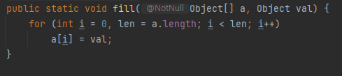

---
tags:
  - Java
title: Array 값 초기화 하기
---

고정된 크기의 배열을 선언하고, 전부 같은 값으로 초기화 해야되는 상황이 있었다. loop문을 통해서 모든 요소를 초기화하는 방법도 있지만, `Arrays` 에 이를 이미 구현해둔 내용이 있다.

```java
Clazz[][] board;
Arrays.fill(row, new Clazz());
```



내부 코드를 보면, 우리가 평소에 사용하는 기법대로 구현되어 있다.

## 참고 자료

[https://stackoverflow.com/questions/7118178/arrays-fill-with-multidimensional-array-in-java#comment69858755_7118178](https://stackoverflow.com/questions/7118178/arrays-fill-with-multidimensional-array-in-java#comment69858755_7118178)
