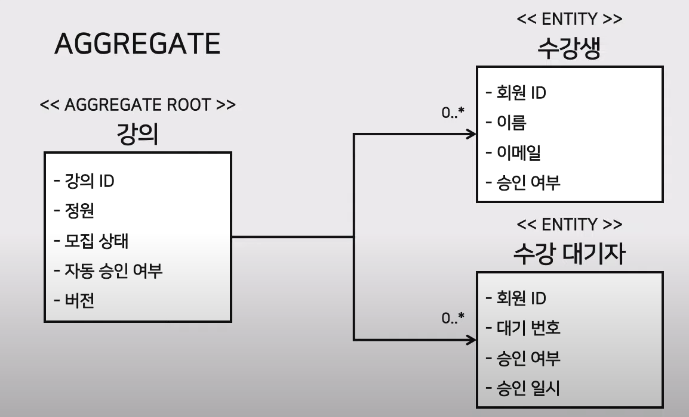
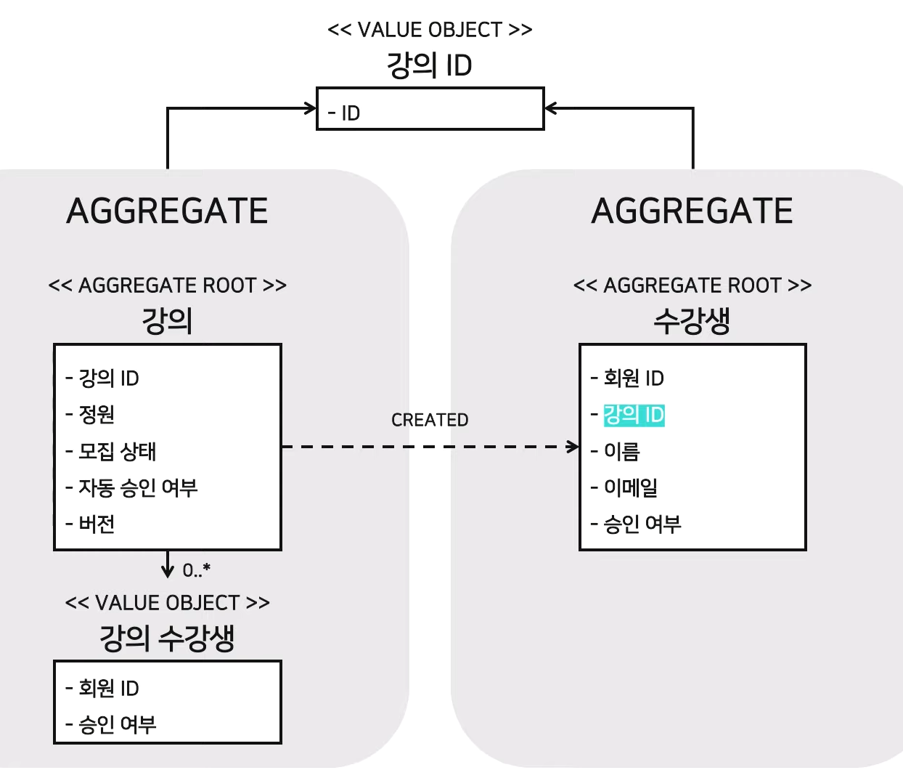

---
tags:
  - 설계
title: DDD
---

## 배경

- 우리팀 코드가 DDD를 사용하고 있다고 설명을 들었다.
- DDD가 무엇인지 이해하고, 어떤 장단점이 있는지 알아본다.

## 용어 정리

### 도메인

- 소프트웨어로 해결하고자 하는 문제 영역
- 소프트웨어를 사용하는 사용자의 활동이나 관심사와 관련되어 있다.

### 모델

- 목적을 위해 현실 세계에 존재하는 것을 가공하고 편집하여 우리에게 정보를 제공한다.
- 특정 다이어그램이 아니라 다이어그램으로 전달하려는 아이디어와 목적을 가진 의사소통 수단이다.
- 이 의사소통 수단은 회의, 기획, 디자인, 개발등 여러 이해관계자가 사용한다.

> 도메인 모델은 특정 도메인을 개념적으로 표현한 것, 도메인 모델을 사용하려면 여러 관계자들이 동일한 모습으로 도메인을 이해하고 도메인 지식을 공유하는 데 도움이 된다.
>
> 도메인 모델은 Entity, VO, Aggregates 등을 통해 설계된다. 

### DDD

- 도메인 그 자체와 도메인 로직에 초점을 맞춘다. 일반적으로 많이사용하는 데이터 중심의 접근법을 탈피해서 순수한 도메인 모델과 로직에 집중한다.
- 보편적인(ubiquitous) 언어를 사용한다. 도메인 전문가와 개발자 간의 커뮤니케이션 문제를 없애고 통일된 언어를 사용한다.
- 소프트웨어 엔티티와 도메인간 개념을 일치시킨다. 도메인 모델과 설계, 코드가 다른 구조가 아니라 도메인 모델부터 코드까지 항상 함께 움직이는 구조의 모델을 지향한다.

### Bounded Context

- 관심사를 분리하고 격리하여 문제 해결이 집중할 범위
- bounded context 별로 도메인 모델이 정의된다.
- 예시) 같은 피자라고 하더라도,
  - 식사라는 bounded context에서는 (이름, 가격, 칼로리, 영양 성분)이 도메인 모델을 구성한다.
  - 쓰레기 처리라는 bounded context에서는 (무게, 음식물 쓰레기 여부)가 도메인 모델을 구성한다.

### Context Map

- bounded context 간의 관계

### Aggregates

- 단일 트랜잭션에 일관성을 유지해야되는 Entity와 VO의 모음

- 명령을 수행하기 위해 함께 조회하고 업데이트해야 하는 최소 단위

- 같은 Aggregate에 속한 객체들은 동일하거나 비슷한 생명 주기를 가지고있다.

- Aggregate의 일관성을 위해 비관적 잠금 또는 낙관적 잠금을 사용한다.

- Aggregate 마다 서로 다른 DB를 사용할 수도 있다.

- Aggregate를 잘 쪼개서 설계하는 것은 동시성의 극대화를 가져오고, 잘못 쪼개면 성능상의 문제를 가져온다. 즉, 설계 단계에서 소프트웨어 설계를 같이 고려할 수 있게 된다.

- Aggregate Root: Aggregate를 대표하는 Entity로 Aggregate에 속하는 다른 Entity들의 생명 주기를 관리한다.

  - Aggregate Root의 식별자를 Aggregate 외부에서 사용할 수 있는 전역 식별자(global identity)라고 부른다.
  - Aggregate Root를 제외한 Entity의 식별자만으로는 자신이 속한 Aggregate에서 식별할 수 없다. 이를 지역 식별자(local identity)라고 부른다.

- 예시: 강의와 수강생

  - 강의에 수강생을 추가하기위해서 정원을 체크해야되기 때문에 일관성을 유지할 필요가 있다.

  

   - 만약, 수강생 정보 수정으로 인해 수강 신청을 막아서는 안 된다는 도메인 지식이 추가된다면?

     	- 수강생을 별도의 Aggregate로 분리하는 방법이 있다.
     	- 강의와 수강생의 동시성 제어는 '강의 수강생'이라는 별도의 VO를 만들어서 해결할 수 있다. 개념적으로는 엔티티지만 VO로 구현할 수도 있다.
     	- 이 방법이 아니라도, 일시적으로 불변식이 깨지지만 최종적으로 지킬수 있도록 노력하는 결과적 일관성도 있다. (배치 방식, 이벤트 방식)

     

## 장단점

### 장점

- 보편적인 언어 사용에 따른 빠른 커뮤니케이션
- 도메인간 관계가 복잡한 경우 Aggregate 등을 사용하면서 정리가 가능
- 도메인의 분리에 따른 유지보수에 대한 유연성
- 새로운 기능 및 요구 사항에 대한 유연성
- 데이터베이스가 아닌 애플리케이션의 동시성 제어를 통한 유연성

### 단점

- MSA에서 오는 단점(별도 학습 필요)
- 아키텍쳐 구현에서 생성되는 생각보다 많은 코드
- 각 도메인에 대한 높은 이해도가 필요

## 참고 자료

- https://www.geeksforgeeks.org/domain-driven-design-ddd/
- https://incheol-jung.gitbook.io/docs/q-and-a/architecture/ddd
- https://www.youtube.com/watch?v=kmUneexSxk0
- https://www.youtube.com/watch?v=s0twDQ6lIGU
