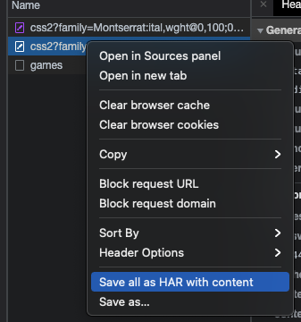

---
tags:
  - 테스트
---
# Gatling을 이용한 성능 측정기

## 시작 하기

Gatling의 시작 방법은 단순하다. [링크](https://gatling.io/get-started/)에서 압축 파일을 받아서 풀면된다. 주로 유저 시나리오 코드를 `user-files/simulations` 경로에 넣어두고 `bin/gatling.sh` 를 통해 실행시키면 된다.

## 시나리오 작성 하기

시나리오 코드를 작성하고 싶은데 엄청 간단한 툴이 있었다. Gatling에서 Recorder라는 애플리케이션을 제공해주는데 이를 이용하면 아래 두 가지가 가능하다.

1. 브라우저 작업을 추적해 시나리오 코드 작성
2. HAL 파일을 통해 시나리오 코드 작성

나 같은경우 1번 방법을 사용하면 HTTPS의 웹사이트는 추적이 불가능 한 경우가 있어서 2번 방법을 사용했다. 브라우저 개발자 도구에서 우클릭을 하면 HAL 파일로 저장이 가능하다.



`./recorder.sh` 명령어로 Recorder를 실행해서 Recorder mode를 HAR Converter로 선택하면 된다. package는 `user-files/simulations` 내부에 저장할 디렉토리의 이름이 된다.


나는 다음과 같은 시나리오를 만들었다.

1. 메인 페이지 입장
2. 방 리스트 페이지 입장
3. 방 생성 버튼 클릭
4. 인원 10명, 태그 1hour 선택
5. 방 생성

불필요한 요청을 제거하고 완성한 시나리오 코드는 다음과 같다.

```scala
package test2

import scala.concurrent.duration._
import io.gatling.core.Predef._
import io.gatling.http.Predef._
import io.gatling.jdbc.Predef._

class RecordedSimulation extends Simulation {

  val httpProtocol = http
    .baseUrl("https://test-api.babble.gg")
    .inferHtmlResources()
    .userAgentHeader("Mozilla/5.0 (Macintosh; Intel Mac OS X 10_15_7) AppleWebKit/537.36 (KHTML, like Gecko) Chrome/94.0.4606.81 Safari/537.36")

  val headers_1 = Map(
    "Accept" -> "application/json, text/plain, */*",
    "Accept-Encoding" -> "gzip, deflate, br",
    "Accept-Language" -> "ko,ko-KR;q=0.9,en;q=0.8,ja;q=0.7",
    "Origin" -> "https://babble.gg",
    "Sec-Fetch-Dest" -> "empty",
    "Sec-Fetch-Mode" -> "cors",
    "Sec-Fetch-Site" -> "same-site",
    "sec-ch-ua" -> """Chromium";v="94", "Google Chrome";v="94", ";Not A Brand";v="99""",
    "sec-ch-ua-mobile" -> "?0",
    "sec-ch-ua-platform" -> "macOS")

  val headers_2 = Map(
    "Accept" -> "*/*",
    "Accept-Encoding" -> "gzip, deflate, br",
    "Accept-Language" -> "ko,ko-KR;q=0.9,en;q=0.8,ja;q=0.7",
    "Access-Control-Request-Headers" -> "content-type",
    "Access-Control-Request-Method" -> "POST",
    "Origin" -> "https://babble.gg",
    "Sec-Fetch-Dest" -> "empty",
    "Sec-Fetch-Mode" -> "cors",
    "Sec-Fetch-Site" -> "same-site")

  val headers_6 = Map(
    "Accept" -> "application/json, text/plain, */*",
    "Accept-Encoding" -> "gzip, deflate, br",
    "Accept-Language" -> "ko,ko-KR;q=0.9,en;q=0.8,ja;q=0.7",
    "Content-Type" -> "application/json;charset=UTF-8",
    "Origin" -> "https://babble.gg",
    "Sec-Fetch-Dest" -> "empty",
    "Sec-Fetch-Mode" -> "cors",
    "Sec-Fetch-Site" -> "same-site",
    "sec-ch-ua" -> """Chromium";v="94", "Google Chrome";v="94", ";Not A Brand";v="99""",
    "sec-ch-ua-mobile" -> "?0",
    "sec-ch-ua-platform" -> "macOS")

  val headers_21 = Map(
    "Accept" -> "*/*",
    "Accept-Encoding" -> "gzip, deflate, br",
    "Accept-Language" -> "ko,ko-KR;q=0.9,en;q=0.8,ja;q=0.7",
    "Origin" -> "https://babble.gg",
    "Sec-Fetch-Dest" -> "empty",
    "Sec-Fetch-Mode" -> "cors",
    "Sec-Fetch-Site" -> "same-site",
    "sec-ch-ua" -> """Chromium";v="94", "Google Chrome";v="94", ";Not A Brand";v="99""",
    "sec-ch-ua-mobile" -> "?0",
    "sec-ch-ua-platform" -> "macOS")

  val scn = scenario("RecordedSimulation")
    .exec(http("get games")
      .get("/api/games")
      .headers(headers_1))
    .exec(http("get rooms")
      .get("/api/rooms?gameId=75&tagIds=&page=1")
      .headers(headers_1)
      .resources(
        http("option users")
          .options("/api/users")
          .headers(headers_2),
        http("get games/75")
          .get("/api/games/75")
          .headers(headers_1),
        http("post users")
          .post("/api/users")
          .headers(headers_6)
          .body(RawFileBody("test2/recordedsimulation/0006_request.json")),
        http("get tags")
          .get("/api/tags")
          .headers(headers_1),
        http("get rooms")
          .get("/api/rooms?gameId=75&tagIds=&page=1")
          .headers(headers_1)))
    .exec(http("get games/75/images")
      .get("/api/games/75/images")
      .headers(headers_1)
      .resources(http("get tags")
        .get("/api/tags")
        .headers(headers_1)))
    .exec(http("option rooms")
      .options("/api/rooms")
      .headers(headers_2)
      .resources(http("post rooms")
        .post("/api/rooms")
        .headers(headers_6)
        .body(RawFileBody("test2/recordedsimulation/0018_request.json")),
        http("get games/75")
          .get("/api/games/75")
          .headers(headers_1),
        http("get rooms")
          .get("/api/rooms?gameId=75&tagIds=&page=1")
          .headers(headers_1),
        http("get connection")
          .get("/connection/info?t=1633673328343")
          .headers(headers_21),
        http("get tags")
          .get("/api/tags")
          .headers(headers_1),
        http("get rooms")
          .get("/api/rooms?gameId=75&tagIds=&page=1")
          .headers(headers_1)))

  setUp(scn.inject(atOnceUsers(13))).protocols(httpProtocol)
}
```

## 성능 목표 설정

이전에 학습한대로 설정해봤다.

### Throughput

- 예상 1일 사용자수(DAU)를 정한다.
    - 100000
- 피크 시간대 집중률을 예상한다.
    - 10배
- 1명당 1일 평균 접속 또는 요청 수를 예상해본다.
    - 20
- (1일 총 접속 수) = (DAU) * (1명당 1일 평균 접속 수) = 100000 * 20 = 2000000
- (1일 평균 rps) = (1일 총 접속 수) / 86400(초/일) = 23.15
- (1일 최대 rps) = 2.315 * 10 = 231.5
- (VUser) = (15 * 0.5 + 1) * 23.15 / 15 = 13.1183

> T = (R * http_req_duration) (+ 1s) ; 내부망에서 테스트할 경우 예상 latency를 추가한다
VUser = (목표 rps * T) / R
- Request Rate: measured by the number of requests per second (RPS)
- VU: the number of virtual users
- R: the number of requests per VU iteration
- T: a value larger than the time needed to complete a VU iteration
> 

### Latency

일반적으로 50~100ms이하로 잡는 것이 좋다.

## 성능 측정

성능 측정의 목표가 우리가 많은 서비스의 규모가 커졌을 때 많은 유저를 수용할 수 있을지를 확인하기 위해서였기 때문에 db에 Tag와 Game 더미데이터를 약 3만개 정도 넣어뒀다.

### Smoke Test

부하가 없는 상황에서 Latency가 어떻게 나오는지 측정해본다. 테스트 코드 제일 아래 줄에 다음과 같이 설정했다.

```scala
setUp(scn.inject(atOnceUsers(1))).protocols(httpProtocol)
```


보이는 결과와 같이 get games와 get tags의 latency가 엄청나게 큰것을 확인할 수 있다. 이전에 game과 tag의 검색 로직을 프론트엔드에서 작업하기 위해서 이렇게 구현했는데, 백엔드에서 검색이 가능하도록 수정해야 될 것으로 보인다.

### Load Test

목표하는 rps를 처리할 수 있는지 확인해본다. 위에서 계산한 VUser의 수를 입력하여 테스트를 진행했다. 

```scala
setUp(scn.inject(atOnceUsers(13))).protocols(httpProtocol)
```

## 참고 자료

[https://velog.io/@devkingsejong/Gatling-내가-만든-사이트의-부하를-테스트-하는-법](https://velog.io/@devkingsejong/Gatling-%EB%82%B4%EA%B0%80-%EB%A7%8C%EB%93%A0-%EC%82%AC%EC%9D%B4%ED%8A%B8%EC%9D%98-%EB%B6%80%ED%95%98%EB%A5%BC-%ED%85%8C%EC%8A%A4%ED%8A%B8-%ED%95%98%EB%8A%94-%EB%B2%95)

[https://automationrhapsody.com/performance-testing-with-gatling-record-and-playback/](https://automationrhapsody.com/performance-testing-with-gatling-record-and-playback/)

[https://abstracta.us/blog/performance-testing/implement-load-test-scenarios-gatling/](https://abstracta.us/blog/performance-testing/implement-load-test-scenarios-gatling/)