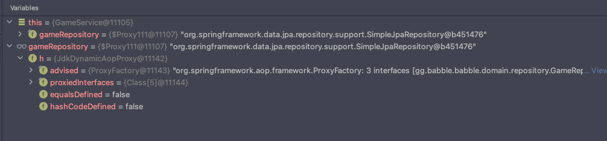

---
tags:
  - Logback
title: Logging
---

```java
	System.out.println("*********제발 나와라*********");
```

위 코드 한 줄은 아마 개발을 해본 대부분은 시도 해본 디버깅 방법일 것이다. 필자도 한 때 많이 이용한 방법이다. 특별한 기술이 없어도 내가 작성한 코드가 어떻게 흘러가는지, 어디까지 동작하는지 확인할 수 있다. 점차 IDE 사용법에 익숙해지면 알게 되는 좀 더 쉬운 디버깅 방법으로는 디버거가 있다. 디버거를 사용하면 특정 코드 라인에 도달했을 때, 각 변수의 주소, 값 등을 확인할 수 있어 디버깅할 때 용이하다.



하지만 이런 방법들은 한계가 있다. "내 컴퓨터에서는 잘 동작하는데 배포만 하면 동작을 안해요.", "분명 버그가 있었는데 재연을 못 하겠어요." 많이 들어본 대사일 것이다. 배포 환경과 내 컴퓨터가 항상 동일한 환경이라는 보장도 없고, 내가 직접 모든 버그를 다 찾아낼 수 있다는 보장도 없다. 우리는 언제 어디서 터질지 모르는 이런 버그들을 잘 기록해뒀다가 디버깅에 사용할 필요가 있다. 그래서 사용하게 된 방법이 _**로깅**_이다. 로깅을 사용하면 단순 출력과는 다르게 로깅 레벨, 포맷 등을 커스터마이징 할 수 있어 더 편리하다.

## 로깅의 목적

로깅은 앞서말했던 디버깅 뿐만 아니라 다른 목적으로도 다양하게 사용된다.

* 시스템 모니터링
* 워크플로 모델링
* 성능 조사
* etc

## Java의 로깅 방법

Java에서 로깅을 하기 위해서 여러 가지 로깅 프레임워크를 사용할 수 있다. Java 기본 프레임워크인 `java.util.logging` 뿐만 아니라 서드 파티 프레임워크인 Log4j나 Logback, tinylog 등을 사용할 수도 있다. 추상화 레이어인 SLF4J나 Apache Commons Logging를 사용하여 로깅 프레임워크와 내 코드의 결합도를 낮출 수도 있다. 이렇게 Java는 여러가지 프레임워크를 사용할 수 있지만 기본 구조는 비슷하다. 아래의 3가지 컴포넌트를 가진다.

* Logger: 이벤트를 캡처하여 Appender에게 전달한다.
* Appender: 로그를 어디에 기록할지 정한다. 어떤 포맷으로 기록할지 정하기 위해 Layout에게 이벤트를 전달한다.
* Layout: 이벤트에 있는 데이터를 포매팅한다.

만약 애플리케이션에서 로깅이 호출되면 Logger는 이벤트를 기록하고 Appender에게 이 이벤트를 전달한다. Appender는 Layout을 사용해서 기록을 포매팅하고 콘솔, 파일, 다른 애플리케이션 같은 곳에 로그를 보낸다. 추가적으로 어떤 이벤트를 어떤 Appender가 처리하게 할지 지정하기 위해 Filters라는 것을 사용할 수도 있다.

## Spring Boot의 로깅 방법

Spring Boot는 여러 가지 프레임워크를 사용할 수 있지만 기본적으로는 Logback을 지원한다.

### Logback 구조

현재 Logback은 logback-core, logback-classic, logback-access 3가지 모듈로 나뉜다. core는 classic과 access 모듈의 기초가 되는 범용 모듈이다. classic 모듈은 SLF4J API의 구현에 집중되어있다. access 모듈은 HTTP 액세스 로그 기능을 제공하기 위해 서블릿 컨테이너와 통합된다. 또한 Logger 클래스는 classic 모듈의 일부이고 Appender와 Layout 인터페이스는 core 모듈의 일부이다.


### Logback 구성

Logback을 구성하기 위해서 보통 `logback.xml`파일을 만들어서 구성하게된다. 아무 구성도 하지 않으면 Logback의 `BasicConfigurator` 가 로깅 출력이 콜솔로 전달되도록 자동으로 구성한다. `logback.xml` 파일은 아래와 같은 형태를 가진다.

```xml
<configuration debug="true"> 

  <appender name="STDOUT" class="ch.qos.logback.core.ConsoleAppender"> 
    <!‐- encoders are  by default assigned the type
         ch.qos.logback.classic.encoder.PatternLayoutEncoder ‐‐>
    <encoder>
      <pattern>%d{HH:mm:ss.SSS} [%thread] %-5level %logger{36} - %msg%n</pattern>
    </encoder>
  </appender>

  <root level="debug">
    <appender-ref ref="STDOUT" />
  </root>
</configuration>
```

### Log Level

Logback의 Logger는 5가지의 로그 레벨을 가질 수 있다.

* ERROR: 애플리케이션에 치명적일 수 있는 에러 이벤트
* WARN: 잠재적으로 위험할 수 있는 상황
* INFO: 애플리케이션의 전반적인 흐름을 나타내는 정보성 메시지
* DEBUG: 중요도가 낮은 정보성 메시지
* TRACE: 중요도가 매우 낮은 정보성 메시지

레벨은 ERROR > WARN > INFO > DEBUG > TRACE 순으로 순위가 높고, Spring Boot의 로그 레벨 기본 값은 INFO다.

### Appender

* `OutputStreamAppender`: 이벤트를 `java.io.OutputStream`에 추가한다. 다른 Appender의 기초가되는 서비스를 제공한다. `OutputStream`에 문자열을 쉽게 매핑할 수 없기 때문에 일반적으로 직접 사용하지는 않는다.

    

* `ConsoleAppender`: 콘솔에 이벤트를 추가한다. 아래와 같이 class에 `ch.qos.logback.core.ConsoleAppender`로 xml 파일에 추가할 수 있다.

    ```xml
    <configuration>

      <appender name="STDOUT" class="ch.qos.logback.core.ConsoleAppender">
        <encoder>
          <pattern>%-4relative [%thread] %-5level %logger{35} - %msg %n</pattern>
        </encoder>
      </appender>

      <root level="DEBUG">
        <appender-ref ref="STDOUT" />
      </root>
    </configuration>
    ```

* `FileAppender`: 파일에 이벤트를 추가한다. 애플리케이션 실행시 로그파일이 이미 있다면, 설정에 따라 기존 로그 파일을 완전히 지우거나 이어서 쓸 수 있다. 아래의 `append` 속성을 참고하면된다.

    ```xml
    <configuration>

    <appender name="FILE" class="ch.qos.logback.core.FileAppender">
    		<!-- 파일 이름 지 -->
        <file>testFile.log</file>
        <append>true</append>
        <encoder>
          <pattern>%-4relative [%thread] %-5level %logger{35} - %msg%n</pattern>
        </encoder>
      </appender>

      <root level="DEBUG">
        <appender-ref ref="FILE" />
      </root>
    </configuration>
    ```

    애플리케이션 실행마다 로그 파일을 다르게 만들고 싶다면 아래와 같이 timestamp를 이용하는 방법도 있다.

    ```xml
    <configuration>

      <!-- bySecond라는 키를 가진 타임스탬프 선언 -->
      <timestamp key="bySecond" datePattern="yyyyMMdd'T'HHmmss"/>

      <appender name="FILE" class="ch.qos.logback.core.FileAppender">
        <!-- 파일 이름에 타임스탬프 추가 -->
        <file>log-${bySecond}.txt</file>
        <encoder>
          <pattern>%logger{35} - %msg%n</pattern>
        </encoder>
      </appender>

      <root level="DEBUG">
        <appender-ref ref="FILE" />
      </root>
    </configuration>
    ```

* `RollingFileAppender`: `FileAppender`를 상속받은 것이다. 파일을 어떤 규칙에 따라 분리해서 관리 할 수 있다. 이 `RollingFileAppender`에는 `RollingPolicy`와 `TriggerPolicy` 두 가지 요소가 필요하다. `RollingPolicy`는 파일 이름 변경, 파일 이동과 같은 파일 분리 과정을 담당하고 `TriggerPolicy`는 이 파일 분리가 시작될 시기를 담당한다. 아래는 각 요소에 대표적인게 어떤 것들이 있는지 간단하게 나열했다.

    **FileAppender**

    * `TimeBasedRollingPolicy`: 가장 인기있는 정책으로 일별 또는 월별 같이 시간 기준으로 파일 이름을 변경한다. `TimeBasedTriggeringPolicy`는 `RollingPolicy`와 `TriggerPolicy`를 둘 다 구현되어있다.
    * `FixedWindowRollingPolicy`: fixed window 알고리즘에 따라 이름을 변경한다.

    **TriggerPolicy**

    * `SizeBasedTriggerPolicy`: 지정한 크기보다 파일이 커지면 파일이 분리되도록 신호를 보낸다.

    ```xml
    <configuration>
      <appender name="ROLLING" class="ch.qos.logback.core.rolling.RollingFileAppender">
        <file>mylog.txt</file>
        <rollingPolicy class="ch.qos.logback.core.rolling.SizeAndTimeBasedRollingPolicy">
          <!-- rollover daily -->
          <fileNamePattern>mylog-%d{yyyy-MM-dd}.%i.txt</fileNamePattern>
           <!-- each file should be at most 100MB, keep 60 days worth of history, but at most 20GB -->
           <maxFileSize>100MB</maxFileSize>    
           <maxHistory>60</maxHistory>
           <totalSizeCap>20GB</totalSizeCap>
        </rollingPolicy>
        <encoder>
          <pattern>%msg%n</pattern>
        </encoder>
      </appender>

      <root level="DEBUG">
        <appender-ref ref="ROLLING" />
      </root>

    </configuration>
    ```

### Encoder

Encoder는 이벤트를 바이트 배열로 변환하고 해당 바이트 배열을 OutputStream으로 쓰는 역할을 한다. 이전의 Logback은 Appender가 Layout에 의존하여 이벤트를 String으로 변환하고 이를 Writer에 쓰도록 했지만 최근에는 Layout을 쓰지않고 Encoder를 사용한다. Layout은 String으로 밖에 변환하지 못하고 이벤트를 기록하는 시기를 조정할 수 없기 때문에 사용되지 않는다고 한다.

* `LayoutWrappingEncoder`: 이전에 쓰던 Layout들을 계속 사용하기 위해 Encoder과 Layout과 상호작용할 수 있는 방법이 필요해 만들어졌다.
* `PatternLayoutEncoder`: Layout 중에 가장 흔하게 사용하는 `PatternLayout`을 사용하기 위해 만들어진 Encoder로 `LayoutWrappingEncoder`를 상속받았다. 아래예오 같이 패턴을 지정할 수 있다.

    ```xml
    <appender name="FILE" class="ch.qos.logback.core.FileAppender"> 
      <file>foo.log</file>
      <encoder>
        <pattern>%d %-5level [%thread] %logger{0}: %msg%n</pattern>
        <outputPatternAsHeader>true</outputPatternAsHeader>
      </encoder> 
    </appender>
    ```

### 프로필에 따른 구성 변경

Spring Boot는 `logback-spring.xml`이라는 파일을 자동으로 읽어서 추가적인 기능을 지원해준다. 대표적인 기능 중 하나로 프로필에 따른 구성을 지정할 수 있다. `<springProfile>` 태그를 사용하여 아래와 같이 구성이 가능하다.

```xml
<springProfile name="staging">
    <root level="INFO">
      <appender-ref ref="FILE" />
    </root>
</springProfile>

<springProfile name="dev | staging">
    <!-- configuration to be enabled when the "dev" or "staging" profiles are active -->
</springProfile>

<springProfile name="!production">
    <!-- configuration to be enabled when the "production" profile is not active -->
</springProfile>
```

## 참고 자료

[https://towardsdatascience.com/understand-your-computer-system-using-logs-98139d0b5de1](https://towardsdatascience.com/understand-your-computer-system-using-logs-98139d0b5de1)

[https://www.loggly.com/ultimate-guide/java-logging-basics/](https://www.loggly.com/ultimate-guide/java-logging-basics/)

[https://docs.spring.io/spring-boot/docs/2.1.18.RELEASE/reference/html/boot-features-logging.html](https://docs.spring.io/spring-boot/docs/2.1.18.RELEASE/reference/html/boot-features-logging.html)

[http://logback.qos.ch/manual/index.html](http://logback.qos.ch/manual/index.html)

[https://www.baeldung.com/spring-boot-logging](https://www.baeldung.com/spring-boot-logging)
