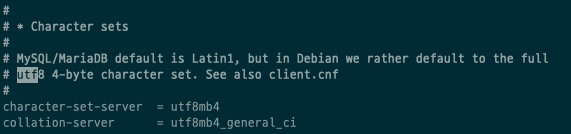

---
tags:
  - MariaDB
title: MariaDB의 charset 이슈
---

MariaDB는 기본 캐릭터셋으로 utf8mb4를 쓰기 때문에 스키마 생성시 utf8을 사용하게 설정해야된다.



```sql
CREATE DATABASE practice DEFAULT CHARACTER SET utf8 COLLATE utf8_general_ci;
```
