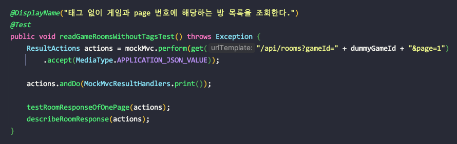

---
tags:
  - Spring-MVC
---
# Pagination 커스터마이징

```java
@Configuration
public class PageableConfig implements WebMvcConfigurer {

    private static final int MAX_PAGE_SIZE = 16;

    @Override
    public void addArgumentResolvers(List<HandlerMethodArgumentResolver> argumentResolvers) {
        PageableHandlerMethodArgumentResolver resolver = new PageableHandlerMethodArgumentResolver();
        resolver.setOneIndexedParameters(true);
        resolver.setMaxPageSize(MAX_PAGE_SIZE);
        argumentResolvers.add(resolver);
    }
}
```

- `setOneIndexedParameters(true)`: 페이징 인덱스가 1부터 시작하도록 설정. 이 경우에도 `PageRequest.of(1, 16)` 을 호출하면 두 번째 페이지가 가져와지니 주의 해야된다. `Pageable`을 직접 커스터마이징 하는 것이 아니라, 컨트롤러에서 `Pageable`을 파라미터로 받을 때 1이 자동으로 0으로 바뀌는 것으로 추측 된다.
- `setMaxPageSize(MAX_MAGE_SIZE)`: 한 페이지로 불러 올 수 있는 최대 크기를 지정한다. 공격자가 고의적으로 모든 데이터를 다 가져오려고 할 때 막을 수 있을 것으로 보인다. (아래 사진과 같이 확인 완료)
  
    

    
    
- [https://www.baeldung.com/spring-data-jpa-pagination-sorting](https://www.baeldung.com/spring-data-jpa-pagination-sorting)