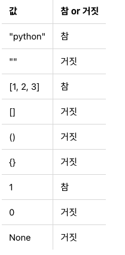

---
tags:
  - Python
title: Python 기초 문법
---

참고자료: 

[점프 투 파이썬](https://wikidocs.net/book/1)

## 숫자형

### 출력

```python
print("asdf")
```

### 조건문 if

```python
if a > 1:
	print("a is greater than 1")
```

### 반복문 for

```python
for a in [1, 2, 3]:
	print(a)
```

### **반복문 while**

```python
while i < 3:
	i=i+1
	print(i)
```

### 함수

```python
def add(a, b):
	return a+b

add(3,4)
```

### 제곱

```python
a ** b
```

### 나누기

```python
7 / 4

```

### 나눗셈 몫

```python
7 // 4

```

## 문자열

### 문자열 표현 4가지

```python
"Hello World"
'Python is fun'
"""Life is too short, You need python"""
'''Life is too short, You need python'''
```

### 문자열 연결

```python
>>> head = "Python"
>>> tail = " is fun!"
>>> head + tail
'Python is fun!'
```

### 문자열 곱하기

```python
>>> a = "python"
>>> a * 2
'pythonpython'
```

### 문자열 길이 구하기

```python
>>> a = "Life is too short"
>>> len(a)
17
```

### 문자열 인덱싱

```python
>>> a = "Life is too short, You need Python"
>>> a[3]
'e'
>>> a[-1]
'n'
```

### 문자열 슬라이싱

```python
>>> a = "Life is too short, You need Python"
>>> a[0:4]
'Life'
>>> a[19:]
'You need Python'
>>> a[:17]
'Life is too short'
>>> a[:]
'Life is too short, You need Python'
>>> a[19:-7]
'You need'
```

### 문자열 포매팅

```python
>>> number = 10
>>> day = "three"
>>> "I ate %d apples. so I was sick for %s days." % (number, day)
'I ate 10 apples. so I was sick for three days.'
```

### 오른쪽 정렬

```python
>>> "%10s" % "hi"
'        hi'
```

### 왼쪽 정렬

```python
>>> "%-10sjane." % 'hi'
'hi        jane.'
```

### 소수점 표현하기

전체 길이가 10개인 문자열 공간에 오른쪽졍렬로 소수점 네 번째 자리까지 표시

```python
>>> "%10.4f" % 3.42134234
'    3.4213'
```

### 포매팅하는 다른 방법

```python
>>> number = 10
>>> day = "three"
>>> "I ate {0} apples. so I was sick for {1} days.".format(number, day)
'I ate 10 apples. so I was sick for three days.'
```

### 이름으로 넣기

```python
>>> "I ate {number} apples. so I was sick for {day} days.".format(number=10, day=3)
'I ate 10 apples. so I was sick for 3 days.'
```

### 왼쪽 정렬

```python
>>> "{0:<10}".format("hi")
'hi        '
```

### 오른쪽 정렬

```python
>>> "{0:>10}".format("hi")
'        hi'
```

### 가운데 정렬

```python
>>> "{0:^10}".format("hi")
'    hi    '
```

### 공백 채우기

```python
>>> "{0:=^10}".format("hi")
'====hi===='
>>> "{0:!<10}".format("hi")
'hi!!!!!!!!'
```

### 포매팅에 `{` `}` 문자 표현하기

```python
>>> "{{ and }}".format()
'{ and }'
```

### 변수 문자열 포매팅

```python
>>> name = '홍길동'
>>> age = 30
>>> f'나의 이름은 {name}입니다. 나이는 {age}입니다.'
'나의 이름은 홍길동입니다. 나이는 30입니다.'
```

```python
>>> age = 30
>>> f'나는 내년이면 {age+1}살이 된다.'
'나는 내년이면 31살이 된다.'
```

```python
>>> d = {'name':'홍길동', 'age':30}
>>> f'나의 이름은 {d["name"]}입니다. 나이는 {d["age"]}입니다.'
'나의 이름은 홍길동입니다. 나이는 30입니다.'
```

```python
>>> f'{{ and }}'
'{ and }'
```

### 문자열에 문자 개수 세기

```python
>>> a = "hobby"
>>> a.count('b')
2
```

### 문자열 속 문자 위치 알려주기

```python
>>> a = "Python is the best choice"
>>> a.find('b')
14
>>> a.find('k')
-1

```

```python
>>> a = "Life is too short"
>>> a.index('t')
8
>>> a.index('k')
Traceback (most recent call last):
File "<stdin>", line 1, in <module>
ValueError: substring not found

```

### 문자열 사이에 삽입하기

```python
>>> ",".join(['a', 'b', 'c', 'd'])
'a,b,c,d'
```

### 소문자를 대문자로 바꾸기

```python
>>> a = "hi"
>>> a.upper()
'HI'
```

### 대문자를 소문자로 바꾸기

```python
>>> a = "HI"
>>> a.lower()
'hi'
```

### 양끝 공백 지우기

```python
>>> a = " hi "
>>> a.strip()
'hi'
```

### 왼쪽 공백만 지우기

```python
>>> a = " hi "
>>> a.lstrip()
'hi '
```

### 오른쪽 공백만 지우기

```python
>>> a= " hi "
>>> a.rstrip()
' hi'
```

### 문자열 치환

```python
>>> a = "Life is too short"
>>> a.replace("Life", "Your leg")
'Your leg is too short'
```

### 문자열 나누기

```python
>>> b = "a:b:c:d"
>>> b.split(':')
['a', 'b', 'c', 'd']
```

### 공백 기준으로 나누기

```python
>>> a = "Life is too short"
>>> a.split()
['Life', 'is', 'too', 'short']
```

## 리스트

리스트의 요소가 같은 타입일 필요가 없다.

```python
>>> a = [1, 2, ['a', 'b', ['Life', 'is']]]
>>> a[2][2][0]
'Life'
```

### 리스트 더하기

```python
>>> a = [1, 2, 3]
>>> b = [4, 5, 6]
>>> a + b
[1, 2, 3, 4, 5, 6]
```

### 리스트 반복하기

```python
>>> a = [1, 2, 3]
>>> a * 3
[1, 2, 3, 1, 2, 3, 1, 2, 3]
```

### 리스트 길이 구하기

```python
>>> a = [1, 2, 3]
>>> len(a)
3
```

### 리스트 값 삭제하기

```python
>>> a = [1, 2, 3]
>>> del a[1]
>>> a
[1, 3]
```

### 리스트 슬라이싱 기법으로 삭제하기

```python
>>> a = [1, 2, 3, 4, 5]
>>> del a[2:]
>>> a
[1, 2]
```

### 리스트 끝에 요소 추가

```python
>>> a = [1, 2, 3]
>>> a.append(4)
>>> a
[1, 2, 3, 4]
```

### 리스트 정렬

```python
>>> a = [1, 4, 3, 2]
>>> a.sort()
>>> a
[1, 2, 3, 4]
```

### 리스트 뒤집기

```python
>>> a = ['a', 'c', 'b']
>>> a.reverse()
>>> a
['b', 'c', 'a']
```

### 리스트의 요소 찾기

```python
>>> a = [1,2,3]
>>> a.index(3)
2
>>> a.index(1)
0

```

### 리스트의 특정 위치에 삽입

```python
>>> a = [1, 2, 3]
>>> a.insert(0, 4)
>>> a
[4, 1, 2, 3]
```

### 리스트의 특정 값 찾아서 삭제

z찾아서 첫 번째로 나오는 값 삭제

```python
>>> a = [1, 2, 3, 1, 2, 3]
>>> a.remove(3)
>>> a
[1, 2, 1, 2, 3]
>>> a.remove(3)
>>> a
[1, 2, 1, 2]
```

### 리스트의 마지막 요소 꺼내기

```python
>>> a = [1,2,3]
>>> a.pop()
3
>>> a
[1, 2]
```

### 리스트에 포함된 요수 개수 세기

```python
>>> a = [1,2,3,1]
>>> a.count(1)
2
```

### 리스트 끼리 합치기

```python
>>> a = [1,2,3]
>>> a.extend([4,5])
>>> a
[1, 2, 3, 4, 5]
```

### 리스트 복사 방법

```python
>>> b = a[:]
```

## 튜플

리스트와 다르게 튜플은 요소를 추가, 삭제, 수정할 수 없다.

```python
>>> t1 = ()
>>> t2 = (1,)
>>> t3 = (1, 2, 3)
>>> t4 = 1, 2, 3
>>> t5 = ('a', 'b', ('ab', 'cd'))
```

### 튜플 추가

```python
>>> a = {1: 'a'}
>>> a[2] = 'b'
>>> a
{1: 'a', 2: 'b'}
```

### 튜플 삭제

```python
>>> a = {1: 'a', 2: 'b', 'name': 'pey', 3: [1, 2, 3]}
>>> del a[1]
{2: 'b', 'name': 'pey', 3: [1, 2, 3]}
```

## 딕셔너리

### 딕셔너리의 key로는 리스트를 쓸 수 없다.

```python
>>> a = {[1,2] : 'hi'}
Traceback (most recent call last):
  File "<stdin>", line 1, in <module>
TypeError: unhashable type: 'list'
```

### 딕셔너리로 Key 리스트 만들기(keys)

파이썬 3.0 이후로는 메모리 낭비 줄이기 위해 리스트가 아니라 `dict_keys` 객체를 돌려준다. 리스트가 필요한 경우 `list(a.keys())` 를 사용하면된다.

```python
>>> a = {'name': 'pey', 'phone': '0119993323', 'birth': '1118'}
>>> a.keys()
dict_keys(['name', 'phone', 'birth'])
```

`dict_keys` 로도 for 문을 사용할 수 있다.

```python
for k in a.keys():
	print(k)
```

### 딕셔너리로 Value 리스트 만들기

```python
>>> a.values()
dict_values(['pey', '0119993323', '1118'])
```

### 딕셔너리로 key, Value 쌍 얻기

```python
>>> a.items()
dict_items([('name', 'pey'), ('phone', '0119993323'), ('birth', '1118')])
```

### 딕셔너리 Key로 Value 얻기

`a['name']` 와 `a.get('name')` 의 차이는 전자는 존재하지 않으면 오류가 발생하고, 후자는 None을 반환한다.

```python
>>> a = {'name':'pey', 'phone':'0119993323', 'birth': '1118'}
>>> a.get('name')
'pey'
```

존재하지 않을 경우 디폴트 값을 지정할 수도 있다.

```python
>>> a.get('foo', 'bar')
'bar'
```

### 해당 Key가 딕셔너리 안에 있는지 조사하기

```python
>>> a = {'name':'pey', 'phone':'0119993323', 'birth': '1118'}
>>> 'name' in a
True
>>> 'email' in a
False
```

## 집합

```python
>>> s1 = set([1,2,3])
>>> s1
{1, 2, 3}
>>> s2 = set("Hello") # 문자열을 이용해서도 집합을 만들 수 있다.
>>> s2
{'e', 'H', 'l', 'o'}
```

### 교집합

```python
>>> s1 & s2
{4, 5, 6}
>>> s1.intersection(s2)
{4, 5, 6}
```

### 합집합

```python
>>> s1 | s2
{1, 2, 3, 4, 5, 6, 7, 8, 9}
>>> s1.union(s2)
{1, 2, 3, 4, 5, 6, 7, 8, 9}
```

### 차집합

```python
>>> s1 - s2
{1, 2, 3}
>>> s2 - s1
{8, 9, 7}
>>> s1.difference(s2)
{1, 2, 3}
>>> s2.difference(s1)
{8, 9, 7}
```

### 합 값 추가

```python
>>> s1.add(4)
>>> s1.update([4, 5, 6]) # 여러개 추가할 땐 update
```

### 집합 값 제거하기

```python
>>> s1.remove(2)
```

## 컬렉션의 참과 거짓

문자열, 리스트, 튜플, 딕셔너리 등은 값이 비어있으면 거짓이된다.



따라서 다음과 같이 while문을 사용할 수 있다.

```python
>>> a = [1, 2, 3, 4]
>>> while a:
...     print(a.pop())
```

## 변수가 가리키는 메모리 주소 확인

```python
>>> a = [1, 2, 3]
>>> id(a)
4303029896
```

## 변수 지정

### 튜플 변수 지정

```python
>> a, b = ('python', 'life')
>>> (a, b) = 'python', 'life'
```

### 리스트 변수 지정

```python
>>> [a,b] = ['python', 'life']
```

### 두 변수 값 바꾸는 법

```python
>>> a = 3
>>> b = 5
>>> a, b = b, a
>>> a
5
>>> b
3
```

## 논리 연산


### 리스트, 튜플, 문자열 포함 확인


## 조건문과 루프문

### 조건문에서 아무 일도 하지 않게 하는 법

```python
>>> pocket = ['paper', 'money', 'cellphone']
>>> if 'money' in pocket:
...     pass 
... else:
...     print("카드를 꺼내라")
...
```

### for문

```python
>>> test_list = ['one', 'two', 'three'] 
>>> for i in test_list: 
...     print(i)
```

### 튜플을 이용한 for문

```python
>>> a = [(1,2), (3,4), (5,6)]
>>> for (first, last) in a:
...     print(first + last)
```

### for문과 함께 자주 사용하는 range 함수

```python
>>> a = range(10)
>>> a
range(0, 10)
```

'첫 번째 숫자' 이상 '두 번째 숫자'미만의 숫자들을 가지게 된다.

### 리스트 내포

아래와 같은 형태로 for문을 이용해 리스트를 만들 수 있다.

```python
[표현식 for 항목1 in 반복가능객체1 if 조건문1
        for 항목2 in 반복가능객체2 if 조건문2
        ...
        for 항목n in 반복가능객체n if 조건문n]
```

아래는 구구단의 모든 결과를 리스트로 만드는 예시다.

```python
>>> result = [x*y for x in range(2,10)
...               for y in range(1,10)]
```

## 함수

### 함수의 기본 구조

```python
def 함수명(매개변수):
    <수행할 문장1>
    <수행할 문장2>
    ...
```

### 함수 호출시 매개변수 지정하기

```python
>>> result = add(b=5, a=3)  # b에 5, a에 3을 전달
>>> print(result)
8
```

### 가변 인자 함수 만들기

아래의 경우 `args`는 튜플로 만들어진다.

```python
>>> def add_mul(choice, *args): 
...     if choice == "add": 
...         result = 0 
...         for i in args: 
...             result = result + i 
...     elif choice == "mul": 
...         result = 1 
...         for i in args: 
...             result = result * i 
...     return result 
...
>>> result = add_mul('add', 1,2,3,4,5)
```

### 키워드 파라미터 함수 만들기

별두개를 붙이면된다. 이때 `kwargs`는 딕셔너리로 만들어진다.

```python
>>> def print_kwargs(**kwargs):
...     print(kwargs)
...
>>> print_kwargs(name='foo', age=3)
{'age': 3, 'name': 'foo'}
```

### 튜플 반환값

아래와 같이 정의하면 하나의 튜플이 반환된다.

```python
>>> def add_and_mul(a,b): 
...     return a+b, a*b
```

### 매개변수 초깃값 설정

초기값 설정할 파라미터는 항상 제일 마지막에 있어야된다.

```python
def say_myself(name, old, man=True): 
    print("나의 이름은 %s 입니다." % name) 
    print("나이는 %d살입니다." % old) 
    if man: 
        print("남자입니다.")
    else: 
        print("여자입니다.")
```

## 함수 안에서 함수 밖의 변수를 변경하는 방법

### return 사용하기

```python

a = 1 
def vartest(a): 
    a = a +1 
    return a

a = vartest(a) 
print(a)
```

### global 명령어 사용하기

하지만 외부 변수에 종속적인 함수는 좋은 방법이 아니다.

```python

a = 1 
def vartest(): 
    global a 
    a = a+1

vartest() 
print(a)
```

## lambda

```python
>>> add = lambda a, b: a+b
>>> result = add(3, 4)
>>> print(result)
7
```

## 사용자 입출력

### 입력

`input()` 함수를 이용해서 입력을 받을 수 있다. 모든 입력은 문자열로 처리되니 주의해야된다.

```python
>>> a = input()
Life is too short, you need python
>>> a
'Life is too short, you need python'
>>> number = input("숫자를 입력하세요: ")
숫자를 입력하세요: 3
>>> print(number)
3
```

### 출력

문자열 띄어쓰기는 콤마로 한다

```python
>>> print("life", "is", "too short")
life is too short
```

개행하지 않고 출력하기

```python
print("출력할 문자열", end=" ")
```

## 파일 입출력

### 파일 열기

파일이 존재하지 않으면 생성된다.

```python
f = open("새파일.txt", 'w')
```

### 파일 닫기

프로그램을 종료할 때 자동으로 닫지만, 가능하면 사용하지 않는 파일은 닫아주는 것이 좋다.

```python
f.close()
```

### 파일 쓰기

```python
f = open("C:/doit/새파일.txt", 'w')
for i in range(1, 11):
    data = "%d번째 줄입니다.\n" % i
    f.write(data)
f.close()
```

### 파일 읽기

`readline()` 를 사용하면 파일을 한줄 씩 읽을 수 있다.

```python

f = open("C:/doit/새파일.txt", 'r')
while True:
    line = f.readline()
    if not line: break # 더 이상 읽을 줄이 없으면 빈 문자열을 리턴한다.
    print(line)
f.close()
```

`readlines()`를 사용하면 파일의 모든 줄을 읽어서 각각의 줄을 요소로 갖는 리스트로 돌려준다.

```python
f = open("C:/doit/새파일.txt", 'r')
lines = f.readlines()
for line in lines:
    print(line)
f.close()
```

`read()`를 사용하면 파일의 내용 전체를 문자열로 돌려준다.

```python
f = open("C:/doit/새파일.txt", 'r')
data = f.read()
print(data)
f.close()
```

파일을 읽을 때 줄 끝의 줄 바꿈을 제거해야되는 경우가 있다. 이 때, `strip()`함수를 사용하면 된다.

```python
f = open("C:/doit/새파일.txt", 'r')
lines = f.readlines()
for line in lines:
    line = line.strip()  # 줄 끝의 줄 바꿈 문자를 제거한다.
    print(line)
f.close()
```

### with문으로 파일 자동 닫기

아래와 같이 with문으로 open을 호출하면 with 블록을 벗어나는 순간 열린 파일 객체가 자동으로 close된다.

```python
with open("foo.txt", "w") as f:
    f.write("Life is too short, you need python")
```

## 클래스

### 선언

```python
class Calculator:
    def __init__(self): # 생성자
        self.result = 0

    def add(self, num): # 메서드
        self.result += num
        return self.result
```

클래스의 생성자와 메서드는 모두 첫번쨰 파라미터로 `self`를 가지고 있어야된다. 파이썬은 Java 처럼 멤버변수를 선언해줄 필요가 없다.

### 상속

아래는 `FourCal`을 상속받는 클래스를 만드는 예시다.

```python
>>> class MoreFourCal(FourCal):
...     pass
```

### 클래스 변수

객체들에 영향받지 않고 독립적인 변수를 선언할 수 있다. Java로 설명하면 `static` 변수로 보인다.

```python
>>> class Family:
...     lastname = "김"
...
```

## 모듈

모듈이란 코드의 재활용성을 높이기위해, 코드의 일부를 독립적으로 나누어 놓은 것을 말한다. `.py` 파일들은 모두 하나의 모듈이라고 볼 수 있다.

### 모듈 불러오기

아래와 같이 할 수 있다. `import`는 현재 디렉터리에 있는 파일과 파이썬 라이브러리가 저장된 디렉터리만 불러올 수 있다.

```python
import mod1
```

### `if __name__ == "__main__"`의 의미

자신이 직접 실행되었을 때만 처리하고 싶은 코드의 경우 사용할 수 있다. 만약 아래의 파일 `[mod1.py](http://mod1.py)` 가 있다고 가정해본다. `python mod1.py` 를 실행하면 `mod1`의 `__name__` 변수는 `__main__` 이 되지만, import로 불어와졌을 경우에는 `mod1`이 된다.

```python

def add(a, b): 
    return a+b

def sub(a, b): 
    return a-b

if __name__ == "__main__":
    print(add(1, 4))
    print(sub(4, 2))
```

### 파이썬 라이브러리 디렉토리 추가

`sys.path` 변수에 파이썬 라이브러리의 디렉토리를 추가할 수 있다.

```python
>>> sys.path.append("C:/doit/mymod")
>>> sys.path
['', 'C:\\Windows\\SYSTEM32\\python37.zip', 'c:\\Python37\\DLLs', 
'c:\\Python37\\lib', 'c:\\Python37', 'c:\\Python37\\lib\\site-packages', 
'C:/doit/mymod']
```

## 패키지

모듈들을 계층적으로 관리할 수 있도록 해준다. 패키지는 디렉토리와 파이썬 모듈로 구성되어 있다.

```python
game/
    __init__.py
    sound/
        __init__.py
        echo.py
        wav.py
    graphic/
        __init__.py
        screen.py
        render.py
    play/
        __init__.py
        run.py
        test.py
```

### 패키지 안에 있는 함수 실행하는 방법 3가지

1. 모듈을 직접 import

    ```python
    >>> import game.sound.echo
    >>> game.sound.echo.echo_test()
    ```

2. 모듈이 있는 디렉토리까지를 from ... import

    ```python
    >>> from game.sound import echo
    >>> echo.echo_test()
    ```

3. 모듈의 함수를 직접 import

    ```python
    >>> from game.sound.echo import echo_test
    >>> echo_test()
    ```

### __init__.py의 용도

해당 디렉토리가 패키지의 일부임을 알려주는 역할을 한다. 'sound' 패키지에 있는 모듈들을 불러올 때, 'echo' 모듈도 불러오고 싶다면 다음과 같이 정의해야된다.

```python

__all__ = ['echo']
```

### 패키지 상대 경로

패키지를 불러올 때, 상대경로로도 가능하다.

```python

from ..sound.echo import echo_test

def render_test():
    print("render")
    echo_test()
```

## 예외 처리

### 모든 예외 처리

```python
try:
    ...
except:
    ...
```

### 특정 예외 처리

```python
try:
    a = [1,2]
    print(a[3])
    4/0
except ZeroDivisionError:
    print("0으로 나눌 수 없습니다.")
except IndexError:
    print("인덱싱 할 수 없습니다.")
finally: # 예외가 발생하든 하지 않든 실행
		f.close() 
```

예외 처리는 묶어서도 가능하다.

```python
try:
    a = [1,2]
    print(a[3])
    4/0
except (ZeroDivisionError, IndexError) as e:
    print(e)
```

### 예외 던지기

```python
raise NotImplementedError
```

### 커스텀 예외 만들기

상속을 이용하여 만들 수 있다. 예외 메시지를 남기려면 `__str__` 메소드를 정의해야된다.

```python
class MyError(Exception):
    def __str__(self):
        return "허용되지 않는 별명입니다."
```

## 파이썬에서 유용한 내장 함수

### abs

절대값 계산

```python
>>> abs(3)
3
>>> abs(-3)
3
>>> abs(-1.2)
1.2
```

### all

iterable 자료형의 요소가 모두 참이면 True, 하나라도 거짓이면 False 반환. 빈 값인 경우 True

```python
>>> all([1, 2, 3])
True
>>> all([1, 2, 3, 0])
False
```

### any

iteratble 자료형의 요소가 하나라도 참이면 True, 모두 거짓이면 False 반환. 빈 값인 경우 False

```python
>>> any([1, 2, 3, 0])
True
>>> any([])
False
```

### chr

유니코드 값을 받아, 거기에 맞는 문자를 반환

```python
>>> chr(97)
'a'
>>> chr(44032)
'가'
```

### dir

객체가 가지고 있는 변수나 함수를 반환

```python
>>> dir([1, 2, 3])
['append', 'count', 'extend', 'index', 'insert', 'pop',...]
>>> dir({'1':'a'})
['clear', 'copy', 'get', 'has_key', 'items', 'keys',...]
```

### divmod

몫과 나머지를 튜플로 반환

```python
>>> divmod(7, 3)
(2, 1)
```

### enumerate

순서가 있는 자료형을 입력받아, 인덱스 값을 포함하는 enumerate 객체를 돌려준다.

```python
>>> for i, name in enumerate(['body', 'foo', 'bar']):
...     print(i, name)
...
0 body
1 foo
2 bar
```

### filter

함수와 반복 가능한 자료형을 입력받아 참인 요소만 묶어서 반환한다. 람다로도 사용 가능하다.

```python
def positive(x):
    return x > 0

print(list(filter(positive, [1, -3, 2, 0, -5, 6])))
list(filter(lambda x: x > 0, [1, -3, 2, 0, -5, 6]))
```

### hex

16진수로 변환해준다.

```python
>>> hex(234)
'0xea'
>>> hex(3)
'0x3'
```

### id

객체의 주소값을 반환한다.

```python
>>> a = 3
>>> id(3)
135072304
>>> id(a)
135072304
```

### input

사용자의 입력을 받는다.

```python
>>> a = input()
hi
>>> a
'hi'
>>> b = input("Enter: ")
Enter: hi
```

### int

정수형으로 변환해서 반환한다. `int(x, radix)` 는 radix 진수로 표현된 문자열 x를 10진수로 변환하여 돌려준다.

```python
>>> int('3')
3
>>> int(3.4)
3
>>> int('1A', 16)
26
```

### isinsatance

`isinstance(object, class )` 는 object가 class의 인스턴스인지 확인하는 함수다.

```python
>>> class Person: pass
...
>>> a = Person()
>>> isinstance(a, Person)
True
>>> b = 3
>>> isinstance(b, Person)
False
```

### len

요소의 길이

```python
>>> len("python")
6
>>> len([1,2,3])
3
>>> len((1, 'a'))
2
```

### list

리스트로 변환. 리스트를 받으면 복사가 된다.

```python
>>> list("python")
['p', 'y', 't', 'h', 'o', 'n']
>>> list((1,2,3))
[1, 2, 3]
>>> a = [1, 2, 3]
>>> b = list(a)
>>> b
[1, 2, 3]
```

### map

각 요소에 함수를 수행한 결과를 묶어서 반환한다. 람다도 사용가능하다.

```python
>>> def two_times(x): 
...     return x*2
...
>>> list(map(two_times, [1, 2, 3, 4]))
[2, 4, 6, 8]
>>> list(map(lambda a: a*2, [1, 2, 3, 4]))
[2, 4, 6, 8]
```

### max

반복가능한 자료형을 받아 최대값을 반환한다.

```python
>>> max([1, 2, 3])
3
>>> max("python")
'y'
```

### min

최소값을 반환한다.

```python
>>> min([1, 2, 3])
1
>>> min("python")
'h'
```

### oct

8진수로 변환

```python
>>> oct(34)
'0o42'
>>> oct(12345)
'0o30071
```

### ord

문자의 유니코드 값 반환

```python
>>> ord('a')
97
>>> ord('가')
44032
```

### round

반올림. `round(number[, ndigits])` 의경우 소수점 ndigits 자리까지 반올림 해준다.

```python
>>> round(4.6)
5
>>> round(4.2)
4
>>> round(5.678, 2)
5.68
```

### sorted

입력받은 리스트에는 영향을 주지 않고, 정렬된 리스트를 반환한다.

```python
>>> sorted([3, 1, 2])
[1, 2, 3]
>>> sorted(['a', 'c', 'b'])
['a', 'b', 'c']
>>> sorted("zero")
['e', 'o', 'r', 'z']
>>> sorted((3, 2, 1))
[1, 2, 3]
```

### str

문자열 형태로 변환한다.

```python
>>> str(3)
'3'
>>> str('hi')
'hi'
>>> str('hi'.upper())
'HI'
```

### sum

리스트나 튜플의 합을 돌려준다.

```python
>>> sum([1,2,3])
6
>>> sum((4,5,6))
15
```

### tuple

튜플로 변환한다.

```python
>>> tuple("abc")
('a', 'b', 'c')
>>> tuple([1, 2, 3])
(1, 2, 3)
>>> tuple((1, 2, 3))
(1, 2, 3)
```

### zip

동일한 개수의 요소를 가진 반복가능한 자료형들을 묶어준다. 예시가 이해하기 더 쉬움.

```python
>>> list(zip([1, 2, 3], [4, 5, 6]))
[(1, 4), (2, 5), (3, 6)]
>>> list(zip([1, 2, 3], [4, 5, 6], [7, 8, 9]))
[(1, 4, 7), (2, 5, 8), (3, 6, 9)]
>>> list(zip("abc", "def"))
[('a', 'd'), ('b', 'e'), ('c', 'f')]
```

## 라이브러리

### sys

sys 모듈은 파이썬 인터프리터가 제공하는 변수와 함수를 직접제어할 수 있다.

- sys.argv: 명령 행에서 인수 전달하기

```python
$ python test.py abc pey guido

import sys
print(sys.argv)
```

- sys.exit: 강제로 종료하기

```python
sys.exit()
```

- sys.path: 자신이 만든 모듈 불러와 사용하기

```python
import sys
sys.path.append("C:/doit/mymod")
```

### pickle

객체의 형태를 그대로 유지하면서 파일에 저장하기 위한 모듈이다. `dump` 함수로 객체를 파일에 저장할 수 있고, `load` 함수로 파일에서 객체를 불러올 수 있다.

```python
>>> import pickle
>>> f = open("test.txt", 'wb')
>>> data = {1: 'python', 2: 'you need'}
>>> pickle.dump(data, f)
>>> f.close()
```

```python
>>> import pickle
>>> f = open("test.txt", 'rb')
>>> data = pickle.load(f)
>>> print(data)
{2:'you need', 1:'python'}
```

### os

os모듈은 환경 변수나 디렉터리, 파일 등의 OS 자원을 제어할 수 있는 모듈이다.

- os.environ: 시스템의 환경 변수값을 알고 싶을 때

```python
>>> import os
>>> os.environ
environ({'PROGRAMFILES': 'C:\\Program Files', 'APPDATA': … 생략 …})
```

- os.chdir: 현재 디렉토리 위치 변경

```python
>>> os.chdir("C:\WINDOWS")
```

- os.getcwd: 현재 디렉토리 확인

```python
>>> os.getcwd()
'C:\WINDOWS'
```

- os.system: 시스템 명령어 호출하기

```python
>>> os.system("dir")
```

- os.popen: 실행한 시스템 명령어의 결과값 돌려받기

```python
>>> f = os.popen("dir")
```

### shutil

파일을 복사하기 위한 모듈이다.

```python
>>> import shutil
>>> shutil.copy("src.txt", "dst.txt")
```

### glob

특정 디렉토리에 있는 모든 파일들을 리스트로 읽기위해 사용할 수 있다. `*`, `?` 등을 사용해서 원하는 파일만 읽어올 수도 있다.

```python
>>> import glob
>>> glob.glob("c:/doit/mark*")
['c:/doit\\marks1.py', 'c:/doit\\marks2.py', 'c:/doit\\marks3.py']
>>>
```

### tempfile

파일을 임시로 만들때 사용할 수 있는 모듈이다. 파일이 닫히면 자동으로 파일이 삭제된다.

```python
>>> import tempfile
>>> f = tempfile.TemporaryFile()
>>> f.close()
```

### time

시간과 관련된 모듈이다.

- time.time: UTC를 기준으로 1970년 1월 1일 0시 0분 0초를 기준으로 지난 시간을 초 단위로 돌려준다.

```python
>>> import time
>>> time.time()
988458015.73417199
```

- time.localtime: time.time()이 돌려준 값을 년, 월, 일, 시, 분, 초 형태로 바꾸어주는 함수다.

```python
>>> time.localtime(time.time())
time.struct_time(tm_year=2013, tm_mon=5, tm_mday=21, tm_hour=16,
    tm_min=48, tm_sec=42, tm_wday=1, tm_yday=141, tm_isdst=0)
```

- time.asctime: time.localtime에 의해 반환받은 튜플 형태의 시간을 알아보기 쉬운 형태로 돌려준다.

```python
>>> time.asctime(time.localtime(time.time()))
'Sat Apr 28 20:50:20 2001'
```

- time.ctime: `time.asctime(time.localtime(time.time()))` 를 한번에 처리해준다.

```python
>>> time.ctime()
'Sat Apr 28 20:56:31 2001'
```

- time.strftime: 시간을 자신이 원하는 형태로 표현해준다.

```python
>>> import time
>>> time.strftime('%x', time.localtime(time.time()))
'05/01/01'
>>> time.strftime('%c', time.localtime(time.time()))
'05/01/01 17:22:21'
```

- time.sleep: 초단위로 일정시간 멈춰준다.

```python
#sleep1.py
import time
for i in range(10):
    print(i)
    time.sleep(1)
```

### calendar

파이썬에서 달력을 볼 수 있게 해준다.

- calendar.calendar 또는 calendar.prcal: 달력을 볼 수 있다.

```python
>>> import calendar
>>> print(calendar.calendar(2015))
>>> calendar.prcal(2015)
>>> calendar.prmonth(2015, 12)
```

- calendar.weekday: 해당 날짜의 요일을 알려준다. 월요일을 0으로 시작해서 일요일이 6이다.

```python
>>> calendar.weekday(2015, 12, 31)
3
```

- calendar.monthrange: 입력받은 달의 1일이 무슨 요일인지와 그 달이 며칠까지 있는지 튜플 형태로 돌려준다.

```python
>>> calendar.monthrange(2015,12)
(1, 31)
```

### random

랜덤과 관련된 모듈이다.

- random.random: 0.0이상 1.0미만의 랜덤 실수값을 반환한다.

```python
>>> import random
>>> random.random()
0.53840103305098674
```

- random.randint: 첫번째 인자 이상 두번째 인자 이하의 랜덤 정수값을 반환한다.

```python
>>> random.randint(1, 10)
6
```

- random.choice: 리스트에서 무작위 요소 하나를 선택한다.

```python
number = random.choice(data)
```

- random.shuffle: 리스트를 무작위로 섞는다.

```python
>>> import random
>>> data = [1, 2, 3, 4, 5]
>>> random.shuffle(data)
>>> data
[5, 1, 3, 4, 2]
```

### webbrowser

자신의 시스템에서 사용하는 기본 웹 브라우저를 자동으로 실행한다.

```python
>>> import webbrowser
>>> webbrowser.open("http://google.com")
```

이미 브라우저가 열려있는 상태라면 입력 주소로 이동한다. 항상 새로운 창으로 열게하고 싶다면 아래의 방법이 있다.

```python
>>> webbrowser.open_new("http://google.com")
```

### threading

스레드를 다루기 위한 모듈이다.

- threading.Thread: 스레드를 생성한다.
- t.start: 스레드를 실행한다.
- t.join: 해당 스레드가 종료될 때 까지 기다리게 한다.

```python

import time
import threading

def long_task():
    for i in range(5):
        time.sleep(1)
        print("working:%s\n" % i)

print("Start")

threads = []
for i in range(5):
    t = threading.Thread(target=long_task)
    threads.append(t)

for t in threads:
    t.start()

for t in threads:
    t.join()  # join으로 스레드가 종료될때까지 기다린다.

print("End")
```

## 정규표현식

### 문자 클래스 []

- `[ ]` 사이의 문자들과 매치
- `[abc]` 라면 "a, b, c 중 하나와 매치"라는 뜻이다.
- `^`는 부정연산이므로 `[^0-9]`라면 "숫자가 아닌 문자와 매치"라는 뜻이다.
- 자주 사용하는 문자 클래스는 별도의 표기법이 있다.
    - `\d`: 숫자와 매치
    - `\D`: 숫자가 아닌 것과 매치
    - `\s`: 공백과 매치. `[ \t\n\r\f\v]`와 같은 뜻이다.
    - `\S`: 공백이 아닌 것과 매치.
    - `\w`: 문자 + 숫자와 매치. `[a-zA-Z0-9_]`와 같은 뜻이다.
    - `\W`: 문자 + 숫자가 아닌 것과 매치

### Dot(.)

- 줄바꿈 문자인 `\n`을 제외한 모든 문자와 매치됨.
- `[.]` 는 Dot 문자 자체를 나타낸다.

### 반복(*)

- 앞에 있는 문자가 0개에서 무한개 반복된다는 뜻이다.
- `ca*t`의 경우에는 ct, cat, caat, caaat, ... 등이 가능하다.

### 반복(+)

- 앞에 있는 문자가 1번이상 반복된다는 뜻이다.
- `ca+t`

### 반복 ({m,n}, ?)

- `ca{2}t`: a가 2번이상 반복된다.
- `ca{2,5}t`: a가 2번이상 5번이하 반복된다.
- `ca?t`: a가 0번 또는 1번 반복된다.

### 정규식을 이용한 문자열 검색

- `match()`: 문자열이 처음부터 정규식과 매치가 되는지 확인한다. 매치되면 `match`객체를 돌려준다. 매치되지 않는 경우 `None`을 돌려준다.
- `search()`: 문자열 전체를 검색하여 정규식과 매치가 되는지 확인한다. 매치되면 `match`객체를 돌려준다. 매치되지 않는 경우 `None`을 돌려준다.
- `findall()`: 정규식과 매치되는 모든 문자열을 리스트로 돌려준다.
- `filteriter()`: 정규식과 매치되는 모든 문자열을 반복가능한 객체로 돌려준다.

### match 객체의 메서드

- `group()`: 매치된 문자열을 돌려준다.
- `start()`: 매치된 문자열의 시작 위치를 돌려준다.
- `end()`: 매치된 문자열의 마지막 위치를 돌려준다.
- `span()`: 매치된 문자열의 (시작, 끝)에 해당하는 튜플을 돌려준다.

```python
>>> p = re.compile(정규표현식)
>>> m = p.match("python")
>>> m.group()
'python'
>>> m.start()
0
>>> m.end()
6
>>> m.span()
(0, 6)
```

### 컴파일 옵션

- DOTALL: `.`이 줄바꿈 문자를 포함하여 모든 문자와 매치되도록 한다.

```python
>>> p = re.compile('a.b', re.DOTALL)
>>> m = p.match('a\nb')
```

- IGNORECASE: 대소문자와 관계없이 매치되도록 한다.

```python
>>> p = re.compile('[a-z]', re.I)
>>> p.match('python')
```

- MULTILINE: 여러줄과 매치할 수 있도록 한다. `^`는 문자열의 처음, `$`는 문자열의 마지막을 뜻하는데, 각 줄의 새로운 문자열 처럼 취급하고 싶을 때 사용할 수 있다.

```python
import re
p = re.compile("^python\s\w+")

data = """python one
life is too short
python two
you need python
python three"""

print(p.findall(data))


```

```python
import re
p = re.compile("^python\s\w+", re.MULTILINE)

data = """python one
life is too short
python two
you need python
python three"""

print(p.findall(data))

```

- VERBOSE: verbose 모드를 사용할 수 있도록한다.(정규식을 보기편하게 만들 수 있고 주석등을 사용할 수 있게된다.)

```python
charref = re.compile(r"""
 &[#]                # Start of a numeric entity reference
 (
     0[0-7]+         # Octal form
   | [0-9]+          # Decimal form
   | x[0-9a-fA-F]+   # Hexadecimal form
 )
 ;                   # Trailing semicolon
""", re.VERBOSE)
```

### 백슬래시 문제

정규식에 백슬래시를 사용하려면 `\\` 로 표현해야된다. 또는 컴파일 해야되는 정규식이 Raw String임을 알려주기위해 앞에 r을 붙이면된다.

```python
>>> p = re.compile(r'\section')
```

### 메타 문자

- `|`: 또는을 나타내는 문자

```python
>>> p = re.compile('Crow|Servo')
>>> m = p.match('CrowHello')
>>> print(m)
<re.Match object; span=(0, 4), match='Crow'> 
```

### 그루핑

- 특정 문자열이 반복되는것 등을 확인할 때 그루핑을 사용할 수 있다.

```python
>>> p = re.compile('(ABC)+')
>>> m = p.search('ABCABCABC OK?')
>>> print(m)
<re.Match object; span=(0, 9), match='ABCABCABC'>
```

- 또한 정규식으로 찾은 문자열의 일부를 가져오는 것도 가능해진다.

```python
>>> p = re.compile(r"(\w+)\s+\d+[-]\d+[-]\d+")
>>> m = p.search("park 010-1234-1234")
>>> print(m.group(1))
park
```

그룹의 인덱스는 0은 매치된 전체 문자열이 나오고, 1부터 그룹 인덱스가 시작된다.

- 중첩 그룹도 가능하다. 이 때는 제일 바깥쪽부터 시작해서 안쪽으로 갈 수록 인덱스가 늘어난다.

```python
>>> p = re.compile(r"(\w+)\s+((\d+)[-]\d+[-]\d+)")
>>> m = p.search("park 010-1234-1234")
>>> print(m.group(3))
010
```

- 그루핑을 해두면 문자열 재참조도 가능하다. 아래에서 `\1`이 1번 그룹을 다시 사용한다는 뜻이다.

```python
>>> p = re.compile(r'(\b\w+)\s+\1')
>>> p.search('Paris in the the spring').group()
'the the'
```

- 그루핑된 문자열에 이름 붙이기: `(?P<그룹명>...)`

```python
>>> p = re.compile(r"(?P<name>\w+)\s+((\d+)[-]\d+[-]\d+)")
>>> m = p.search("park 010-1234-1234")
>>> print(m.group("name"))
park
```

### 전방 탐색

매치하는 문자열의 일부를 가져와야되는데 그루핑을 할 수 없는 경우에 사용할 수있다.

- 긍정형 전방 탐색(`(?=...)`): `...`에 해당되는 정규식과 매치되어야 하며 조건이 통과되어도 문자열이 소비되지 않는다.

```python
>>> p = re.compile(".+(?=:)")
>>> m = p.search("http://google.com")
>>> print(m.group())
http
```

- 부정형 전방 탐색(`(?!...)`): `...`에 해당되는 정규식과 매치되지 않아야 하며 조건이 통과되어도 문자열이 소비되지 않는다.

```python
.*[.](?!bat$|exe$).*$

```

### 문자열 바꾸기

sub 메서드를 사용하면 된다.

```python
>>> p = re.compile('(blue|white|red)')
>>> p.sub('colour', 'blue socks and red shoes')
'colour socks and colour shoes'
```

세 번째 매개변수로 count 값을 넘기면 바꾸기 최대 횟수를 지정할 수 있다.

```python
>>> p.sub('colour', 'blue socks and red shoes', count=1)
'colour socks and red shoes'
```

subn은 sub와 똑같은 기능이지 바꾸기가 발생한 회수를 포함하여 튜플 형태로 반환된다.

```python
>>> p = re.compile('(blue|white|red)')
>>> p.subn( 'colour', 'blue socks and red shoes')
('colour socks and colour shoes', 2)
```

sub 메서드를 사용할 떄 `\g<그룹이름>` 또는 `\g<인덱스>`형태로 그룹을 참조할 수 있다.

```python
>>> p = re.compile(r"(?P<name>\w+)\s+(?P<phone>(\d+)[-]\d+[-]\d+)")
>>> print(p.sub("\g<phone> \g<name>", "park 010-1234-1234"))
010-1234-1234 park
```

```python
>>> p = re.compile(r"(?P<name>\w+)\s+(?P<phone>(\d+)[-]\d+[-]\d+)")
>>> print(p.sub("\g<2> \g<1>", "park 010-1234-1234"))
010-1234-1234 park
```

sub 메서드의 첫 번째 매개변수로 함수를 넣을 수도 있다.

```python
>>> def hexrepl(match):
...     value = int(match.group())
...     return hex(value)
...
>>> p = re.compile(r'\d+')
>>> p.sub(hexrepl, 'Call 65490 for printing, 49152 for user code.')
'Call 0xffd2 for printing, 0xc000 for user code.'
```

### Greedy vs Non-Greedy

정규식에서 `*`메타 문자는 탐욕스러워서 가장 긴 문자열로 소비해버린다. 뒤에 `?`를 붙여서 탐욕스럽지 않게 바꿀 수 있다.

```python
>>> s = '<html><head><title>Title</title>'
>>> print(re.match('<.*>', s).group())
<html><head><title>Title</title>
>>> print(re.match('<.*?>', s).group())
<html>
```
