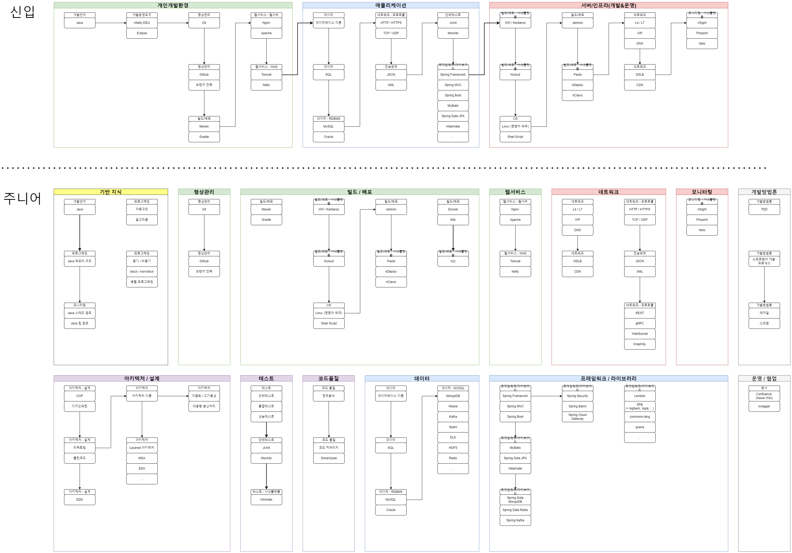

---
tags:
  - README
---
# 로드 맵

## 도서

'교보문고 > 컴퓨터/IT 베스트 셀러' 중 백엔드 개발자와 관련된 도서(2024.08.13 기준 출판한지 6개월 이상된 책만 필터링)

이미 읽은 책은 제외

- 가상 면접 사례로 배우는 대규모 시스템 설계 기초: https://product.kyobobook.co.kr/detail/S000001033116
- 가상 면접 사례로 배우는 대규모 시스템 설계 기초 2: https://product.kyobobook.co.kr/detail/S000211656186
- 그림과 작동 원리로 쉽게 이해하는 AWS 구조와 서비스: https://product.kyobobook.co.kr/detail/S000200882352
- 만들면서 배우는 클린 아키텍처: https://product.kyobobook.co.kr/detail/S000001766486
- 카프카 핵심 가이드: https://product.kyobobook.co.kr/detail/S000201464167
- 자바 ORM 표준 JPA 프로그래밍: https://product.kyobobook.co.kr/detail/S000000935744
- HTTP 완벽 가이드: https://product.kyobobook.co.kr/detail/S000001033001
- 도메인 주도 개발 시작하기: DDD 핵심 개념 정리부터 구현까지: https://product.kyobobook.co.kr/detail/S000001810495
- 테스트 주도 개발: https://product.kyobobook.co.kr/detail/S000001032985
- 효율적인 리눅스 명령어 사용의 기술: https://product.kyobobook.co.kr/detail/S000211545480
- 코틀린 코루틴: https://product.kyobobook.co.kr/detail/S000210537188
- 코틀린 디자인 패턴: https://product.kyobobook.co.kr/detail/S000208494266
- 엘라스틱서치 바이블: https://product.kyobobook.co.kr/detail/S000202720436
- 소프트웨어 아키텍처 101: https://product.kyobobook.co.kr/detail/S000001810445

## 개발자 커리어 관련 도서

- 구글 엔지니어는 이렇게 일한다: https://product.kyobobook.co.kr/detail/S000061352347
- 육각형 개발자: https://product.kyobobook.co.kr/detail/S000203107475
- 개발자 원칙: https://product.kyobobook.co.kr/detail/S000200381165
