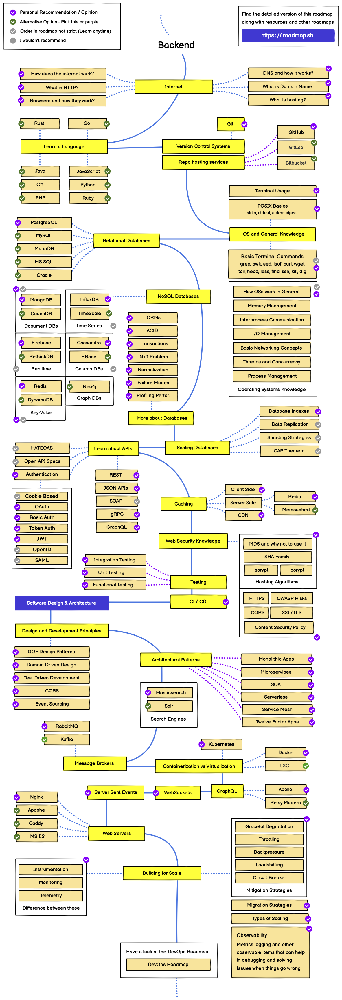

---
tags:
  - README
title: README
---

## 도서

'교보문고 > 컴퓨터/IT 베스트 셀러' 중 백엔드 개발자와 관련된 도서(2026.01.04 기준 출판한지 6개월 이상된 책만 필터링)

이미 읽은 책은 제외

- 주니어 백엔드 개발자가 반드시 알아야 할 실무 지식: https://product.kyobobook.co.kr/detail/S000216376461
- 가상 면접 사례로 배우는 대규모 시스템 설계 기초: https://product.kyobobook.co.kr/detail/S000001033116
- 가상 면접 사례로 배우는 대규모 시스템 설계 기초 2: https://product.kyobobook.co.kr/detail/S000211656186
- 데이터 중심 애플리케이션 설계: https://product.kyobobook.co.kr/detail/S000001766328
- JVM 밑바닥까지 파헤치기: https://product.kyobobook.co.kr/detail/S000213057051
- 실용주의 프로그래머: https://product.kyobobook.co.kr/detail/S000001033128
- 소프트웨어 아키텍처 101: https://product.kyobobook.co.kr/detail/S000218641537
- AWS 교과서: https://product.kyobobook.co.kr/detail/S000210532528
- 그림으로 공부하는 IT 인프라 구조: https://product.kyobobook.co.kr/detail/S000001942495
- 오브젝트: https://product.kyobobook.co.kr/detail/S000001766367
- 리팩터링: https://product.kyobobook.co.kr/detail/S000001810241
- 도메인 주도 개발 시작하기: DDD 핵심 개념 정리부터 구현까지: https://product.kyobobook.co.kr/detail/S000001810495
- 시스템 설계 면접 완벽 가이드: https://product.kyobobook.co.kr/detail/S000216400799
- Elasticsearch in Action: https://product.kyobobook.co.kr/detail/S000215553448
- 클라우드 네이티브 스프링 인 액션: https://product.kyobobook.co.kr/detail/S000212731527
- 효율적인 리눅스 명령어 사용의 기술: https://product.kyobobook.co.kr/detail/S000211545480
- 30가지 패턴으로 배우는 분산 시스템 설계와 구현 기법: https://product.kyobobook.co.kr/detail/S000216211590

## 개발자 커리어 관련 도서

- 구글 엔지니어는 이렇게 일한다: https://product.kyobobook.co.kr/detail/S000061352347
- 개발자 원칙: https://product.kyobobook.co.kr/detail/S000214054310
