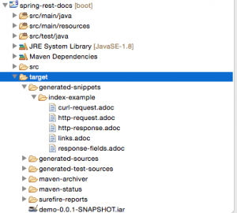

---
tags:
  - Spring-REST-Docs
---
# Spring Rest Docs 시작

- 의존성 추가
  
    ```xml
    <dependency>
        <groupId>org.springframework.restdocs</groupId>
        <artifactId>spring-restdocs-mockmvc</artifactId>
        <version>2.0.4.RELEASE</version>
    </dependency>
    ```
    
- Spring REST Docs는 문서화할 REST 서비스의 테스트를 처리해야 문서가 생성된다. 테스트를 실행하면 request와 response를 통해 문서 스니펫이 생성된다.
  
    ```java
    @ExtendWith({RestDocumentationExtension.class, SpringExtension.class})
    @SpringBootTest
    public class ApiDocumentationJUnit5IntegrationTest { //... }
    ```
    
    ```java
    @BeforeEach
    public void setUp(WebApplicationContext webApplicationContext,
      RestDocumentationContextProvider restDocumentation) {
        this.mockMvc = MockMvcBuilders.webAppContextSetup(webApplicationContext)
          .apply(documentationConfiguration(restDocumentation)).build();
    }
    ```
    
- 컨트롤러(`CRUDController`)의 엔드 포인트에 대한 링크가 있는 페이지를 반환하는 컨트롤러 생성
  
    ```java
    @RestController
    @RequestMapping("/")
    public class IndexController {
    
        static class CustomRepresentationModel extends RepresentationModel<CustomRepresentationModel> {
            public CustomRepresentationModel(Link initialLink) {
                super(initialLink);
            }
        }
    
        @GetMapping
        public CustomRepresentationModel index() {
            return new CustomRepresentationModel(linkTo(CRUDController.class).withRel("crud"));
        }
    }
    ```
    
- 모든 MockMvc 호출이 자동으로 문서화 시키도록 설정. 모든 MockMvc 호출에 대해 테스트 메서드 이름이 있는 폴더에 기본 스피넷에 생성되도록 한다.
  
    ```java
    this.mockMvc = MockMvcBuilders
      //...
      .alwaysDo(document("{method-name}", 
        preprocessRequest(prettyPrint()), preprocessResponse(prettyPrint())))
      .build();
    ```
    
- 아래와 같이 테스트 코드에 `requestFields()`, `responseFields()`, `responseHeaders()`를 작성하면 request와 response가 문서화가 된다.
  
    ```java
    @Test
    public void indexExample() throws Exception {
        this.mockMvc.perform(get("/")).andExpect(status().isOk())
          .andDo(document("index", 
            links(linkWithRel("crud").description("The CRUD resource")), 
            responseFields(subsectionWithPath("_links")
              .description("Links to other resources"))
            responseHeaders(headerWithName("Content-Type")
              .description("The Content-Type of the payload"))));
    }
    ```
    
    ```java
    @Test
    public void crudCreateExample() throws Exception {
        Map<String, Object> crud = new HashMap<>();
        crud.put("title", "Sample Model");
        crud.put("body", "http://www.baeldung.com/");
           
        this.mockMvc.perform(post("/crud").contentType(MediaTypes.HAL_JSON)
          .content(this.objectMapper.writeValueAsString(crud)))
          .andExpect(status().isCreated())
          .andDo(document("create-crud-example", 
            requestFields(fieldWithPath("id").description("The id of the input"),
              fieldWithPath("title").description("The title of the input"),
              fieldWithPath("body").description("The body of the input"),
            ))));
    }
    ```
    
- 경로 매개변수를 설명하기 위해서는 `pathParameters()`메서드를 사용하면 된다.
  
    ```java
    @Test
    public void crudDeleteExample() throws Exception {
        this.mockMvc.perform(delete("/crud/{id}", 10)).andExpect(status().isOk())
          .andDo(document("crud-delete-example", 
          pathParameters(
            parameterWithName("id").description("The id of the input to delete")
          )));
    }
    ```
    
- 빌드가 성공되면 REST 문서 스니펫의 출력이 생성되고, target/generated-snippets 폴더가 생성된다. 아래가 생성되면 curl 명령어로 정보를 받을 수 있게 된다.
  
    
    
- 스니펫 출력을 Asciidoc에서 읽을 수 있는 형식으로 변환하기 위해서는
- [https://www.baeldung.com/spring-rest-docs](https://www.baeldung.com/spring-rest-docs)