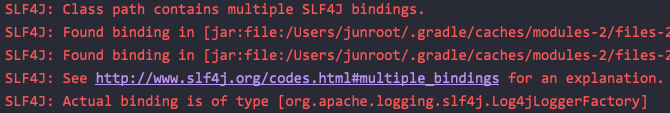

---
tags:
  - Spring-Framework
---
# Spring log4j2 적용기

[log4j vs logback vs log4j2](../../../3.Resource/%ED%94%84%EB%A0%88%EC%9E%84%EC%9B%8C%ED%81%AC%EB%9D%BC%EC%9D%B4%EB%B8%8C%EB%9F%AC%EB%A6%AC/Java%202aba8d7bf7a9430b9a385fe9ca1a4cb3/log4j%20vs%20logback%20vs%20log4j2%20a1c266d438b04521972f03ca86d9abcf.md) 를 비교 해보고 log4j2를 사용해보기로 결정했다. Spring Framwork에 log4j2를 적용한 과정을 정리해본다.

## 의존 중복

처음에 log4j2 의존을 아래와 같이 추가해서 실행하니 에러가 발생했다. SLF4J가 여러 개 바인딩 되어서 발생한 문제였다.

```groovy
implementation 'org.springframework.boot:spring-boot-starter-log4j2:2.6.3'
```



Spring Boot에 로깅 모듈을 제외 시켜서 해결할 수 있다.

```groovy
implementation('org.springframework.boot:spring-boot-starter-data-jpa:2.6.2') {
	exclude module: "spring-boot-starter-logging"
}
```

## 멀티 프로필

Spring Boot에서는 Logback처럼 프로필면 xml 자동 감지가 안된다. properties 파일을 통해서 사용할 로깅 xml파일을 지정해줘야 된다.

```bash
logging:
  config: classpath:log4j2-local.xml
```

## XML 설정 파일 include

여러 개의 프로필마다 다른 로깅 전략을 사용하면서, 중복되는 설정을 xml 파일로 따로 분리할 수 있다.

`<xi:include href="log4j-xinclude-appenders.xml" />` 형태로 xml 파일을 불러올 수 있다.

```xml
<?xml version="1.0" encoding="UTF-8"?>
<configuration xmlns:xi="http://www.w3.org/2001/XInclude"
               status="warn" name="XIncludeDemo">
  <properties>
    <property name="filename">xinclude-demo.log</property>
  </properties>
  <ThresholdFilter level="debug"/>
  <xi:include href="log4j-xinclude-appenders.xml" />
  <xi:include href="log4j-xinclude-loggers.xml" />
</configuration>
```

```xml
<?xml version="1.0" encoding="UTF-8"?>
<appenders>
  <Console name="STDOUT">
    <PatternLayout pattern="%m%n" />
  </Console>
  <File name="File" fileName="${filename}" bufferedIO="true" immediateFlush="true">
    <PatternLayout>
      <pattern>%d %p %C{1.} [%t] %m%n</pattern>
    </PatternLayout>
  </File>
</appenders>
```

```xml
<?xml version="1.0" encoding="UTF-8"?>
<loggers>
  <logger name="org.apache.logging.log4j.test1" level="debug" additivity="false">
    <ThreadContextMapFilter>
      <KeyValuePair key="test" value="123" />
    </ThreadContextMapFilter>
    <AppenderRef ref="STDOUT" />
  </logger>
 
  <logger name="org.apache.logging.log4j.test2" level="debug" additivity="false">
    <AppenderRef ref="File" />
  </logger>
 
  <root level="error">
    <AppenderRef ref="STDOUT" />
  </root>
</loggers>
```

## 참고 자료

[https://docs.gradle.org/current/userguide/dependency\_downgrade\_and\_exclude.html](https://docs.gradle.org/current/userguide/dependency\_downgrade\_and\_exclude.html)

[https://www.baeldung.com/spring-boot-logging](https://www.baeldung.com/spring-boot-logging)

[https://www.baeldung.com/spring-log4j2-config-per-profile](https://www.baeldung.com/spring-log4j2-config-per-profile)
