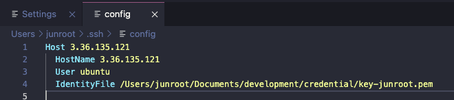

---
tags:
  - VSCode
---
# VSCode에서 SSH 연결하기

VSCode로 SSH 환경에서 작업을 해야되는 상황이었다.

## 1. Remote Development 설치

VSCode에서 확장 프로그램을 설치 해야된다. 아래 경로에서 설치 가능하다.

[https://marketplace.visualstudio.com/items?itemName=ms-vscode-remote.vscode-remote-extensionpack](https://marketplace.visualstudio.com/items?itemName=ms-vscode-remote.vscode-remote-extensionpack)

## 2. Config 파일 수정

config 파일을 수정해서 자신이 접속할 경로와 사용자명을 작성하면 된다.
Windows 기준 아래의 경로에 파일이 존재한다.
`C:\Users\사용자명\.ssh\config`

해당 파일의 다음과 같은 파일 형식으로 지정해두면 이후에 쉽게 접속이 가능해진다. 아래 예시는 pem 키를 이용해서 접속하는 경우다. pem키를 사용하지 않고 사용지 비밀번호를 입력하는 경우는 4번 라인의 `IdentityFile` 을 제거하면된다.

## 결과

## 참고 자료

[https://mmozzi.tistory.com/79](https://mmozzi.tistory.com/79)

[https://stackoverflow.com/questions/54402104/how-to-connect-ec2-instance-with-vscode-directly-using-pem-file-in-sftp](https://stackoverflow.com/questions/54402104/how-to-connect-ec2-instance-with-vscode-directly-using-pem-file-in-sftp)