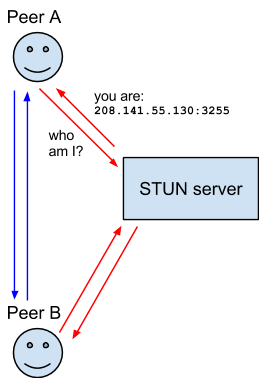

---
tags:
  - 네트워크
  - WebRTC
title: WebRTC 알아보기
---

## 목표

- WebRTC가 무엇인지 이해한다.
- WebRTC의 전체적인 구조를 이해한다.
- WebRTC 통신을 하기 위한 전체적인 과정을 이해한다.

## WebRTC란?

- WebRTC는 P2P 통신을 지원해주는 웹 표준이다.
- 오픈소스이기 때문에 지속적으로 발전되고 있다.
- 대부분의 최신 브라우저에서 사용가능하다.
- 브라우저뿐만아니라 모바일 애플리케이션에서도 사용가능하다.
- WebRTC는 주로 음성, 영상 통화에서 사용되고 그 뿐만 아니라 다양한 데이터를 전달할 때 사용할 수 있다.
- 서버를 통해 데이터를 받아야되는 WebSocket과 달리, P2P 통신으로 이루어지기 때문에 서버 과부하 문제를 해결할 수 있고, 개인 정보 보호의 이점도 가지고 있다.

## Signaling

- 피어끼리 커넥션을 만들기 위해서는 서로의 IP를 알아야된다. 이렇게 연결을 맫을 두 피어간의 IP를 교환하는 과정을 Signaling이라고 한다.
- Signaling은 WebRTC에 정해져 있는 명세가 없다.
- 만약, Signaling을 하기 위한, 서버를 따로 만든다면 이를 Singaling server라고 부른다.
- 주로, WebSocket을 사용해서 구현한다.

## 또 다른 서버들

- Signaling 과정에서 추가적인 서버가 필요한 경우가 있다.

### STUN

- STUN은 피어가 자신의 public IP를 확인하고, 다른 피어에 연결할 수 있는지 여부를 확인하기 위해 사용하는 프로토콜이다.
- 아래 그림과 같이 별도의 서버를 두고, 서버에 요청을 보내 public IP와 연결 가능 여부를 수신한다. 이 때 서버를 STUN 서버라고 부른다.

### TURN

- NAT을 사용하는 일부 라우터는 P2P 연결이 차단되어 있을 수 있다. 이를 대비해서 기존에 웹에서 주로 사용하던 Client-Server 구조로 통신하는 서버를 TURN 서버라고 부른다.
- 여기서 부르는 TURN도 프로토콜의 이름이다.

> NAT 이란?
라우터에서 사용되는 기술. IP를 절약하기 위해서 라우터에 속해있는 기기들에 private IP를 할당하고, 포트에 매핑을 시켜준다.

## 참고 자료

[https://bloggeek.me/what-is-webrtc/](https://bloggeek.me/what-is-webrtc/)

[https://inspirit941.tistory.com/346](https://inspirit941.tistory.com/346)

[https://velog.io/@gkssk925/라이브-스트리밍-플랫폼-구축후기](https://velog.io/@gkssk925/%EB%9D%BC%EC%9D%B4%EB%B8%8C-%EC%8A%A4%ED%8A%B8%EB%A6%AC%EB%B0%8D-%ED%94%8C%EB%9E%AB%ED%8F%BC-%EA%B5%AC%EC%B6%95%ED%9B%84%EA%B8%B0)

## 다음에 볼거

[https://developer.mozilla.org/en-US/docs/Web/API/WebRTC_API/Protocols](https://developer.mozilla.org/en-US/docs/Web/API/WebRTC_API/Protocols)

[https://bloggeek.me/how-webrtc-works/](https://bloggeek.me/how-webrtc-works/)
