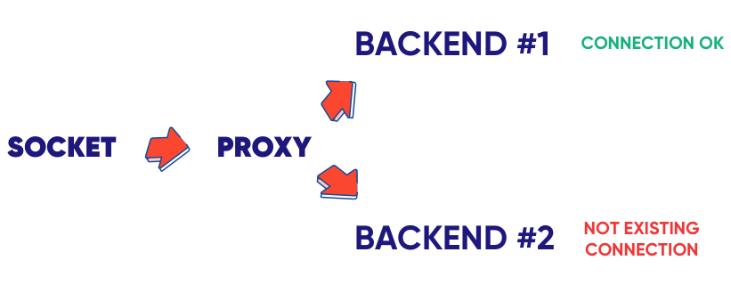
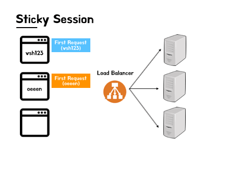

---
tags:
  - 네트워크
  - WebSocket
title: WebSocket을 사용하는 서버는 수평적 확장을 어떻게 할까
---

## 문제가 되는 이유

수평적 확장 관점에서 REST API와 WebSocket의 가장 큰 차이점은 아무래도 상태 관리다. REST API는 서버에서 상태를 저장하지 않기 때문에 스케일 아웃을 하는데 문제가 없다. 하지만 WebSocket의 경우에는 서버에서 세션을 저장하고 가지고 있어야한다. 따라서 클라이언트가 기존에 세션을 저장해둔 서버(BACKEND #1)가 아닌 다른 서버(BACKEND #2)로 메시지를 보낸다면 세션을 저장하고 있지 않기 때문에 처리하지 못할 것이다.

## 처리 방법 #1: Sticky Session

Sticky Session이란 클라이언트가 첫 요청을 보낸 시점에 로드 밸런서에서 특정 서버를 하나 지정해서 처리하게 해주고, 이 클라이언트는 이후의 요청들을 전부 이전에 처리해준 서버에게 보내도록 하는 기법이다. 로드 밸런서는 특정 세션의 요청을 어떤 서버로 보내야 되는지를 기억하고 처리할 필요가 있다.

하지만 이 방식에는 단점이 존재한다.

### 단점

1. 특정 서버에서 집중적으로 과부하가 올 수 있다.
2. 특정 서버가 다운되면 그 서버에 저장된 세션들이 전부 유실된다.

## 처리 방법 #2: Session Clustering

여러 대의 서버가 세션을 공유할 수 있도록 하는 것이 세션 클러스터링이다. 이렇게 처리하면 서버 한 대가 다운되더라도 세션이 유실되지도 않고, 어떤 서버에서든지 요청을 처리할 수 있어 한 서버에서만 트래픽 과부하가 발생하지도 않을 것이다. 

## 처리 방법 #3: Redis Pub/Sub

우리 같은 경우는 SockJS와 STOMP를 사용하고 있어서 세션 클러스터링만으로는 한계가 있었다. 어떤 클라이언트가 어떤 채널에 STOMP 구독을 했는지도 기억하고 있어야 했기 때문이다. 그래서 우리는 Redis의 pub/sub 기능을 활용하기로 했다. 

## 참고 자료

[https://tsh.io/blog/how-to-scale-websocket/](https://tsh.io/blog/how-to-scale-websocket/)

[https://smjeon.dev/web/sticky-session/](https://smjeon.dev/web/sticky-session/)

[https://techblog.woowahan.com/2547/](https://techblog.woowahan.com/2547/)

[https://www.poeticoding.com/distributed-phoenix-chat-using-redis-pubsub/](https://www.poeticoding.com/distributed-phoenix-chat-using-redis-pubsub/)
