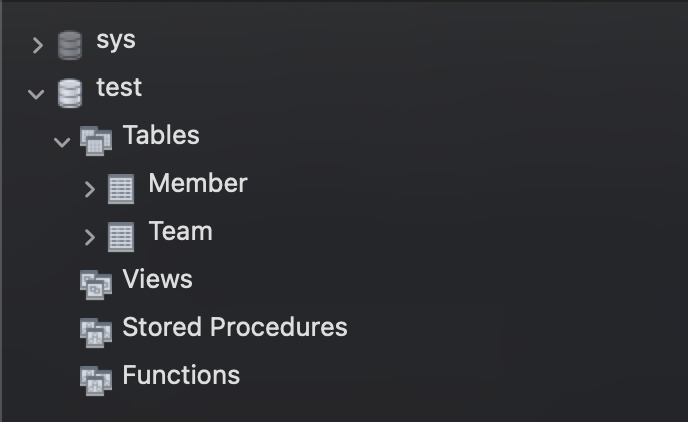
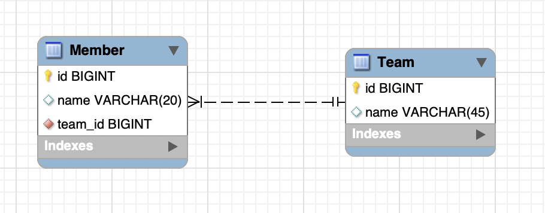
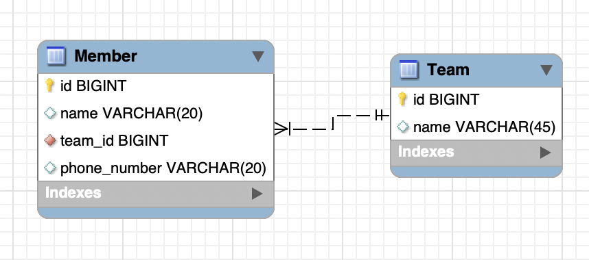

---
tags:
  - MySQL
title: Workbench에서 ERD Diagram 만들기
---


## 기존에 존재하던 데이터베이스의 ERD Diagram 자동 생성하기

### 설명

- Workbench의 Reverse Engineer 기능을 이용하면 된다.
- `Database` => `Reverse Enginner`

### 예시





## 만들어진 ERD Diagram을 최신화 하기

### 설명

- `Database` => `Synchronize  model`

### 예시

```sql
alter table `test`.`member` add column `phone_number` varchar(20);
```



## 참고 자료

- https://medium.com/@tushar0618/how-to-create-er-diagram-of-a-database-in-mysql-workbench-209fbf63fd03
- https://dba.stackexchange.com/questions/25900/mysql-workbench-how-to-refresh-eer-diagram
