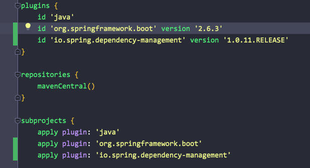

---
tags:
  - Spring-Framework
---
# build 후에 실행 시 "no main manifest attribute"  에러 해결

대부분 SpringBoot 플러그인을 추가해주지 않아서 발생하는 문제다.

SpringBoot 플러그인에는 Spring Boot 애플리케이션을 jar 파일로 패키징을 도와주기 위한 플러그인이므로 필요하다.

## 참고 자료

[https://dingue.tistory.com/17](https://dingue.tistory.com/17)

[https://kotlinworld.com/323](https://kotlinworld.com/323)

[https://stackoverflow.com/questions/54121894/executing-springboot-application-as-jar-gives-no-main-manifest-attribute](https://stackoverflow.com/questions/54121894/executing-springboot-application-as-jar-gives-no-main-manifest-attribute)