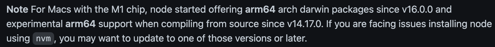

---
tags:
  - 개발운영도구
  - macOS
---
# M1 mac에서 rosseta2로 shell 실행 하기

## 배경

- nvm을 통해 v10.16의 Node.js를 사용해야 되었다.

- 하지만, m1 칩의 경우 nvm에서 v16.0.0 부터 지원을 하고 있었다. 그래서 v10.16을 설치하면 아래와 같은 에러가 발생했다.

  ```plain
  Downloading and installing node v10.16.3...
  Downloading https://nodejs.org/dist/v10.16.3/node-v10.16.3-darwin-arm64.tar.xz...
  curl: (22) The requested URL returned error: 404
  
  Binary download from https://nodejs.org/dist/v10.16.3/node-v10.16.3-darwin-arm64.tar.xz failed, trying source.
  grep: /Users/user/.nvm/.cache/bin/node-v10.16.3-darwin-arm64/node-v10.16.3-darwin-arm64.tar.xz: No such file or directory
  Provided file to checksum does not exist.
  Binary download failed, trying source.
  ```

  - https://github.com/nvm-sh/nvm

  

## 해결 방법

- 아래 명령어롤 틍해 Rosetta 2로 zsh을 실행하면, 문제없이 설치가 가능해진다.

  ```she
  arch -x86_64 zsh

## 참고 자료

- https://github.com/nvm-sh/nvm/issues/2350#issuecomment-734132550
- https://www.unix.com/man-page/osx/1/arch/
